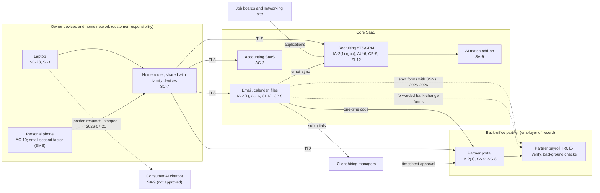

# SaaS Architecture and Control Placement: Cris Santos Company | Administrative and Support and Waste Management and Remediation Services | Sole Proprietorship

**Organization:** Cris Santos Company (independent recruiter) | **Tier:** Sole Proprietorship | **Provider:** SaaS only (no IaaS or PaaS)
**System:** Recruiting and Placement Systems Profile (RPSP), as defined in the system profile (P02)

## 1. Diagram
Control IDs on each node are the ones in `cloud-control-map.csv`. Dashed lines are flows that carry personal information without adequate terms or protection today.

## 2. Layers
| Layer | Components | Key controls | Responsibility |
|---|---|---|---|
| Identity | Email, ATS, partner portal, accounting accounts | IA-2(1), AC-2 | Customer configures; vendor provides MFA options |
| Data | Candidate records, mailbox and files, start requests, ID images, background reports | SI-12, CP-9, SC-8, SA-9 | Vendor protects data inside its service; customer decides what is collected, where it goes, how long it stays, and under what terms |
| Endpoints | Laptop, phone | SC-28, SI-3, AC-19 | Customer |
| Network | Home router and Wi-Fi | SC-7 | Customer (internet provider supplies the router) |
| Logging | Email sign-in history and mailbox rules, ATS export log | AU-2 (vendor), AU-6 (customer) | Shared: vendor records, customer reviews |
| SaaS applications and hosting | ATS, email, partner portal, accounting platforms | Inherited (AU-2, SC-28 at rest, PE family) | Provider |

## 3. Shared responsibility for SaaS
All three major cloud providers' shared responsibility models (SRC-AWS-SRM, SRC-AZURE-SRM, SRC-GCP-SRM) agree on the SaaS split: the provider runs the application, the platform, and the facilities; **the customer always keeps its identities and accounts, its data, and its devices.** That is why 14 of the 18 rows in the control map are the owner's alone and the other 4 are shared. A vendor's SOC 2 report never covers these three layers. No IaaS provider equivalents table is needed, because the business runs no infrastructure.

## 4. Findings from the mapping
1. **The mailbox is the master key.** The partner portal sends its one-time code to the email account, the ATS password can be reset by email, and the e-signature service signs in through it. Email protected by SMS codes is therefore the weakest point for every system, which is why P08 is written around an email takeover (P01 R-001, R-002).
2. **The data the business keeps is mostly data it no longer needs.** SSNs, dates of birth, ID images, and background reports in the mailbox serve no current purpose; the partner holds the official copies. Deleting them reduces breach exposure more than any tool (R-004, R-006).
3. **The partner's bank-change practice trusts the owner's email.** This was found while mapping SYS-03 (call with the partner on 2026-07-22). It is the partner's control, but the owner's mailbox is the attack path, so the fix is contractual (R-003).
4. **AI vendor terms are a data-sharing decision.** The AI match add-on and the consumer chatbot both allowed training on candidate data by default. SaaS shared responsibility leaves that choice with the customer (P10).
