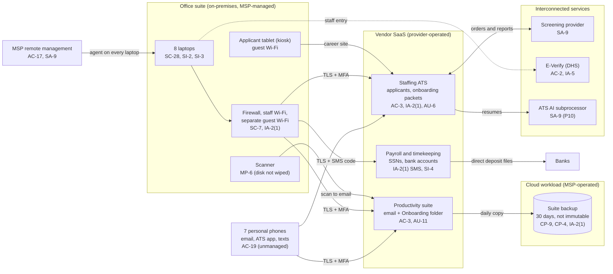

# Cloud Architecture and Control Placement: Cris Santos Company | Administrative and Support Services | Micro

**Organization:** Cris Santos Company, LLC (temporary staffing firm) | **Tier:** Micro | **Provider:** Vendor-agnostic SaaS (see section 3)
**System:** Payroll and Applicant Tracking System (PATS), as defined in the SSP (P02) | **Prepared:** 2026-07-31 by the Operations Manager with the MSP lead technician | **Approved:** Owner, 2026-08-31

## 1. Diagram
The firm runs no servers and no IaaS tenant. Its "cloud" is a set of SaaS services plus one cloud workload that the MSP operates for it: the SaaS-to-SaaS backup of the productivity suite (SYS-08).

## 2. Layers and who is responsible
| Layer | Components | Key controls | Customer (the firm) | MSP (on the firm's behalf) | Provider (SaaS vendor) |
|---|---|---|---|---|---|
| Identity | ATS, payroll, suite, E-Verify, backup, and firewall logins | AC-2, IA-2(1), IA-5 | Decides who gets access; creates ATS, payroll, and E-Verify users; chooses MFA settings | Creates and disables suite accounts; holds the backup and firewall admin logins | Runs sign-in and MFA services |
| Network | Firewall, Wi-Fi, internet line | SC-7, AC-18 | Approves changes | Configures, patches, and monitors | Not applicable |
| Endpoints | 8 laptops, tablet, scanner; personal phones | SC-28, SI-2, SI-3, MP-6, AC-19 | Sets phone rules; keeps the inventory; approves disposal | Encryption, patching, antivirus, screen lock on laptops | Not applicable |
| SaaS applications | ATS, payroll service, suite | AC-3, SI-4, AU-2 | Roles, folder permissions, alert settings, AI settings | Suite administration on request | Application, platform, data centers |
| Data | Onboarding packets, payroll records, shared-drive scans and reports, backup copies | CP-9, CP-4, SC-28, SI-12 | Decides what to keep and for how long; holds exports | Operates the suite backup and runs restore tests | Encrypts and backs up its own platform |
| Logging | ATS, payroll, and suite logs; firewall logs | AU-2, AU-6, AU-11 | **Reviews logs monthly (gap today)** | Keeps firewall logs | Generates and stores logs |
| Vendor governance | Contracts, SOC 2 reports, MSP review | SA-9 | Signs contracts; reviews SOC 2 and MSP evidence | Provides its own evidence | Provides SOC 2 reports and terms |

**The MSP is not a cloud provider in the shared responsibility sense.** It performs customer-side duties for the firm. Anything marked "Customer (performed by MSP)" in `cloud-control-map.csv` remains the firm's responsibility under Fla. Stat. 501.171(2) ("reasonable measures") and under its client contracts. The firm must direct the work, receive evidence, and check it (SA-9).

## 3. Service categories and provider equivalents
The design is vendor-agnostic. For SaaS, the shared responsibility split is the same in all three major cloud providers' models: the provider runs the application, platform, and infrastructure; the customer keeps identities, access, data, and devices (SRC-AWS-SRM, SRC-AZURE-SRM, SRC-GCP-SRM in `00_universal-framework/sources/source-register.csv`). For the firm's vendors, a SOC 2 report or vendor security documentation is the evidence of the provider side.

| Service category used | What it is here | Equivalent category in the large cloud providers (for reading their documentation) |
|---|---|---|
| Line-of-business SaaS | Staffing ATS; payroll and timekeeping service | Industry SaaS built on any provider |
| Productivity suite | Email, calendar, file storage, chat | Productivity and collaboration SaaS |
| SaaS-to-SaaS backup | Daily backup of the suite | Backup service or third-party SaaS backup |
| Remote monitoring and management | MSP laptop management | Device management SaaS |
| AI service inside a SaaS product | ATS AI match feature run by the ATS vendor's subprocessor | Managed AI or machine learning services |

## 4. Findings from the mapping
1. **The payroll service is the crown jewel, and the firm holds its weakest key.** The vendor's platform is strong and evidenced by a SOC 2 report (P09). But the firm signs in with SMS codes and has not turned on the vendor's alerts for bank changes and report exports. A phishing page can relay an SMS code. Fix: authenticator-app MFA for the 3 administrators and both alerts on, by 2026-10-31 (R-001; POAM-004, POAM-006).
2. **The shared drive is the firm's own data store for its most sensitive images, and it is flat.** Form I-9 scans, identity document images, and consumer reports sit in one folder all 7 staff can open. The provider cannot fix this; folder permissions are a customer setting. Fix: restrict the Onboarding folder to the Operations Manager and the Coordinator, and purge what the retention schedule does not require (R-004, R-015; POAM-002, POAM-013).
3. **The backup is one MSP password away from deletion and has never been restored (CP-9, CP-4, IA-2(1)).** Fix: MFA on the backup console, immutable 90-day versions, a restore test by 2026-09-30, then quarterly (R-005; POAM-007, POAM-008).
4. **The MSP's reach is total (AC-17).** Its remote management agent can run commands on every laptop, and the contract has no security terms. Fix: annual MSP security review and contract terms at renewal (R-013).
5. **Personal phones sit outside every control.** Recruiters text candidates from personal phones, and candidates send identity document photos that way. Fix: candidates upload documents only through the ATS link; phones must have a passcode, encryption, and the vendor apps' own data protection; text threads with document photos are deleted (R-007; POL-02 C.2).
6. **Logs exist but nobody reads them, and the suite keeps them only 90 days.** That is shorter than the time it often takes to notice an intrusion, and it does not give the permanent audit record expected for electronic Form I-9 images (8 CFR 274a.2(g)(1)(iv)). Fix: monthly review from 2026-10 and a log retention upgrade or monthly export (POAM-006).
