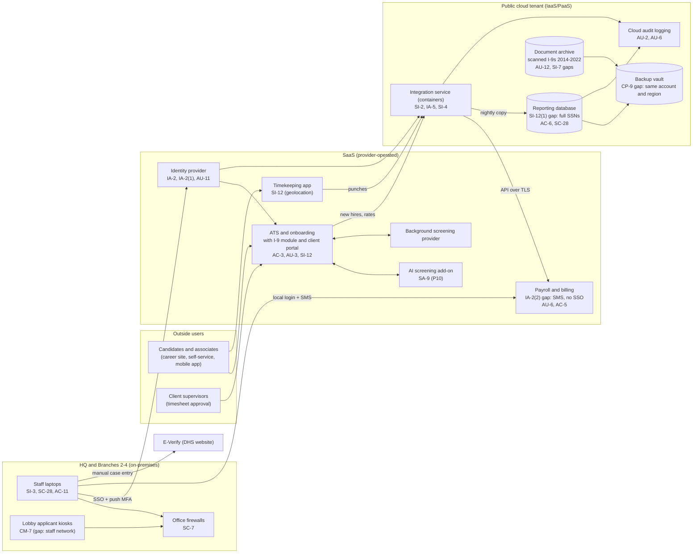

# Cloud Architecture and Control Placement: Cris Santos Company | Administrative and Support and Waste Management | Small

**Organization:** Cris Santos Company, LLC (temporary staffing firm) | **Tier:** Small | **Provider:** Vendor-agnostic (see section 3)
**System:** Associate Payroll and Applicant Tracking Platform (APATP), as defined in the SSP (P02)

## 1. Diagram

## 2. Layers
| Layer | Components | Key controls | Responsibility |
|---|---|---|---|
| Identity | Identity provider, cloud IAM roles, payroll platform local accounts, E-Verify accounts | AC-2, IA-2, IA-2(1), IA-2(2), IA-5, AC-6 | Customer (configuration, users), provider (service) |
| Network / edge | Office firewalls, guest Wi-Fi, database network rules | SC-7, SC-8 | Customer |
| Compute / application | Integration service containers, laptops, kiosks | SI-2, SI-3, SI-4, CM-7 | Customer (images, code configuration, endpoints) |
| Data | Reporting database, document archive, backup vault | SC-28, SI-12(1), AC-3, SI-7, CP-9 | Shared: provider encrypts and stores; customer decides what is kept, who reads it, and how it is isolated |
| Logging / monitoring | Cloud audit logs, identity provider sign-in logs, ATS and payroll audit history | AU-2, AU-3, AU-6, AU-11, AU-12 | Shared: providers generate; customer enables data events, retains, and reviews |
| SaaS applications | ATS, payroll, timekeeping, AI add-on | AC-3, AC-5, AU-3, CP-9, SI-12 | Provider (application and infrastructure), customer (users, roles, settings, data retention) |
| Physical / hypervisor | Provider data centers | PE family | Provider (inherited) |

## 3. Service categories and provider equivalents
The firm's design is independent of the provider. This table gives each provider's name for each service category, to use when reading its shared responsibility documentation.

| Service category | AWS | Microsoft Azure | Google Cloud |
|---|---|---|---|
| Container service | Amazon ECS / AWS Fargate | Azure Container Apps | Cloud Run |
| Managed relational database | Amazon RDS | Azure SQL Database | Cloud SQL |
| Object storage | Amazon S3 | Azure Blob Storage | Cloud Storage |
| Object versioning and write-once lock | S3 Versioning and Object Lock | Blob versioning and immutable storage | Object Versioning and Bucket Lock |
| Backup service | AWS Backup | Azure Backup | Backup and DR Service |
| Secrets storage | AWS Secrets Manager | Azure Key Vault | Secret Manager |
| Identity and access management | AWS IAM | Azure role-based access control with Microsoft Entra ID | Cloud IAM |
| Audit logging (control plane and data events) | AWS CloudTrail | Azure Monitor activity and resource logs | Cloud Audit Logs |

Shared responsibility sources: SRC-AWS-SRM, SRC-AZURE-SRM, SRC-GCP-SRM in `00_universal-framework/sources/source-register.csv`. All three models agree on the split used here:
- **IaaS (object storage, backup):** the provider owns facilities, hardware, and the storage service. The customer owns access policies, versioning and lock settings, retention, and the data.
- **PaaS (containers, managed database):** the provider also owns the operating system and database engine patching. The customer owns the container image, credentials, network rules, database users, and what data is loaded.
- **SaaS:** the provider owns the application. The customer keeps identities, roles, settings (including retention), and data.

## 4. Findings from the mapping
1. **The reporting copy is the biggest exposure (SI-12(1), AC-6).** The nightly copy brings full SSNs and bank account numbers for about 31,000 people into a database that 22 recruiters can query, although every report uses names, dates, and hours only. The provider's encryption at rest does not help against a signed-in user. Fix: load last-4 digits only and limit access to 3 report builders. P01 R-005, P07 POAM-005.
2. **The scanned I-9 archive does not meet the electronic I-9 standards (AU-12, SI-7, AC-3).** 8 CFR 274a.2(g)(1)(iv) requires a secure and permanent record of the date, the person, and the action whenever a record is created, updated, modified, or corrected, and (e)(1)(ii) requires controls that prevent and detect alteration or deletion. The archive has no data-event logging, no versioning, and no object lock, and more roles can read it than need to. Fix: turn on object-level logging to the 1-year log workspace, versioning with a write-once lock for the retention period, and a single reader role. P07 POAM-006.
3. **Backup isolation (CP-9).** The backup vault shares the production account, region, and administrators. Fix: separate account, immutable retention, second region, and quarterly restore tests that include the archive. P01 R-004, P07 POAM-003.
4. **The payroll platform sits outside the identity layer (IA-2(2)).** It is the one system that can both expose every SSN and move money, and it has the weakest sign-in. The vendor supports SAML single sign-on on a higher subscription tier; the firm has funded it. P01 R-001, P07 POAM-002.
5. **Inherited controls rely on vendor reports.** Statements marked "Provider" or "Shared" for the payroll platform rely on its SOC 2 Type 2 report (P09 Part B). The ATS vendor's report has been requested; until it arrives, the ATS rows rest on vendor documentation only.
