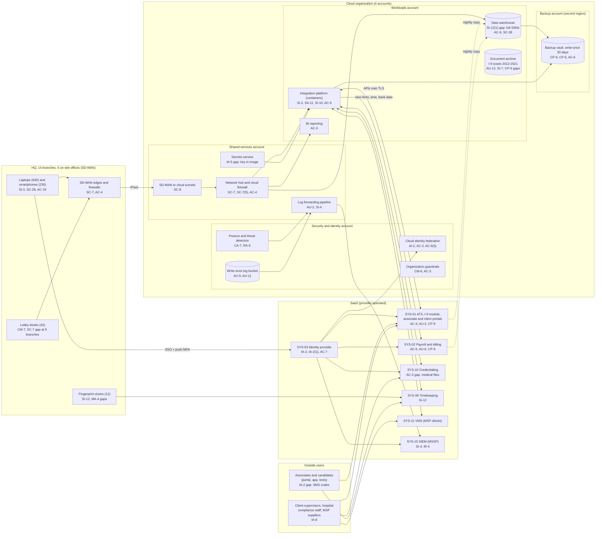

# Cloud Architecture and Control Placement: Cris Santos Company | Administrative and Support and Waste Management | Mid-Market

**Organization:** Cris Santos Company, Inc. | **Tier:** Mid-Market | **Provider:** Vendor-agnostic public cloud (see section 4), plus SaaS
**System:** Associate Payroll and Applicant Tracking Platform (APATP), as defined in the SSP (P02) | **Prepared:** 2026-08-07 by the Security Manager and the IT Director; updated 2026-09-22 with P07 results
**Control map:** `cloud-control-map.csv` (56 rows, 21 components)

## 1. Diagram

## 2. Landing zone design
The landing zone, built in 2025, separates duties across 4 accounts (accounts, subscriptions, or projects, depending on the provider) under one cloud organization. Each account limits what an attacker can do from any other.

| Account | Purpose | Who administers | Key design decisions |
|---|---|---|---|
| **Security and identity** | Organization root, identity federation to SYS-03, organization guardrails, posture and threat detection, write-once log bucket | Security Manager and security analyst | No workloads. Root credentials sealed. Guardrails apply to every account and cannot be disabled from them. Control-plane logs from all accounts land here with object lock |
| **Shared services** | Network hub, cloud firewall, SD-WAN tunnels, DNS, secrets service, log forwarding pipeline | IT Director's infrastructure team (3) | All traffic between sites, workloads, and the internet passes the hub. Integration secrets are meant to live in the secrets service |
| **Workloads** | Integration platform (containers), data warehouse, document archive, BI reporting | Infrastructure team; integration contractor (code only, through the repository and the deployment pipeline) | No internet ingress. Company-managed keys. The integration platform is the only path between the firm's SaaS systems |
| **Backup** | Backup vault with 30-day write-once retention in a second region | 2 named backup administrators | Backups pulled by a cross-account role that can write but not delete. **Gap:** the 2 backup administrators also hold workload administrator rights |

## 3. Layers and shared responsibility per service
| Layer | Components | Key controls | Service model | Responsibility |
|---|---|---|---|---|
| Identity | Cloud federation, break-glass accounts, guardrails, SYS-03 | IA-2, IA-2(1), AC-2, AC-6(5), AC-3, CM-6 | PaaS / SaaS | Customer configures identities, roles, MFA, and reviews; provider runs the identity and policy services |
| Network | Hub, cloud firewall, SD-WAN tunnels, SD-WAN edges | SC-7, SC-7(5), SC-8, AC-4 | PaaS / SaaS (SD-WAN) | Customer designs routes, rules, and segments; provider and SD-WAN vendor run the gateways and appliances |
| Compute | Integration platform containers | CM-2, SI-2, SA-11, SI-10, AC-6, CP-10 | PaaS | Customer owns images, code, secrets, and roles; provider patches the container hosts |
| Data | Data warehouse, document archive, BI, secrets, backups | SC-28, SC-12, AC-3, AC-6, SI-12(1), SI-7, CP-9, CP-6, CP-4 | IaaS / PaaS | Shared: provider encrypts and operates storage and the database engine; customer controls keys, access, minimization, retention, versioning, and restore testing |
| Logging and monitoring | Log bucket, forwarding pipeline, posture service, SIEM | AU-2, AU-9, AU-11, AU-12, CA-7, RA-5, SI-4, IR-4 | PaaS / SaaS | Shared: provider generates logs and detections; customer enables, retains, forwards, and acts on them; MSSP monitors |
| SaaS applications | ATS, payroll, identity, timekeeping, credentialing, SIEM | AC-3, AC-5, AU-2, AU-6, IA-8, SI-12, MA-4, CP-9 | SaaS | Provider runs the application and infrastructure; customer keeps users, roles, settings, audit review, retention, and data |
| Physical | Provider data centers | PE-3, PE-13 | All | Provider (inherited, evidenced by SOC 2 reports) |

**Responsibility counts in `cloud-control-map.csv`:** 29 Customer, 21 Shared, 6 Provider. By service model: 11 IaaS, 27 PaaS, 18 SaaS rows. As the three providers' shared responsibility models agree, the customer side is always identity, data protection, and logging.

## 4. Service categories and provider equivalents
The design is independent of the provider. This table gives each provider's name for the service category, for reading its shared responsibility documentation (SRC-AWS-SRM, SRC-AZURE-SRM, SRC-GCP-SRM in `00_universal-framework/sources/source-register.csv`).

| Service category | AWS | Microsoft Azure | Google Cloud |
|---|---|---|---|
| Multi-account organization and guardrails | AWS Organizations, service control policies | Management groups, Azure Policy | Resource Manager folders, organization policies |
| Account, subscription, or project | Account | Subscription | Project |
| Cloud identity federation | IAM Identity Center | Microsoft Entra ID with Azure RBAC | Cloud Identity with IAM |
| Network hub and cloud firewall | Transit Gateway; AWS Network Firewall | Virtual WAN hub; Azure Firewall | Network Connectivity Center; Cloud NGFW |
| Site-to-cloud tunnels | Site-to-Site VPN | VPN Gateway | Cloud VPN |
| Container service | Amazon ECS or EKS | Azure Container Apps or AKS | Cloud Run or GKE |
| Secrets service | AWS Secrets Manager | Azure Key Vault (secrets) | Secret Manager |
| Object storage with versioning and lock | S3 with Versioning and Object Lock | Blob Storage with versioning and immutability policies | Cloud Storage with object versioning and bucket lock |
| Managed database (warehouse) | Amazon Redshift or RDS | Azure Synapse or Azure SQL | BigQuery or Cloud SQL |
| Backup service | AWS Backup (vault lock) | Azure Backup (immutable vault) | Backup and DR Service |
| Key management | AWS KMS | Azure Key Vault (keys) | Cloud KMS |
| Audit logging | CloudTrail | Azure Monitor activity log | Cloud Audit Logs |
| Posture and threat detection | Security Hub, GuardDuty | Microsoft Defender for Cloud | Security Command Center |

**Service model split used here (all three providers agree):**
- **IaaS** (object storage, organization root, networks): the provider owns facilities, hosts, and virtualization. The customer owns configuration, identities, and data.
- **PaaS** (container service, managed database, backup, secrets, firewall service): the provider also owns the platform software and its patching. The customer owns images, code, access, keys, data, and configuration.
- **SaaS** (ATS, payroll, identity, timekeeping, credentialing, SIEM): the provider also owns the application. The customer keeps identities, roles, settings, audit review, and data.

## 5. Findings from the mapping
1. **The integration platform is the most powerful identity in the environment.** It can read and write every SaaS system, and its payroll API key could change bank accounts. P07 found that key in plain text in the container image and the code repository (EV-IA-5; P01 R-052). Fix: rotate the key, move it to the secrets service, split it by job so only the new-hire job can write bank data, and add secret scanning to the repository (POAM-004).
2. **The richest data store has the weakest minimization.** The data warehouse copies full SSNs and bank accounts nightly for reports that need neither, and 46 users can query it (EV-024; P01 R-003). Fix: last-4 masking at load, 6 named analysts, query logging (POAM-002).
3. **The I-9 archive does not meet the electronic records standards.** No object logging, no versioning or lock, and no backups (only replication), against 8 CFR 274a.2(e)(1), (g)(1)(ii), and (g)(1)(iv) (EV-022, EV-025, EV-037; P01 R-011, R-012). Fix: versioning with object lock, access logging to the log bucket, and inclusion in the backup plan (POAM-010, POAM-023).
4. **SaaS is where the money moves, and it is unmonitored.** Payroll exports and bank changes happen in SYS-02, and I-9 images and consumer reports are downloaded from SYS-01, but neither sends logs to the SIEM (EV-026; P01 R-021). Fix: SaaS log connectors and alert rules by 2027-01-31 (POAM-006).
5. **Backups are isolated but not fully separated.** Write-once retention in a second region is the strongest recovery control here, but the backup administrators also administer the workloads (P01 R-038). Fix: separate backup roles with their own break-glass access by 2026-12-31.
6. **Boundary check.** Every in-scope component in the SSP (P02 section 9) appears in the diagram. Every cloud component has at least one row in the control map, and each account has controls from at least 2 of the AC, AU, CM, IA, SC, and SI families.
7. **Inherited controls rely on SOC 2 reports.** Provider and Shared rows for the ATS, payroll, identity, cloud, MSSP, and timekeeping vendors depend on their SOC 2 Type 2 reports and complementary user entity controls, reviewed each year in P09 `vendor-soc2-review.csv`. The credentialing vendor has no report, so its Shared rows rest on contract terms and a questionnaire until one is obtained.
