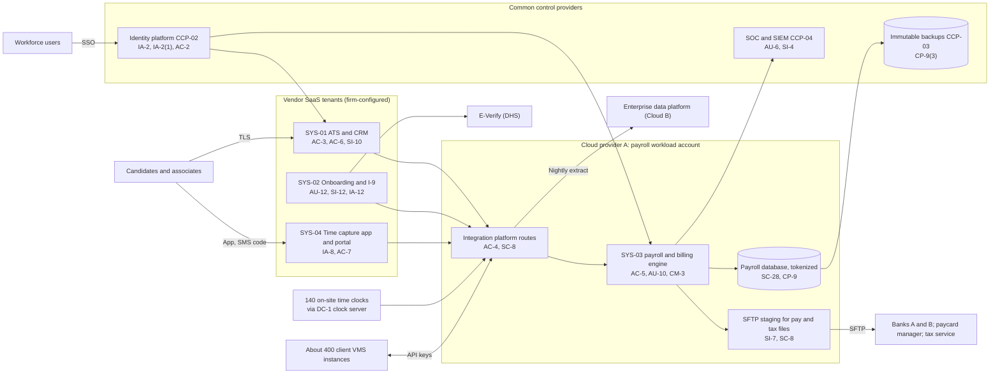

# System Security Plan: Associate Lifecycle and Payroll Platform (ALPP)

**Organization:** Cris Santos Company, Inc. (publicly traded staffing and workforce solutions company) | **Tier:** Enterprise | **Vertical:** Administrative and Support and Waste Management and Remediation Services
**Outline:** NIST SP 800-18 Rev. 2, System Security Plan Outline Example (June 2026) | **Version:** 2.0, 2026-09-14

## 1. System Name and Identifier
Associate Lifecycle and Payroll Platform (**ALPP**), identifier CSC-SYS-ALPP-001. Tier-1 system in the enterprise application inventory. This is the registry's "payroll and applicant tracking system": at this size it is a platform of four components that share data, identities, and integrations, so it is planned and authorized as one system.

## 2. System Overview
The ALPP carries an associate from application to paycheck. It supports all four segments except ACQ-1, which keeps its own systems until 2027-03-31.

| Stage | Component | Volume |
|---|---|---|
| Apply and rank | Front-office ATS and CRM (SYS-01, vendor SaaS) with the AI ranking add-on (AI-001) | About 2.6 million applications a year |
| Onboard | Onboarding and electronic Form I-9 platform (SYS-02, vendor SaaS); E-Verify case creation; background check orders | About 240,000 new hires a year |
| Record time | Time capture app and client portal (SYS-04, vendor SaaS); 140 on-site time clocks; client VMS feeds | About 46,000 timesheets on a peak day |
| Pay and bill | Payroll and billing engine (SYS-03, commercial staffing back-office software, customer-managed on Cloud provider A) | About $65 million a week to about 78,000 associates; about $92 million a week invoiced |
| Connect | ALPP integrations on the enterprise integration platform (Cloud provider A) | About 900 interface jobs a day |

**Why integrity and confidentiality both matter.** The ALPP holds SSNs, Form I-9 document images, bank accounts, and consumer reports for millions of current and former associates and candidates, so a confidentiality breach is the firm's largest privacy exposure. It also moves real money every week: a changed bank account or an altered pay file sends wages to a criminal. In 2025, 214 fraudulent associate bank changes diverted about $612,000 (EV-044).

Users: about 9,800 workforce users (recruiters, onboarding specialists, payroll and billing staff, Associate Service Center agents), about 310,000 associate self-service accounts active in 2025, and about 21,000 client approvers in the timesheet portal.

## 3. Laws, Regulations, and Policies Affecting the System
| ID | Requirement | Citation | How it affects the ALPP |
|---|---|---|---|
| N56-BM | NIST CSF 2.0 (voluntary benchmark) | NIST CSWP 29 | Enterprise program benchmark (P03) |
| N56-R03 | Form I-9 retention and electronic I-9 standards | 8 CFR 274a.2(b), (e)-(i) | Electronic I-9 integrity, audit trail, records security program, retention |
| E-Verify | E-Verify MOU for Employers; FAR E-Verify clause | MOU Art. II.A and II.B; 48 CFR 52.222-54 | User access, safeguarding, immediate breach notice to DHS; federal contractor verification |
| N56-R02 | FCRA employment screening | 15 U.S.C. 1681b(b); 1681m(a) | Disclosure, authorization, and adverse action workflow through SYS-02 |
| N56-R01 | FACTA Disposal Rule | 16 CFR 682.3 | Disposal of consumer report information |
| N56-R07 | FAR Basic Safeguarding | 48 CFR 52.204-21 | Government Solutions FCI (agency timesheets, invoices) in SYS-01 and SYS-03 |
| SEC | Cybersecurity disclosure | Form 8-K Item 1.05; 17 CFR 229.106 | A material ALPP incident goes through the P08 materiality step |
| State | State breach notification and data security laws | Each state where affected individuals reside (Florida worked example: Fla. Stat. 501.171) | Reasonable security and notice (P08) |
| State | State E-Verify laws | Florida worked example: Fla. Stat. 448.095 | E-Verify use and outage documentation |
| N56-R08 | NYC Local Law 144 | NYC Admin. Code 20-870 et seq. | AI-001 ranking for NYC candidates (P10) |
| State AI | State AI employment rules | Illinois P.A. 103-0804; California 2 CCR 11008 et seq. and 11 CCR 7200 et seq.; Colorado SB26-189 (from 2027-01-01) | AI-001 notices, bias testing, and records in SYS-01 (P03; P10) |
| Contract | Client agreements; SOC 2 | P09 | SL-2 payrolling runs on the ALPP payroll engine |
| Internal | POL-01 to POL-05 and standards | P06 | Enterprise policy hierarchy |

Not applicable to the ALPP: N56-R04 (the firm is not a HIPAA business associate for clinician placements; see the intake [obligations register](../step-00_P00_intake/obligations-register.csv) and EV-062), N56-R05 (recruiting texts are sent from SYS-01 under the Privacy Office's consent program, a contact-consent duty outside this plan), N56-R06 (no payment cards), N56-R09 (no hazardous materials).

## 4. System Status
### 4.1 System Security Plan Approval
Prepared by the Vice President, Payroll Technology, and the GRC team. Reviewed by the CISO, the Vice President, Talent Acquisition Technology, the Vice President, Employment Compliance, and the Senior Vice President, Payroll and Associate Services. Approved by the Chief Operating Officer on 2026-09-14.
### 4.2 System Authorization Decision
The firm is not a federal agency, so there is no formal ATO. The equivalent internal decision:
- **Authorizing official equivalent:** Chief Operating Officer, with the CISO's recommendation.
- **Decision (2026-09-14):** continue operation with conditions, based on the Internal Audit assessment (P07) and the risk register (P01).
- **Conditions:** close the High POA&M items that let money or records leave the firm (POAM-001 bank-change verification by 2027-01-31; POAM-015 pay rule separation of duties by 2026-12-31; POAM-019 pay file integrity by 2026-12-31; POAM-008 client integration keys by 2027-03-31); rerun the DR test to prove the 8-hour RTO (POAM-010 by 2027-01-31).
- **Reauthorization:** annually, or after a major change (for example, ACQ-1's migration onto the ALPP in 2027-03).
### 4.3 System Operational Status
Operational. Planned major modifications: ACQ-1 and ACQ-2 onboarding (2026-12 and 2027-03), associate app MFA upgrade with out-of-band bank-change confirmation (POAM-001), and pay file hashing (SI-7(2), SI-7(5)).

## 5. Role Identification and Responsible Personnel
| Role | Title | Responsibility |
|---|---|---|
| System owner | Vice President, Payroll Technology | Accountable for the ALPP as a whole and for SYS-03 and the integrations |
| Component owners | Vice President, Talent Acquisition Technology (SYS-01); Vice President, Employment Compliance (SYS-02 and the I-9 program); Chief Operating Officer's time capture lead (SYS-04) | Approve roles and changes for their components |
| Business owner | Senior Vice President, Payroll and Associate Services | Pay accuracy and timeliness; bank-change process |
| Authorizing official (equivalent) | Chief Operating Officer | Accepts residual risk to operate |
| System administrator | Payroll Engine Application Manager | Day-to-day administration of SYS-03 |
| Information security | CISO; Director of Security Operations | Program oversight; SOC monitoring; incident response |
| Privacy | Chief Privacy Officer | Breach determinations; notices |
| Common control providers | See section 10.3 | Operate inherited controls |
| Independent assessor | Chief Audit Executive (Internal Audit) | Annual assessment (P07) |

## 6. System Information Types and System Categorization
Information types follow the NIST SP 800-60 Vol. 2 Rev. 1 human resources and financial management families. Impact levels follow FIPS 199 as a model.

| Information type | Confidentiality | Integrity | Availability | Rationale |
|---|---|---|---|---|
| Staff acquisition (applications, resumes, onboarding records, Form I-9 images, E-Verify case data, consumer reports) | Moderate | Moderate | Moderate | Disclosure of SSNs and identity documents causes serious harm and triggers breach duties in every state. Onboarding has a 48-hour MTD with a paper fallback (P05 BP-05) |
| Compensation management (pay rates, hours, withholding, garnishments) | Moderate | **Moderate (supplemented)** | Moderate | Wrong pay harms associates and creates wage claims; P05 BP-01 MTD 24 h in the payroll window, RTO 8 h |
| Payments (bank account numbers, ACH and paycard funding files) | Moderate | **Moderate (supplemented)** | Moderate | An altered bank account or file diverts wages; integrity is supplemented with High-baseline controls |
| Collections and receivables (client invoices) | Low | Moderate | Low | Invoices can queue (P05 BP-03) |
| Information security (audit logs, credentials, keys) | Moderate | Moderate | Moderate | Protects the evidence for pay and I-9 integrity |
| **ALPP category** | **Moderate** | **Moderate** | **Moderate** | See the decision below |

**Categorization decision.** The ALPP is **Moderate**. The firm considered High confidentiality because of the volume of records (about 2.9 million people across the ALPP and its extracts), but FIPS 199 rates the magnitude of harm per event, and the controls that limit volume (tokenization, export limits, retention) are better targeted than a full High baseline. The risk and technology committee approved this tailoring on 2026-09-10:
- The ALPP uses the **SP 800-53B Moderate baseline**.
- It adds **8 High-baseline controls** for pay integrity and account takeover: AC-2(12), AU-10, CA-8, CM-3(1), CM-5(1), CP-9(3), SI-7(2), SI-7(5).
- The decision is reviewed annually. If bank-change fraud losses do not fall by 80% after POAM-001 closes, the CISO will recommend High integrity for the payments information type.

**Documented controls.** `control-implementation.csv` documents **141 controls**: 133 from the Moderate baseline and 8 High-baseline supplements. The remaining Moderate-baseline controls and enhancements are fully inherited from the enterprise common control catalog (section 10.3) and are listed there rather than repeated here. Privacy-baseline controls are documented in the enterprise privacy program.

## 7. Authorization Boundary Description
The boundary was drawn from the intake [asset inventory](../step-00_P00_intake/asset-inventory.csv) (SYS-01, SYS-02, SYS-03, SYS-03-SF, SYS-03-IP, SYS-04, SYS-04-TC and SYS-06-ARC) and the prior SSP version 1.1.

**Inside the boundary:** the payroll engine servers and database in the payroll workload account (Cloud provider A); the ALPP integrations configured on the integration platform; the firm's tenants, configuration, roles, and data in SYS-01, SYS-02, and SYS-04; the SFTP staging service for bank, paycard, and tax files; the time clock server (DC-1) and the 140 on-site time clocks; the scanned I-9 archive file server (DC-2); and workforce endpoints while used to operate the ALPP.

**Outside the boundary (common control providers and interconnected systems):**
- Landing zone services (network hub, key management, log archive, backup accounts, standby region): CCP-03
- Identity platform (SYS-05): CCP-02
- SOC, SIEM, EDR, scanners: CCP-04
- SaaS vendors' own infrastructure (SYS-01, SYS-02, SYS-04 vendors), screening providers, E-Verify, banks, the paycard program manager, the tax filing service, client VMS instances, the enterprise data platform (Cloud provider B), and the Workforce Management Platform (SYS-07, its own SSP)

The enterprise multi-cloud diagram is in P04 `cloud-architecture.md`.

## 8. Information Exchanges Summary
| Connected system / party | Direction | Data | Agreement |
|---|---|---|---|
| Originating banks A and B | Outbound (SFTP with file encryption) | ACH files (names, bank accounts, net pay) | Bank cash management agreements; **no file hash verification (POAM-019)** |
| Paycard program manager | Outbound | Funding files and new card enrollments | Program agreement; **SOC report not reviewed since 2024 (POAM-009)** |
| Payroll tax filing service | Outbound | Tax deposits, returns, W-2 data | Service agreement with security terms |
| Background screening providers 1 and 2 | Bidirectional (API) | Orders, consumer reports, adverse action letters | Agreements with FCRA certifications; **provider 2 lacks a 72-hour incident notice term (POAM-009)** |
| E-Verify (DHS) | Outbound (web interface, named users) | Form I-9 data for case creation | E-Verify MOU for Employers |
| Client VMS instances (about 400) | Bidirectional (API) | Worker names, time, rates, invoices | Client agreements; **shared service accounts and long-lived keys (POAM-008)** |
| Client approvers (timesheet portal) | Inbound | Time approvals | Client agreements |
| SL-2 payrolling clients (about 340) | Inbound (SFTP and API) | Worker data, hours, rates | Payrolling agreements; **field-level validation gap (POAM-020)** |
| Enterprise data platform (Cloud provider B) | Outbound nightly | Associate, candidate, and pay data | Internal data sharing agreement; **full SSNs and bank numbers untokenized (POAM-004)** |
| AI ranking vendor (AI-001) | Bidirectional (within SYS-01) | Resumes, application answers, scores | Vendor agreement; P10 |
| Government agencies (34 federal and 21 state contracts) | Bidirectional | Timesheets, invoices, contract reports (FCI) | Contracts with FAR 52.204-21 and 52.222-54 |

## 9. System Component Inventory
| Component | Type | Location / provider | Owner |
|---|---|---|---|
| Payroll engine application servers (6) | IaaS virtual machines | Cloud provider A, primary region; warm standby in second region | Payroll Engine Application Manager |
| Payroll database | Managed relational database (PaaS) with tokenization service | Cloud provider A | Payroll Engine Application Manager |
| SFTP staging service | Managed file transfer (PaaS) | Cloud provider A | Treasurer (file approval); Payroll Engine Application Manager |
| ALPP integration routes (about 140) | Configuration on the shared integration platform | Cloud provider A (shared services account) | Vice President, Payroll Technology |
| SYS-01, SYS-02, SYS-04 tenants | Vendor SaaS | Vendors' clouds | Component owners (section 5) |
| Time clock server | On-premises server (unsupported OS) | Colocation DC-1 | Director of Network and Endpoint Engineering |
| On-site time clocks (140) | Badge and PIN terminals | Client facilities | Director of Network and Endpoint Engineering |
| Scanned I-9 archive file server | On-premises file server | Colocation DC-2 | Director of Employment Eligibility Compliance |
| Workforce endpoints used for the ALPP (about 9,800) | Laptops | Branches, payroll centers, remote | Director of Network and Endpoint Engineering |

## 10. Control Implementation Details
### 10.1 Control implementation status
See `control-implementation.csv` (141 controls).

| Status | Count |
|---|---|
| Implemented | 110 |
| Partially implemented | 27 |
| Planned | 4 |
| **Total** | **141** |

| Inheritance | Count |
|---|---|
| Common (fully inherited from a common control provider) | 86 |
| Hybrid (shared between a provider and the ALPP team) | 36 |
| System-specific | 19 |

The Planned controls are High-baseline supplements: CM-3(1), CM-5(1), SI-7(2), SI-7(5). Partially implemented controls: AC-2, AC-2(12), AC-4, AC-5, AT-3, AU-6, AU-12, CM-3, CM-6, CM-8, CP-2, CP-10, IA-2, IA-5, IA-8, IR-4, IR-8, PS-4, RA-5, SA-9, SA-22, SC-7, SI-4, SI-7, SI-10, SI-12, SR-6.

### 10.2 Control assessment status
Internal Audit assessed 44 of these controls from 2026-07-13 to 2026-08-28 using SP 800-53A Rev. 5 procedures and statistical sampling (P07 `assessment-plan.md`, `assessment-results.csv`). Weaknesses are in P07 `poam.csv`.

### 10.3 Common control providers and inheritance
Common and hybrid controls are inherited from the enterprise platform. Each provider publishes its controls in the enterprise **common control catalog** (maintained by the GRC team in the GRC platform) and is assessed on its own cycle; the ALPP inherits the results.

| Provider | Name | Accountable role | Controls provided | Rows in this plan | Evidence of operation |
|---|---|---|---|---|---|
| CCP-01 | Enterprise GRC program | CISO (with the Chief Risk Officer and Chief Audit Executive for assessment) | Policies and standards (P06), risk methodology, assessment, POA&M, continuous monitoring, contingency planning program | 26 | Annual Internal Audit assessment (P07); GRC platform |
| CCP-02 | Identity platform (SYS-05) | Director of Identity and Access Management | SSO, MFA, PAM, identity governance, account lifecycle | 20 | SOX IT general control testing; P07 AC-2, IA-2, IA-5 results |
| CCP-03 | Cloud landing zone (Cloud provider A) | Director of Cloud Platform Engineering | Account guardrails, network policies, key management, encryption, backups, log archive, standby region | 23 | Posture management reports; provider SOC 2 Type 2 (physical and hypervisor) |
| CCP-04 | Security operations | Director of Security Operations | 24x7 SOC, SIEM, EDR, vulnerability management, penetration testing, incident response, threat intelligence | 18 | SOC metrics; P07 SI-4, RA-5, IR results |
| CCP-05 | Network and endpoint engineering (SYS-08) | Director of Network and Endpoint Engineering | SD-WAN, segmentation, endpoint and time clock baselines, media sanitization, unsupported component tracking | 6 | Network configuration reviews; certificates of destruction |
| CCP-06 | Facilities and colocation | Vice President, Facilities | Physical access to payroll centers and colocation cages | 3 | Badge reviews; colocation SOC 2 reports |
| CCP-07 | Human resources and workforce training | Chief Human Resources Officer | Personnel screening, terminations, sanctions, training, acknowledgments | 11 | HCM and learning system reports |
| CCP-08 | Third-party risk management | Director of Third-Party Risk Management | Vendor tiering, contract terms, SOC report reviews, supply chain risk management | 11 | Vendor register; SOC report reviews |
| CCP-09 | Employment compliance program | Vice President, Employment Compliance | Form I-9 and E-Verify program, identity proofing at onboarding, records retention schedule | 4 | Internal I-9 audits; E-Verify user reviews |

**Inheritance rules:**
- A Common control is fully inherited; the ALPP team verifies only that the ALPP is onboarded (for example, SSO integration and log forwarding).
- A Hybrid control names both parts in the implementation statement: the provider's part and the ALPP team's part.
- If a provider's assessment finds a weakness, the finding is linked to every inheriting system's POA&M. Example: POAM-002 (ACQ-1 terminations) is a CCP-02 and CCP-07 weakness that affects the ALPP because ACQ-1 recruiters are being onboarded to SYS-01 ahead of the full migration.

**SaaS components.** For SYS-01, SYS-02, and SYS-04 the vendors operate the infrastructure and application controls under their SOC 2 Type 2 reports (reviewed by CCP-08). The firm's part (tenant configuration, roles, SSO, logging, data retention) is documented in the Hybrid rows. P04 `cloud-control-map.csv` shows the split by layer.

## 11. Digital Identity Acceptance Statement
- **Workforce users:** SSO with number-matching push MFA or a FIDO2 security key. Privileged users use phishing-resistant FIDO2 keys through PAM. This is comparable to NIST SP 800-63 AAL2 for users and AAL3-like protection for privileged users. E-Verify accounts are the exception until POAM-006 closes (DHS-managed credentials).
- **Associates (app and self-service):** identity is proofed at onboarding against Form I-9 documents (IA-12). Sign-in uses a password and an SMS one-time code, which is not phishing-resistant and is the root cause of most bank-change fraud. By 2027-01-31 (POAM-001) the app moves to passkeys or app-based push, and every bank change will require out-of-band confirmation to the previous contact method plus a 3-day hold for first-time changes.
- **Client approvers (portal):** identity is vouched for by the client administrator under the client agreement; MFA is required.
- **Candidates:** career site accounts carry no pay or identity data beyond the application, so password plus email verification is accepted.

## 12. Referenced Artifacts
Scenario facts (`../00_company-facts.md`), intake evidence, inventories and obligations register ([step-00](../step-00_P00_intake/intake-report.md)), BIA and dependency map (P05), multi-cloud architecture and control map (P04), enterprise risk register (P01), regulatory gap analysis (P03), policy hierarchy and policies (P06), Internal Audit assessment and POA&M (P07), payroll and HR breach runbook (P08), SOC 2 readiness for SL-1 and SL-2 (P09), AI portfolio including AI-001 (P10), ALPP contingency plan v3 (EV-024), electronic I-9 system description (8 CFR 274a.2(e)(5); EV-035), enterprise common control catalog (EV-034). The `evidence` column in `control-implementation.csv` cites the [evidence register](../step-00_P00_intake/evidence-register.csv) ID behind each statement.

## 13. Acronym List and Glossary
- **ACH:** Automated Clearing House (bank payment files)
- **ALPP:** Associate Lifecycle and Payroll Platform
- **AO:** authorizing official
- **ATS:** applicant tracking system
- **CCP:** common control provider
- **FCI:** federal contract information (48 CFR 52.204-21)
- **PAM:** privileged access management
- **Paycard:** a payroll card account funded by the employer through a bank program manager
- **POA&M:** plan of action and milestones
- **VMS:** vendor management system (a client's contingent labor platform)

## 14. System Security Plan Review and Change Records
| Version | Date | Change | Author |
|---|---|---|---|
| 1.0 | 2025-09-12 | Initial plan for the payroll engine (Moderate baseline) | Vice President, Payroll Technology |
| 1.1 | 2026-02-20 | Boundary expanded to SYS-01, SYS-02, SYS-04 and the integrations (ALPP) | Vice President, Payroll Technology |
| 2.0 | 2026-09-14 | Integrity supplementation; common control provider mapping; 2026 assessment results | Vice President, Payroll Technology with GRC team |
