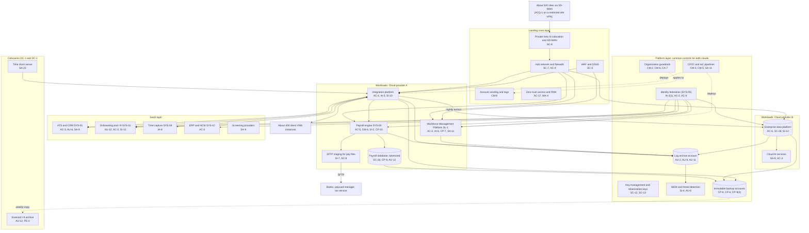

# Cloud Architecture and Control Placement: Cris Santos Company | Administrative and Support and Waste Management and Remediation Services | Enterprise

**Organization:** Cris Santos Company, Inc. (publicly traded staffing and workforce solutions company) | **Tier:** Enterprise | **Provider:** Multi-cloud, vendor-agnostic: two public cloud providers (called Cloud provider A and Cloud provider B), two colocation data centers, and SaaS (see section 4)
**Owner:** Director of Cloud Platform Engineering, with the CISO | **Date:** 2026-08-31 | **Related:** ALPP SSP (P02), enterprise BIA and dependency map (P05)

## 1. Architecture in layers
The estate is organized in four layers plus colocation. Each lower layer provides **common controls** that the layers above inherit, so a workload team configures only what is specific to its system.

| Layer | What it is | Examples | Who runs it |
|---|---|---|---|
| **Platform** | Organization-wide services in both clouds | Cloud organization guardrails, identity federation, key management (including the payroll tokenization keys), log archive, SIEM feeds, vulnerability and posture management, immutable backup accounts, CI/CD pipelines | Cloud Platform Engineering; Security Operations; Identity team |
| **Landing zone** | The standard account (subscription or project) pattern every workload lands in | Account vending with mandatory tags, hub-and-spoke network with cloud firewalls, private connectivity to colocation and SD-WAN, WAF and DDoS protection, zero-trust and PAM access | Cloud Platform Engineering; Network and Endpoint Engineering |
| **Workload** | Systems built or run by the firm | Cloud A: payroll and billing engine (SYS-03) and its database, SFTP staging for pay and tax files, the integration platform, the Workforce Management Platform (SYS-07, SL-1). Cloud B: enterprise data platform and cloud AI services | Application teams (for example, the Payroll Engine Application Manager) |
| **SaaS** | Vendor-operated applications | Front-office ATS (SYS-01), onboarding and I-9 (SYS-02), time capture (SYS-04), ERP and HCM (SYS-10), screening providers, productivity suite | Vendors, with the firm's configuration and oversight |

Colocation DC-1 (Florida) hosts the network core and the time clock server; DC-2 (Georgia) hosts the scanned I-9 archive and an offline copy of the immutable backups.

**Why the payroll engine is IaaS and not SaaS.** The firm runs a commercial staffing back-office package itself because weekly pay for 78,000 associates, multi-state tax rules, and client-specific bill rates need configuration that the vendor's hosted service did not offer in 2023. The trade-off: the firm owns the operating system, database, patching, backup, and disaster recovery for the most sensitive system it has.

## 2. Diagram

## 3. Responsibility by service model
Sources: SRC-AWS-SRM, SRC-AZURE-SRM, and SRC-GCP-SRM in `00_universal-framework/sources/source-register.csv`. The three published models agree on the split used here, so the design does not depend on which two providers the firm uses.

| Service model | Provider | Firm (customer) | Shared |
|---|---|---|---|
| IaaS (payroll engine servers) | Facilities, hosts, hypervisor, physical network | Guest OS, payroll application, identities, data, network policy | Encryption (provider service, customer keys), logging |
| PaaS (payroll database, SFTP, integration platform, WMP containers, data platform, AI services) | Also the platform runtime and its patching | Data, access, configuration, keys, application code | Backups, availability configuration |
| SaaS (ATS, onboarding and I-9, time capture, ERP and HCM, screening) | Also the application | Users, roles, data, retention settings, oversight of the vendor | Audit review (complementary user entity controls) |
| Colocation | Building, power, cooling, perimeter | Racks, servers, cage access lists | None |

## 4. Service categories and provider equivalents
| Service category | AWS | Microsoft Azure | Google Cloud |
|---|---|---|---|
| Organization guardrails | AWS Organizations service control policies | Azure Policy with management groups | Organization Policy Service |
| Account vending | AWS Control Tower account factory | Azure landing zone subscription vending | Resource Manager project creation |
| Key management | AWS KMS | Azure Key Vault | Cloud KMS |
| Audit logging | AWS CloudTrail | Azure Monitor activity log | Cloud Audit Logs |
| Threat detection | Amazon GuardDuty | Microsoft Defender for Cloud | Security Command Center |
| Managed relational database | Amazon RDS | Azure SQL Database | Cloud SQL |
| Managed file transfer (SFTP) | AWS Transfer Family | Azure Blob Storage SFTP | Partner offering (no first-party equivalent) |
| Managed containers | Amazon EKS | Azure Kubernetes Service | Google Kubernetes Engine |
| Web application firewall | AWS WAF | Azure Web Application Firewall | Cloud Armor |
| Backup service | AWS Backup | Azure Backup | Backup and DR Service |

This table is for reading provider documentation only. The architecture, control map, and SSP describe service categories.

## 5. Common controls
`cloud-control-map.csv` has **64 rows** across 28 components: Platform 21, Landing zone 8, Workload 21 (Cloud A 16, Cloud B 5), SaaS 10, Colocation 4. Responsibility: Customer 45, Shared 16, Provider 3.

**32 rows are published as common controls** (`common_control` = Yes) in the enterprise common control catalog. They map to the common control providers in the ALPP SSP (P02 section 10.3): identity (CCP-02), landing zone (CCP-03), security operations (CCP-04), network and endpoint engineering (CCP-05), and facilities and colocation (CCP-06). A workload inherits them by being deployed through account vending, which applies the guardrails, logging, network, key, and backup policies automatically.

**Rules for inheriting:**
1. A workload may claim a common control only if its account was created by account vending and passes the posture baseline.
2. Customer-side identity, data protection, and logging stay explicit at every layer: even a SaaS application has Customer rows for access (AC-3, AU-6, AU-12) because those are always the firm's responsibility.
3. SaaS rows cite the vendor's SOC 2 report, reviewed by the third-party risk team (P09 evidence map).

## 6. Validation against the ALPP SSP (P02)
Every ALPP component in the SSP boundary appears here with controls from each required family, directly or inherited:

| ALPP component | AC | AU | CM | IA | SC | SI |
|---|---|---|---|---|---|---|
| Payroll engine servers | AC-5 | AU-2, AU-9 (inherited) | CM-6, CM-2 (inherited) | IA-2(1) (inherited) | SC-7 (inherited) | SI-2, SI-3 (inherited) |
| Payroll database | AC-6 (inherited) | AU-12 | CM-6 (inherited) | IA-2(1) (inherited) | SC-28 | SI-2 (shared) |
| SFTP staging | AC-6 (inherited) | AU-2 (inherited) | CM-3 (inherited) | IA-2(1) (inherited) | SC-8 | SI-7 |
| Integration platform routes | AC-4 | AU-2 (inherited) | CM-3 (inherited) | IA-5 | SC-8 (inherited) | SI-10 |
| SYS-01, SYS-02, SYS-04 tenants | AC-3 | AU-6, AU-12 | CM-3 (vendor, SOC 2) | IA-2 (SSO) and IA-8 (associates) | SC-8 (vendor) | SI-12 |
| Time clock server and on-site clocks | AC-3 (local) | AU-2 (partial) | CM-8 | IA-5 | SC-7 | SA-22 (unsupported OS) |

## 7. Findings from the mapping
1. **Untokenized copies undo the payroll engine's best control.** Tokenization protects SSNs and bank numbers inside SYS-03, but the integration platform's nightly extract delivers them in clear text (encrypted at rest only) to the data platform in Cloud B, where 41 analytics users can query them (POAM-004). The architecture fix is to tokenize in the extract and give analytics a token, not a number.
2. **The pay file gap sits between layers.** The payroll engine reconciles control totals, and the SFTP service encrypts in transit, but no component verifies that the file transmitted is the file that was approved (POAM-019).
3. **Client integrations are the widest door.** About 400 client VMS integrations authenticate with shared service accounts and long-lived keys at the integration platform (POAM-008). This is a workload responsibility; no platform service rotates them automatically today.
4. **Two clouds, one control set.** Guardrails, logging, and key policies are written once as code and applied to both clouds. Differences are limited to service names (section 4).
5. **Log coverage.** Platform logging covers every cloud account, but ACQ-1's systems (outside the clouds) and the DC-2 I-9 archive are not yet in the SIEM (POAM-003; POAM-007).
6. **Legacy colocation components.** The time clock server in DC-1 is the only unsupported operating system in the ALPP boundary (POAM-011). It is on an isolated VLAN until the vendor's cloud-hosted clock service replaces it.
