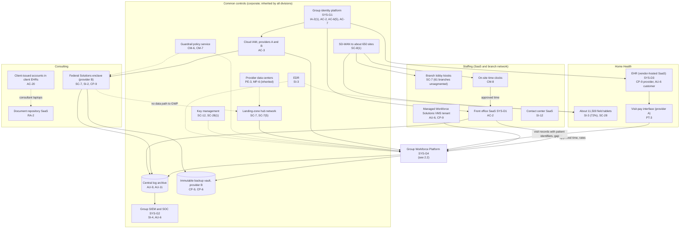
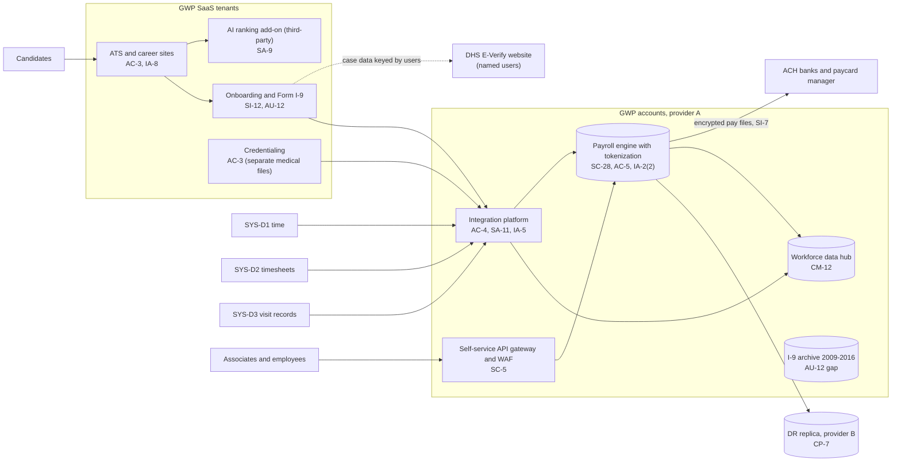

# Cloud Architecture and Control Placement: Cris Santos Company Holdings | Admin and Support Services | Multi-Sector

**Organization:** Cris Santos Company Holdings, Inc. | **Tier:** Multi-Sector | **Providers:** two public cloud providers, called provider A and provider B (vendor-agnostic; see section 5)
**Scope:** the shared corporate cloud platform (SYS-G3 landing zones), the Group Workforce Platform (GWP, SYS-G4) that runs on it and on SaaS, and the division workloads. The SSP system (P02) is the GWP.

## 1. Design in one paragraph
Corporate runs one **landing zone** per provider: identity federation from SYS-G1, a hub network, guardrail policies, a central log archive, key management, EDR, and an immutable backup vault. Divisions and the GWP get their own **accounts** (subscriptions or projects) inside the landing zone and inherit these guardrails. Provider A hosts the corporate hub, the GWP's customer-managed parts (payroll engine, tokenization service, integration platform, workforce data hub, I-9 archive), and the Home Health visit-pay interface. Provider B hosts the GWP disaster recovery replica, the backup vault, and Consulting's Federal Solutions enclave. Much of the estate is **SaaS**: the GWP's ATS, onboarding and I-9, and credentialing services; Staffing's front office, VMS tenant, time capture, and contact center; Consulting's document repository; and the Home Health EHR. For SaaS, the group controls identities, configuration, data, and vendor oversight, not the infrastructure.

## 2. Diagrams
### 2.1 Group landing zone, the GWP, and division workloads

### 2.2 Group Workforce Platform (SSP boundary)

**Target state (POAM-006, POAM-008, POAM-010, due 2026-12-31 to 2027-03-31):** the visit-pay interface sends an anonymous visit ID, date, and visit type only, and existing patient identifiers are purged from the payroll engine and data hub; associate bank changes require an app-based or passkey authenticator plus out-of-band confirmation; the I-9 archive has object-level access logging; integration service accounts use workload identity.

## 3. Common versus division-specific controls
`cloud-control-map.csv` has 52 rows across 32 components. The `control_scope` column shows who owns each placement:

| Scope | Rows | What it means |
|---|---|---|
| Common (group) | 21 | Provided once by corporate (SYS-G1, SYS-G2, SYS-G3) and inherited by every division account. Listed in the P02 common control catalog |
| Shared system (GWP) | 15 | Controls of the shared corporate system documented in the P02 SSP |
| Division-specific (Staffing) | 6 | Front office, VMS tenant, kiosks, time clocks, contact center |
| Division-specific (Consulting) | 5 | Federal Solutions enclave, document repository, client-issued accounts |
| Division-specific (Home Health) | 5 | EHR, field tablets, visit-pay interface |

| Responsibility | Rows |
|---|---|
| Customer (the group or a division) | 36 |
| Shared (provider and group) | 11 |
| Provider | 5 |

**Rule of thumb.** Identity, network guardrails, logging, keys, backups, and EDR are **common**. A division cannot opt out of them, only request an exception through POL-01. Data access inside an application, client and patient-facing identity, and anything a division's own regulator or client contract governs (the Federal Solutions enclave under FAR 52.204-21, the Home Health EHR under HIPAA, the VMS tenant under client contracts) are **division-specific**.

## 4. Layers
| Layer | Common components | GWP and division components | Key controls | Responsibility |
|---|---|---|---|---|
| Identity | SYS-G1, cloud IAM | Associate self-service, candidate accounts, client portal users, client-issued consultant accounts | AC-2, AC-3, AC-6(5), IA-2(1), IA-2(2), AC-20 | Customer (configuration); vendor (service) |
| Network | Hub network, SD-WAN | API gateway and WAF, branch kiosk segments, enclave firewall | SC-7, SC-7(5), SC-8(1), SC-5 | Customer, with provider DDoS protection shared |
| Compute | EDR, guardrails | Payroll engine, integration platform, enclave desktops, tablets | SI-2, SI-3, CM-6, CM-7, SA-11 | Customer (guest OS, containers, code) |
| Data | Keys, backup vault | Tokenization vault, data hub, I-9 archive, document repository | SC-12, SC-28, SC-28(1), CP-9, CP-6, CM-12, RA-2 | Shared: provider encrypts; group owns keys, tokenization, location, and retention |
| Logging and monitoring | Log archive, SIEM | Application and VMS audit logs, I-9 archive access logs | AU-6, AU-9, AU-11, AU-12, SI-4 | Shared: providers and vendors generate logs; group retains and reviews |
| SaaS dependencies | Identity and SIEM vendors | ATS, onboarding, credentialing, AI add-on, VMS, EHR | SA-9, CP-9, AC-3, SI-12 | Provider for the service; customer for configuration, use, and oversight |
| Physical | Provider data centers | Branch and agency offices (outside cloud scope) | PE-3, MP-6 | Provider (inherited) |

## 5. Service categories and provider equivalents
The design does not depend on a provider. This table gives each provider's name for each service category, for reading its shared responsibility documentation.

| Service category | AWS | Microsoft Azure | Google Cloud |
|---|---|---|---|
| Account structure and guardrails | AWS Organizations with service control policies | Management groups with Azure Policy | Resource hierarchy with Organization Policy |
| Object storage (I-9 archive) | Amazon S3 | Azure Blob Storage | Cloud Storage |
| Managed analytical database (data hub) | Amazon Redshift | Azure Synapse Analytics | BigQuery |
| Managed containers (integration platform) | Amazon EKS | Azure Kubernetes Service | Google Kubernetes Engine |
| Key management | AWS KMS | Azure Key Vault | Cloud KMS |
| Audit logging | AWS CloudTrail | Azure Monitor activity log | Cloud Audit Logs |
| Backup with immutability | AWS Backup (vault lock) | Azure Backup (immutable vault) | Backup and DR Service |
| API gateway and web application firewall | Amazon API Gateway with AWS WAF | Azure API Management with Azure WAF | Apigee or API Gateway with Cloud Armor |

Shared responsibility sources: SRC-AWS-SRM, SRC-AZURE-SRM, SRC-GCP-SRM in `00_universal-framework/sources/source-register.csv`. All three agree on the split used here: for IaaS the provider owns facilities, hosts, and virtualization; for PaaS the provider also owns the runtime; for SaaS the provider owns the application. The customer always keeps identities, access decisions, data classification, and data.

## 6. Findings from the mapping
1. **The GWP's weak points are data scope and authentication, not encryption.** Encryption and tokenization are sound (SC-28, SC-12). The gaps are patient data that should never have entered payroll (AC-4, PT-3, CM-12; POAM-006, POAM-013) and an SMS one-time code guarding bank changes for 1.1 million self-service users (IA-2(2); POAM-008).
2. **Much of the GWP is SaaS, so vendor oversight is a control, not paperwork** (SA-9). The ATS, onboarding, and credentialing vendors provide SOC 2 Type 2 reports; the AI ranking add-on vendor provides none and may train on candidate data (POAM-012).
3. **E-Verify sits outside every boundary.** It is a DHS website used by about 1,400 named users. The group cannot federate it, so account control depends on the termination checklist and quarterly reviews (POAM-001).
4. **Common controls are strong and reused.** One identity platform, one SIEM, one backup design. This lets group internal audit assess them once (P07). The weak links are field tablet EDR coverage and SIEM onboarding for Home Health (POAM-003, POAM-022), and documentation of inheritance for Home Health (POAM-021).
5. **The Federal Solutions enclave is deliberately isolated.** It has no data path to the GWP or other divisions, which keeps federal contract information inside the boundary that FAR 52.204-21 governs. The enclave's patching lag is its own finding (POAM-019).
