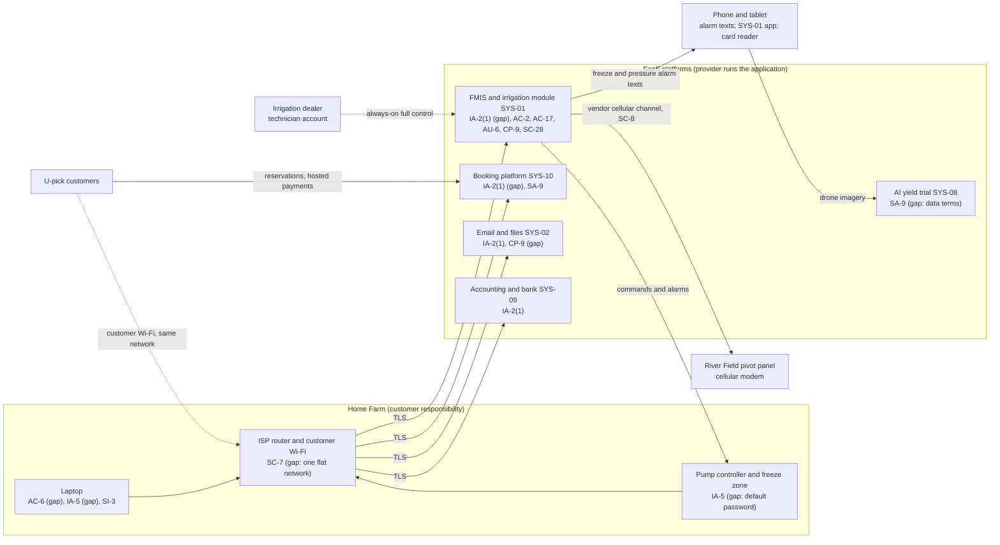

# SaaS Architecture and Control Placement: Cris Santos Company | Agriculture | Sole Proprietorship

**Organization:** Cris Santos Company (precision-agriculture crop farm) | **Tier:** Sole Proprietorship | **Provider:** SaaS only (no IaaS or PaaS)
**System:** Farm Management and Irrigation Control Platform (FMICP), as defined in the system profile (P02)

## 1. Diagram
Control IDs on each node are the ones in `cloud-control-map.csv`. Dashed lines are paths with an open gap.

## 2. Layers
| Layer | Components | Key controls | Responsibility |
|---|---|---|---|
| Identity | SYS-01, booking, email, accounting and bank accounts; the dealer's technician account | IA-2(1), AC-2, AC-17, IA-5 | Customer configures; vendor provides MFA and roles |
| Data | Field and program records, customer accounts, W-9 data, files, imagery | CP-9, SC-28, SA-9 | Vendor protects data inside its service; the customer decides what goes where, keeps its own copy, and sets contract terms |
| Endpoints | Laptop, phone, tablet, pump controller | AC-6, IA-5, SI-3 | Customer |
| Network | Router, access point, customer Wi-Fi | SC-7 | Customer (the internet provider supplies the router) |
| Logging | SYS-01 activity log; email and booking sign-in history | AU-2 (vendor), AU-6 (customer) | Shared: vendor records, customer reviews |
| SaaS applications, hosting, and the pivot's cellular channel | All SaaS platforms | Inherited (AC-3, SC-8, SC-28, PE family) | Provider |

## 3. Shared responsibility for SaaS
All three major cloud providers' shared responsibility models (SRC-AWS-SRM, SRC-AZURE-SRM, SRC-GCP-SRM) agree on the SaaS split: the provider runs the application, the platform, and the facilities; **the customer always keeps its identities and accounts, its data, and its devices.** That is why 14 of the 18 rows in the control map are the owner's, 2 are shared, and 2 are the provider's. A SaaS vendor's SOC 2 report never covers these three layers. No IaaS equivalents table is needed, because the farm runs no infrastructure.

**What is different on a farm:** the SaaS platform reaches back into the physical world. A command typed into SYS-01 starts a well pump or stops a pivot. The vendor secures the command path, but **who is allowed to send commands is the farm's decision**, and today two accounts can do it with a password alone.

## 4. Findings from the mapping
1. **The irrigation control account is the most valuable account the farm has, and the weakest.** SYS-01 administrator access uses a password only, and that password is reused on the booking platform and saved in a shared laptop browser (EV-002, EV-020). Tracked as P01 R-002.
2. **A third party can run the farm's irrigation at any time.** The dealer's technician account has full control all year, with no contract terms (EV-001, EV-008; R-004).
3. **The field and the farm stand share a network.** A customer on the posted Wi-Fi password is on the same network as the pump controller, whose local page still has its default password (EV-022, EV-009; R-005; the default password was found in P07 testing, EV-IA-5 and EV-SC-7).
4. **No farm-held copy of anything.** The vendors back up their own platforms, but the farm has never exported SYS-01 or the booking sales records that prove its qualified exemption (EV-005, EV-023, EV-030; R-007).
5. **The pivot's command channel is carved out of the vendor's SOC 2 report** (EV-007; reviewed in P09). The owner relies on the vendor's statement that it is encrypted and asks for the vendor's review of that provider.
