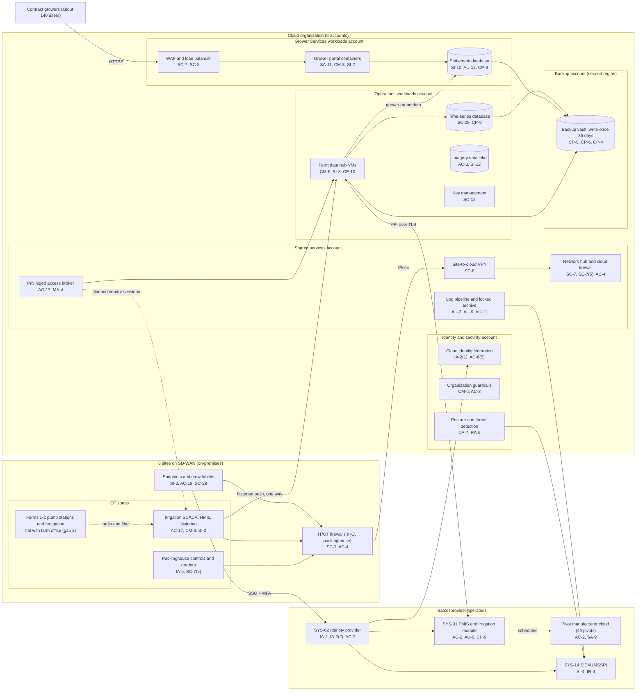

# Cloud Architecture and Control Placement: Cris Santos Company | Agriculture | Mid-Market

**Organization:** Cris Santos Company, Inc. | **Tier:** Mid-Market | **Provider:** Vendor-agnostic public cloud (see section 4), plus SaaS
**System:** Farm Management and Irrigation Control Platform (FMICP), as defined in the SSP (P02) | **Prepared:** 2026-07-31 by the Security Manager; updated 2026-09-15 with P07 results
**Control map:** `cloud-control-map.csv` (56 rows, 23 components)

## 1. Diagram

## 2. Landing zone design
The landing zone separates duties across 5 accounts (subscriptions or projects, depending on the provider) under one cloud organization. Grower Services has its own account so that the SOC 2 scope (P09) has a clear boundary and a compromise of farm analytics cannot reach settlement data.

| Account | Purpose | Who administers | Key design decisions |
|---|---|---|---|
| **Identity and security** | Organization root, federation to SYS-02, guardrails, posture and threat detection | Security Manager and 1 analyst | No workloads. Root credentials sealed. Guardrails apply to every account and cannot be disabled from them |
| **Shared services** | Network hub, cloud firewall, site VPN, DNS, privileged access broker, patch service, log pipeline and locked log archive | IT Director's infrastructure team (3 people) | All traffic between sites, workloads, and the internet passes the hub. Logs from all accounts land in a write-once archive here |
| **Operations workloads** | Farm data hub (historian replica and integrations with SYS-01), time-series database, imagery data lake, key management | Infrastructure team; Director of Irrigation and Water Resources owns the data | OT data enters one way from the headquarters OT firewall. No inbound path from the cloud to SCADA |
| **Grower Services workloads** | Grower portal, settlement service and database, web application firewall, secrets manager | Infrastructure team; the development firm deploys through the pipeline | Only internet-facing workload. Separate account, keys, and pipeline. In SOC 2 scope |
| **Backup** | Backup vault with 35-day write-once retention in a second region | 2 named backup administrators | Separate administrator credentials, not federated to everyday accounts. Backups are pulled by a cross-account role that can write but not delete |

**What is not in the cloud.** SCADA servers, HMIs, PLCs, and packinghouse controls run on-premises and must keep running if the internet is down. The cloud receives a copy of OT data but never sends commands to SCADA. Remote pivot control at Farm 3 runs through the pivot manufacturer's own cloud service, outside the landing zone.

## 3. Layers and shared responsibility per service
| Layer | Components | Key controls | Service model | Responsibility |
|---|---|---|---|---|
| Identity | Cloud federation, access broker, break-glass accounts, SYS-02 | IA-2, IA-2(1), IA-2(2), AC-2, AC-6(2), AC-6(5), AC-7 | PaaS / SaaS | Customer configures identities, roles, MFA, and reviews; provider runs the identity services |
| Network | Hub, cloud firewall, VPN, WAF | SC-7, SC-7(5), SC-8, AC-4 | PaaS | Customer designs routes, rules, and segmentation; provider runs the gateway, firewall, and WAF services |
| Compute | Farm data hub VMs, grower portal containers, patch service | CM-6, CM-3, SI-2, SI-3, SA-11, CP-10 | IaaS / PaaS | Customer owns guest OS, images, application code, and EDR; provider owns hosts, hypervisor, and the container platform |
| Data | Time-series and settlement databases, imagery data lake, keys, secrets, backups | SC-28, SC-12, CP-9, CP-6, CP-4, AC-3, AC-6, SI-10, SI-12 | PaaS | Shared: provider encrypts and operates storage and engines; customer controls keys, access, retention, input validation, isolation, and restore testing |
| Logging and monitoring | Log pipeline, archive, posture service, SIEM | AU-2, AU-9, AU-11, AU-12, CA-7, RA-5, SI-4, IR-4 | PaaS / SaaS | Shared: provider generates logs and detections; customer enables, retains, forwards, and acts on them; MSSP monitors |
| SaaS applications | FMIS, identity provider, SIEM, pivot cloud, alarm service | AC-2, AU-6, CP-9, SC-28, SA-9 | SaaS | Provider runs the application; customer keeps users, roles, audit review, data exports, and vendor oversight |
| Physical | Provider data centers | PE-3 | All | Provider (inherited, evidenced by SOC 2 reports) |

**Responsibility counts in `cloud-control-map.csv`:** 27 Customer, 24 Shared, 5 Provider. By service model: 37 PaaS, 11 SaaS, 8 IaaS rows. The customer side is always identity, data protection, configuration, and logging, as the three providers' shared responsibility models agree.

## 4. Service categories and provider equivalents
The design is independent of the provider. This table gives each provider's name for the service category, for reading its shared responsibility documentation (SRC-AWS-SRM, SRC-AZURE-SRM, SRC-GCP-SRM in `00_universal-framework/sources/source-register.csv`).

| Service category | AWS | Microsoft Azure | Google Cloud |
|---|---|---|---|
| Multi-account organization and guardrails | AWS Organizations, service control policies | Management groups, Azure Policy | Resource Manager folders, organization policies |
| Account, subscription, or project | Account | Subscription | Project |
| Cloud identity federation | IAM Identity Center | Microsoft Entra ID with Azure RBAC | Cloud Identity with IAM |
| Network hub and cloud firewall | Transit Gateway, AWS Network Firewall | Virtual WAN hub, Azure Firewall | Network Connectivity Center, Cloud NGFW |
| Site-to-cloud VPN | Site-to-Site VPN | VPN Gateway | Cloud VPN |
| Web application firewall and load balancer | AWS WAF, Application Load Balancer | Azure Web Application Firewall, Application Gateway | Cloud Armor, Cloud Load Balancing |
| Virtual machines | EC2 | Virtual Machines | Compute Engine |
| Managed containers | Amazon ECS or EKS | Azure Container Apps or AKS | Cloud Run or GKE |
| Managed relational and time-series databases | Amazon RDS, Amazon Timestream | Azure SQL, Azure Data Explorer | Cloud SQL, Bigtable |
| Object storage with lifecycle rules | S3 | Blob Storage | Cloud Storage |
| Backup service with write-once retention | AWS Backup (vault lock) | Azure Backup (immutable vault) | Backup and DR Service |
| Key management and secrets | AWS KMS, Secrets Manager | Azure Key Vault | Cloud KMS, Secret Manager |
| Audit logging | CloudTrail | Azure Monitor activity log | Cloud Audit Logs |
| Posture and threat detection | Security Hub, GuardDuty | Microsoft Defender for Cloud | Security Command Center |

**Service model split used here (all three providers agree):**
- **IaaS** (virtual machines, the access broker host): the provider owns facilities, hosts, and virtualization. The customer owns the guest OS, applications, network configuration, identities, and data.
- **PaaS** (containers, databases, storage, backup, keys, firewall and WAF services): the provider also owns the platform software and its patching. The customer owns access, keys, data, code, and configuration.
- **SaaS** (FMIS, identity provider, SIEM, pivot cloud, alarm service): the provider also owns the application. The customer keeps identities, roles, audit review, exports, and vendor oversight.

## 5. Findings from the mapping
1. **The grower portal is the company's own code.** Because the company owns the application in the Grower Services account, it carries the customer side of every PaaS control plus the development controls (SA-11, CM-3) that a SaaS customer would inherit. The development firm can deploy to production without a company approval step, and the pipeline has no dependency or static analysis scanning (gap 6; P01 R-011, R-045). Fix: approval gate, scanning, and a secure development standard (POAM-017).
2. **OT stays out of the cloud, by design.** The one-way historian push from the headquarters OT firewall to the farm data hub is the right pattern (SP 800-82 Rev. 3 section 5.2.3). The weak points are outside the landing zone: vendor remote access straight into SCADA (gap 1) and the pivot manufacturer's cloud, which has standing access to all 46 pivots and no security terms (P01 R-002, R-014).
3. **Recovery is designed but unproven.** Backups are isolated (separate account, second region, write-once, separate credentials), which is the strongest control in the environment. No restore of the farm data hub, the time-series database, or the settlement database has been tested (gap 3). Fix: quarterly restore tests into an isolated recovery network from 2026-10-21.
4. **Logging stops at the OT boundary.** The landing zone logs well, but SCADA, PLC, and packinghouse controller events never reach the SIEM, and egress volume alerts are not configured (P01 R-003, R-021). Fix: passive OT monitoring and egress alerts by 2027-03-31 and 2027-01-31.
5. **Boundary check.** Every in-scope component in the SSP (P02 section 9) appears in the diagram or is covered by an on-premises row in the SSP. Every cloud component has at least one row in the control map, and each account has controls from at least 2 of the AC, AU, CM, IA, SC, and SI families or inherits them.
6. **Inherited controls rely on SOC 2 reports.** Controls marked Provider or Shared for the cloud provider, FMIS vendor, identity provider, and MSSP depend on their SOC 2 Type 2 reports and complementary user entity controls, reviewed each year in P09 `vendor-soc2-review.csv`. The pivot manufacturer has no report.
