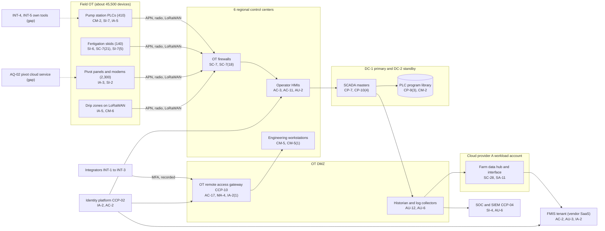

# System Security Plan: Farm Management and Irrigation Control Platform (FMICP)

**Organization:** Cris Santos Company, Inc. (publicly traded diversified precision-agriculture crop farm) | **Tier:** Enterprise | **Vertical:** Agriculture, Forestry, Fishing and Hunting
**Outline:** NIST SP 800-18 Rev. 2, System Security Plan Outline Example (June 2026) | **Version:** 2.0, 2026-09-14

## 1. System Name and Identifier
Farm Management and Irrigation Control Platform (**FMICP**), identifier CSC-SYS-FMICP-001. Tier-1 system in the enterprise application inventory. The OT portion follows NIST SP 800-82 Rev. 3.

## 2. System Overview
The FMICP plans and runs irrigation and fertigation on about 205,000 irrigated acres and keeps the field records the company must produce for regulators and customers. It supports:
- irrigation planning in the FMIS and execution through the SCADA system: about 410 pump stations, 2,300 center pivots, 18,000 drip zones, and 140 fertigation and chemigation skids;
- freeze-protection irrigation on about 9,400 acres of strawberries and blueberries (December to February);
- crop protection and nutrient application records, Worker Protection Standard application and hazard information, and Produce Safety records (21 CFR Part 112);
- harvest field tally for crews, including H-2A earnings records (20 CFR 655.122(j));
- flow records used for water permit reporting.

**Why integrity matters most.** A wrong command or setpoint can do physical harm. A fertigation or chemigation skid that injects at the wrong rate or with its interlocks bypassed can expose workers and contaminate water sources. A pivot that stops on a freeze night or runs the wrong schedule in a heat wave can destroy a crop in hours. A falsified or misattributed record can break the Produce Safety requirement that records be accurate, indelible, and signed by the person who did the work (21 CFR 112.161(a)).

**Major components:**
- **FMIS tenant (SYS-01):** vendor-hosted SaaS; the company manages users, roles, record templates, integrations, and the irrigation planning module
- **SCADA masters:** virtualized server pair at DC-1 (primary) with a standby pair at DC-2, plus the PLC program library and historian
- **Regional irrigation control centers (6):** operator HMIs (48), engineering workstations (12), historian collectors, OT firewalls, and the OT DMZ with the OT remote access gateway
- **Field OT:** pump station PLCs with variable-frequency drives, fertigation and chemigation skid controllers with safety interlocks, pivot control panels with cellular modems, drip-zone valve controllers on LoRaWAN gateways, soil moisture probes, flow meters, and weather stations (about 45,500 devices)
- **Farm data hub (Cloud provider A):** historian replica and the SCADA-to-FMIS interface in a dedicated workload account of the enterprise landing zone
- **Field networks:** one carrier's private cellular APN, company licensed radio (40 towers), LoRaWAN, and fiber near facilities

Users: about 2,900 year-round FMIS users and up to 3,900 seasonal crew lead and scout accounts; about 260 SCADA operator accounts and 34 engineering accounts; about 40 named integrator accounts on the remote access gateway.

## 3. Laws, Regulations, and Policies Affecting the System
| ID | Requirement | Citation | How it affects the FMICP |
|---|---|---|---|
| Benchmark | NIST Cybersecurity Framework 2.0 | NIST CSWP 29 (2024) | Voluntary benchmark (P03). No binding sector-specific federal cybersecurity rule applies |
| Benchmark (OT) | Guide to Operational Technology Security | NIST SP 800-82 Rev. 3 (2023) | OT architecture, remote access, patching, and the Appendix F OT overlay |
| Binding | Produce Safety Rule, records | 21 CFR 112.161-112.166 | Records in SYS-01 must be accurate, indelible, signed, kept 2 years, and produced within 24 hours if offsite |
| Binding (enforcement from 2028-07-20) | Food Traceability Rule | 21 CFR 1.1315-1.1455 | Harvest and cooling records and the farm map with field coordinates come from the FMICP; readiness tracked in P03 |
| Binding | H-2A earnings records | 20 CFR 655.122(j) | Field tally in SYS-01 is part of the earnings record |
| Binding | Worker Protection Standard | 40 CFR 170.311(b) | Application and hazard information from SYS-01 must be displayed within 24 hours and kept 2 years |
| SEC | Cybersecurity disclosure | Form 8-K Item 1.05; 17 CFR 229.106 | A material FMICP incident would go through the P08 materiality step. Item 106 defines information systems to include physical infrastructure controlled by them, so OT is in scope |
| State | State data security and breach notification laws | Each state where affected individuals reside (Florida worked example: Fla. Stat. 501.171) | Tally records and operator data are personal information |
| Contract | Retail and foodservice supplier agreements; SOC 2 readiness | P09 | 24-hour notice of events affecting product safety or traceability; SL-1 and SL-2 client commitments |
| Internal | POL-01 to POL-05 and standards | P06 | Enterprise policy hierarchy |

Not applicable:
- **N11-R01**, the FSMA intentional adulteration rule (21 CFR Part 121): it applies only to facilities that must register under FD&C Act section 415 (21 CFR 121.1), and every company site is a farm (21 CFR 1.226(b); 1.227). Its food defense approach is used only as a voluntary checklist for fertigation tampering (SI-7(5)).
- **CIRCIA** (proposed 6 CFR Part 226): not final as of 2026-09-25. As proposed it would cover the company, because it exceeds the SBA size standard; P08 tracks it.

## 4. System Status
### 4.1 System Security Plan Approval
Prepared by the SCADA Engineering Manager, the FMIS Platform Manager, and the GRC team. Reviewed by the CISO, the Director of OT Security, and the Vice President, Irrigation and Water Resources. Approved by the Chief Operating Officer on 2026-09-14.
### 4.2 System Authorization Decision
The company is not a federal agency, so there is no formal ATO. The equivalent internal decision:
- **Authorizing official equivalent:** Chief Operating Officer, with the CISO's recommendation.
- **Decision (2026-09-14):** continue operation with conditions, based on the Internal Audit assessment (P07) and the risk register (P01).
- **Conditions before the 2026-27 freeze season:** default credentials removed from OT devices (POAM-010 by 2026-11-30); INT-4 and INT-5 moved onto the OT remote access gateway (POAM-004 by 2026-12-31); interim named accounts and MFA in the AQ-02 pivot cloud service (POAM-002 milestone 2026-11-15).
- **Further conditions:** fertigation change control and integrity checks (POAM-006 by 2027-01-31; POAM-019 by 2027-03-31); SCADA master restore within 6 hours demonstrated (POAM-011 by 2027-01-31).
- **Reauthorization:** annually, or after a major change (for example, the AQ-02 migration onto SCADA in 2027).
### 4.3 System Operational Status
Operational. Planned major modifications: automated change blocking for PLC downloads and recipe releases (CM-3(1)); automated integrity notification and fertigation stop (SI-7(2), SI-7(5)); migration of AQ-02 pivots from the manufacturer's cloud service onto the company SCADA (2027-06-30).

## 5. Role Identification and Responsible Personnel
| Role | Title | Responsibility |
|---|---|---|
| System owner | Vice President, Irrigation and Water Resources | Accountable for the FMICP; approves SCADA roles and recipe limits |
| FMIS business owner | Vice President, Digital Agronomy | FMIS tenant, records templates, and field apps |
| Authorizing official (equivalent) | Chief Operating Officer | Accepts residual risk to operate |
| OT system administrator | SCADA Engineering Manager | SCADA masters, PLC program library, engineering workstations, OT change control |
| FMIS administrator | FMIS Platform Manager | Tenant configuration, roles, integrations |
| Regional operations | Irrigation Control Center Managers (6) | Daily operation; approve regional setpoint changes; lead manual operation |
| Information security | CISO; Director of OT Security; Director of Security Operations | Program oversight; OT security engineering; SOC monitoring and incident response |
| Records | Chief Food Safety and Quality Officer; Director of H-2A and Labor Compliance | Produce Safety and traceability records; H-2A earnings records |
| Common control providers | See section 10.3 | Operate inherited controls |
| Independent assessor | Chief Audit Executive (Internal Audit, with a co-sourced OT assessment firm) | Annual assessment (P07) |

## 6. System Information Types and System Categorization
SP 800-60's information type catalog is built for federal missions and has no farm operations type. Information types below are author-defined following the SP 800-60 method; impact levels follow FIPS 199.

| Information type | Confidentiality | Integrity | Availability | Rationale |
|---|---|---|---|---|
| Irrigation and fertigation control (commands, schedules, setpoints, recipes, PLC logic, interlock settings) | Low | **High (treated)** | Moderate | A wrong or altered command can expose workers to chemicals, contaminate water, or destroy a crop, so integrity is treated at High. Manual operation and freeze-night staffing keep availability at Moderate (P05 BP-01: MTD 12 h; BP-02 is covered by the manual freeze plan) |
| Produce Safety, application, and traceability records | Low | Moderate | Moderate | Records must be accurate and indelible and produced within 24 hours (21 CFR 112.161(a); 112.166(a)) |
| Field tally and worker records (H-2A earnings records) | Moderate | Moderate | Low | Names with piece-rate counts; errors lead to wage disputes and program findings |
| Farm operational and yield data | Moderate | Low | Low | Commercially sensitive yields, volumes, and grower data |
| Information security (audit logs, rule sets, credentials) | Moderate | Moderate | Moderate | Protects the evidence for command integrity |
| **FMICP category** | **Moderate** | **Moderate baseline, integrity supplemented** | **Moderate** | See the decision below |

**Categorization decision.** Under a strict FIPS 199 high-water mark, a High integrity rating would make the whole system High. The company is not a federal agency and uses FIPS 199 as a model. The risk committee approved this tailoring on 2026-09-10:
- The FMICP uses the **SP 800-53B Moderate baseline**, with the **SP 800-82 Rev. 3 Appendix F OT overlay** consulted for the OT components.
- It adds **12 High-baseline controls** that protect command integrity and safe operation: CM-3(1), CM-4(1), CM-5(1), CM-6(2), CP-2(5), CP-9(3), CP-10(4), SC-7(18), SC-7(21), SI-6, SI-7(2), SI-7(5).
- The decision is reviewed annually. If the command-integrity POA&M items (POAM-006, POAM-010, POAM-019) are not closed by 2027-06-30, the CISO will recommend full High categorization for the OT subsystem.

**Documented controls.** `control-implementation.csv` documents **147 controls**: 135 from the Moderate baseline and 12 High-baseline supplements. The remaining Moderate-baseline controls and enhancements are fully inherited from the common control catalog (section 10.3) and are listed there rather than repeated here.

## 7. Authorization Boundary Description
The boundary was drawn from the intake [asset inventory](../step-00_P00_intake/asset-inventory.csv) (SYS-01, SYS-02, the farm data hub part of SYS-04-A, SYS-05 and SYS-05-F, with SYS-02-PV as an interconnected service).

**Inside the boundary:** the FMIS tenant configuration and roles, the SCADA masters and PLC program library at DC-1 and DC-2, the 6 control centers (HMIs, engineering workstations, historian collectors, OT firewalls, OT DMZ), all field OT devices on company farms (including AQ-01), the field network segments (APN, licensed radio, LoRaWAN), and the farm data hub workload on Cloud provider A.

**Outside the boundary (common control providers and interconnected systems):**
- Landing zone services (network hub, key management, log archive, backup accounts, standby region): CCP-03
- Identity platform (SYS-03): CCP-02
- SOC, SIEM, EDR, scanners: CCP-04; OT remote access gateway and OT monitoring sensors: CCP-10
- FMIS vendor platform; APN carrier; pivot manufacturer cloud service (AQ-02, interconnected until migration); integrators' systems; equipment dealers' telematics portals; packing site systems (SYS-07)

The enterprise multi-cloud diagram is in P04 `cloud-architecture.md`.

## 8. Information Exchanges Summary
| Connected system / party | Direction | Data | Agreement |
|---|---|---|---|
| FMIS vendor platform (SYS-01) | Bidirectional (API over TLS from the data hub) | Irrigation plans, as-applied flows, alarms, records | FMIS master agreement with security terms; SOC 2 Type 2 reviewed |
| Integrators INT-1 to INT-3 | Inbound sessions through the gateway | PLC and HMI support | Service agreements with security terms (2025) |
| Integrators INT-4 and INT-5 | Inbound through their own remote tools | PLC and HMI support at about 120 pump stations | Agreements predate security terms; **outside the gateway (POAM-004)** |
| Pivot manufacturer cloud service (AQ-02) | Bidirectional over the internet | Start, stop, speed, and status for about 180 pivots | Click-through terms; **shared logins, no MFA (POAM-002)** |
| APN carrier | Transport | Field telemetry and commands | Carrier contract with a private APN |
| Equipment dealers' telematics portals (SYS-09) | Inbound to the FMIS | As-applied maps, yield monitor data | Dealer portal terms; **standing dealer access (POAM-016)** |
| Packing site systems (SYS-07) | Inbound from the FMIS | Harvest lots and field identifiers for traceability | Internal interface specification |
| Traceability data service (Cloud provider A) | Outbound from the FMIS | Harvest, cooling, and field data for FTL foods | Internal data sharing agreement |
| Water management districts | Outbound reports | Monthly and annual withdrawal totals | Permit conditions |

## 9. System Component Inventory
| Component | Type | Location / provider | Owner |
|---|---|---|---|
| FMIS tenant configuration, roles, integrations | SaaS | FMIS vendor | FMIS Platform Manager |
| SCADA master servers (2 primary, 2 standby) | Virtualized servers | DC-1 and DC-2 | SCADA Engineering Manager |
| PLC program library and historian | Server and repository | DC-1, replicated to DC-2 | SCADA Engineering Manager |
| Operator HMIs (48; 31 on an unsupported OS) | OT workstations | 6 control centers | Irrigation Control Center Managers |
| Engineering workstations (12) | OT workstations | 6 control centers | SCADA Engineering Manager |
| OT firewalls and OT DMZ (remote access gateway, collectors) | Network and servers | 6 control centers and DC-1 | Director of Network Engineering; Director of OT Security |
| Farm data hub and interface | IaaS virtual machines and managed database | Cloud provider A workload account | SCADA Engineering Manager |
| Pump station PLCs with VFDs (about 410) | OT | Farms | Irrigation Control Center Managers |
| Fertigation and chemigation skids (about 140) | OT with safety interlocks | Farms | Irrigation Control Center Managers |
| Pivot control panels with cellular modems (about 2,300; about 1,300 on vulnerable firmware) | OT | Farms | Irrigation Control Center Managers |
| Drip-zone valve controllers (about 18,000) on LoRaWAN gateways (about 520) | OT and IoT | Farms | Irrigation Control Center Managers |
| Soil moisture probes, flow meters, weather stations (about 24,160) | IoT | Farms | Irrigation Control Center Managers |
| Licensed radio towers (40) | Network | Farms | Director of Network Engineering |
| Rugged tablets used for irrigation and tally (about 6,500) | Endpoint | Field | Director of Endpoint and Mobility Engineering |

## 10. Control Implementation Details
### 10.1 Control implementation status
See `control-implementation.csv` (147 controls).

| Status | Count |
|---|---|
| Implemented | 109 |
| Partially implemented | 35 |
| Planned | 3 |
| **Total** | **147** |

| Inheritance | Count |
|---|---|
| Common (fully inherited from a common control provider) | 70 |
| Hybrid (shared between a provider and the FMICP team) | 41 |
| System-specific | 36 |

The Planned controls are High-baseline integrity supplements: CM-3(1), SI-7(2), SI-7(5). Partially implemented controls: AC-2, AC-2(3), AC-5, AC-17, AC-19, AT-3, AU-6, CA-3, CM-3, CM-6, CM-8, CP-8, CP-10, IA-2, IA-3, IA-5, IR-8, MA-4, PS-4, PS-7, RA-5, SA-9, SA-22, SC-7, SC-8, SI-2, SI-3, SI-4, SI-7, SI-7(1), SR-6, CM-5(1), CM-6(2), CP-10(4), SI-6.

### 10.2 Control assessment status
Internal Audit, with a co-sourced OT assessment firm, assessed 44 of these controls from 2026-07-13 to 2026-08-28 using SP 800-53A Rev. 5 procedures and statistical sampling (P07 `assessment-plan.md`, `assessment-results.csv`). OT tests ran only in scheduled maintenance windows. Weaknesses are in P07 `poam.csv`.

### 10.3 Common control providers and inheritance
Common and hybrid controls are inherited from the enterprise platform. Each provider publishes its controls in the enterprise **common control catalog** (maintained by the GRC team in the GRC platform) and is assessed on its own cycle; the FMICP inherits the results.

| Provider | Name | Accountable role | Controls provided | Rows in this plan | Evidence of operation |
|---|---|---|---|---|---|
| CCP-01 | Enterprise GRC program | CISO (with the Chief Risk Officer and Chief Audit Executive for assessment) | Policies and standards (P06), risk methodology, assessment, POA&M, continuous monitoring | 23 | Annual Internal Audit assessment (P07); GRC platform |
| CCP-02 | Identity platform (SYS-03) | Director of Identity and Access Management | SSO, MFA, PAM, identity governance, OT directory sync | 17 | SOX IT general control testing; P07 AC-2, IA-2, IA-5 results |
| CCP-03 | Cloud landing zone (Cloud provider A) | Director of Cloud Platform Engineering | Account guardrails, key management, encryption, backups, log archive, standby region | 10 | Posture management reports; provider SOC 2 Type 2 |
| CCP-04 | Security operations | Director of Security Operations | 24x7 SOC, SIEM, EDR, incident response, threat intelligence | 17 | SOC metrics; P07 SI-4, IR results |
| CCP-05 | Enterprise network and OT DMZ (SYS-05) | Director of Network Engineering | SD-WAN, OT firewalls, zones and conduits, wireless, APN and radio design | 8 | Firewall rule reviews; P07 SC-7 results |
| CCP-06 | Endpoint and mobility engineering (SYS-06) | Director of Endpoint and Mobility Engineering | Workstation baselines, EDR agents, mobile device management, media disposal | 4 | Configuration compliance and MDM reports |
| CCP-07 | Facilities and physical security | Vice President, Facilities and Physical Security | Control center, data center, and pump station physical protection | 4 | Badge and alarm reports |
| CCP-08 | Human resources and workforce training | Chief Human Resources Officer | Screening, terminations, sanctions, training, acknowledgments | 7 | HR and learning system reports |
| CCP-09 | Third-party risk management | Director of Third-Party Risk Management | Vendor tiering, contract terms, SOC report reviews, supply chain risk management | 8 | Vendor register; SOC report reviews |
| CCP-10 | OT security engineering | Director of OT Security | OT remote access gateway, OT monitoring sensors, OT inventory, OT hardening and patch program | 13 | Gateway logs; inventory and patch reports; P07 AC-17, CM-8, SI-2 results |

**Inheritance rules:**
- A Common control is fully inherited; the FMICP team verifies only that the FMICP is onboarded (for example, SSO integration, log forwarding, gateway enrollment).
- A Hybrid control names both parts in the implementation statement: the provider's part and the FMICP team's part.
- If a provider's assessment finds a weakness, the finding is linked to every inheriting system's POA&M. Example: POAM-001 (acquired-operation terminations) is a CCP-02 and CCP-08 weakness that affects the FMICP because AQ-01 staff hold FMIS tally and SCADA operator access.

## 11. Digital Identity Acceptance Statement
- **Workforce users:** SSO with MFA (authenticator app with number matching). Privileged users and engineers use phishing-resistant FIDO2 keys through PAM and the OT gateway. This is comparable to NIST SP 800-63 AAL2 for users and AAL3-like protection for privileged users.
- **Control room operators:** badge plus PIN at HMIs inside badge-controlled control rooms, with SSO for any change outside the operator role. Shared operator accounts are prohibited; the alarm summary stays visible when a session locks.
- **Seasonal crew leads:** named FMIS accounts with a device PIN on managed rugged tablets, so each tally entry is attributable (21 CFR 112.161(a)(4); 20 CFR 655.122(j)(1)). Exception until POAM-023 closes: AQ-01 crews share tally logins.
- **Integrators:** named gateway accounts with MFA and session recording. Exceptions until POAM-004 and POAM-002 close: INT-4 and INT-5 tools, and the AQ-02 pivot cloud service.

## 12. Referenced Artifacts
Scenario facts (`../00_company-facts.md`), intake evidence, inventories and obligations register ([step-00](../step-00_P00_intake/intake-report.md)), BIA and dependency map (P05), multi-cloud architecture and control map (P04), enterprise risk register (P01), regulatory gap analysis (P03), policy hierarchy and policies (P06), Internal Audit assessment and POA&M (P07), ransomware runbook (P08), SOC 2 readiness for SL-1 and SL-2 (P09), AI portfolio including AI-002 irrigation scheduling recommendations (P10), FMICP contingency plan v3, regional freeze plans, OT change procedure PRC-01.4, enterprise common control catalog (EV-044), FMICP contingency plan v3 and regional freeze plans (EV-050). The `evidence` column in `control-implementation.csv` cites the [evidence register](../step-00_P00_intake/evidence-register.csv) ID behind each statement.

## 13. Acronym List and Glossary
- **APN:** access point name (a private cellular network segment)
- **CCP:** common control provider
- **DMZ:** demilitarized zone (the buffer network between IT and OT)
- **Fertigation and chemigation:** injecting fertilizer or crop protection products into irrigation water
- **FMIS:** farm management information system
- **HMI:** human-machine interface
- **LoRaWAN:** a low-power wide-area radio network for field sensors and valves
- **OT:** operational technology
- **PAM:** privileged access management
- **PLC:** programmable logic controller
- **POA&M:** plan of action and milestones
- **SCADA:** supervisory control and data acquisition
- **VFD:** variable-frequency drive

## 14. System Security Plan Review and Change Records
| Version | Date | Change | Author |
|---|---|---|---|
| 1.0 | 2025-09-15 | Initial plan (Moderate baseline) | SCADA Engineering Manager |
| 1.1 | 2026-04-06 | Added AQ-01 farms and the AQ-02 pivot cloud interconnection | SCADA Engineering Manager |
| 2.0 | 2026-09-14 | Integrity supplementation; common control provider mapping; 2026 assessment results | SCADA Engineering Manager and FMIS Platform Manager with the GRC team |
