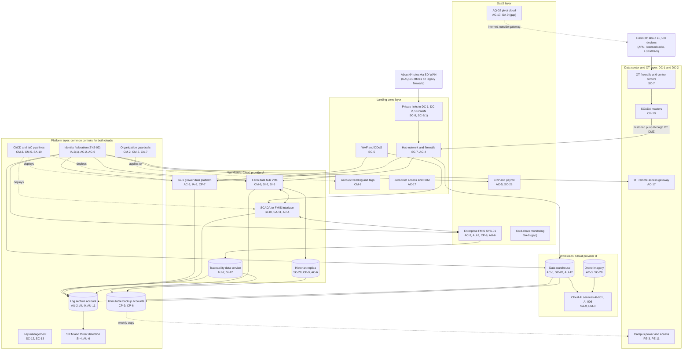

# Cloud Architecture and Control Placement: Cris Santos Company | Agriculture, Forestry, Fishing and Hunting | Enterprise

**Organization:** Cris Santos Company, Inc. (publicly traded diversified precision-agriculture crop farm) | **Tier:** Enterprise | **Provider:** Multi-cloud, vendor-agnostic: two public cloud providers (called Cloud provider A and Cloud provider B), two company data center campuses (DC-1 and DC-2), and SaaS (see section 4)
**Owner:** Director of Cloud Platform Engineering, with the CISO and the Director of OT Security | **Date:** 2026-08-31 | **Related:** FMICP SSP (P02), enterprise BIA (P05)

## 1. Architecture in layers
The estate is organized in five layers. Each lower layer provides **common controls** that the layers above inherit, so a workload team configures only what is specific to its system. The fifth layer, company data centers and OT, exists because the irrigation control system (SYS-02) cannot run in a public cloud: SCADA masters must keep working when internet links fail, and field commands must never depend on a cloud service.

| Layer | What it is | Examples | Who runs it |
|---|---|---|---|
| **Platform** | Organization-wide services in both clouds | Cloud organization guardrails, identity federation, key management, log archive, SIEM feeds, vulnerability and posture management, immutable backup accounts, CI/CD pipelines | Cloud Platform Engineering; Security Operations; Identity and Access Management |
| **Landing zone** | The standard account (subscription or project) pattern every workload lands in | Account vending with mandatory tags (including an OT flag), hub-and-spoke network with cloud firewalls, private connectivity to DC-1, DC-2, and SD-WAN, WAF and DDoS protection, private DNS, zero-trust and PAM access | Cloud Platform Engineering; Network Engineering |
| **Workload** | Systems built or run by the company | Cloud A: farm data hub and historian replica, SCADA-to-FMIS interface, traceability data service, SL-1 grower data platform. Cloud B: drone imagery pipeline, data warehouse, cloud AI services (AI-001, AI-006) | Application teams (for example, the SCADA Engineering Manager for the farm data hub) |
| **SaaS** | Vendor-operated applications | Enterprise FMIS (SYS-01), ERP and payroll (SYS-11), productivity suite, EDI network, cold-chain monitoring, e-commerce, and the AQ-02 pivot manufacturer's cloud control service | Vendors, with the company's configuration and oversight |
| **Data center and OT** | Company-operated campuses and the OT security zones | DC-1 (Florida headquarters) and DC-2 (Georgia operations center): SCADA masters, PLC program library, OT DMZ with the OT remote access gateway, network core, offline backup copies | SCADA Engineering; OT Security; Network Engineering; Facilities |

## 2. Diagram

## 3. Responsibility by service model
Sources: SRC-AWS-SRM, SRC-AZURE-SRM, and SRC-GCP-SRM in `00_universal-framework/sources/source-register.csv`. The three published models agree on the split used here, so the design does not depend on which two providers the company uses.

| Service model | Provider | Company (customer) | Shared |
|---|---|---|---|
| IaaS (farm data hub, SCADA-to-FMIS interface) | Facilities, hosts, hypervisor, physical network | Guest OS, applications, identities, data, network policy | Encryption (provider service, customer keys), logging |
| PaaS (historian replica, traceability data service, warehouse, containers, AI services) | Also the platform runtime and its patching | Data, access, configuration, keys, application code | Backups, availability configuration |
| SaaS (FMIS, ERP and payroll, EDI, cold-chain monitoring, pivot cloud) | Also the application | Users, roles, data, oversight of the vendor | Audit review (complementary user entity controls) |
| Company data centers and OT | None (the company runs everything) | Buildings, power, access, SCADA, OT network zones, field devices | None |

## 4. Service categories and provider equivalents
| Service category | AWS | Microsoft Azure | Google Cloud |
|---|---|---|---|
| Organization guardrails | AWS Organizations service control policies | Azure Policy with management groups | Organization Policy Service |
| Account vending | AWS Control Tower account factory | Azure landing zone subscription vending | Resource Manager project creation |
| Key management | AWS KMS | Azure Key Vault | Cloud KMS |
| Audit logging | AWS CloudTrail | Azure Monitor activity log | Cloud Audit Logs |
| Threat detection | Amazon GuardDuty | Microsoft Defender for Cloud | Security Command Center |
| Posture management | AWS Security Hub | Microsoft Defender for Cloud | Security Command Center |
| Managed relational database | Amazon RDS | Azure SQL Database | Cloud SQL |
| Managed containers | Amazon EKS | Azure Kubernetes Service | Google Kubernetes Engine |
| Object storage | Amazon S3 | Azure Blob Storage | Cloud Storage |
| Web application firewall | AWS WAF | Azure Web Application Firewall | Cloud Armor |
| Backup service | AWS Backup | Azure Backup | Backup and DR Service |

This table is for reading provider documentation only. The architecture, control map, and SSP describe service categories.

## 5. Common controls
`cloud-control-map.csv` has **66 rows** across 34 components: Platform 20, Landing zone 8, Workload 21, SaaS 12, Data center and OT 5. Responsibility: Customer 45, Shared 16, Provider 5.

**32 rows are published as common controls** (`common_control` = Yes) in the enterprise common control catalog: all 20 Platform rows, all 8 Landing zone rows, and 4 Data center and OT rows (campus access and power, the OT remote access gateway, and the OT firewalls). They map to the common control providers in the FMICP SSP (P02 section 10.3): identity (CCP-02), landing zone (CCP-03), security operations (CCP-04), network and OT DMZ (CCP-05), facilities (CCP-07), and OT security engineering (CCP-10). A cloud workload inherits them by being deployed through account vending, which applies the guardrails, logging, network, key, and backup policies automatically. An OT zone inherits the gateway and firewall controls by being placed behind a control center's OT firewall.

**Rules for inheriting:**
1. A workload may claim a common control only if its account was created by account vending and passes the posture baseline. Accounts tagged OT may not have any internet-facing endpoint.
2. Customer-side identity, data protection, and logging stay explicit at every layer: even a SaaS application has Customer rows for access (AC-3, AU-6) because those are always the company's responsibility.
3. SaaS rows cite the vendor's SOC report, reviewed by the third-party risk team (P09). Where no SOC report exists (cold-chain monitoring, the AQ-02 pivot cloud), the row says so and points to the POA&M item.
4. No cloud service may send commands to field OT directly. Irrigation plans from the FMIS reach SCADA only through the interface validation (SI-10) and the OT DMZ broker after operator acceptance (AC-4).

## 6. Validation against the FMICP SSP (P02)
Every FMICP component in the SSP boundary appears here with controls from each required family, directly or inherited:

| FMICP component | AC | AU | CM | IA | SC | SI |
|---|---|---|---|---|---|---|
| Farm data hub virtual machines | AC-17 (inherited) | AU-2, AU-9 (inherited) | CM-6; CM-2 (inherited) | IA-2(1) (inherited) | SC-7 (inherited) | SI-2, SI-3 |
| Historian replica database | AC-6 | AU-2 (inherited) | CM-6 (inherited) | IA-2(1) (inherited) | SC-28 | SI-4 (inherited) |
| SCADA-to-FMIS interface | AC-4 | AU-2 (inherited) | CM-3 (inherited) | IA-2(1) (inherited) | SC-8(1) (inherited) | SI-10; SA-11 |
| FMIS tenant (SaaS) | AC-3 (shared) | AU-2 (vendor), AU-6 | CM-3 (vendor, per SOC 2) | IA-2(1) (inherited through SSO) | SC-28 (vendor, per SOC 2) | SI-4 (inherited, admin events) |
| SCADA masters and control centers | AC-17 (inherited, gateway) | AU-6 (inherited, SOC) | CM-3, CM-6 (SSP rows) | IA-5 (SSP row) | SC-7 (inherited, OT firewalls) | SI-7 (SSP row) |

The field OT devices themselves (PLCs, skids, pivot panels, drip controllers) have no cloud component. Their controls are in the SSP (`control-implementation.csv`), not in this map.

## 7. Findings from the mapping
1. **OT stays out of the cloud.** The SCADA masters, PLC program library, and command path run only in DC-1, DC-2, and the control centers. The cloud receives a one-way historian copy, and plans travel back only through the validated interface and the OT DMZ broker. This keeps irrigation and freeze protection running during an internet or cloud outage (P05 BP-01, BP-02).
2. **A SaaS service bypasses this design.** The AQ-02 pivot manufacturer's cloud service sends start, stop, and speed commands to about 180 pivots over the internet, with shared logins and no MFA, outside every layer above (P01 R-005; POAM-002). Interim fix: named accounts and MFA in the vendor service by 2026-11-15; final fix: migration onto company SCADA by 2027-06-30.
3. **Acquired-operation connectivity.** 6 AQ-01 farm offices connect over legacy firewalls and a site VPN instead of SD-WAN; a legacy VPN rule allowed reach into the R4 historian collector (P07 SC-7; POAM-013).
4. **Two clouds, one control set.** Guardrails, logging, and key policies are written once as code and applied to both clouds. Differences are limited to service names (section 4).
5. **Log coverage.** Platform logging covers every cloud account, but AQ-01 farm servers and the AQ-02 pivot cloud service are not yet in the SIEM (POAM-005).
6. **Third-party SaaS without assurance.** The cold-chain monitoring SaaS is the alarm path for every cooler and has no SOC report (P01 R-030; POAM-015). Concentration risk for the single FMIS tenant is handled by contract and the paper fallback, not by architecture (P05 DEP-01).
7. **Traceability export is a workload responsibility.** No platform service can produce the 24-hour sortable spreadsheet for FDA; the traceability data service owns it (POAM-020).
8. **AI services** run under service terms that bar the provider from training on company data. The AI governance committee reviews each new model version before promotion (P10).
