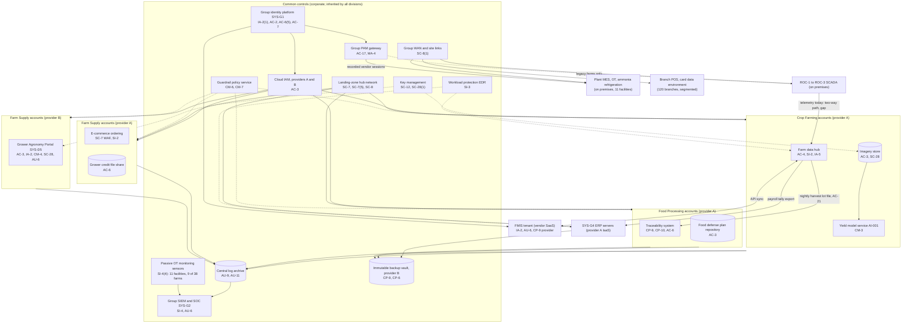
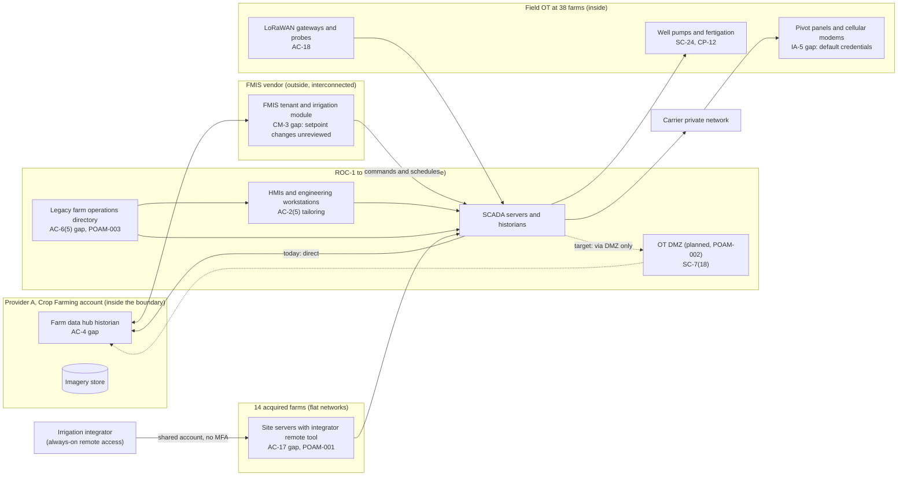

# Cloud Architecture and Control Placement: Cris Santos Company Holdings | Agriculture | Multi-Sector

**Organization:** Cris Santos Company Holdings, Inc. | **Tier:** Multi-Sector | **Providers:** two public cloud providers, called provider A and provider B (vendor-agnostic; see section 5)
**Scope:** the shared corporate cloud platform (SYS-G3 landing zones, WAN, and SOC tooling) plus the division workloads that run on it or connect to it. The SSP system (P02) is the Crop Farming **Farm Management and Irrigation Control Platform (FMICP)**, whose cloud parts (farm data hub, imagery store) sit in provider A and whose OT parts sit on premises at 3 ROCs and 38 farms.

## 1. Design in one paragraph
Corporate runs one **landing zone** per provider: identity federation from SYS-G1, a hub network, guardrail policies, a central log archive, key management, EDR, and an immutable backup vault in provider B. Divisions get their own **accounts** (subscriptions or projects) inside the landing zone and inherit these guardrails. Provider A hosts the corporate hub, the ERP application and database servers (SYS-G4, IaaS), the Crop Farming farm data hub and imagery store, the Food Processing traceability system, and Farm Supply e-commerce and order management. Provider B hosts the Grower Agronomy Portal (SYS-D5), the disaster recovery replica, and the backup vault. Three groups of systems sit outside the cloud: the **FMIS** and the **HR and payroll** services are vendor SaaS; **ROC SCADA, field OT, plant MES and OT, and ammonia refrigeration controls** run on premises and reach the cloud only through the WAN and, for vendors, through the group PAM gateway.

## 2. Diagrams
### 2.1 Group landing zone and division workloads

### 2.2 FMICP boundary (SSP system): today and target

**Target state (POAM-001 to POAM-003, due 2026-11-15 to 2026-12-31):** every flow between the ROCs and the corporate cloud ends in an OT DMZ at each ROC; the hub reads historian replicas in the DMZ and can open no connection into SCADA; integrator and engineer remote access goes only through the group PAM gateway to a jump host per ROC; the farm operations directory's administrator accounts come under group PAM with MFA; the 14 acquired farms move to segmented field and ROC networks by 2027-03-31.

## 3. Common versus division-specific controls
`cloud-control-map.csv` has 57 rows across 30 components. The `control_scope` column shows who owns each placement:

| Scope | Rows | What it means |
|---|---|---|
| Common (group) | 25 | Provided once by corporate (SYS-G1, SYS-G2, SYS-G3) and inherited by every division account. Listed in the P02 common control catalog |
| FMICP (Crop Farming SSP system) | 14 | Controls of the SSP system's cloud and SaaS parts, documented in the P02 SSP |
| Division-specific (Crop Farming) | 3 | Equipment telematics, drone fleet software, the yield model service |
| Division-specific (Food Processing) | 6 | Traceability, food defense repository, quality records, contractor access to refrigeration controls |
| Division-specific (Farm Supply) | 9 | Grower Agronomy Portal, e-commerce, branch card data environment link, grower credit files |

| Responsibility | Rows |
|---|---|
| Customer (the group or a division) | 46 |
| Shared (provider and group) | 7 |
| Provider | 4 |

**Rule of thumb.** Identity, PAM, network guardrails, logging, keys, backups, EDR, and OT monitoring sensors are **common**. A division cannot opt out of them, only request an exception through POL-01. Application behavior, data access inside the application, OT design, and customer-facing identity are **division-specific**, because they depend on each division's regulators, customers, and plant or farm operations.

## 4. Layers
| Layer | Common components | Division components | Key controls | Responsibility |
|---|---|---|---|---|
| Identity | SYS-G1, PAM gateway, cloud IAM | FMIS accounts and tablets, portal customer identity, telematics and drone accounts | AC-2, AC-3, AC-6(5), AC-17, IA-2, IA-2(1), MA-4 | Customer (configuration); vendor (service) |
| Network | Hub network, WAN tunnels | Farm data hub to ROC link, branch card data environment link, e-commerce WAF | SC-7, SC-7(5), SC-8, SC-8(1), AC-4 | Customer, with provider DDoS protection shared |
| Compute | EDR on all cloud hosts; guardrails | Farm data hub, yield model service, e-commerce, portal | SI-2, SI-3, CM-3, CM-4, CM-6, CM-7 | Customer (guest OS, containers, code) |
| Data | Keys, backup vault | Imagery store, traceability, food defense repository, credit files, portal databases | SC-12, SC-28, SC-28(1), CP-9, CP-6, CP-10, AC-21, CM-12 | Shared: provider encrypts; group owns keys, access, and retention |
| Logging and monitoring | Log archive, SIEM, OT sensors | FMIS audit trail, portal logs, quality record history | AU-6, AU-9, AU-11, SI-4, SI-4(4) | Shared: providers and vendors generate logs; group retains and reviews |
| SaaS dependencies | Identity, SIEM, EDR, OT monitoring vendors | FMIS vendor, quality software vendor, telematics and drone vendors | SA-9, CP-9, AU-6 | Provider for the service; customer for use and oversight |
| Physical | Provider data centers | ROCs, plants, branches (outside the cloud scope; see P02) | PE-3, MP-6 | Provider (inherited) |

## 5. Service categories and provider equivalents
The design does not depend on a provider. This table gives each provider's name for each service category, for reading its shared responsibility documentation.

| Service category | AWS | Microsoft Azure | Google Cloud |
|---|---|---|---|
| Account structure and guardrails | AWS Organizations with service control policies | Management groups with Azure Policy | Resource hierarchy with Organization Policy |
| Virtual machines (farm data hub, ERP) | Amazon EC2 | Azure Virtual Machines | Compute Engine |
| Object storage (imagery store, file shares) | Amazon S3 | Azure Blob Storage | Cloud Storage |
| Managed relational database | Amazon RDS | Azure SQL Database | Cloud SQL |
| Managed containers (portal, e-commerce) | Amazon EKS | Azure Kubernetes Service | Google Kubernetes Engine |
| Key management | AWS KMS | Azure Key Vault | Cloud KMS |
| Audit logging | AWS CloudTrail | Azure Monitor activity log | Cloud Audit Logs |
| Backup with immutability | AWS Backup (vault lock) | Azure Backup (immutable vault) | Backup and DR Service |
| Private connectivity | AWS Direct Connect / Site-to-Site VPN | Azure ExpressRoute / VPN Gateway | Cloud Interconnect / Cloud VPN |

Shared responsibility sources: SRC-AWS-SRM, SRC-AZURE-SRM, SRC-GCP-SRM in `00_universal-framework/sources/source-register.csv`. All three agree on the split used here: for IaaS the provider owns facilities, hosts, and virtualization; for PaaS the provider also owns the runtime; for SaaS the provider owns the application. The customer always keeps identities, access decisions, data classification, and data. None of them covers on-premises OT, which stays fully with the group.

## 6. Findings from the mapping
1. **The cloud is not the weak point; the bridge from the cloud into farm OT is.** Landing-zone controls are common and strong. The farm data hub, a normal cloud workload, has a two-way path into ROC SCADA (AC-4, SC-7; P01 CF-004, GR-01). An attacker who reaches the corporate cloud network can reach irrigation control. The OT DMZ (POAM-002) removes that path.
2. **Vendor remote access is split.** Plant OT and legacy ROCs use the group PAM gateway with recorded sessions; the 14 acquired farms let the integrator in through an always-on tool with a shared account (AC-17; POAM-001). One common control exists; Crop Farming has not adopted it everywhere.
3. **The FMIS is a cloud control path into OT.** Schedule and setpoint changes made in the vendor's irrigation module reach ROC SCADA, and nobody reviews them (CM-3; POAM-011). The vendor's SOC 2 report covers its own controls, not whether the farms' changes are right (P09).
4. **Cross-division data moves through one nightly file.** The harvest lot file from the hub to the traceability system has no integrity check and no tested alternate route (AC-21, CP-10; POAM-018).
5. **Farm Supply's controls depend on product decisions.** The portal's AI prescription feature skipped review (CM-4; POAM-019), and grower credit files are over-shared (AC-6; POAM-022). Neither is a cloud platform weakness.
