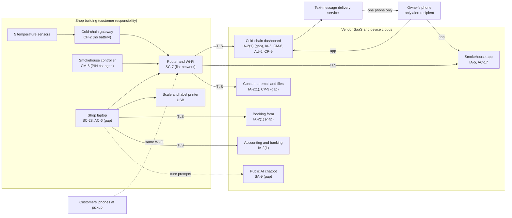

# SaaS Architecture and Control Placement: Cris Santos Company | Food and Agriculture | Sole Proprietorship

**Organization:** Cris Santos Company (custom-exempt meat processing shop) | **Tier:** Sole Proprietorship | **Provider:** SaaS and vendor device clouds only (no IaaS or PaaS)
**System:** Shop Production and Cold-Chain Monitoring System (SPCM), as defined in the system profile (P02)

## 1. Diagram
Control IDs on each node are the ones in `cloud-control-map.csv`. Dashed lines are paths with a known gap.

## 2. Layers
| Layer | Components | Key controls | Responsibility |
|---|---|---|---|
| Identity | Cold-chain, smokehouse, email, booking, accounting, and chatbot accounts | IA-2(1), IA-5 | Customer configures; vendors provide MFA where offered |
| Configuration | Alarm set points, alert contacts, offline notice, remote editing, panel PIN | CM-6, AC-17 | Customer |
| Data | Temperature history, cook programs, custom records, cut sheets, chatbot prompts | CP-9, SA-9 | Vendor protects data inside its service; customer decides what goes where and keeps its own copies |
| Devices | Sensors, gateway, smokehouse controller, laptop, phone | CP-2, CM-6, SC-28, AC-6 | Customer |
| Network | Shop router and Wi-Fi | SC-7 | Customer (internet provider supplies the device) |
| Logging | Cold-chain activity log, email sign-in history | AU-2 (vendor), AU-6 (customer) | Shared: vendor records, customer reviews |
| SaaS applications and hosting | All vendor platforms | Inherited (AC-3, AU-2, platform availability) | Provider |

## 3. Shared responsibility for SaaS and device clouds
The three major cloud providers' shared responsibility models (SRC-AWS-SRM, SRC-AZURE-SRM, SRC-GCP-SRM) agree on the SaaS split: the provider runs the application, the platform, and the facilities; **the customer always keeps its identities, its data, and its devices.** Two of the shop's services add a fourth customer layer: **device configuration.** The cold-chain vendor runs a reliable platform (P09), but whether an alert reaches anyone depends on settings only the shop controls: who is on the alert list, whether "gateway offline" is reported, and whether the gateway has power. That is why 15 of the 17 rows in the control map are the customer's. No IaaS provider equivalents table is needed, because the shop runs no infrastructure.

## 4. Findings from the mapping
1. **The alert path has a single point of failure at every step** (one gateway on wall power, one phone, offline notice off). Found in this mapping; tracked as P01 R-003.
2. **One password opens both devices that act on food** (cold-chain settings and smokehouse programs), and it is saved in the laptop browser. Tracked as R-002.
3. **The custom records live in one consumer file with no version history.** The vendor cannot restore what it never versioned. Tracked as R-004.
4. **The public AI chatbot receives recipe and cure data** under consumer terms. Tracked as R-012 and in P10.
5. **Inherited controls depend on vendor evidence.** Only the cold-chain vendor has provided a SOC 2 report; the smokehouse manufacturer and booking vendor have provided nothing (SA-9 gap, P07).
