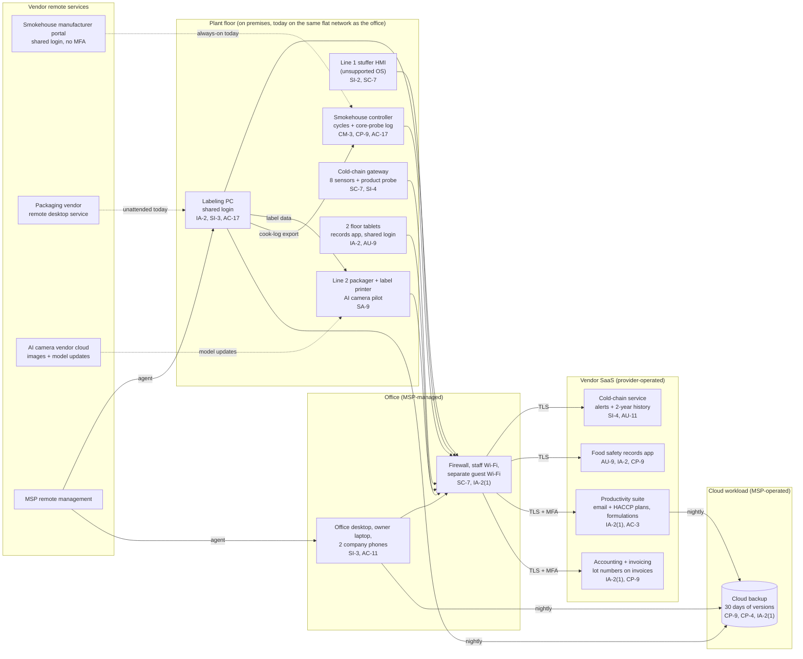

# Cloud Architecture and Control Placement: Cris Santos Company | Food and Agriculture | Micro

**Organization:** Cris Santos Company, LLC (USDA-inspected sausage and smoked meats plant) | **Tier:** Micro | **Provider:** Vendor-agnostic SaaS (see section 3)
**System:** Plant Production and Cold-Chain Monitoring System (PPCM), as defined in the SSP (P02); components from the intake [asset inventory](../step-00_P00_intake/asset-inventory.csv) | **Prepared:** 2026-07-31 by the Office Manager with the MSP lead technician | **Approved:** owner, 2026-08-31

## 1. Diagram
The company runs no servers and no IaaS tenant. Its "cloud" is a set of SaaS services, one cloud workload the MSP operates for it (the cloud backup, SYS-09), and two vendor cloud connections that reach into plant machines. The dashed lines are the connections that bypass the company's own control today.

**Planned change (by 2026-11-30):** a plant network (VLAN) on the same firewall for the smokehouse controller, line controls, labeling PC, cold-chain gateway, tablets, and AI camera. The firewall then allows only: outbound connections to the cold-chain service, records app, and smokehouse portal; the label data path; and vendor sessions when the Production Supervisor enables them. The cold-chain gateway gets a cellular backup (2026-10-31).

## 2. Layers and who is responsible
| Layer | Components | Key controls | Customer (the company) | MSP (on the company's behalf) | Provider (SaaS or equipment vendor) |
|---|---|---|---|---|---|
| Identity | Suite, accounting, records app, cold-chain dashboard, smokehouse portal, backup console, firewall login | AC-2, IA-2, IA-2(1), AC-6 | Decides who gets access; ends shared logins; turns on MFA where offered | Creates and disables suite and PC accounts; holds the backup and firewall logins | Runs sign-in and MFA services |
| Network | Firewall, Wi-Fi, flat network, internet line, cold-chain gateway connection | SC-7, AC-18 | Approves the plant network design and rules | Configures and patches the firewall and Wi-Fi | Not applicable |
| Endpoints and machine controllers | Office desktop, owner laptop, labeling PC, tablets; smokehouse controller, stuffer HMI, packager | SI-2, SI-3, CM-3, CM-7 | Owns machine settings, change records, and baselines | Patches and protects the managed PCs only | Machine firmware and remote service |
| SaaS applications | Cold-chain service, records app, suite, accounting | AU-2, AU-9, SC-8 | Users, roles, alert recipients, folder permissions | Suite administration on request | Application, platform, data centers |
| Data | CCP and SSOP records, cook logs, formulations, label templates, lot data, backups | CP-9, CP-4, AU-11 | Decides retention; keeps copies of machine settings; requests restore tests | Operates the backup and runs restore tests | Backs up its own platform |
| Logging | Suite sign-ins, records app edit history, gateway offline events, vendor sessions | AU-6, SI-4 | **Reviews monthly (gap today)** | Keeps firewall logs (7 days today) | Generates and stores logs |
| Vendor governance | MSP contract, equipment vendors, SaaS terms, SOC 2 reports | SA-9, MA-4 | Sets contract terms; reviews SOC 2 reports; supervises vendor sessions | Holds its own subcontracts (backup vendor) | Provides reports and notices |

**The MSP is not a cloud provider in the shared responsibility sense.** It performs customer-side duties for the company. Anything marked "Customer (performed by MSP)" in `cloud-control-map.csv` remains the company's responsibility. The company must direct the work, receive evidence, and check it (SA-9).

**The plant machines have no MSP at all.** The MSP contract excludes them, and the equipment vendors only fix their own machines. Until 2026 nobody owned their security. The Maintenance and Sanitation Technician now owns machine baselines and vendor sessions (POL-02 B.8), with the Production Supervisor approving changes that affect a CCP or a label.

## 3. Service categories and provider equivalents
The design is vendor-agnostic. For SaaS, the split is the same in all three major cloud providers' shared responsibility models: the provider runs the application, platform, and infrastructure; the customer keeps identities, access, data, and devices (SRC-AWS-SRM, SRC-AZURE-SRM, SRC-GCP-SRM in `00_universal-framework/sources/source-register.csv`). The vendor's SOC 2 report or security documentation is the evidence for the provider side.

| Service category used | What it is here | Equivalent category in the large cloud providers (for reading their documentation) |
|---|---|---|
| IoT monitoring SaaS | Cold-chain sensors, gateway, dashboard, alerts | IoT device management and telemetry services |
| Line-of-business SaaS | Food safety records app; accounting and invoicing | Industry SaaS built on any provider |
| Productivity suite | Email, calendar, file storage | Productivity and collaboration SaaS |
| SaaS backup | Nightly backup of two PCs and the suite | Backup service or third-party SaaS backup |
| Vendor remote service portal | Smokehouse manufacturer portal; packaging vendor remote desktop | Remote access or remote support services |
| Remote monitoring and management | MSP device management | Device management SaaS |

## 4. Findings from the mapping
1. **Two vendor connections reach plant machines without the company's control (AC-17, IA-2(1)).** The smokehouse portal was always on with a shared login and no MFA, and the packaging vendor's remote desktop tool ran unattended with a static password (EV-008; EV-009). Anyone holding either credential could change a cook cycle or a label template. Both were set to supervised, on-request sessions on 2026-08-12; named accounts with MFA follow by 2026-10-31 (P01 R-002, R-003; POAM-002).
2. **The cold-chain service is only as good as the plant's side of it (SI-4, SC-7).** The vendor's platform is strong and evidenced by its SOC 2 report. But alerts go to one phone, nobody is told when the gateway goes offline (EV-006; EV-007), and the gateway depends on the office network and one internet line (P01 R-004).
3. **Records integrity is a customer duty (IA-2, AU-9).** The records app keeps an edit history, but shared logins and a shared administrator mean entries cannot be tied to a person. FSIS expects each entry to be initialed by the person who made it and computer records to have integrity controls (9 CFR 417.5(b), (d); 416.16(a), (b)).
4. **Backups miss what matters most on the plant floor (CP-9, CP-4).** The cloud backup covers two PCs and the suite, has never been tested, and can be deleted with one MSP password. Smokehouse cycles, HMI settings, and packager recipes are not backed up anywhere (EV-018; EV-010; P01 R-006).
5. **The AI camera sits outside the boundary on purpose.** It sends images to its vendor and receives model updates with no contract terms. It is mapped here only to show the SA-9 gap and enters the SSP boundary when the P10 conditions are met.
