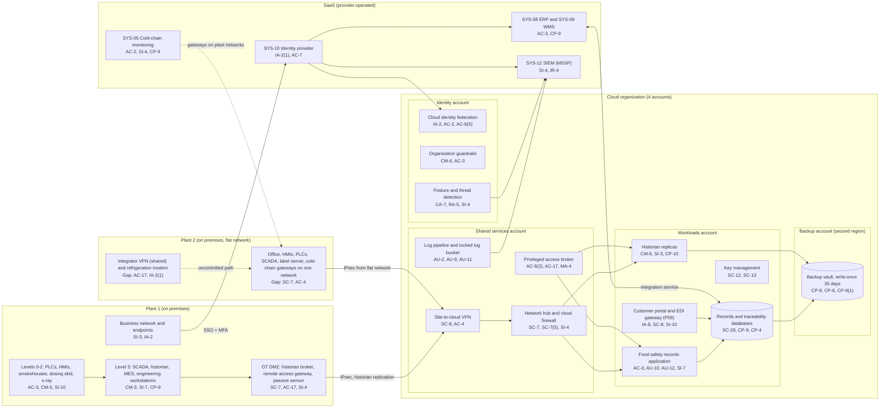

# Cloud Architecture and Control Placement: Cris Santos Company | Food and Agriculture | Mid-Market

**Organization:** Cris Santos Company, Inc. | **Tier:** Mid-Market | **Provider:** Vendor-agnostic public cloud (see section 4), plus SaaS
**System:** Plant Production and Cold-Chain Monitoring System (PPCM), as defined in the SSP (P02), and the landing zone it shares with the Customer Traceability and EDI Services (P09) | **Prepared:** 2026-07-24 by the Security Manager with the IT Director; updated 2026-09-15 with P07 results
**Control map:** `cloud-control-map.csv` (57 rows, 23 components)

## 1. Diagram

## 2. Landing zone design
The landing zone separates duties across 4 accounts (subscriptions or projects, depending on the provider) under one cloud organization. Each account limits the damage an attacker can do from any other.

| Account | Purpose | Who administers | Key design decisions |
|---|---|---|---|
| **Identity** | Organization root, cloud identity federation to SYS-10, organization guardrails, security tooling (posture management, threat detection) | Security Manager and the security analyst | No workloads. Root credentials sealed. Guardrails apply to every other account and cannot be disabled from them |
| **Shared services** | Network hub, cloud firewall, site-to-cloud VPN, DNS, privileged access broker, log pipeline and locked log bucket | IT Director's infrastructure team (3 engineers) | All traffic between plants, workloads, and the internet passes the hub. Logs from all accounts land in a write-once bucket kept 2 years, matching the longest CCP record retention (9 CFR 417.5(e)) |
| **Workloads** | Food safety records application, records and traceability databases, historian replicas, data warehouse, customer portal and EDI gateway, key management | Infrastructure team; the records application developer through the broker | Separate subnets per workload. PPCM workloads have no internet ingress; only the portal and EDI gateway sit behind the managed edge. Company-managed keys |
| **Backup** | Backup vault with 35-day write-once retention in a second region | 2 named backup administrators | Separate administrator credentials, not federated to everyday accounts. Backups are pulled by a cross-account role that can write but not delete |

**What stays on premises, and why.** Process control (levels 0-2), SCADA, the MES, and the refrigeration controllers stay at the plants, because they must keep running if the internet or the cloud is lost (P05 BP-01 to BP-08, BP-13). The cloud receives copies of CCP data (historian replicas every 15 minutes) and holds the records of review, not the control loop. Nothing in the cloud can write setpoints to the plants: the Plant 1 broker in the OT DMZ allows outbound replication only. At Plant 2 the same rule depends on firewall settings on a flat network, which is why POAM-016 matters.

## 3. Layers and shared responsibility per service
| Layer | Components | Key controls | Service model | Responsibility |
|---|---|---|---|---|
| Identity | Cloud federation, break-glass accounts, privileged access broker, portal identity service, SYS-10 | IA-2, IA-2(1), IA-8, AC-2, AC-6(2), AC-6(5), AC-7 | PaaS / SaaS | Customer configures identities, roles, MFA, and reviews; provider runs the identity services |
| Network | Hub, cloud firewall, VPN, DNS, portal edge | SC-7, SC-7(5), SC-8, AC-4, SC-5, SC-20 | IaaS / PaaS | Customer designs routes, rules, and segmentation; provider runs the gateways, edge, and DNS services |
| Compute | Records application, historian replicas, portal and EDI gateway | AC-3, AU-10, AU-12, SI-7, CM-6, SI-2, SI-3, SI-10, CP-10 | IaaS / PaaS | Customer (guest OS on IaaS, application configuration and libraries, EDR); provider for hosts, hypervisor, and the PaaS platform |
| Data | Managed databases, keys, backups, data warehouse | SC-28, SC-12, SC-13, CP-9, CP-9(1), CP-6, CP-4, AC-6 | PaaS | Shared: provider encrypts and operates storage and engines; customer controls keys, access, retention, isolation, and restore testing |
| Logging and monitoring | Log pipeline, posture service, SIEM | AU-2, AU-9, AU-11, CA-7, RA-5, SI-4, IR-4 | PaaS / SaaS | Shared: provider generates logs and detections; customer enables, retains, forwards, and acts on them; MSSP monitors |
| SaaS applications | Identity provider, cold-chain monitoring, ERP, WMS, SIEM | IA-2(1), AC-7, AC-2, AC-3, CP-9, SI-4 | SaaS | Provider runs the application and infrastructure; customer keeps users, roles, alert routing, and data |
| Physical | Provider data centers | PE-3, PE-13 | All | Provider (inherited, evidenced by SOC 2 reports) |

**Responsibility counts in `cloud-control-map.csv`:** 35 Customer, 16 Shared, 6 Provider. By service model: 14 IaaS, 34 PaaS, 9 SaaS rows. As in all three providers' shared responsibility models, the customer side is identity, data protection, and logging.

## 4. Service categories and provider equivalents
The design is independent of the provider. This table gives each provider's name for the service category, for reading its shared responsibility documentation (SRC-AWS-SRM, SRC-AZURE-SRM, SRC-GCP-SRM in `00_universal-framework/sources/source-register.csv`).

| Service category | AWS | Microsoft Azure | Google Cloud |
|---|---|---|---|
| Multi-account organization and guardrails | AWS Organizations, service control policies | Management groups, Azure Policy | Resource Manager folders, organization policies |
| Account, subscription, or project | Account | Subscription | Project |
| Cloud identity federation | IAM Identity Center | Microsoft Entra ID with Azure RBAC | Cloud Identity with IAM |
| Network hub | Transit Gateway | Virtual WAN hub or hub virtual network | Network Connectivity Center or shared VPC |
| Cloud firewall | AWS Network Firewall | Azure Firewall | Cloud NGFW |
| Site-to-cloud VPN | Site-to-Site VPN | VPN Gateway | Cloud VPN |
| Virtual machines | EC2 | Virtual Machines | Compute Engine |
| Managed application platform | Elastic Beanstalk or ECS | App Service | Cloud Run |
| Managed relational database | Amazon RDS | Azure SQL Database | Cloud SQL |
| Edge protection for the portal | AWS Shield with CloudFront | Azure Front Door with DDoS Protection | Cloud Armor |
| Object storage with write-once retention | S3 with Object Lock | Blob Storage with immutability policies | Cloud Storage with bucket lock |
| Backup service | AWS Backup (vault lock) | Azure Backup (immutable vault) | Backup and DR Service |
| Key management | AWS KMS | Azure Key Vault | Cloud KMS |
| Audit logging | CloudTrail | Azure Monitor activity log | Cloud Audit Logs |
| Posture and threat detection | Security Hub, GuardDuty | Microsoft Defender for Cloud | Security Command Center |

**Service model split used here (all three providers agree):**
- **IaaS** (virtual machines, networks): the provider owns facilities, hosts, and virtualization. The customer owns the guest OS, applications, network configuration, identities, and data.
- **PaaS** (managed databases, application platform, backup, key service): the provider also owns the platform software and its patching. The customer owns access, keys, data, and configuration.
- **SaaS** (identity provider, cold-chain monitoring, ERP, WMS, SIEM): the provider also owns the application. The customer keeps identities, roles, alert routing, audit review, and data.

## 5. Findings from the mapping
1. **The records application cannot prove who signed a record.** It keeps a good audit trail, but entries are signed with typed initials and one administrator account is shared. That fails the attribution part of 9 CFR 417.5(b) and 416.16(a) and weakens the integrity control 417.5(d) asks for (P03; P01 R-006). Fix: named accounts with an authenticated sign-off and record locking after pre-shipment review (POAM-017, due 2026-12-31).
2. **Plant 2 reaches the cloud from a flat network.** Any device at Plant 2, including the integrator's laptop on the shared VPN, can route to the hub. The cloud firewall restricts what it can reach, but the boundary should sit at Plant 2 (POAM-016; P01 R-001).
3. **Recovery is designed but only partly proven.** Backups are isolated (separate account, second region, write-once, separate credentials), which is the strongest control in the environment. The records application was restore-tested in 2026-04. The traceability database and historian replicas were not; the traceability restore test is due 2026-10-28 because the 24-hour FSIS notice depends on it (POAM-010).
4. **Cold-chain monitoring depends on a vendor with no assurance report.** Alert routing is the company's job (Customer), and the vendor's retention and recovery are unverified (P09; P01 R-024).
5. **OT logs are missing from the log pipeline.** The landing zone collects every cloud log, but nothing from SCADA, historians, the MES, or the refrigeration controllers (POAM-006; P01 R-009).
6. **Boundary check.** Every in-scope cloud and SaaS component in the SSP (P02 section 9) appears in the diagram. Every cloud component has at least one row in the control map, and each account has controls from at least 2 of the AC, AU, CM, IA, SC, and SI families or inherits them. The OT components are mapped in the SSP, not here, because they are not cloud services.
7. **Inherited controls rely on SOC 2 reports.** Controls marked Provider or Shared for the cloud provider, identity provider, ERP and WMS vendors, and MSSP depend on their SOC 2 Type 2 reports and complementary user entity controls, reviewed each year in P09 `vendor-soc2-review.csv`.
