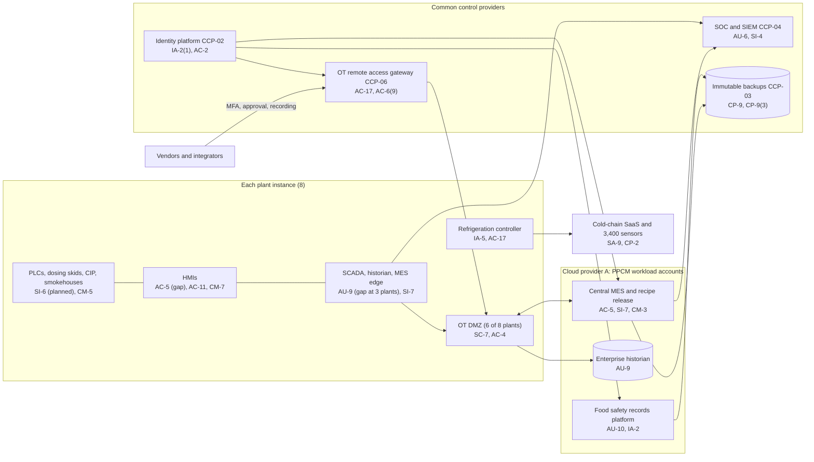

# System Security Plan: Plant Production and Cold-Chain Monitoring System (PPCM)

**Organization:** Cris Santos Company, Inc. (publicly traded further processor of meat products) | **Tier:** Enterprise | **Vertical:** Food and Agriculture
**Outline:** NIST SP 800-18 Rev. 2, System Security Plan Outline Example (June 2026), with OT guidance from NIST SP 800-82 Rev. 3 | **Version:** 2.0, 2026-09-14

## 1. System Name and Identifier
Plant Production and Cold-Chain Monitoring System (**PPCM**), identifier CSC-SYS-PPCM-001. Tier-1 system in the enterprise application inventory. One plan covers the enterprise plant standard and its 8 plant instances (PPCM-PLT-01 to PPCM-PLT-08), the central services, and the cold-chain monitoring at the 4 distribution centers.

## 2. System Overview
The PPCM runs and records every step that makes the company's food safe: formulation and cure dosing, cooking and smoking, chilling, packaging, labeling and lot coding, and cold storage. It produces the electronic records that FSIS and FDA review (HACCP, Sanitation SOP, food defense, and preventive controls records). It serves about 7,600 production, sanitation, maintenance, warehouse, and QA staff across 8 plants and 4 DCs, and about 4,100 formulations.

**Why integrity matters most.** A changed cure (sodium nitrite) setpoint, a shortened cook cycle, or a CIP valve opened during production can put adulterated food into commerce at national scale. Since the 2025-2026 migration, one central MES pushes recipes to every plant except PLT-08, so a single compromise or error can reach all of them at once.

**Major components:**
- **SYS-01 (per plant):** process control network: PLCs, HMIs, brine injection and cure dosing skids, CIP valve manifolds, smokehouses and ovens, chilling, slicers, packaging, metal detectors, X-ray inspection, checkweighers
- **SYS-02 (per plant):** SCADA server, historian, engineering workstations, and the MES edge server that receives recipe releases and prints labels
- **SYS-03 (per site):** ammonia refrigeration control systems at 8 plants and 4 DCs (vendor-maintained)
- **SYS-04:** cold-chain monitoring: about 3,400 sensors, site gateways, trailer telematics, and the vendor's SaaS dashboard and alerting
- **SYS-05:** central MES (recipe, formulation, batch, label, and lot management) and enterprise historian on Cloud provider A
- **SYS-11:** food safety records platform on Cloud provider A (eHACCP, Sanitation SOP, food defense, preventive controls, pre-shipment review)
- **SYS-15:** OT remote access: the enterprise OT remote access gateway, and legacy paths at PLT-05 and PLT-08

OT zones follow the SP 800-82 Rev. 3 layered model: field devices and controllers (levels 0-1), HMIs and supervisory control (level 2), SCADA, historians, and MES edge servers (level 3), an OT DMZ, and the business network and clouds (level 4 and above). The OT DMZ is in place at 6 of 8 plants.

## 3. Laws, Regulations, and Policies Affecting the System
| ID | Requirement | Citation | How it affects the PPCM |
|---|---|---|---|
| C-FOOD-AG-R01 | FSMA Intentional Adulteration rule | 21 CFR Part 121 | Applies to PLT-07 (registered facility). The dosing, CIP, blending, and recipe systems are paths to adulterate the plant-based products; mitigation strategies, monitoring, and records live in the PPCM |
| FSIS | Sanitation SOPs | 9 CFR 416.16 | Electronic SSOP records need integrity controls (416.16(b)) |
| FSIS | HACCP systems | 9 CFR Part 417 | CCP monitoring by historians and cold-chain sensors at all 8 plants; computer records need integrity controls (417.5(d)) |
| FSIS | Recalls | 9 CFR Part 418 | 24-hour notification if adulterated or misbranded product entered commerce (418.2); traceability platform |
| FDA | Preventive controls records | 21 CFR 117.305; 117.315(c) | PLT-07 records must be accurate, indelible, concurrent, and signed; offsite records retrievable within 24 hours |
| FDA | Reportable Food Registry | 21 U.S.C. 350f | 24-hour report for reportable PLT-07 products (P08) |
| EPA | Hazardous substance release reporting | 40 CFR 302.6; 40 CFR 355.40-355.42 | An ammonia release of 100 lb or more caused by loss of refrigeration control must be reported immediately (P08) |
| SEC | Cybersecurity disclosure | Form 8-K Item 1.05; 17 CFR 229.106 | A material PPCM incident goes through the P08 materiality step |
| State | State breach notification laws | Each state where affected individuals reside (Florida worked example: Fla. Stat. 501.171) | Applies only if personal information in connected systems is involved (P08) |
| Contract | SL-1 and SL-2 customer agreements; SOC 2 readiness | P09 | Temperature records and production record packages are customer commitments |
| Benchmark | NIST CSF 2.0 and SP 800-82 Rev. 3 | Voluntary | OT control expectations used to tailor the baseline |
| Internal | POL-01 to POL-05 and standards | P06 | Enterprise policy hierarchy |

Not applicable:
- CIRCIA (C-FOOD-AG-R02): proposed only. As proposed, the company would be covered by the size criterion; tracked in P03 and P08.
- USCG MTS cyber rule (C-FOOD-AG-R03): no MTSA-regulated facility.
- OSHA PSM (29 CFR 1910.119) and EPA RMP (40 CFR Part 68) govern the ammonia systems as process safety programs owned by the Director of Refrigeration and Process Safety. The refrigeration controllers are inside this boundary for security; the PSM and RMP programs are not restated here.

## 4. System Status
### 4.1 System Security Plan Approval
Prepared by the Vice President, Engineering, and the Director of OT Security with the GRC team. Reviewed by the CISO, the SVP FSQA, and the Director of Refrigeration and Process Safety. Approved by the Chief Operating Officer on 2026-09-14.
### 4.2 System Authorization Decision
The company is not a federal agency, so there is no formal ATO. The equivalent internal decision:
- **Authorizing official equivalent:** Chief Operating Officer, with the CISO's and the SVP FSQA's recommendations.
- **Decision (2026-09-14):** continue operation with conditions, based on the Internal Audit assessment (P07) and the enterprise risk register (P01).
- **Conditions:**
  - the PLT-05 refrigeration modem is disconnected except during supervised sessions until PLT-05 joins the OT remote access gateway (POAM-003, interim by 2026-10-31);
  - HMI cure and brine setpoint overrides need a second badge and send alerts (POAM-005 by 2027-03-31);
  - PLT-08 is segmented and joined to the identity platform and gateway (POAM-001, POAM-002 by 2027-03-31);
  - the central MES DR test is rerun to prove the 4-hour RTO (POAM-010 by 2027-01-31).
- **Reauthorization:** annually, or after a major change (for example, PLT-08 joining the central MES in 2027).
### 4.3 System Operational Status
Operational. Planned major modifications: PLT-08 integration (2027-03), HMI override controls (CM-5(1)), batch-start setpoint verification (SI-6), and automated recipe integrity comparison (SI-7(1)). Each needs a PLT-07 food defense reanalysis check under 21 CFR 121.157(b)(1) and (c) if it touches PLT-07.

## 5. Role Identification and Responsible Personnel
| Role | Title | Responsibility |
|---|---|---|
| System owner | Vice President, Engineering | Accountable for the PPCM standard, the central MES, and plant OT |
| Authorizing official (equivalent) | Chief Operating Officer | Accepts residual risk to operate |
| Food safety and food defense owner | Senior Vice President, Food Safety and Quality Assurance | Formulation approval, product holds, FSIS and FDA notices; enterprise Food Defense Coordinator |
| PLT-07 food defense | PLT-07 FSQA Manager (qualified individual, 121.4(c)); PLT-07 Plant Manager (signs the plan, 121.310) | Part 121 plan, monitoring, verification, reanalysis |
| Plant instance owners | Plant Managers (8), with plant controls engineers and plant FSQA managers | Day-to-day operation of each plant instance |
| Refrigeration owner | Director of Refrigeration and Process Safety | Refrigeration controllers, generators, PSM and RMP programs |
| Information security | CISO; Director of OT Security; Director of Security Operations | Program oversight; OT security; SOC monitoring and incident response |
| Common control providers | See section 10.3 | Operate inherited controls |
| Independent assessor | Chief Audit Executive (Internal Audit, with a co-sourced OT specialist) | Annual assessment (P07) |

## 6. System Information Types and System Categorization
Information types were selected from NIST SP 800-60 Vol. 2 Rev. 1 and adapted for OT. Impact levels follow FIPS 199.

| Information type | Confidentiality | Integrity | Availability | Rationale |
|---|---|---|---|---|
| Process control data (formulations, setpoints, PLC logic, cure and brine dosing) | Moderate | **High** | **High** | A changed cure level, cook cycle, or CIP valve state can produce adulterated food at many plants at once; that is a severe adverse effect on individuals. Losing control at 2 or more plants stops about $18.8 million a day of production (P05 BP-04) |
| CCP monitoring and food safety records | Low | **High** | Moderate | Product cannot ship without complete, trustworthy records (9 CFR 417.5(c)); falsified records could hide a deviation. Paper workaround covers up to 24 hours (P05 BP-06) |
| Cold-chain monitoring data | Low | Moderate | **High** | Loss of monitoring for more than 2 hours forces product evaluation across sites (P05 BP-01, MTD 2 h) |
| Food defense plan and vulnerability assessment (PLT-07); formulations and SL-2 customer specifications | **Moderate** | Moderate | Low | Disclosure gives an attacker a map of vulnerable steps or exposes trade secrets |
| Traceability and lot data | Low | Moderate | Moderate | Needed within 24 hours for FSIS recall notice (9 CFR 418.2) |
| **PPCM category (high-water mark)** | **Moderate** | **High** | **High** | Overall: **High** |

**Baseline:** the NIST SP 800-53B **High** baseline, tailored with the SP 800-82 Rev. 3 OT overlay. `control-implementation.csv` documents **131 controls** that address the food safety, food defense, and OT risks in P01 and P03. Every other High-baseline control is treated as follows:
- **Inherited in full** from the enterprise common control catalog (section 10.3) and listed there rather than repeated, for example most remaining AC, AU, IA, and SC enhancements.
- **Tailored out** with a recorded reason where the control assumes federal systems (for example PIV-specific IA enhancements).
- **Compensated** in OT where the IT form would disrupt the process, following SP 800-82 Rev. 3: application allowlisting instead of agents on HMIs (SI-3), badge sign-in and view-only timeouts instead of lockout on HMIs (AC-7, AC-11), and active scanning only in sanitation windows (RA-5).

Privacy-baseline controls are documented in the enterprise privacy program; the PPCM holds little personal information (operator names and badge IDs).

## 7. Authorization Boundary Description
**Inside the boundary:** at each plant, SYS-01, SYS-02, and SYS-03 and the plant's OT DMZ; refrigeration controllers at the 4 DCs; the cold-chain sensors and gateways at all 12 sites and the company's configuration of the cold-chain SaaS; the central MES, enterprise historian, and food safety records platform in their Cloud provider A workload accounts; and the OT remote access gateway and the legacy paths at PLT-05 and PLT-08.

**Outside the boundary (common control providers and interconnected systems):**
- Landing zone services (network hub, key management, log archive, backup accounts, standby region): CCP-03
- Identity platform (SYS-08): CCP-02
- SOC, SIEM, EDR, and vulnerability scanners: CCP-04
- ERP (SYS-06), WMS and TMS (SYS-07), traceability platform (SYS-12), customer portals (SYS-13), AI vision inspection edge servers and vendor cloud (AI-001), and the cold-chain vendor's platform

**Boundary weaknesses:** PLT-05 has no OT DMZ and a contractor modem on its refrigeration controller; PLT-08 is a flat network with a VPN into SCADA without MFA (POAM-001 to POAM-003).

The enterprise multi-cloud diagram is in P04 `cloud-architecture.md`.

## 8. Information Exchanges Summary
| Connected system / party | Direction | Data | Agreement |
|---|---|---|---|
| ERP (SYS-06) | Bidirectional (central MES to ERP) | Production orders, consumption, lots | SaaS contract |
| WMS (SYS-07) and traceability platform (SYS-12) | Outbound from MES | Lot, pallet, and label data | Internal interface specification |
| SL-2 customer portal (SYS-13) | Inbound specifications; outbound record packages | Customer formulations and specifications; CCP record packages | Customer agreements with confidentiality terms |
| Cold-chain monitoring vendor (SYS-04) | Outbound from gateways; alerts to on-call roles | Temperatures, alarms | SaaS contract with security terms; **no contracted RTO (POAM-008)** |
| Controls integrators and equipment makers | Inbound remote access through the gateway | PLC, SCADA, and HMI sessions | Service contracts with security terms; **PLT-08 integrator VPN without MFA (POAM-002)** |
| Refrigeration contractors | Inbound remote access | Refrigeration controller sessions | **Two contracts without security terms; PLT-05 modem (POAM-003, POAM-015)** |
| AI vision inspection (AI-001) | Inbound lot data; outbound reject counts | Lot codes, inspection results | Vendor contract (P10) |
| SIEM (CCP-04) | Outbound | Security and audit logs | Internal |

## 9. System Component Inventory
| Component | Type | Location / provider | Owner |
|---|---|---|---|
| PLCs and controllers (about 2,600), dosing skids, CIP manifolds, smokehouses and ovens (64) | OT field and control devices | 8 plants | Plant controls engineers |
| HMIs (680; 118 on unsupported OS) | OT supervisory | 8 plants | Plant controls engineers |
| SCADA servers, historians, engineering workstations (9 on unsupported OS), MES edge servers | OT level 3 servers | Plant server rooms | Vice President, Engineering |
| Refrigeration controllers (12) | OT controllers | Engine rooms at 8 plants and 4 DCs | Director of Refrigeration and Process Safety |
| Cold-chain sensors (about 3,400), gateways (12), trailer telematics (380) | IoT | 12 sites and the fleet | Vice President, Distribution and Transportation |
| Central MES and enterprise historian | IaaS virtual machines and managed database | Cloud provider A, primary region; warm standby in second region | Vice President, Engineering |
| Food safety records platform | Commercial software on managed containers and managed database | Cloud provider A | Senior Vice President, Food Safety and Quality Assurance |
| OT remote access gateway | Virtual appliances in each plant OT DMZ, brokered centrally | 6 plants | Director of OT Security |
| Plant OT backup appliances with offline copies | On-premises storage | 7 plants (PLT-08 uses a domain-joined device) | Plant controls engineers |

Counts come from the OT asset inventory, which is about 91% complete (CM-8, POAM-009).

## 10. Control Implementation Details
### 10.1 Control implementation status
See `control-implementation.csv` (131 controls).

| Status | Count |
|---|---|
| Implemented | 87 |
| Partially implemented | 41 |
| Planned | 3 |
| **Total** | **131** |

| Inheritance | Count |
|---|---|
| Common (fully inherited from a common control provider) | 91 |
| Hybrid (shared between a provider and the PPCM team) | 21 |
| System-specific | 19 |

The Planned controls are CM-5(1), SI-6, and SI-7(1), which together close the setpoint integrity gap. Partially implemented controls: AC-2, AC-2(3), AC-4, AC-5, AC-17, AT-2, AT-3, AU-6, AU-9, AU-10, AU-12, CA-3, CM-2, CM-3, CM-3(1), CM-5, CM-6, CM-7, CM-7(5), CM-8, CP-2, CP-4, CP-9, CP-10, IA-2, IA-2(1), IA-5, IR-4, IR-8, MA-4, PS-4, RA-5, SA-9, SA-22, SC-7, SC-7(5), SI-2, SI-3, SI-4, SI-7, SR-6. Most of them are partial because of PLT-05, PLT-08, or one enterprise-wide design gap (HMI overrides).

### 10.2 Control assessment status
Internal Audit assessed 42 of these controls from 2026-07-13 to 2026-08-28 using SP 800-53A Rev. 5 procedures and statistical sampling, with OT testing at PLT-03, PLT-05, PLT-07, and PLT-08 during sanitation windows (P07 `assessment-plan.md`, `assessment-results.csv`). Weaknesses are in P07 `poam.csv`.

### 10.3 Common control providers and inheritance
Common and hybrid controls are inherited from the enterprise platform. Each provider publishes its controls in the enterprise **common control catalog** (maintained by the GRC team) and is assessed on its own cycle; the PPCM inherits the results.

| Provider | Name | Accountable role | Controls provided | Rows in this plan | Evidence of operation |
|---|---|---|---|---|---|
| CCP-01 | Enterprise GRC program | CISO (with the Chief Risk Officer and Chief Audit Executive for assessment) | Policies and standards (P06), risk method, assessment, POA&M, continuous monitoring | 18 | Annual Internal Audit assessment (P07); GRC platform |
| CCP-02 | Identity platform (SYS-08) | Director of Identity and Access Management | SSO, MFA, PAM, identity governance, account lifecycle, federation to 6 OT directories | 15 | SOX IT general control testing; P07 AC-2, IA-2 results |
| CCP-03 | Cloud landing zone (Cloud provider A) | Director of Cloud Platform Engineering | Account guardrails, key management, encryption, immutable backups, log archive, standby region, WAF | 11 | Posture management reports; provider SOC 2 Type 2 (physical and hypervisor) |
| CCP-04 | Security operations | Director of Security Operations | 24x7 SOC, SIEM, EDR, vulnerability management, incident response | 16 | SOC metrics; P07 SI-4, RA-5, IR results |
| CCP-05 | Enterprise network and OT boundary | Director of Network Engineering (with the OT Security team) | SD-WAN, plant zone firewalls, OT DMZ, wireless, transport encryption, time sources | 7 | Firewall rule reviews |
| CCP-06 | OT security program | Director of OT Security | OT asset inventory, OT monitoring, OT remote access gateway, OT baselines and allowlisting, OT patching, unsupported component tracking | 20 | OT monitoring coverage reports; P07 CM-8, AC-17 results |
| CCP-07 | Facilities and plant security | Vice President, Facilities and Corporate Security (with the Director of Refrigeration and Process Safety for generators) | Badge access, restricted rooms, CCTV, media destruction, power | 6 | Badge reviews; generator logs |
| CCP-08 | Human resources and workforce training | Chief Human Resources Officer | Screening, terminations, sanctions, awareness and role training, acknowledgments | 9 | HR and learning system reports |
| CCP-09 | Third-party risk management | Director of Third-Party Risk Management | Vendor tiering, security terms, SOC report reviews, OT supply chain controls | 7 | Vendor register; SOC report reviews |
| CCP-10 | Corporate FSQA program | Senior Vice President, Food Safety and Quality Assurance | Manual monitoring and product hold procedures, training on them, record retention | 3 | FSQA audits; mock recalls |

**Inheritance rules:**
- A Common control is fully inherited; the PPCM team verifies only that each plant instance is onboarded (for example, OT monitoring sensors installed and logs forwarded).
- A Hybrid control names both parts in the implementation statement: the provider's part and the PPCM team's part.
- If a provider's assessment finds a weakness, the finding is linked to every inheriting system's POA&M. Example: POAM-018 (late OT access removal) is a CCP-08 and plant weakness that affects every plant instance.
- A plant instance inherits common controls only after the OT Security team confirms it meets the plant standard. PLT-05 inherits partially and PLT-08 does not yet inherit CCP-02, CCP-05, or CCP-06 controls.

## 11. Digital Identity Acceptance Statement
- **Office and engineering users:** SSO with MFA (authenticator app with number matching, or a FIDO2 security key). Privileged users and OT engineering sessions use phishing-resistant FIDO2 keys through PAM or the OT gateway. This is comparable to NIST SP 800-63 AAL2 for users and AAL3-like protection for privileged users.
- **Plant operators:** badge sign-in at HMIs, with view-only timeouts. This is accepted for operating within released recipes; changes to cure, brine, and cook setpoints need a supervisor badge today and will need a second badge under CM-5(1).
- **Vendors:** named accounts on the OT gateway with MFA, approval, and recording. **PLT-05 and PLT-08 do not meet this statement today** (POAM-002, POAM-003).
- **Records sign-offs:** e-signatures on the records platform bind each sign-off to a named user at 7 plants; PLT-08 does not meet this statement until its migration (POAM-007).

## 12. Referenced Artifacts
Scenario facts (`../00_company-facts.md`), BIA (P05), multi-cloud architecture and control map (P04), enterprise risk register (P01), regulatory gap analysis (P03), policy hierarchy and policies (P06), Internal Audit assessment and POA&M (P07), ransomware runbook (P08), SOC 2 readiness (P09), AI portfolio including AI-001 (P10), the PPCM contingency plan v3, the OT reference architecture, the PLT-07 food defense plan, the HACCP plans for each plant, and the enterprise common control catalog.

## 13. Acronym List and Glossary
- **AO:** authorizing official
- **CCP:** critical control point (9 CFR 417.1); in section 10.3 only, CCP-01 to CCP-10 are common control providers
- **CIP:** clean-in-place
- **DMZ:** demilitarized zone (a buffer network between business and control networks)
- **HMI:** human-machine interface
- **MES:** manufacturing execution system (central recipe, batch, label, and lot management)
- **OT:** operational technology
- **PAM:** privileged access management
- **PLC:** programmable logic controller
- **POA&M:** plan of action and milestones
- **PPCM:** Plant Production and Cold-Chain Monitoring System
- **SCADA:** supervisory control and data acquisition

## 14. System Security Plan Review and Change Records
| Version | Date | Change | Author |
|---|---|---|---|
| 1.0 | 2025-09-12 | Initial enterprise plan (plant standard, 7 plants) | Vice President, Engineering |
| 1.1 | 2026-02-27 | Central MES migration to Cloud provider A; PLT-08 added as a non-conforming instance | Vice President, Engineering |
| 2.0 | 2026-09-14 | Common control provider mapping; 2026 assessment results; authorization conditions | Vice President, Engineering with the Director of OT Security and the GRC team |
