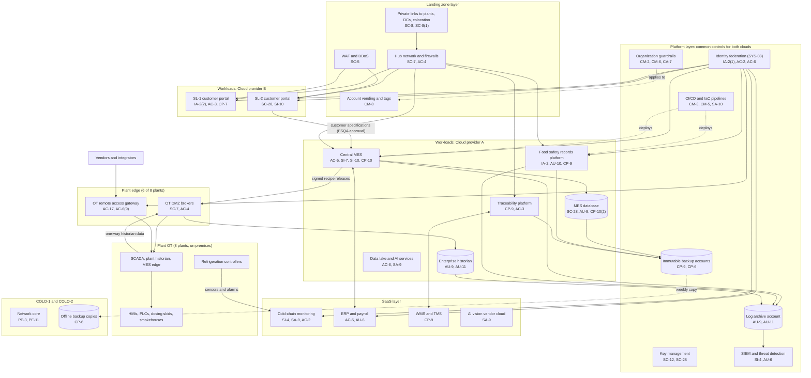

# Cloud Architecture and Control Placement: Cris Santos Company | Food and Agriculture | Enterprise

**Organization:** Cris Santos Company, Inc. (publicly traded further processor of meat products) | **Tier:** Enterprise | **Provider:** Multi-cloud, vendor-agnostic: two public cloud providers (called Cloud provider A and Cloud provider B), two colocation sites, and SaaS (see section 4)
**Owner:** Director of Cloud Platform Engineering, with the CISO and the Director of OT Security | **Date:** 2026-08-31 | **Related:** PPCM SSP (P02), enterprise BIA (P05)

## 1. Architecture in layers
The estate is organized in layers. Each lower layer provides **common controls** that the layers above inherit, so a workload team configures only what is specific to its system. A food company adds one layer the clouds do not have: the **plant edge**, where the cloud meets the control networks.

| Layer | What it is | Examples | Who runs it |
|---|---|---|---|
| **Platform** | Organization-wide services in both clouds | Cloud organization guardrails, identity federation, key management, log archive, SIEM feeds, immutable backup accounts, CI/CD pipelines | Cloud Platform Engineering; Security Operations; Identity team |
| **Landing zone** | The standard account pattern every workload lands in | Account vending with mandatory tags, hub-and-spoke network with cloud firewalls, private connectivity to plants, DCs, and colocation, WAF and DDoS protection | Cloud Platform Engineering; Network Engineering |
| **Plant edge** | The controlled crossing between each plant's OT and the clouds | OT DMZ brokers for historian replication and signed recipe releases; the enterprise OT remote access gateway | OT Security team; Network Engineering |
| **Workload** | Systems the company runs in the clouds | Cloud A: central MES, enterprise historian, food safety records platform, traceability platform, data lake and AI services. Cloud B: SL-1 and SL-2 customer portals, e-commerce integration | Application teams (for example, the Vice President, Engineering, for the MES) |
| **SaaS** | Vendor-operated applications | Cold-chain monitoring, ERP and payroll, WMS and TMS, AI vision vendor cloud, productivity suite | Vendors, with the company's configuration and oversight |
| **Facilities** | Colocation and provider data centers | COLO-1 (Florida) network core and legacy applications; COLO-2 (Georgia) offline backup copies | Colocation providers and cloud providers |

**The cloud holds the plants' recipes and records, not their controls.** PLCs, HMIs, and refrigeration controllers stay on premises and keep running if the cloud is unreachable. What the cloud now holds is the authority to change them: the central MES decides which formulation and setpoint ranges every plant receives. That makes the MES release path the most important control placement in this architecture.

## 2. Diagram

**Not shown:** PLT-05 and PLT-08 have no OT DMZ. PLT-05 historian data reaches the cloud through a firewall rule from the corporate network, and the PLT-05 refrigeration controller has a contractor cellular modem. PLT-08 uses a legacy site VPN and its own recipe and eHACCP applications (P02 section 7).

## 3. Responsibility by service model
Sources: SRC-AWS-SRM, SRC-AZURE-SRM, and SRC-GCP-SRM in `00_universal-framework/sources/source-register.csv`. The three published models agree on the split used here, so the design does not depend on which two providers the company uses.

| Service model | Provider | Company (customer) | Shared |
|---|---|---|---|
| IaaS (MES servers, historian) | Facilities, hosts, hypervisor, physical network | Guest OS, applications, identities, data, network policy | Encryption (provider service, customer keys), logging |
| PaaS (MES database, records platform, portals, AI services) | Also the platform runtime and its patching | Data, access, configuration, keys, application code | Backups, availability configuration |
| SaaS (cold-chain monitoring, ERP, WMS, AI vision cloud) | Also the application | Users, roles, data, alert settings, oversight of the vendor | Audit review (complementary user entity controls) |
| Colocation | Building, power, cooling, perimeter | Racks, equipment, cage access lists | None |
| Plant edge and OT | Nothing (no provider) | Everything | None |

**Why the records layer matters to regulators.** FSIS accepts computer records only with "appropriate controls ... to ensure the integrity of the electronic data and signatures" (9 CFR 417.5(d)); the Sanitation SOP rule says the same for SSOP records (9 CFR 416.16(b)); FDA preventive controls and food defense records must be "accurate, indelible, and legible" (21 CFR 117.305(c); 121.305(c)). In the cloud, those duties fall on the **customer** side of every shared responsibility model: the provider keeps the database running and encrypted, but only the company can turn on audit trails, lock signed records, and give each person a named account.

## 4. Service categories and provider equivalents
| Service category | AWS | Microsoft Azure | Google Cloud |
|---|---|---|---|
| Organization guardrails | AWS Organizations service control policies | Azure Policy with management groups | Organization Policy Service |
| Account vending | AWS Control Tower account factory | Azure landing zone subscription vending | Resource Manager project creation |
| Key management | AWS KMS | Azure Key Vault | Cloud KMS |
| Audit logging | AWS CloudTrail | Azure Monitor activity log | Cloud Audit Logs |
| Threat detection | Amazon GuardDuty | Microsoft Defender for Cloud | Security Command Center |
| Managed relational database | Amazon RDS | Azure SQL Database | Cloud SQL |
| Managed containers | Amazon EKS | Azure Kubernetes Service | Google Kubernetes Engine |
| Web application firewall | AWS WAF | Azure Web Application Firewall | Cloud Armor |
| Backup service | AWS Backup | Azure Backup | Backup and DR Service |
| Site-to-site VPN | AWS Site-to-Site VPN | Azure VPN Gateway | Cloud VPN |

This table is for reading provider documentation only. The architecture, control map, and SSP describe service categories.

## 5. Common controls
`cloud-control-map.csv` has **61 rows** across 28 components: Platform 17, Landing zone 6, Plant edge 4, Workload 23, SaaS 7, Facilities 4. Responsibility: Customer 40, Shared 17, Provider 4.

**31 rows are published as common controls** (`common_control` = Yes) in the enterprise common control catalog. They map to the common control providers in the PPCM SSP (P02 section 10.3): identity (CCP-02), landing zone (CCP-03), security operations (CCP-04), network and OT boundary (CCP-05), OT security program (CCP-06, for the plant edge), and facilities (CCP-07). A cloud workload inherits them by being deployed through account vending, which applies guardrails, logging, network, key, and backup policies automatically. A plant inherits the plant edge controls only when the OT Security team confirms its OT DMZ and gateway are live.

**Rules for inheriting:**
1. A workload may claim a common control only if its account was created by account vending and passes the posture baseline.
2. Customer-side identity, data protection, and logging stay explicit at every layer: even a SaaS application has Customer rows for access and review (AC-2, AU-6, SA-9), because those are always the company's job.
3. SaaS rows cite the vendor's SOC 2 report, reviewed by the third-party risk team (P09 evidence map).
4. No cloud workload may hold a direct network path to a PLC, HMI, or refrigeration controller. All traffic goes through the plant edge layer.

## 6. Validation against the PPCM SSP (P02)
Every cloud-hosted PPCM component appears here with controls from each required family, directly or inherited:
| PPCM component | AC | AU | CM | IA | SC | SI |
|---|---|---|---|---|---|---|
| Central MES application | AC-5 | AU-9 (database; inherited archive) | CM-6, CM-3 (inherited) | IA-2(1) (inherited) | SC-7 (inherited) | SI-2, SI-7, SI-10 |
| MES database | AC-6 (inherited) | AU-9 | CM-2 (inherited) | IA-2(1) (inherited) | SC-28 | SI-4 (inherited) |
| Enterprise historian | AC-4 (plant edge) | AU-9, AU-11 | CM-6 (inherited) | IA-2(1) (inherited) | SC-7 (plant edge) | SI-4 (inherited) |
| Food safety records platform | AC-6 (inherited) | AU-10 | CM-3 (inherited) | IA-2 | SC-28 (inherited) | SI-4 (inherited) |
| Plant edge (DMZ and gateway) | AC-4, AC-17, AC-6(9) | AU-6 (inherited) | CM-8 (inherited) | IA-2(1) (inherited) | SC-7 | SI-4 (inherited) |

## 7. Findings from the mapping
1. **The release path is the crown jewel.** The central MES can change every plant's formulations. Its controls (AC-5 two-person approval, SI-7 signed releases, SI-10 range validation) are strong in the cloud, but the last step happens at the HMI, where supervisors can override within the range without a second approval and nobody is alerted (P01 R-003; POAM-005).
2. **Two plants sit outside the plant edge layer.** PLT-05 and PLT-08 have no OT DMZ, so they cannot inherit CCP-05 and CCP-06 controls (P01 R-002, R-006; POAM-001 to POAM-003).
3. **Records integrity is a customer control.** The records platform meets it at 7 plants with named accounts and e-signatures (AU-10). Three plant historians feed the enterprise historian with data that has no audit trail at the source, so the cloud copy cannot prove the data was never changed on premises (POAM-007).
4. **MES recovery misses its RTO.** The provider's standby region works; the company's failover and formulation verification took 7.5 hours against 4 (POAM-010).
5. **Cold-chain monitoring is SaaS with no platform fallback.** Concentration must be handled by contract and procedure, not architecture (POAM-008).
6. **Two clouds, one control set.** Guardrails, logging, and key policies are written once as code and applied to both clouds. Differences are limited to service names (section 4).
