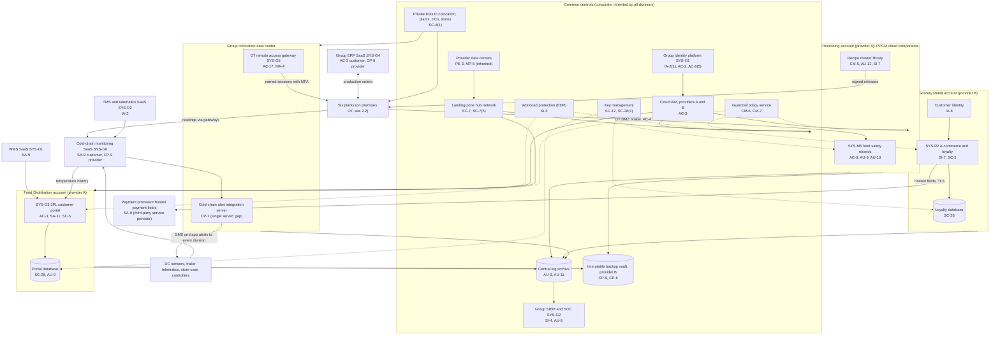
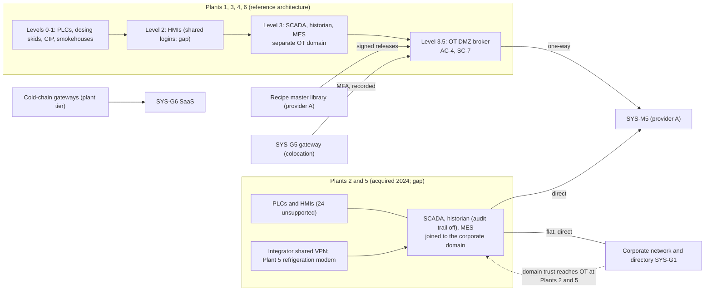

# Cloud Architecture and Control Placement: Cris Santos Company Holdings | Food and Agriculture | Multi-Sector

**Organization:** Cris Santos Company Holdings, Inc. | **Tier:** Multi-Sector | **Providers:** two public cloud providers, called provider A and provider B (vendor-agnostic; see section 6), a group colocation data center, and SaaS vendors
**Scope:** the shared corporate cloud platform (SYS-G3 landing zones), the shared SaaS services every division uses (SYS-G4 ERP, SYS-G6 cold-chain monitoring), the cloud components of the SSP system (the PPCM's food safety records application and recipe master library), and the division workloads on the platform. Plant OT stays on premises; this document shows where it connects.

## 1. Design in one paragraph
Corporate runs one **landing zone** per provider: identity federation from SYS-G1, a hub network, guardrail policies, a central log archive, key management, EDR, and an immutable backup vault. Divisions get their own **accounts** (subscriptions or projects) inside the landing zone and inherit these guardrails. Provider A hosts the corporate hub, the group data platform, the PPCM's cloud components (SYS-M5 and the recipe master library), and the Food Distribution 3PL portal (SYS-D3). Provider B hosts the Grocery Retail e-commerce and loyalty platform (SYS-R2), plus the DR replicas and the immutable backup vault for provider A workloads. The **group colocation data center** hosts the directory domain controllers, the SYS-G5 OT remote access gateway, SIEM collectors, and the cold-chain alert integration server. Plants reach the cloud only through an **OT DMZ** at Plants 1, 3, 4, and 6; Plants 2 and 5 still connect directly (POAM-001).

## 2. Diagrams
### 2.1 Group landing zone, shared services, and division workloads

### 2.2 PPCM boundary: plant OT and its cloud connections

**Target state (POAM-001 and POAM-002, due 2027-03-31 and 2026-12-31):** Plants 2 and 5 rebuilt to the reference architecture: OT servers moved to the separate OT domain, an OT DMZ broker in front of SYS-M5 and the ERP, the integrator VPN and the modem removed, all vendor access through SYS-G5, and cold-chain gateways on a segmented sensor network. The cold-chain alert integration server becomes an active-active pair with a tested failover (POAM-005).

## 3. Tenancy and identity decision
**Decision.** All three divisions share the group identity platform (SYS-G1) for IT and cloud access. Each division gets its own accounts inside the SYS-G3 landing zone and receives only division roles federated from SYS-G1. No division has a separate cloud tenant. Plant OT is the exception: Plants 1, 3, 4, and 6 run a separate OT domain, while the OT servers at Plants 2 and 5 and the DC automation servers are still joined to the corporate domain.

**Reason.** Shared identity lets one identity platform, one SIEM, one backup design, and one OT gateway design be assessed once by group internal audit. The sample is moving all plant OT into the separate OT domain so that ransomware in the corporate directory cannot reach plant control systems (GR-01).

**What limits blast radius.** Administrators and OT engineers use phishing-resistant MFA and just-in-time PAM with session recording. Break-glass roles are sealed, and division administrators cannot delete logs in the separate write-once archive. Plant OT data reaches SYS-M5 and the ERP only through one-way brokered flows in the OT DMZ at four plants. Vendors reach OT only through named, recorded SYS-G5 sessions. Backups use a separate backup identity.

**Known gaps.** Plants 2 and 5 have no OT DMZ and stay in the corporate domain (POAM-001). SYS-G5 does not yet cover Plants 2 and 5 or three DCs (POAM-002). 34 privileged directory service accounts are outside PAM (POAM-012).

Cross-division risks: GR-01 (ransomware spreads through the corporate directory to plant OT and DC automation), GR-07 (identity platform outage stops sign-in across all divisions).

## 4. Common versus division-specific controls
`cloud-control-map.csv` has 53 rows across 29 components. The `control_scope` column shows who owns each placement:

| Scope | Rows | What it means |
|---|---|---|
| Common (group) | 27 | Provided once by corporate (SYS-G1 to SYS-G6, landing zones, colocation) and inherited by every division. Listed in the P02 common control catalog |
| Shared system (PPCM) | 10 | Cloud and DMZ components of the SSP system: SYS-M5, the recipe master library, and the plant OT DMZ broker |
| Division-specific (Meat Processing) | 2 | AI vision vendor cloud used for model training |
| Division-specific (Food Distribution) | 8 | 3PL portal and database, WMS, TMS and telematics, EDI |
| Division-specific (Grocery Retail) | 6 | E-commerce and loyalty platform, customer identity, payment processor, store payment links |

| Responsibility | Rows |
|---|---|
| Customer (the group or a division) | 37 |
| Shared (provider and group) | 12 |
| Provider | 4 |

**Rule of thumb.** Identity, network guardrails, logging, keys, backups, EDR, OT remote access, and cold-chain alerting are **common**. A division cannot opt out of them, only request an exception through POL-01. Application behavior, data access within an application, customer-facing identity, and payment flows are **division-specific**, because they depend on each division's regulators, customers, and contracts.

## 5. Layers
| Layer | Common components | Division components | Key controls | Responsibility |
|---|---|---|---|---|
| Identity | SYS-G1, cloud IAM, SYS-G5 gateway | Customer identity (SYS-R2), telematics accounts, 3PL portal users | AC-2, AC-3, AC-6(5), AC-17, IA-2, IA-2(1), IA-8 | Customer (configuration); vendor (service) |
| Network | Hub network, private links, OT DMZ broker | WAF and bot management, store payment links, EDI | SC-7, SC-7(5), SC-8, SC-8(1), SC-5, AC-4 | Customer, with provider DDoS protection and carrier transport shared |
| Compute | EDR on all cloud hosts; alert integration server | SYS-M5, recipe library, 3PL portal, e-commerce | SI-3, SI-7, CM-5, CM-7, SA-11, CP-7 | Customer (code, configuration, containers) |
| Data | Keys, backup vault | SYS-M5 records, portal temperature history, loyalty data | SC-12, SC-28, SC-28(1), CP-9, CP-6, AU-9, AU-10 | Shared: provider encrypts; group owns keys, record integrity, and retention |
| Logging and monitoring | Log archive, SIEM | Application and recipe change logs | AU-6, AU-9, AU-11, AU-12, SI-4 | Shared: providers generate platform logs; group retains and reviews |
| SaaS dependencies | Identity, SIEM, EDR, ERP, cold-chain SaaS | WMS, TMS, AI vision vendor, payment processor | SA-9, CP-9, CM-3 | Provider for the service; customer for use and oversight |
| Physical | Provider data centers | none in the cloud (plants, DCs, and stores are on premises) | PE-3, MP-6 | Provider (inherited) |

## 6. Service categories and provider equivalents
The design does not depend on a provider. This table gives each provider's name for each service category, for reading its shared responsibility documentation.

| Service category | AWS | Microsoft Azure | Google Cloud |
|---|---|---|---|
| Account structure and guardrails | AWS Organizations with service control policies | Management groups with Azure Policy | Resource hierarchy with Organization Policy |
| Managed relational database | Amazon RDS | Azure SQL Database | Cloud SQL |
| Managed containers | Amazon EKS | Azure Kubernetes Service | Google Kubernetes Engine |
| Web application firewall and DDoS protection | AWS WAF and AWS Shield | Azure Web Application Firewall and Azure DDoS Protection | Cloud Armor |
| Key management | AWS KMS | Azure Key Vault | Cloud KMS |
| Audit logging | AWS CloudTrail | Azure Monitor activity log | Cloud Audit Logs |
| Backup with immutability | AWS Backup (vault lock) | Azure Backup (immutable vault) | Backup and DR Service |
| Private connectivity | AWS Direct Connect / PrivateLink | Azure ExpressRoute / Private Link | Cloud Interconnect / Private Service Connect |

Shared responsibility sources: SRC-AWS-SRM, SRC-AZURE-SRM, SRC-GCP-SRM in `00_universal-framework/sources/source-register.csv`. All three agree on the split used here: for IaaS the provider owns facilities, hosts, and virtualization; for PaaS the provider also owns the runtime; for SaaS the provider owns the application. The customer always keeps identities, access decisions, data classification, and data. None of the three covers on-premises OT, which is entirely the group's responsibility.

## 7. Findings from the mapping
1. **The weak points are on premises, not in the cloud.** Cloud guardrails, keys, and backups are sound (CM-6, SC-28, CP-9). The PPCM's exposure comes from Plants 2 and 5 connecting directly to the corporate network and the cloud without an OT DMZ (AC-4, SC-7; P01 GR-01; POAM-001).
2. **The cold-chain alert integration server is a common control with no alternate processing** (CP-7). It is in the colocation data center, not the cloud, and it serves all three divisions (P01 GR-02; POAM-005).
3. **The recipe master library is a food safety asset in the cloud.** Its integrity depends on separating library administration from cloud platform administration and on change alerts to plant FSQA (CM-5, AU-12; P01 MT-017).
4. **Common controls are strong and reused.** One identity platform, one SIEM, one backup design, and one OT gateway design let group internal audit assess them once (P07). The weak link is coverage (SYS-G5 at four of six plants) and documentation of inheritance for Food Distribution (P02, POAM-017), not the controls themselves.
5. **Division SaaS and payment providers carry division-specific duties.** The payment processor's annual PCI DSS attestation and responsibility matrix support the Grocery Retail ROC (SA-9); the 3PL portal's temperature history must be append-only because customers rely on it for their own food safety records (AU-9).
