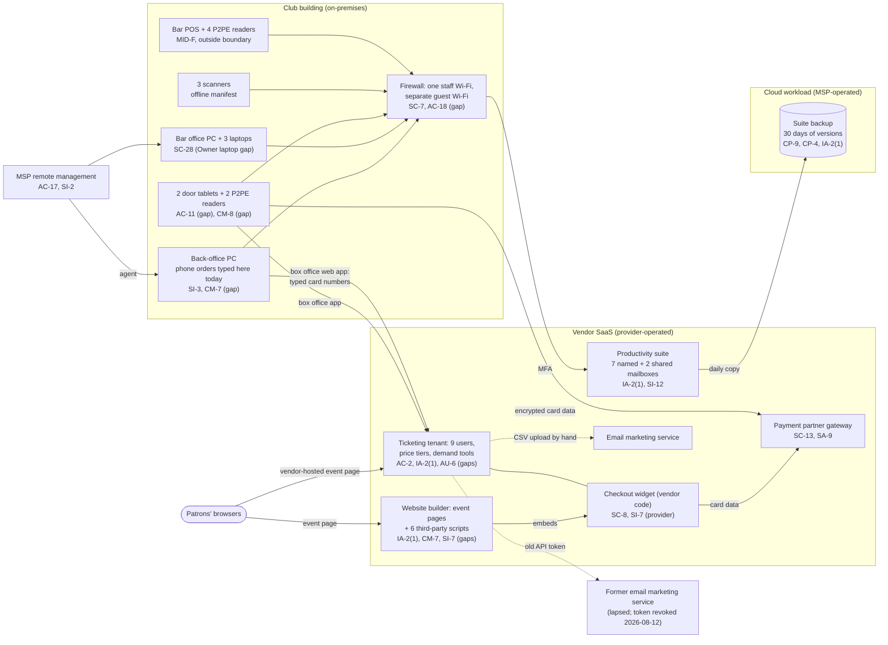

# Cloud Architecture and Control Placement: Cris Santos Company | Arts, Entertainment, and Recreation | Micro

**Organization:** Cris Santos Company, LLC (live event venue operator with ticketing; one music club) | **Tier:** Micro | **Provider:** Vendor-agnostic SaaS (see section 3)
**System:** Ticketing and Venue Operations Platform (TVOP), as defined in the SSP (P02) | **Prepared:** 2026-07-24 by the Venue Manager with the MSP account technician; updated 2026-08-12 with P07 findings | **Approved:** Owner and General Manager, 2026-08-31

## 1. Diagram
The company runs no servers and no IaaS tenant. Its "cloud" is a set of SaaS services plus one cloud workload that the MSP operates for it: the SaaS-to-SaaS backup of the productivity suite (SYS-11). The card data paths matter most, so they are drawn in full.

## 2. Layers and who is responsible
| Layer | Components | Key controls | Customer (company) | MSP (on the company's behalf) | Provider (SaaS vendor) |
|---|---|---|---|---|---|
| Identity | Ticketing users and API tokens; website login; suite accounts; backup and firewall logins | AC-2, AC-6, IA-2(1), IA-5 | Decides who gets access; enforces MFA in ticketing and website settings; controls API tokens | Creates and disables suite and computer accounts; holds the backup console and firewall logins | Runs the sign-in and MFA features |
| Network | Firewall, staff Wi-Fi, guest Wi-Fi, internet line | SC-7, AC-18 | Approves changes; decides which devices share a network | Configures, patches, and monitors | Not applicable |
| Endpoints | Back-office PC, bar office PC, laptops, door tablets, scanners | SI-3, SI-2, SC-28, AC-11, CM-8 | Keeps the inventory; manages the tablets and scanners | Anti-malware, patching, encryption, screen lock on the 5 office computers | Not applicable |
| Payment pages | Website event pages that embed the checkout widget; vendor-hosted pages | CM-7, SI-7, RA-5 | **Everything on the company's own pages, including every script** | Not applicable | The widget code and the payment pages it serves |
| Card devices | 2 door readers and 1 spare (payment partner), 4 bar readers (POS vendor) | CM-8, SC-13 | Inventory and inspections per the P2PE instruction manuals | Not applicable | P2PE encryption and key management |
| Data | Patron records, settlement workbooks, mailboxes, backups | CP-9, CP-4, SC-28, SI-12 | Decides retention, deletes card data, requests restore tests | Operates the backup and runs restore tests | Encrypts and backs up its own platform |
| Logging | Ticketing audit log, suite logs, firewall logs | AU-2, AU-6, AU-11 | **Reviews logs weekly (gap today)**; exports the ticketing log monthly | Keeps firewall logs; forwards alerts | Generates and stores logs |
| Vendor governance | Service provider list, AOCs, SOC 2 review, MSP review | SA-9 | Keeps the list; reviews AOCs and reports yearly | Answers the yearly MSP security questions | Provides AOCs and SOC 2 reports |

**The MSP is not a cloud provider in the shared responsibility sense.** It performs customer-side duties for the company. Anything marked "Customer (performed by MSP)" in `cloud-control-map.csv` remains the company's responsibility under its merchant agreements and the FTC Act. The company must direct the work, receive evidence, and check it (SA-9).

## 3. Service categories and provider equivalents
The design is vendor-agnostic. For SaaS, the three major cloud providers' shared responsibility models agree on the split: the provider runs the application, platform, and infrastructure; the customer keeps identities, access, settings, data, and devices (SRC-AWS-SRM, SRC-AZURE-SRM, SRC-GCP-SRM in `00_universal-framework/sources/source-register.csv`).

**The ticketing platform needs its own split,** because PCI DSS applies to it. The vendor's service provider AOC covers the checkout widget code, card data handling, and its infrastructure. The vendor's responsibility matrix (fictional) assigns to the customer: venue user accounts and MFA enforcement, roles, API tokens, and **the security of any page where the customer embeds the widget**. That last item is where the P08 scenario starts: a script on the company's own event page can draw a fake payment form over the real widget, and the vendor's controls never see it.

| Service category used | What it is here | Equivalent category in the large cloud providers (for reading their documentation) |
|---|---|---|
| Line-of-business SaaS | Ticketing platform, bar POS | Industry SaaS built on any provider |
| Payment gateway and P2PE | Payment partner gateway, tokenization, P2PE readers | Payment services from third-party processors (not a cloud provider service) |
| Website builder | Hosted website with plugins | Managed web hosting or static site hosting |
| Productivity suite | Email, files, chat | Productivity and collaboration SaaS |
| SaaS-to-SaaS backup | Daily copy of the suite | Backup service or third-party SaaS backup |
| Remote monitoring and management | MSP device management | Device management SaaS |

## 4. Findings from the mapping
1. **The company's website is part of the payment page (CM-7, SI-7).** The checkout widget is the vendor's, but the page around it is the company's. Six scripts load on that page, the administrator login is shared with no MFA, and nothing detects a change. Fix: remove every script not needed on event pages, MFA and named logins on the website, and weekly page checks. Tracked as P01 R-001 and P07 POAM-003 and POAM-008.
2. **Card numbers reach company systems only through people.** The P2PE readers and the widget keep card data out of company systems. The two exceptions are phone orders typed on the back-office PC and card numbers emailed to the box office mailbox. Stopping both removes clear card data from every company-managed component (P03 Option B; R-003, R-004).
3. **MSP-held administrator logins have no MFA (IA-2(1)).** The backup console and firewall management login use passwords only (POAM-003).
4. **Sync is not backup for the shared mailboxes (CP-9).** The 2 shared mailboxes, which hold most patron correspondence, are not in the backup at all, and nothing has been restore-tested (R-012; POAM-010).
5. **Old integrations keep running (IA-5, SA-9).** A 2024 API token sent patron records every night to a lapsed email marketing account until P07 testing found it (R-023; POAM-012).
6. **Customer-side controls are the weak layer.** The vendors' side is evidenced by AOCs and a SOC 2 report (P09). The gaps are on the company's side: accounts, MFA, page content, inventory, logs, and retention.
