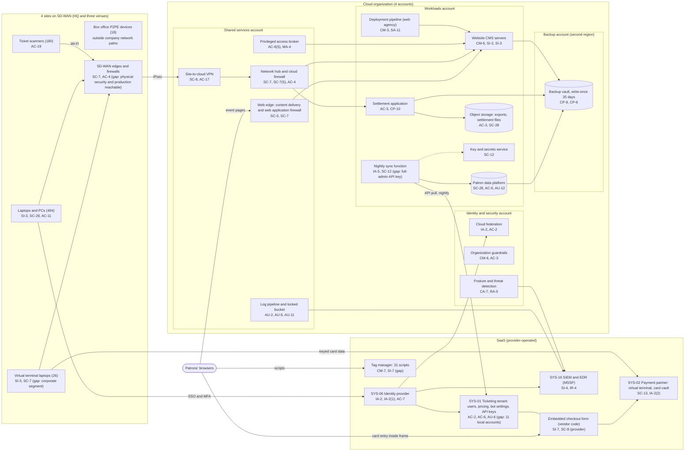

# Cloud Architecture and Control Placement: Cris Santos Company | Arts, Entertainment, and Recreation | Mid-Market

**Organization:** Cris Santos Company, Inc. | **Tier:** Mid-Market | **Provider:** Vendor-agnostic public cloud (see section 4), plus SaaS
**System:** Ticketing and Venue Operations Platform (TVOP), as defined in the SSP (P02) | **Prepared:** 2026-07-31 by the Security Manager and the IT Director; updated 2026-09-15 with P07 results
**Control map:** `cloud-control-map.csv` (59 rows, 25 components)

## 1. Diagram

## 2. Landing zone design
The landing zone separates duties across 4 accounts (subscriptions or projects, depending on the provider) under one cloud organization. Each account limits the damage an attacker can do from any other.

| Account | Purpose | Who administers | Key design decisions |
|---|---|---|---|
| **Identity and security** | Organization root, cloud federation to the identity provider, organization guardrails, posture management and threat detection | Security Manager and 1 security analyst | No workloads. Root credentials sealed. Guardrails apply to every other account and cannot be disabled from them |
| **Shared services** | Web edge (content delivery and web application firewall), network hub and cloud firewall, site-to-cloud VPN, privileged access broker, log pipeline and locked log bucket | IT Director's infrastructure team | All traffic between sites, workloads, and the internet passes the hub. Logs from all accounts land in a write-once bucket here |
| **Workloads** | Website CMS and its database, deployment pipeline, patron data platform, nightly sync function, settlement application, object storage, key and secrets service | Infrastructure team; web agency deploys through the pipeline only | Separate subnets per workload. No direct internet ingress except through the web edge. Company-managed keys |
| **Backup** | Backup vault with 35-day write-once retention in a second region | 2 named backup administrators | Separate administrator credentials, not federated to everyday accounts. A cross-account role can write but not delete backups |

## 3. Layers and shared responsibility per service
| Layer | Components | Key controls | Service model | Responsibility |
|---|---|---|---|---|
| Identity | Cloud federation, break-glass accounts, privileged access broker, identity provider, ticketing users, tag manager users | IA-2, IA-2(1), AC-2, AC-6, AC-6(5), AC-7, IA-5 | PaaS / SaaS | Customer configures identities, roles, MFA, and reviews; providers run the identity services |
| Network | Web edge, hub, cloud firewall, VPN, SD-WAN edges | SC-5, SC-7, SC-7(5), SC-8, AC-4, AC-17 | IaaS / PaaS | Customer designs routes, rules, and segmentation; providers run the gateway, edge, and firewall engines |
| Compute | CMS servers, deployment pipeline, sync function, settlement application | CM-3, CM-6, SI-2, SI-3, IA-5, CP-10 | IaaS / PaaS | Customer (guest OS on IaaS, application code and configuration on PaaS); provider for hosts and runtimes |
| Data | CMS database, patron data platform, object storage, key service, backups | SC-28, SC-12, CP-9, CP-6, AC-3, AC-6, AU-12 | PaaS | Shared: provider encrypts and operates storage and engines; customer controls keys, access, retention, isolation, and restore testing |
| Logging and monitoring | Log pipeline, posture service, SIEM | AU-2, AU-9, AU-11, CA-7, RA-5, SI-4, IR-4 | PaaS / SaaS | Shared: providers generate logs and detections; customer enables, retains, forwards, and acts on them; MSSP monitors |
| SaaS applications | Ticketing tenant and checkout form, tag manager, identity provider, payment partner services, productivity suite | AC-2, AU-6, CM-3, CM-7, SI-7, SC-13, SI-8 | SaaS | Provider runs the application; customer keeps users, settings, what it adds to pages, and log review |
| Physical | Provider data centers | PE-3 | All | Provider (inherited, evidenced by SOC 2 reports and AOCs) |

**Responsibility counts in `cloud-control-map.csv`:** 33 Customer, 20 Shared, 6 Provider. By service model: 8 IaaS, 35 PaaS, 16 SaaS rows. The customer side is always identity, data protection, and logging, as the three providers' shared responsibility models agree.

## 4. Service categories and provider equivalents
The design does not depend on one provider. This table gives each provider's name for the service category, to use when reading its shared responsibility documentation (SRC-AWS-SRM, SRC-AZURE-SRM, SRC-GCP-SRM in `00_universal-framework/sources/source-register.csv`).

| Service category | AWS | Microsoft Azure | Google Cloud |
|---|---|---|---|
| Multi-account organization and guardrails | AWS Organizations, service control policies | Management groups, Azure Policy | Resource Manager folders, organization policies |
| Account, subscription, or project | Account | Subscription | Project |
| Cloud identity federation | IAM Identity Center | Microsoft Entra ID with Azure RBAC | Cloud Identity with IAM |
| Content delivery and web application firewall | Amazon CloudFront with AWS WAF | Azure Front Door with Web Application Firewall | Cloud CDN with Cloud Armor |
| Network hub | Transit Gateway | Virtual WAN hub or hub virtual network | Network Connectivity Center or shared VPC |
| Cloud firewall | AWS Network Firewall | Azure Firewall | Cloud NGFW |
| Site-to-cloud VPN | Site-to-Site VPN | VPN Gateway | Cloud VPN |
| Virtual machines | EC2 | Virtual Machines | Compute Engine |
| Serverless functions | AWS Lambda | Azure Functions | Cloud Run functions |
| Application hosting (PaaS) | AWS App Runner or Elastic Beanstalk | Azure App Service | Cloud Run |
| Managed relational database | Amazon RDS | Azure SQL Database | Cloud SQL |
| Object storage | Amazon S3 | Azure Blob Storage | Cloud Storage |
| Object storage with write-once retention | S3 with Object Lock | Blob Storage with immutability policies | Cloud Storage with bucket lock |
| Key and secret storage | AWS KMS and AWS Secrets Manager | Azure Key Vault | Cloud KMS and Secret Manager |
| Backup service | AWS Backup (vault lock) | Azure Backup (immutable vault) | Backup and DR Service |
| Audit logging | AWS CloudTrail | Azure Monitor activity log | Cloud Audit Logs |
| Posture and threat detection | AWS Security Hub, Amazon GuardDuty | Microsoft Defender for Cloud | Security Command Center |

**Service model split used here (all three providers agree):**
- **IaaS** (virtual machines, networks): the provider owns facilities, hosts, and virtualization. The customer owns the guest OS, applications, network configuration, identities, and data.
- **PaaS** (managed database, functions, application hosting, storage, backup, key service): the provider also owns the platform software and its patching. The customer owns code, configuration, access, keys, and data.
- **SaaS** (ticketing, tag manager, identity provider, payment partner portal, SIEM, productivity suite): the provider also owns the application. The customer keeps users, settings, content it adds, log review, and data.

**The ticketing platform and the payment page need their own split,** because PCI DSS applies to them:
- The vendor's service provider AOC covers its platform, the code inside its embedded checkout frame, card data handling, and its infrastructure.
- The vendor's responsibility matrix (fictional) assigns to the company: venue user accounts and MFA, admin roles, API keys, review of the venue audit log, and **everything on the company's own pages that embed the frame**.
- PCI DSS v4.0.1 places the scripts on a merchant's page that embeds a provider's payment form within the merchant's responsibility for Requirements 6.4.3 and 11.6.1, while the scripts inside the provider's frame stay with the provider. That is why the website, the tag manager, and the 31 scripts are company controls in this map, and why the P08 card compromise scenario starts there.

## 5. Findings from the mapping
1. **The company's own pages surround the payment form (CM-7, SI-7).** The website event pages embed the vendor's checkout frame and load 31 third-party scripts through the tag manager, which 4 marketing agency staff can publish to without MFA or a second approval. A malicious script on the parent page can overlay or replace the frame. Fix: script inventory with authorization and justification, removal of all non-essential scripts from pages that embed the form, tag manager on SSO with MFA and two-person publishing, and a payment page change and tamper detection service. Tracked as P01 R-001 and P07 POAM-010.
2. **A cloud secret can change the ticketing platform (IA-5, SC-12).** The nightly sync function holds a full-admin ticketing API key in plain function settings. Anyone who reads that setting can export all patron records or change checkout and pricing settings. Fix: a read-only key scoped to patron reports, stored in the secrets service, rotated yearly. Tracked as P01 R-003 and POAM-002.
3. **Logging stops at the SaaS boundary (AU-2, AU-6, AU-11).** Cloud, identity, and firewall logs reach the SIEM, but the ticketing audit log (90 days at the vendor), tag manager publish history, CMS logs, and payment partner portal activity do not. Fix: export these to the log pipeline with 12-month retention and alerts. Tracked as P01 R-034 and POAM-007 and POAM-008.
4. **Recovery is designed but unproven (CP-9, CP-10).** Backups are isolated (separate account, second region, write-once, separate credentials), which is the strongest control in the environment. No restore of the settlement application or the patron data platform has been tested. Fix: quarterly restore tests into an isolated network, starting 2026-10-20. Tracked as P01 R-022 and POAM-015.
5. **Privileged access management stops at the cloud (AC-6(5)).** The access broker covers cloud administrator roles only. Identity provider, ticketing, CMS, and network administrators hold standing rights, and the integrator uses its own remote tool. Tracked as P01 R-036 and R-038.
6. **Boundary check.** Every in-scope component in the SSP (P02 section 9) appears in the diagram. Every cloud component has at least one row in the control map, and each account has controls from at least 2 of the AC, AU, CM, IA, SC, and SI families.
7. **Inherited controls rely on vendor assurance.** Rows marked Provider or Shared for the ticketing vendor, payment partner, identity provider, cloud provider, and MSSP depend on their PCI DSS AOCs and SOC 2 Type 2 reports and the controls those reports expect the company to operate, which are reviewed each year in P09 `vendor-soc2-review.csv`.
