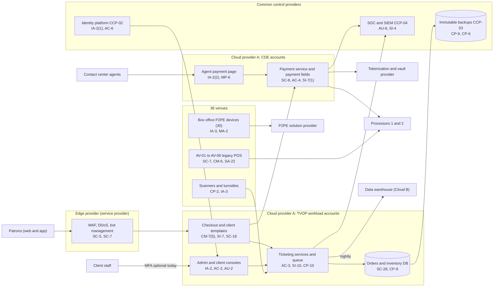

# System Security Plan: Ticketing and Venue Operations Platform (TVOP)

**Organization:** Cris Santos Company, Inc. (publicly traded live entertainment company) | **Tier:** Enterprise | **Vertical:** Arts, Entertainment, and Recreation
**Outline:** NIST SP 800-18 Rev. 2, System Security Plan Outline Example (June 2026) | **Version:** 2.0, 2026-09-14

## 1. System Name and Identifier
Ticketing and Venue Operations Platform (**TVOP**), identifier CSC-SYS-TVOP-001. Tier-1 system in the enterprise application inventory. The TVOP holds both PCI DSS cardholder data environments: the merchant environment (own events and venues) and the service provider environment (white-label ticketing for client venues).

## 2. System Overview
The TVOP is the company's in-house ticketing platform and the payment, box office, and entry channels around it. It sells about 52 million tickets a year: about 21 million for the company's own events at 36 venues and 3 festivals, and about 31 million for about 340 client venues and promoters on client-branded sites (service line SL-1). It runs event and seat-map setup, inventory and pricing, the virtual queue and bot defense for high-demand on-sales, web and app checkout, patron accounts, digital tickets with rotating barcodes, transfer and resale, and gate entry scanning.

**Why confidentiality and integrity of payments matter most.** Card data passes through the payment service for about 32 million card-not-present orders a year (own and client). A skimming script on a checkout page, a tampered payment flow, or a stolen administrator session can expose millions of patrons and trigger card brand, client, state, and SEC duties at once (P08).

**Major components:**
- Ticketing platform microservices on managed containers in Cloud provider A (two regions), with managed relational databases for orders and inventory
- Payment service in dedicated CDE accounts: payment fields served from a dedicated payment domain, the agent payment page for contact center phone sales, the tokenization connector, and authorization routing to two processors
- Web checkout for the company's own brand and about 340 client white-label templates; the mobile app back end
- Virtual queue, bot defense integration (edge provider plus in-house risk models), and the dynamic pricing service (P10)
- Access control service, about 7,500 handheld scanners, and turnstile integrations at 36 venues
- Box office devices: validated P2PE devices at 30 venues; legacy card readers on Windows POS terminals at AV-01 to AV-06
- Admin console (company staff) and client console (client staff)

Users: about 2,900 workforce accounts (platform engineering, ticketing operations, box office, contact center, finance), about 9,400 client user accounts at about 340 clients, and about 41 million patron accounts.

## 3. Laws, Regulations, and Policies Affecting the System
| ID | Requirement | Citation | How it affects the TVOP |
|---|---|---|---|
| N71-R04 | PCI DSS v4.0.1 | PCI SSC standard (contractual, not law) | The TVOP holds the merchant CDE (Visa Level 1 merchant) and the service provider CDE (Visa Level 1 service provider); annual Reports on Compliance by a QSA |
| N71-R05 | FTC Act Section 5 | 15 U.S.C. 45(a), 45(n) | Reasonable security for patron data; privacy and pricing statements must match practice |
| N71-R05 | FTC Rule on Unfair or Deceptive Fees | 16 CFR Part 464 (live-event tickets) | Total price display in every channel the platform renders, including client templates |
| ADA | ADA Title III ticketing | 28 CFR 36.302(f) | Accessible seating sale, pricing, and purchase limits enforced by platform rules |
| BOTS Act | Circumvention of ticket access controls | 15 U.S.C. 45c | The queue and bot defense are the "security measure" the Act protects; their logs are evidence |
| SEC | Cybersecurity disclosure | Form 8-K Item 1.05; 17 CFR 229.106 | A material TVOP incident goes through the P08 materiality step |
| State | State breach notification and consumer privacy laws | Each state where affected individuals reside (Florida worked example: Fla. Stat. 501.171) | Notification (P08); privacy rights requests and opt-outs for patron data |
| Contract | Client agreements (SL-1); SOC 2 Type 2 | P09 | Availability, confidentiality, processing integrity, and privacy commitments to clients |
| Internal | POL-01 to POL-05 and standards | P06 | Enterprise policy hierarchy |

Not applicable: N71-R01 to N71-R03 (no gaming, wagering, or casino operations); N71-R06 COPPA (general-audience sites and app; accounts require age 18 or older). The intake [obligations register](../step-00_P00_intake/obligations-register.csv) and P03 section 1 record the reasoning.

## 4. System Status
### 4.1 System Security Plan Approval
Prepared by the Director of Platform Engineering, the Director of Payments Engineering, and the GRC team. Reviewed by the CISO, the Director of Payments and PCI Compliance, and the President, Ticketing. Approved by the Chief Operating Officer on 2026-09-14.
### 4.2 System Authorization Decision
The company is not a federal agency, so there is no formal ATO. The equivalent internal decision:
- **Authorizing official equivalent:** Chief Operating Officer, with the CISO's recommendation.
- **Decision (2026-09-14):** continue operation with conditions, based on the Internal Audit assessment (P07) and the risk register (P01).
- **Conditions:** remove client tag containers from checkout and extend script authorization and change detection to all client templates (POAM-002, by 2026-12-15, before QSA fieldwork closes); purge card numbers from case notes and recordings and deploy keypad masking at the outsourced contact center (POAM-003, by 2026-12-15); enforce MFA for client users (POAM-004, by 2027-01-31); migrate AV-01 to AV-06 to P2PE and segmented networks (POAM-001, by 2027-03-31); prove the 2-hour regional failover (POAM-010, by 2027-01-31).
- **Reauthorization:** annually, or after a major change (for example a new payment processor, a new checkout architecture, or another acquisition).
### 4.3 System Operational Status
Operational. Planned major modifications: checkout template redesign that removes client tag containers from the payment page shell; automated regional failover; client account monitoring (AC-2(12)).

## 5. Role Identification and Responsible Personnel
| Role | Title | Responsibility |
|---|---|---|
| System owner | President, Ticketing | Accountable for the TVOP and SL-1; approves access roles and client terms |
| Authorizing official (equivalent) | Chief Operating Officer | Accepts residual risk to operate |
| Technology owner | Chief Technology Officer | Platform and payment service engineering |
| System administrators | Director of Platform Engineering; Director of Payments Engineering | Day-to-day operation, change control, recovery |
| PCI DSS program | Director of Payments and PCI Compliance | Scope, targeted risk analyses, QSA and acquirer liaison, AOCs |
| Information security | CISO; Director of Security Operations | Program oversight; SOC monitoring; incident response |
| Privacy | Chief Privacy Officer | Patron data, privacy rights, breach determinations |
| Venue channel | President, Venue Operations | Box office devices, scanners, gate entry |
| Common control providers | See section 10.3 | Operate inherited controls |
| Independent assessors | Chief Audit Executive (Internal Audit); external QSA | Annual assessment (P07); Reports on Compliance |

## 6. System Information Types and System Categorization
Information types are described in the company's terms, with NIST SP 800-60 Vol. 2 Rev. 1 used as a reference. Impact levels follow FIPS 199 as a model.

| Information type | Confidentiality | Integrity | Availability | Rationale |
|---|---|---|---|---|
| Account data in transit (card numbers, expiry, security codes) | Moderate | Moderate | Moderate | Disclosure triggers card brand, state, and client duties and fraud losses. The platform stores only tokens, which limits the stored population, so the rating stays Moderate rather than High |
| Patron accounts and orders | Moderate | Moderate | Moderate | Names, contact details, order history, and ticket entitlements for about 41 million accounts. Wrong or double-sold inventory harms patrons and clients |
| Ticket inventory, pricing, and entry entitlements | Low | Moderate | Moderate | Tampered prices or entitlements cause financial loss and gate disruption. Offline scanning keeps entry running (P05 BP-04: MTD 1 h), so availability is Moderate |
| Information security (audit logs, keys, configuration) | Moderate | Moderate | Moderate | Protects the evidence and the cardholder data environment |
| **TVOP category** | **Moderate** | **Moderate** | **Moderate** | See the decision below |

**Categorization decision.**
- The TVOP uses the **SP 800-53B Moderate baseline**.
- It adds **5 High-baseline controls** because PCI DSS requires them for the CDE: CA-8 and CA-8(1) (penetration testing, Requirement 11.4), AC-2(12) (monitoring accounts for atypical use, Requirement 10.4.1.1), CM-8(2) (automated inventory, Requirement 12.5.1), and SI-4(12) (automated alerts, Requirements 10.4.1.1 and 11.6.1).
- The risk committee approved this tailoring on 2026-09-10. It is reviewed annually.

**Documented controls.** `control-implementation.csv` documents **142 controls**: 137 from the Moderate baseline and 5 PCI DSS-driven High-baseline supplements. The remaining Moderate-baseline controls and enhancements are fully inherited from the common control catalog (section 10.3) and are listed there rather than repeated here. Privacy-baseline controls are documented in the enterprise privacy program. The `regulatory_driver` column maps each control to PCI DSS requirements (author mapping; no official mapping from PCI DSS v4.0.1 to SP 800-53 was used).

## 7. Authorization Boundary Description
The boundary was drawn from the intake [asset inventory](../step-00_P00_intake/asset-inventory.csv) (SYS-01 and its components, SYS-02, SYS-03, SYS-03-AV and the scanners in SYS-01-ACS) and the prior SSP version 1.1 (EV-064), with PCI DSS scope taken from the 2026 scope document (EV-029).

**Inside the boundary:** the ticketing platform workload accounts and the CDE accounts in Cloud provider A (both regions); the checkout and client templates; the admin and client consoles; the access control service, scanners, and turnstile integrations; box office devices at all 36 venues (P2PE devices at 30 venues; legacy POS terminals and readers at AV-01 to AV-06); and the contact center agent payment page.

**Outside the boundary (common control providers and interconnected systems):**
- Landing zone services (network hub, key management, log archive, backup accounts, standby region): CCP-03
- Identity platform (SYS-04): CCP-02
- SOC, SIEM, EDR, scanners: CCP-04
- Tokenization and vault provider, two processors, edge and bot management provider, P2PE solution provider (service providers with their own AOCs)
- Data warehouse and customer data platform (Cloud provider B), contact center platform, outsourced overflow contact center, client systems

**PCI DSS scope note.** The P2PE devices at 30 venues reduce the scope of those box offices to the device controls in the P2PE instruction manual. The AV-01 to AV-06 terminals and their flat networks are in full scope until POAM-001 closes. The data warehouse is out of CDE scope only while it holds no card numbers; the 2026 data discovery confirmed none there, but found card numbers in contact center case notes (EV-082; POAM-003).

The enterprise multi-cloud diagram is in P04 `cloud-architecture.md`.

## 8. Information Exchanges Summary
| Connected system / party | Direction | Data | Agreement |
|---|---|---|---|
| Tokenization and vault provider | Bidirectional (TLS, mutual authentication) | Card data in; tokens out | Service agreement with PCI DSS responsibility matrix; provider AOC (2026-03) |
| Processors 1 and 2 | Bidirectional (TLS) | Authorizations, refunds, chargebacks | Processing agreements; processor AOCs |
| Edge, WAF, and bot management provider | Inbound (all web and app traffic) | Patron sessions and bot signals | Service agreement; provider AOC and SOC 2 |
| P2PE solution provider | Box office devices to provider | Encrypted card data | P2PE instruction manual; solution listing |
| Client systems (127 API integrations) | Bidirectional (API keys) | Orders, attendee lists, reports for that client | Client agreements; **long-lived keys (POAM-004)** |
| Data warehouse (Cloud provider B) | Outbound nightly | Orders and patron data without card numbers | Internal data sharing standard; **service accounts with passwords (POAM-005)** |
| Customer data platform and email/SMS services | Outbound | Marketing audiences and transactional messages | Data processing terms |
| Marketing tag vendors on templates | Outbound from patron browsers | Page events | **Outside the third-party risk program (POAM-009)** |
| Cloud contact center platform and outsourced overflow center | Bidirectional | Patron contacts; agent payment page sessions | Contracts; **outsourced center AOC expired 2026-05-31 (POAM-009)** |
| ERP (SYS-08) | Outbound daily | Settlement and revenue data | Internal interface agreement (SOX) |

## 9. System Component Inventory
| Component | Type | Location / provider | Owner |
|---|---|---|---|
| Ticketing microservices (about 140 services) | Managed containers | Cloud provider A, two regions | Director of Platform Engineering |
| Orders and inventory databases | Managed relational database (PaaS) | Cloud provider A | Director of Platform Engineering |
| Payment service and agent payment page | Managed containers in CDE accounts | Cloud provider A, two regions | Director of Payments Engineering |
| Checkout and client templates (about 340) | Web application | Cloud provider A behind the edge provider | Vice President, Ticketing Operations |
| Mobile app back end | APIs on managed containers | Cloud provider A | Director of Platform Engineering |
| Access control service and scanners (about 7,500) | Service plus handheld devices | Cloud provider A; 36 venues | President, Venue Operations |
| Box office P2PE devices (about 430) | Payment terminals | 30 venues | President, Venue Operations |
| AV-01 to AV-06 legacy POS terminals and readers (about 150) | Windows POS terminals with USB readers | 6 venues | Vice President, Integration Management Office |

## 10. Control Implementation Details
### 10.1 Control implementation status
See `control-implementation.csv` (142 controls).

| Status | Count |
|---|---|
| Implemented | 112 |
| Partially implemented | 29 |
| Planned | 1 |
| **Total** | **142** |

| Inheritance | Count |
|---|---|
| Common (fully inherited from a common control provider) | 86 |
| Hybrid (shared between a provider and the TVOP teams) | 23 |
| System-specific | 33 |

The Planned control is AC-2(12) (monitoring of client and workforce accounts for atypical use). Partially implemented controls: AC-2, AC-2(3), AT-3, AU-6, CM-3, CM-6, CM-7(5), CM-8, CM-8(2), CP-2, CP-4, CP-10, IA-2, IA-5, IA-8, IR-4, IR-8, MP-6, PS-4, PS-7, RA-5, SA-9, SA-22, SC-7, SC-18, SI-2, SI-4, SI-7, SI-12.

### 10.2 Control assessment status
Internal Audit assessed 46 of these controls from 2026-07-13 to 2026-08-28 using SP 800-53A Rev. 5 procedures and statistical sampling (P07 `assessment-plan.md`, `assessment-results.csv`). Weaknesses are in P07 `poam.csv`. The QSA's 2026 fieldwork for the merchant and service provider Reports on Compliance is planned for 2026-10-19 to 2026-11-25.

### 10.3 Common control providers and inheritance
Common and hybrid controls are inherited from the enterprise platform. Each provider publishes its controls in the enterprise **common control catalog** (maintained by the GRC team in the GRC platform) and is assessed on its own cycle; the TVOP inherits the results.

| Provider | Name | Accountable role | Controls provided | Rows in this plan | Evidence of operation |
|---|---|---|---|---|---|
| CCP-01 | Enterprise GRC program | CISO (with the Chief Risk Officer and Chief Audit Executive for assessment) | Policies and standards (P06), risk methodology, assessment, POA&M, continuous monitoring | 22 | Annual Internal Audit assessment (P07); GRC platform |
| CCP-02 | Identity platform (SYS-04) | Director of Identity and Access Management | SSO, MFA, PAM, identity governance, account lifecycle | 18 | SOX IT general control testing; P07 AC-2, IA-2, IA-5 results |
| CCP-03 | Cloud landing zone (Cloud provider A) | Director of Cloud Platform Engineering | Account guardrails, network policies, key management, encryption, backups, log archive, standby region | 19 | Posture reports; provider SOC 2 Type 2 and AOC (physical and hypervisor) |
| CCP-04 | Security operations | Director of Security Operations | 24x7 SOC, SIEM, EDR, vulnerability management, penetration testing, incident response | 19 | SOC metrics; P07 SI-4, RA-5, IR results |
| CCP-05 | Enterprise and venue network (SYS-06) | Director of Network Engineering | SD-WAN, venue segmentation, wireless, carrier redundancy | 4 | Segmentation tests; network configuration reviews |
| CCP-06 | Endpoint engineering (SYS-07) | Director of Endpoint Engineering | Workstation and device baselines, EDR agents, device certificates, unsupported component tracking | 9 | Configuration compliance and patch reports |
| CCP-07 | Venue security and facilities; colocation providers | Vice President, Venue Security and Safety | Physical access to IT closets, box offices, and colocation cages | 3 | Badge reviews; colocation SOC 2 reports |
| CCP-08 | Human resources and workforce training | Chief Human Resources Officer | Screening, terminations, sanctions, training, acknowledgments | 9 | HR and learning system reports |
| CCP-09 | Third-party risk management | Director of Third-Party Risk Management | Vendor tiering, PCI DSS responsibility matrices, AOC and SOC report reviews, supply chain | 6 | Vendor register; AOC reviews |

**Inheritance rules:**
- A Common control is fully inherited; the TVOP teams verify only that the TVOP is onboarded (for example, SSO integration and log forwarding).
- A Hybrid control names both parts in the implementation statement: the provider's part and the TVOP team's part.
- If a provider's assessment finds a weakness, the finding is linked to every inheriting system's POA&M. Example: POAM-011 (AV venue terminations) is a CCP-02 and CCP-08 weakness that affects the TVOP because AV box office staff hold box office access.
- Service providers outside the company (tokenization, processors, edge, P2PE) are not common control providers; their responsibilities are set in the PCI DSS responsibility matrices (Requirement 12.8.5) and checked through their AOCs.

## 11. Digital Identity Acceptance Statement
- **Workforce users:** SSO with MFA (authenticator app with number matching, or a FIDO2 security key). Privileged and CDE users use phishing-resistant FIDO2 keys through PAM. This is comparable to NIST SP 800-63 AAL2 for users and AAL3-like protection for privileged users.
- **Client users (client console):** identity is vouched for by each client's administrator under the client agreement. MFA is available but optional today (38% enrolled); enforcement for all client users is due with POAM-004 by 2027-01-31. Shared client logins are prohibited by contract.
- **Patrons:** email-verified accounts with risk-based step-up (one-time codes) for new devices, payment method changes, and ticket transfers. Patrons never reach the consoles.

## 12. Referenced Artifacts
Scenario facts (`../00_company-facts.md`), intake evidence, inventories and obligations register ([step-00](../step-00_P00_intake/intake-report.md)), BIA (P05), multi-cloud architecture and control map (P04), enterprise risk register (P01), regulatory gap analysis and PCI DSS pre-assessment (P03), policy hierarchy and policies (P06), Internal Audit assessment and POA&M (P07), ticketing platform breach runbook (P08), SOC 2 readiness for SL-1 and SL-2 (P09), AI portfolio including AI-001 and AI-002 (P10), TVOP contingency plan v3 (EV-023), PCI DSS scope document 2026 (EV-029), enterprise common control catalog (EV-063). The `evidence` column in `control-implementation.csv` cites the [evidence register](../step-00_P00_intake/evidence-register.csv) ID behind each statement.

## 13. Acronym List and Glossary
- **AOC:** attestation of compliance (PCI DSS)
- **ASV:** Approved Scanning Vendor
- **AV-01 to AV-06:** the six acquired venues
- **CCP:** common control provider
- **CDE:** cardholder data environment
- **P2PE:** point-to-point encryption (a PCI-listed validated solution)
- **PAM:** privileged access management
- **POA&M:** plan of action and milestones
- **QSA:** Qualified Security Assessor
- **ROC:** Report on Compliance
- **SL-1:** white-label ticketing service line

## 14. System Security Plan Review and Change Records
| Version | Date | Change | Author |
|---|---|---|---|
| 1.0 | 2025-09-15 | Initial plan (Moderate baseline) | Director of Platform Engineering |
| 1.1 | 2026-03-02 | Added AV-01 to AV-06 box offices to the boundary after the acquisition | Director of Payments and PCI Compliance |
| 2.0 | 2026-09-14 | PCI DSS supplements; common control provider mapping; 2026 assessment results | Director of Platform Engineering with the GRC team |
