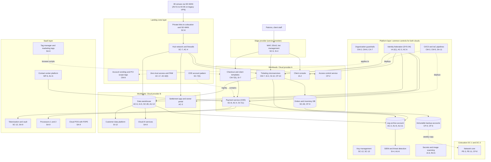

# Cloud Architecture and Control Placement: Cris Santos Company | Arts, Entertainment, and Recreation | Enterprise

**Organization:** Cris Santos Company, Inc. (publicly traded live entertainment company) | **Tier:** Enterprise | **Provider:** Multi-cloud, vendor-agnostic: two public cloud providers (Cloud provider A and Cloud provider B), two colocation data centers, an edge provider, and SaaS (see section 4)
**Owner:** Director of Cloud Platform Engineering, with the CISO and the Director of Payments and PCI Compliance | **Date:** 2026-08-31 | **Related:** TVOP SSP (P02), enterprise BIA (P05)

## 1. Architecture in layers
The estate is organized in four layers plus colocation. Each lower layer provides **common controls** that the layers above inherit, so a workload team configures only what is specific to its system.

| Layer | What it is | Examples | Who runs it |
|---|---|---|---|
| **Platform** | Organization-wide services in both clouds | Guardrails, identity federation, key management, log archive, SIEM feeds, vulnerability and image scanning, secrets management, immutable backup accounts, CI/CD pipelines | Cloud Platform Engineering; Security Operations; Identity team |
| **Landing zone** | The standard account pattern every workload lands in, including the stricter **CDE account pattern** | Account vending with PCI scope tags, hub-and-spoke network with cloud firewalls, CDE deny-by-default accounts, private links to colocation and the venue SD-WAN, zero-trust and PAM access, and the edge provider (WAF, DDoS, bot management) in front of every public endpoint | Cloud Platform Engineering; Network Engineering |
| **Workload** | Systems the company builds or runs | Cloud A: ticketing microservices, order and inventory databases, payment service (CDE), checkout and client templates, client console, access control service, mobile app back end. Cloud B: data warehouse, customer data platform, settlement application and owner portal (SL-2), cloud AI services | Platform Engineering; Payments Engineering; Data Engineering |
| **SaaS** | Vendor-operated services | Tokenization and vault provider, two processors, cloud POS with P2PE, cloud contact center, ERP and payroll, email and SMS services, tag manager and marketing tags | Vendors, with the company's configuration and oversight |

Colocation DC-1 (Florida) and DC-2 (Georgia) host the network core, legacy venue systems, and an offline copy of the immutable backups. The edge provider is a SaaS service, but it is placed in the landing zone layer because every public endpoint must sit behind it.

## 2. Diagram

## 3. Responsibility by service model
Sources: SRC-AWS-SRM, SRC-AZURE-SRM, and SRC-GCP-SRM in `00_universal-framework/sources/source-register.csv`. The three published models agree on the split used here, so the design does not depend on which two providers the company uses.

| Service model | Provider | Company (customer) | Shared |
|---|---|---|---|
| IaaS (network, hub firewalls) | Facilities, hosts, hypervisor, physical network | Guest OS, routing, firewall rules, identities, data | Encryption (provider service, customer keys), logging |
| PaaS (managed containers, databases, warehouse, AI services) | Also the platform runtime and its patching | Images, data, access, configuration, keys, application code | Backups, availability configuration, patching of dependencies |
| SaaS and service providers (tokenization, processors, edge, POS, contact center) | Also the application | Users, roles, data, configuration, oversight of the provider | Responsibility matrices and AOCs under PCI DSS Requirement 12.8 |
| Colocation | Building, power, cooling, perimeter | Racks, equipment, cage access lists | None |

**PCI DSS note.** A cloud provider's or service provider's AOC covers only the services and requirements it lists. The company keeps a responsibility matrix for each provider in scope and checks it against the provider's AOC every year (P03 rows for Requirement 12.8). The tokenization provider holds the card data keys, so Requirements 3.6 and 3.7 are the provider's responsibility for vaulted data.

## 4. Service categories and provider equivalents
| Service category | AWS | Microsoft Azure | Google Cloud |
|---|---|---|---|
| Organization guardrails | AWS Organizations service control policies | Azure Policy with management groups | Organization Policy Service |
| Account vending | AWS Control Tower account factory | Azure landing zone subscription vending | Resource Manager project creation |
| Key management | AWS KMS | Azure Key Vault | Cloud KMS |
| Audit logging | AWS CloudTrail | Azure Monitor activity log | Cloud Audit Logs |
| Threat detection | Amazon GuardDuty | Microsoft Defender for Cloud | Security Command Center |
| Managed containers | Amazon EKS | Azure Kubernetes Service | Google Kubernetes Engine |
| Managed relational database | Amazon RDS | Azure SQL Database | Cloud SQL |
| Web application firewall (cloud fallback) | AWS WAF | Azure Web Application Firewall | Cloud Armor |
| Secrets management | AWS Secrets Manager | Azure Key Vault secrets | Secret Manager |
| Backup service | AWS Backup | Azure Backup | Backup and DR Service |

This table is for reading provider documentation only. The architecture, control map, and SSP describe service categories.

## 5. Common controls
`cloud-control-map.csv` has **62 rows** across 34 components: Platform 20, Landing zone 9, Workload 21, SaaS 9, Colocation 3. Responsibility: Customer 41, Shared 18, Provider 3.

**32 rows are published as common controls** (`common_control` = Yes) in the enterprise common control catalog. They map to the common control providers in the TVOP SSP (P02 section 10.3): identity (CCP-02), landing zone (CCP-03), security operations (CCP-04), network (CCP-05), and colocation (CCP-07). A workload inherits them by being deployed through account vending, which applies the guardrails, logging, network, key, and backup policies automatically. CDE accounts are vended from a separate pattern with deny-by-default network rules and stricter posture checks.

**Rules for inheriting:**
1. A workload may claim a common control only if its account was created by account vending and passes the posture baseline. A CDE workload must also be in a CDE-pattern account.
2. Customer-side identity, data protection, and logging stay explicit at every layer: even a SaaS service has Customer rows (for example AU-6 for contact center exports) because those are always the company's responsibility.
3. Service provider rows cite the provider's AOC or SOC 2 report, reviewed by the third-party risk team (P09 evidence map).

## 6. Validation against the TVOP SSP (P02)
Every TVOP component in the SSP boundary appears here with controls from each required family, directly or inherited:
| TVOP component | AC | AU | CM | IA | SC | SI |
|---|---|---|---|---|---|---|
| Ticketing microservices | AC-6 (inherited) | AU-2, AU-9 (inherited) | CM-7 | IA-2(1) (inherited) | SC-7 (inherited) | SI-2, SI-10 |
| Payment service (CDE) | AC-4 | AU-2 (inherited) | CM-5 (inherited) | IA-5 (inherited) | SC-8, SC-7(5) (inherited) | SI-7(1) |
| Checkout and client templates | AC-4 (inherited) | AU-6 (inherited) | CM-7(5) | IA-2(1) (inherited) | SC-5 (edge) | SI-7 |
| Client console | AC-2 (inherited) | AU-2 (inherited) | CM-3 (inherited) | IA-2 | SC-8 (inherited) | SI-4 (inherited) |
| Orders and inventory databases | AC-6 (inherited) | AU-11 (inherited) | CM-6 (inherited) | IA-2(1) (inherited) | SC-28 | SI-2 (shared) |

## 7. Findings from the mapping
1. **Client templates are the weak edge of the payment page.** The CDE pattern protects the payment service, but the checkout page shell on client templates can load client tag containers. Script authorization (CM-7(5)) and tamper detection (SI-7) are workload duties no platform service can cover (POAM-002).
2. **Edge provider concentration.** All public traffic depends on one edge provider; the cloud WAF fallback exists on paper only (POAM-014).
3. **Two clouds, one control set.** Guardrails, logging, and key policies are written once as code and applied to both clouds. Differences are limited to service names (section 4).
4. **Data warehouse identities.** Platform identity federation covers people, but 14 warehouse service accounts still use passwords without network policies, so one stolen password can export patron data at scale (POAM-005).
5. **Venue connectivity.** AV-01 to AV-06 reach the hub over legacy site VPNs, not the SD-WAN, and their POS terminals sit on flat networks (POAM-001).
6. **AI services** run under provider terms with no training on company data; the AI governance committee reviews each new deployment (P10).
