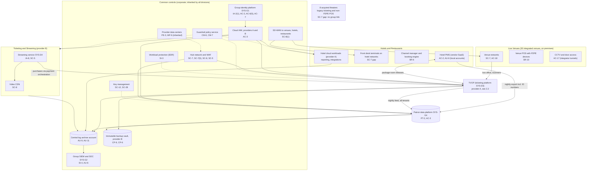
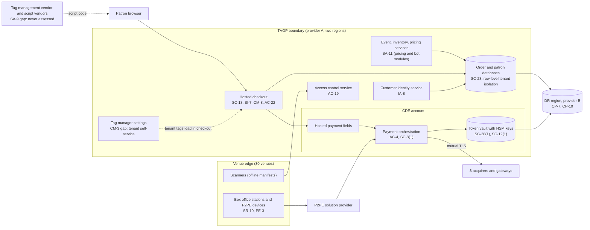

# Cloud Architecture and Control Placement: Cris Santos Company Holdings | Arts, Entertainment, and Recreation | Multi-Sector

**Organization:** Cris Santos Company Holdings, Inc. | **Tier:** Multi-Sector | **Providers:** two public cloud providers, called provider A and provider B (vendor-agnostic; see section 5)
**Scope:** the shared corporate cloud platform (SYS-G3 landing zones and WAN), the two shared systems that run on it (the TVOP and the patron data platform SYS-G4), and the division workloads around them. The SSP system (P02) is the TVOP.

## 1. Design in one paragraph
Corporate runs one **landing zone** per provider: identity federation from SYS-G1, a hub network with a web application firewall, guardrail policies, a central log archive, key management, EDR, and an immutable backup vault (in provider B). Divisions get their own **accounts** (subscriptions or projects) inside the landing zones and inherit these guardrails. Provider A hosts the corporate hub, the **TVOP** in two regions (with its payment orchestration and token vault in a separate **CDE account**), the patron data platform, and hotel cloud workloads. Provider B hosts the TVOP disaster recovery region, the **streaming service** (SYS-D4) behind a CDN, and the backup vault. An **SD-WAN** connects 30 integrated venues, 16 hotels, and 58 restaurants to the hubs. Three things sit outside the cloud platform: the **hotel PMS** (vendor SaaS), the venue and hotel **on-premises networks** with P2PE devices, scanners, and front desk terminals, and the **8 acquired theaters**, which still run the seller's ticketing SaaS on flat local networks with no link to group services.

## 2. Diagrams
### 2.1 Group landing zone and division workloads

### 2.2 TVOP (SSP boundary)

**Target state (POAM-006 to POAM-009, due 2026-11-30 to 2027-01-31):** tenant tags are allowed on event pages only and blocked in every checkout step by the content security policy; the payment step loads only the 14 inventoried platform scripts; change-and-tamper detection alerts the SOC on any new or changed script on any tenant's payment page; script vendors are assessed and contracted; tenant tag changes are logged and alerted.

## 3. Common versus division-specific controls
`cloud-control-map.csv` has 55 rows across 32 components. The `control_scope` column shows who owns each placement:

| Scope | Rows | What it means |
|---|---|---|
| Common (group) | 23 | Provided once by corporate (SYS-G1, SYS-G2, SYS-G3) and inherited by every division account. Listed in the P02 common control catalog |
| Shared system (TVOP) | 19 | Controls of the shared ticketing platform documented in the P02 SSP |
| Shared system (patron data platform SYS-G4) | 2 | Purpose and access controls of the corporate marketing platform |
| Division-specific (Live Venues) | 5 | Venue networks, venue POS, integrator access, and the acquired theaters |
| Division-specific (Hotels and Restaurants) | 4 | PMS accounts and logs, front desk networks, channel providers |
| Division-specific (Ticketing and Streaming) | 2 | Streaming sign-in and delivery |

| Responsibility | Rows |
|---|---|
| Customer (the group or a division) | 39 |
| Shared (provider and group) | 12 |
| Provider | 4 |

**Rule of thumb.** Identity, network guardrails, logging, keys, backups, and EDR are **common**. A division cannot opt out of them, only request an exception through POL-01. Payment page content, tenant settings, and patron data use are **TVOP** controls, because one platform serves every division and client. Card-present devices, venue and hotel networks, and the PMS are **division-specific**, because each division answers to its own acquirer and runs its own premises.

## 4. Layers
| Layer | Common components | Shared system and division components | Key controls | Responsibility |
|---|---|---|---|---|
| Identity | SYS-G1, cloud IAM | Customer identity service (patrons, client users), streaming sign-in, hotel PMS local accounts | AC-2, AC-3, AC-6(5), IA-2(1), IA-8 | Customer (configuration); vendor (service) |
| Network | Hub, WAF, SD-WAN | CDE account zone, venue and hotel networks, acquired theaters | SC-7, SC-7(5), SC-7(21), SC-8, SC-8(1), SC-5, AC-18 | Customer, with provider DDoS protection shared |
| Compute | EDR, guardrails | TVOP containers, pricing and bot modules, streaming | SI-3, CM-6, CM-7, SA-11 | Customer (guest OS, containers, code) |
| Data | Keys, backup vault | Token vault and HSMs, order and patron databases, SYS-G4 | SC-12, SC-12(1), SC-28, SC-28(1), CP-9, PT-2, PT-3 | Shared: provider encrypts and runs HSM hardware; group owns keys, tenancy, and purpose |
| Payment page (in the patron's browser) | none | Hosted checkout, tag manager, script vendors | SC-18, SI-7, CM-8, CM-3, SA-9, AC-22 | Customer. No cloud provider control reaches code that runs in the patron's browser |
| Logging and monitoring | Log archive, SIEM | Application, tenant configuration, and payment logs | AU-6, AU-9, AU-11, SI-4 | Shared: providers generate platform logs; group retains and reviews |
| Physical | Provider data centers | Box office areas, P2PE devices, front desks | PE-3, MP-6, SR-10 | Provider for data centers; divisions for venues and hotels |

## 5. Service categories and provider equivalents
The design does not depend on a provider. This table gives each provider's name for each service category, for reading its shared responsibility documentation.

| Service category | AWS | Microsoft Azure | Google Cloud |
|---|---|---|---|
| Account structure and guardrails | AWS Organizations with service control policies | Management groups with Azure Policy | Resource hierarchy with Organization Policy |
| Managed containers | Amazon EKS | Azure Kubernetes Service | Google Kubernetes Engine |
| Managed relational database | Amazon RDS / Aurora | Azure SQL Database / Azure Database for PostgreSQL | Cloud SQL / AlloyDB |
| Managed HSM | AWS CloudHSM | Azure Managed HSM | Cloud HSM |
| Key management | AWS KMS | Azure Key Vault | Cloud KMS |
| Web application firewall | AWS WAF | Azure Web Application Firewall | Cloud Armor |
| Audit logging | AWS CloudTrail | Azure Monitor activity log | Cloud Audit Logs |
| Backup with immutability | AWS Backup (vault lock) | Azure Backup (immutable vault) | Backup and DR Service |

Shared responsibility sources: SRC-AWS-SRM, SRC-AZURE-SRM, SRC-GCP-SRM in `00_universal-framework/sources/source-register.csv`. All three agree on the split used here: for IaaS the provider owns facilities, hosts, and virtualization; for PaaS the provider also owns the runtime; for SaaS the provider owns the application. The customer always keeps identities, access decisions, data classification, and data. For PCI DSS, each provider's own AOC covers only its part; the QSA tests the group's part.

## 6. Findings from the mapping
1. **The payment page is the weak point, and no cloud control covers it.** Encryption, tokenization, and the CDE account are sound (SC-28(1), SC-12, SC-7(21)). The gap is code that runs in the patron's browser: the content security policy trusts the tag manager domain, so any tenant tag runs on checkout (SC-18, CM-8, SI-7; P01 GR-01; POAM-006, POAM-007). This is the entry point used in the P08 scenario.
2. **One platform, three PCI roles.** The TVOP is a service provider to its clients and to the group's own merchants. A single tenant's tag can affect patrons of every division, so the fix belongs in the platform, not in each tenant's settings.
3. **The patron data platform receives more than its uses need** (PT-2, PT-3). The hotel PMS export carries identity document numbers, and the TVOP feed carries all tenants' purchaser data (POAM-012, POAM-024).
4. **Common controls are strong and reused.** One identity platform, one SIEM, one backup design. Group internal audit assessed them once (P07). The weak links are documentation of inheritance for Hotels and Restaurants (P02, POAM-014) and the parts of the estate that never joined the platform: the hotel PMS accounts and the acquired theaters (POAM-015, POAM-018).
5. **Card-present channels sit on premises.** P2PE devices at venues and restaurants keep card data off group networks (SR-10). The hotel front desk terminals and the acquired theaters' terminals do not, which puts their networks in PCI scope (POAM-016, POAM-018).
