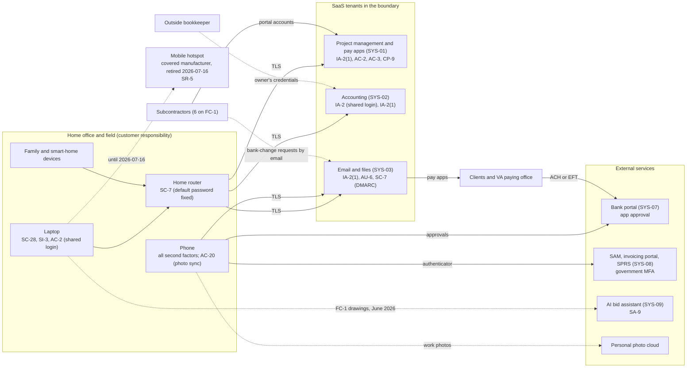

# SaaS Architecture and Control Placement: Cris Santos Company | Construction | Sole Proprietorship

**Organization:** Cris Santos Company (commercial and institutional building general contractor) | **Tier:** Sole Proprietorship | **Provider:** SaaS only (no IaaS or PaaS)
**System:** Project Management and Payment Application System (PMPAS), as defined in the system security plan (P02) | **Prepared:** 2026-07-15 by the owner with the on-call IT technician; updated 2026-07-21 after the P07 router test | **Adopted:** 2026-08-31

## 1. Diagram
Control IDs on each node are the ones in `cloud-control-map.csv`. Dashed lines are flows that carry FCI or payment details outside an approved system, or that the owner cannot verify.

## 2. Layers
| Layer | Components | Key controls | Responsibility |
|---|---|---|---|
| Identity | SYS-01, SYS-02, SYS-03 accounts; laptop login | IA-2, IA-2(1), AC-2 | Customer configures; vendor provides MFA options |
| Data | Drawings, pay apps, vendor bank details, W-9 forms, photos | AC-3, AC-20, CP-9, SC-28, SA-9 | Vendor protects data inside its service; the owner decides who sees it and where FCI may go |
| Endpoints | Laptop, phone | SC-28, SI-3, AC-2 | Customer |
| Network | Home router; the retired hotspot; phone tethering | SC-7, SR-5 | Customer |
| Logging | Email sign-in and mailbox rule history; SYS-01 activity | AU-6 | Shared: vendor records, the owner reviews |
| Email authentication | Company domain (SPF, DKIM, DMARC) | SC-7 | Customer (DNS records) |
| SaaS applications and hosting | All three tenants | Inherited (platform patching, hosting security, encryption at rest) | Provider |

## 3. Shared responsibility for SaaS
The three major cloud providers' shared responsibility models (SRC-AWS-SRM, SRC-AZURE-SRM, SRC-GCP-SRM) agree on the SaaS split: the provider runs the application, the platform, and the facilities; **the customer always keeps its identities and accounts, its data, and its devices.** That is why 13 of the 17 rows in the control map are the owner's alone, 3 are shared, and only 1 is the provider's. The project management vendor's SOC 2 report covers the provider side (P09). It does not cover who the owner lets into the portal, whether MFA is on, or whether a pay app goes out from a compromised mailbox. No IaaS equivalents table is needed, because the company runs no infrastructure.

## 4. Findings from the mapping
1. **MFA is off where it is free to turn on.** SYS-01 and SYS-02 offer app-based MFA; both administrator accounts used a password only. Email uses text-message codes, which an adversary-in-the-middle phishing page can capture. Tracked as P01 R-001 and R-004.
2. **The payment path runs through email.** Pay apps go out by email and subcontractors' bank-change requests come in by email. Without DMARC on the company domain, a client cannot tell a spoofed company email from a real one (R-001, R-002).
3. **FCI leaves the boundary in three places:** the personal photo cloud, the AI bid assistant, and free file-transfer links from subcontractors (R-009). These must be closed before the CMMC Level 1 self-assessment, because FCI may only be processed on systems inside the assessed scope once the DoD subcontract carries DFARS 252.204-7021 (paragraph (d)(2)).
4. **The home network is part of the boundary.** It carried the default router password (found in P07) and shared space with family and smart-home devices (R-006). A separate work network keeps family devices out of the CMMC scope.
5. **Section 889 reaches the owner's own equipment.** The carrier-branded hotspot was covered telecommunications equipment. FAR 52.204-25(b)(2) prohibits *using* it, whether or not the use is for federal work (R-007).
