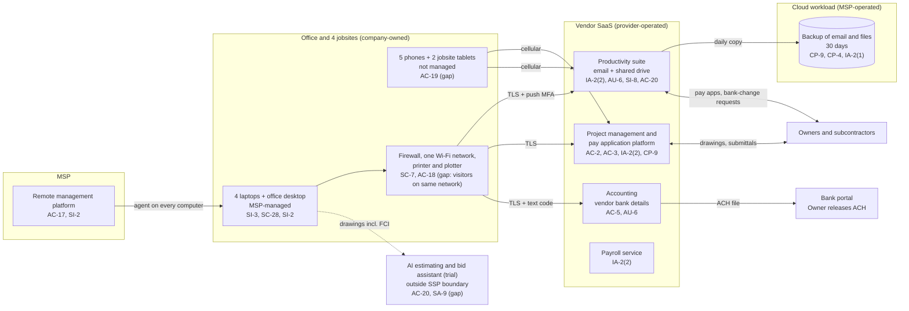

# Cloud Architecture and Control Placement: Cris Santos Company | Construction | Micro

**Organization:** Cris Santos Company, LLC (commercial and institutional building general contractor) | **Tier:** Micro | **Provider:** Vendor-agnostic SaaS (see section 3)
**System:** Project and Payment System (PPS), as defined in the SSP (P02). This is also the FCI boundary for CMMC Level 1 | **Prepared:** 2026-07-31 by the Office Manager with the MSP lead technician | **Approved:** Owner and President, 2026-08-31

## 1. Diagram
The company runs no servers and no IaaS tenant. Its "cloud" is a set of SaaS services plus one cloud workload that the MSP operates for it: the backup of email and files (SYS-07).

## 2. Layers and who is responsible
| Layer | Components | Key controls | Customer (company) | MSP (on the company's behalf) | Provider (SaaS vendor) |
|---|---|---|---|---|---|
| Identity | Suite, SYS-01, SYS-02, SYS-03, backup console, firewall login | AC-2, IA-2, IA-2(1), IA-2(2), IA-2(8), IA-5 | Decides who gets access; enforces MFA in SYS-01; removes leavers and closed-project subcontractors | Creates and disables suite accounts; holds the backup and firewall administrator logins | Runs the sign-in and MFA service |
| Network | Firewall, Wi-Fi, internet line | SC-7, AC-18, SI-2 | Approves changes; decides who gets the Wi-Fi password | Configures, patches, and monitors | Not applicable |
| Endpoints | 4 laptops, desktop, 5 phones, 2 tablets | SI-3, SC-28, AC-11, AC-19, CM-8 | Keeps the inventory; brings phones and tablets under management | Antivirus, patching, encryption, and screen lock on the 5 computers | Not applicable |
| SaaS applications | SYS-01 to SYS-04 | AC-3, AC-5, SI-8, AC-20 | Users, roles, forwarding and sharing settings, DMARC, approval of bank changes | Suite administration on request | Application, platform, data centers |
| Data | Project records, vendor bank details, email and files, backup copies | CP-9, CP-4, SC-28 | Decides retention, exports, and restore testing | Operates the backup and runs restore tests | Encrypts and backs up its own platform |
| Logging | Suite sign-in and mailbox logs, SYS-01 activity log, SYS-02 change log, firewall log | AU-2, AU-6 | **Reviews alerts and logs monthly (gap today)** | Configures alerts; keeps firewall logs | Generates and stores logs |
| Vendor governance | SOC 2 review, MSP review, AI tool terms | SA-9, AC-20 | Reviews SOC 2 and MSP evidence; signs vendor terms | Holds the backup vendor contract | Provides SOC 2 reports and terms |

**The MSP is not a cloud provider in the shared responsibility sense.** It performs customer-side duties for the company. Anything marked "Customer (performed by MSP)" in `cloud-control-map.csv` remains the company's responsibility under FAR 52.204-21 and in any CMMC self-assessment. The company must direct the work, receive evidence, and check it (SA-9).

## 3. Service categories and provider equivalents
The design is vendor-agnostic. The shared responsibility split for SaaS is the same in all three major cloud providers' models: the provider runs the application, platform, and infrastructure; the customer keeps identities, access, data, devices, and tenant settings such as mail authentication policy (SRC-AWS-SRM, SRC-AZURE-SRM, SRC-GCP-SRM in `00_universal-framework/sources/source-register.csv`). For the company's vendors, the SOC 2 report or vendor security documentation is the evidence of the provider side.

| Service category used | What it is here | Equivalent category in the large cloud providers (for reading their documentation) |
|---|---|---|
| Line-of-business SaaS | Project management and pay application platform; accounting; payroll | Industry SaaS built on any provider |
| Productivity suite | Email, calendar, file storage, sync client | Productivity and collaboration SaaS |
| SaaS-to-SaaS backup | Daily backup of email and files | Backup service or third-party SaaS backup |
| Remote monitoring and management | MSP device management | Device management SaaS |
| AI SaaS (trial, outside the boundary) | Estimating and bid assistant | Hosted AI model services |

**FCI and cloud services.** FAR 52.204-21 and CMMC Level 1 do not require FedRAMP-authorized services. That requirement applies to covered defense information under DFARS 252.204-7012(b)(2)(ii)(D), which does not apply today (P03 G-034). The company must still control which external systems hold FCI (52.204-21(b)(1)(iii)).

## 4. Findings from the mapping
1. **Email is the payment channel, and its controls are the weakest layer (IA-2(2), AU-6, SI-8).** Pay apps leave from the Project Manager's mailbox. Bank-change requests arrive by email. The mailbox has push MFA that a relay page can defeat, no alerts on new inbox rules, and no DMARC to stop look-alike or spoofed mail. Fix: security keys for payment roles, alerts on forwarding and inbox rules, DMARC to reject. Tracked as P01 R-001, R-004 and P07 POAM-005, POAM-007.
2. **One person can change where money goes (AC-5).** The accounting service lets the Office Manager edit vendor bank details with no approval step, and nobody reviews its change log. The Owner releases the batch without seeing the change. Fix: call-back and Owner approval of every change, and a monthly change report. Tracked as P01 R-002 and POAM-002.
3. **MSP-held administrator logins have no MFA (IA-2(1)).** The backup console and firewall management login use passwords only. One stolen MSP password could delete every backup. Fix: MFA on both by 2026-09-30 (POAM-004).
4. **Sync is not backup, and the backup is unproven (CP-9, CP-4).** SYS-07 copies only email and files, keeps 30 days, and has never been restored. SYS-01, SYS-02, and SYS-03 depend on their vendors alone. Fix: restore test by 2026-09-30, 90-day immutable retention, and a monthly export of SYS-01 pay app packages and current drawings. Tracked as P01 R-013 and POAM-013.
5. **FCI leaves the boundary (AC-20).** Drawings flow to personal email and to the AI tool (dotted line in the diagram). Both put FCI on systems outside the CMMC scope. Tracked as P03 G-003, G-024 and P10.
6. **Inherited controls rely on the SYS-01 vendor's SOC 2 report.** The report lists controls the company must run. Two of them, MFA enforcement and removing users from closed projects, are open gaps (P09).
