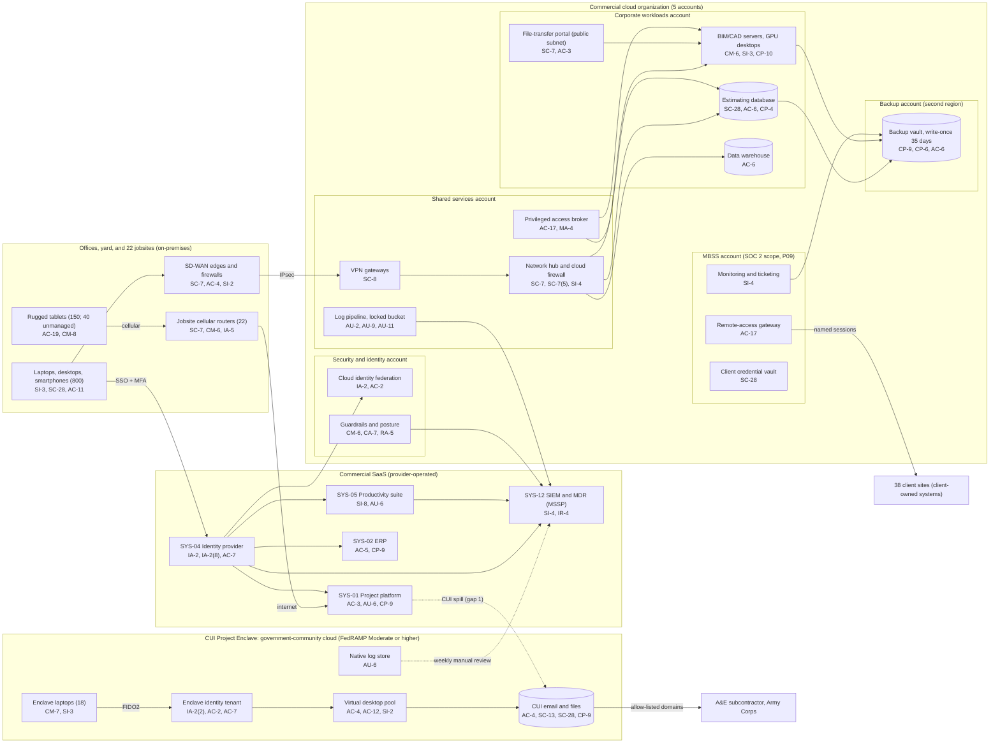

# Cloud Architecture and Control Placement: Cris Santos Company | Construction | Mid-Market

**Organization:** Cris Santos Company, Inc. | **Tier:** Mid-Market | **Providers:** a vendor-agnostic commercial public cloud (5-account landing zone), a government-community cloud for the CUI Project Enclave, and SaaS (see section 5)
**System:** Project Delivery and Payment Platform (PDPP) and its CUI Project Enclave (CPE) subsystem, as defined in the SSP (P02); the MBSS account is included because it shares the landing zone | **Prepared:** 2026-07-31 by the IT Director and Security Manager; updated 2026-09-17 with P07 results
**Control map:** `cloud-control-map.csv` (62 rows, 32 components)

## 1. Diagram

There is no network path between the commercial landing zone and the CPE. The dotted line from SYS-01 to the CPE shows the CUI that was found in the commercial project platform. The dotted line from the CPE log store shows that CPE logs are reviewed by hand, not forwarded.

## 2. Landing zone design (commercial cloud)
The landing zone separates duties across 5 accounts (subscriptions or projects, depending on the provider) under one cloud organization. Each account limits what an attacker can reach from any other.

| Account | Purpose | Who administers | Key design decisions |
|---|---|---|---|
| **Security and identity** | Organization root, cloud identity federation to SYS-04, guardrails, posture and threat detection | Security Manager and 1 security analyst | No workloads. Root credentials sealed. Guardrails apply to every other account and cannot be disabled from them |
| **Shared services** | Network hub, cloud firewall, VPN gateways for the SD-WAN, DNS, privileged access broker, patch service, log pipeline and locked log bucket | IT Director's infrastructure team (4 people) | All traffic between offices, workloads, and the internet passes the hub. Logs from all accounts land in a write-once bucket |
| **Corporate workloads** | Estimating database, BIM/CAD file servers with GPU virtual desktops, file-transfer portal, data warehouse, key management | Infrastructure team; Director of VDC for model data | Separate subnets per workload. The file-transfer portal is the only internet-facing service and sits in its own public subnet |
| **MBSS** | Monitoring servers, ticketing, remote-access gateway, client credential vault | MBSS lead technician and infrastructure team | Kept separate so that a compromise of client-facing tools cannot reach corporate workloads. SOC 2 scope (P09) |
| **Backup** | Backup vault with 35-day write-once retention in a second region | 2 named backup administrators | Separate administrator credentials, not federated to everyday accounts. Backups are pulled by a cross-account role that can write but not delete |

## 3. CUI Project Enclave design (government-community cloud)
The CPE was built in 2025-03 for FC-4. It uses a government-community cloud whose collaboration suite, identity service, and virtual desktop service are FedRAMP authorized at Moderate or higher, which is how the company meets DFARS 252.204-7012(b)(2)(ii)(D) for the cloud services that hold CUI. The provider's customer responsibility matrix (CRM) is on file and was reviewed in 2025-02.

| Component | What it does | Who is responsible |
|---|---|---|
| Enclave identity tenant | 52 accounts (41 company, 8 A&E guests, 3 administrators); FIDO2 for everyone | Provider runs the service; the company owns accounts, roles, and reviews |
| Collaboration suite | CUI email and files; sharing only to 9 allow-listed domains | Provider runs the service and FIPS-validated encryption; the company owns sharing rules, labels, and retention |
| Virtual desktop pool | 40 sessions; the only way into CUI from enclave laptops and (from 2026-12) managed tablets | Provider runs the platform; the company owns the desktop image, patching, and data-movement rules |
| Enclave laptops | 18 laptops in FIPS mode; USB storage blocked | Company |
| Native log store | 180 days of sign-in, file, and administrator events | Provider generates; the company reviews (weekly, by hand, today) |

**Design decisions taken in this review:**
- **Field access through virtual desktops only.** From 2026-12, FC-4 tablets are enrolled in device management and locked to the virtual desktop client, so CUI never rests on them. A virtual desktop client that allows only keyboard, video, and mouse traffic is an Out-of-Scope Asset under 32 CFR 170.19(c)(1), Table 3.
- **No CUI in the commercial platform.** FC-4 RFIs and submittals that contain CUI move to a CPE workflow; non-CUI correspondence stays in SYS-01.
- **Monitoring inside the enclave's cloud.** CPE logs will feed a monitoring service hosted in the government-community cloud by 2027-01-31. If the MSSP operates it, the MSSP becomes an External Service Provider handling Security Protection Data and its services are assessed as Security Protection Assets (32 CFR 170.19(c)(2)).
- **Independent CPE backup.** A backup service in the same government-community cloud, with separate administrator credentials, by 2026-12-31.

## 4. Layers and shared responsibility per service
| Layer | Components | Key controls | Service model | Responsibility |
|---|---|---|---|---|
| Identity | Cloud federation, break-glass accounts, privileged access broker, SYS-04, enclave identity tenant | IA-2, IA-2(1), IA-2(2), AC-2, AC-6(2), AC-7, AC-17 | PaaS / SaaS | Customer configures identities, roles, MFA, and reviews; providers run the identity services |
| Network | Hub, cloud firewall, VPN gateways, SD-WAN edges, jobsite routers, file-transfer portal subnet | SC-7, SC-7(5), SC-8, AC-4 | IaaS / PaaS | Customer designs routes, rules, and segmentation; provider runs gateway services; jobsite routers are fully the company's |
| Compute | BIM/CAD servers, GPU desktops, MBSS servers, enclave virtual desktops and laptops | CM-6, CM-7, SI-2, SI-3, CP-10, AC-12 | IaaS / PaaS | Customer (guest OS or desktop image, applications, endpoint protection); provider for hosts and hypervisor |
| Data | Managed databases, file storage, CUI files, keys, backups, credential vault | SC-28, SC-12, SC-13, CP-9, CP-6, CP-4, AC-3, AC-6 | PaaS / SaaS | Shared: providers encrypt and operate storage; customer controls keys (commercial), access, sharing, retention, and restore testing |
| Logging and monitoring | Log pipeline, posture service, SIEM, CPE native logs | AU-2, AU-6, AU-9, AU-11, CA-7, RA-5, SI-4, IR-4 | PaaS / SaaS | Shared: providers generate logs and detections; customer enables, retains, forwards, and acts on them; MSSP monitors the corporate side |
| SaaS applications | SYS-01, SYS-02, SYS-04, SYS-05, SIEM | AC-3, AC-5, AU-6, CP-9, SI-8, IA-2(8) | SaaS | Provider runs the application; customer keeps users, roles, workflows, audit review, and data |
| Physical | Provider data centers | PE-3 | All | Provider (inherited, evidenced by SOC 2 reports and the FedRAMP package) |

**Responsibility counts in `cloud-control-map.csv`:** 31 Customer, 22 Shared, 9 Provider (62 rows). By service model: 11 IaaS, 28 PaaS, 23 SaaS rows. By location: 15 rows for the CPE, 31 for the 4 corporate accounts, 4 for the MBSS account, 11 for SaaS tenants, and 1 for provider data centers.

## 5. Service categories and provider equivalents
The design is independent of the provider. This table gives each provider's name for the service category, for reading its shared responsibility documentation (SRC-AWS-SRM, SRC-AZURE-SRM, SRC-GCP-SRM in `00_universal-framework/sources/source-register.csv`). All three providers also sell government-community cloud regions; the CPE uses one of them.

| Service category | AWS | Microsoft Azure | Google Cloud |
|---|---|---|---|
| Multi-account organization and guardrails | AWS Organizations, service control policies | Management groups, Azure Policy | Resource Manager folders, organization policies |
| Account, subscription, or project | Account | Subscription | Project |
| Cloud identity federation | IAM Identity Center | Microsoft Entra ID with Azure RBAC | Cloud Identity with IAM |
| Network hub and cloud firewall | Transit Gateway, AWS Network Firewall | Virtual WAN hub, Azure Firewall | Network Connectivity Center, Cloud NGFW |
| Site-to-cloud VPN | Site-to-Site VPN | VPN Gateway | Cloud VPN |
| Virtual machines with GPU | EC2 | Virtual Machines | Compute Engine |
| Managed database | Amazon RDS | Azure SQL | Cloud SQL |
| Backup service with write-once retention | AWS Backup (vault lock) | Azure Backup (immutable vault) | Backup and DR Service |
| Key management | AWS KMS | Azure Key Vault | Cloud KMS |
| Audit logging | CloudTrail | Azure Monitor activity log | Cloud Audit Logs |
| Posture and threat detection | Security Hub, GuardDuty | Microsoft Defender for Cloud | Security Command Center |
| Virtual desktop service | Amazon WorkSpaces | Azure Virtual Desktop | Third-party virtual desktop on Compute Engine |
| Government-community cloud region | AWS GovCloud (US) | Azure Government | Google Cloud Assured Workloads |

**Service model split used here (all three providers agree):**
- **IaaS** (virtual machines, networks): the provider owns facilities, hosts, and virtualization. The customer owns the guest OS, applications, network configuration, identities, and data.
- **PaaS** (managed database, backup, key service, virtual desktop service): the provider also owns the platform software and its patching. The customer owns access, keys, data, and configuration.
- **SaaS** (project platform, ERP, identity, suites, SIEM): the provider also owns the application. The customer keeps identities, roles, workflows, audit review, and data.

## 6. Findings from the mapping
1. **The weak point is the field, not the cloud.** The landing zone and the CPE are well separated, but jobsite routers (7 of 22 with internet-facing administration), 40 unmanaged tablets, and offline drawing sets sit outside every cloud control (gap 6; P01 R-011, R-012). Fix: router baseline and central management by 2027-01-31; enroll or retire the 40 tablets by 2026-11-30.
2. **The commercial project platform cannot hold CUI.** SYS-01 has no FedRAMP authorization and the vendor could not show FedRAMP Moderate equivalence, so CUI in SYS-01 fails DFARS 252.204-7012(b)(2)(ii)(D) (P03 G-111). Fix: section 3 design; remove the 1,140 CUI items by 2026-10-31.
3. **CPE monitoring and backup depend on manual work and provider retention.** Weekly manual log review and provider versioning are not enough for a 2027 C3PAO assessment (P03 G-030, G-109; P01 R-016, R-017). Fix: in-cloud monitoring service and independent backup (section 3).
4. **SaaS logs that matter most for fraud are not collected.** SYS-01 audit logs and SYS-02 vendor-master changes would show a compromised Project Manager or a changed bank record, but neither reaches the SIEM (gap 5; P01 R-001, R-002). Fix: API collection by 2026-12-31.
5. **Recovery is isolated but incomplete.** Corporate backups are in a separate account and region with write-once retention and separate credentials. There is no company copy of SYS-01 or SYS-02 data and no tested MBSS rebuild (P05 findings 1, 3, 4). Fix: nightly exports into the vault; MBSS rebuild test by 2027-03-31.
6. **Boundary check.** Every in-scope component in the SSP (P02 section 9) appears in the diagram. Every cloud component has at least one row in the control map, and each account has controls from at least 2 of the AC, AU, CM, IA, SC, and SI families or inherits them.
7. **Inherited controls rely on third-party evidence.** Controls marked Provider or Shared for commercial SaaS depend on SOC 2 Type 2 reports and their complementary user entity controls (reviewed each year in P09 `vendor-soc2-review.csv`). CPE controls depend on the FedRAMP authorization and the CRM.
