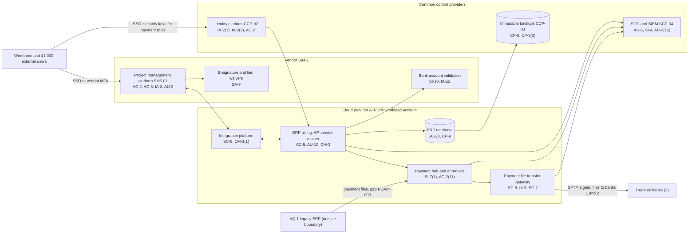

# System Security Plan: Project Delivery and Payment Platform (PDPP)

**Organization:** Cris Santos Company, Inc. (publicly traded commercial and institutional building general contractor) | **Tier:** Enterprise | **Vertical:** Construction
**Outline:** NIST SP 800-18 Rev. 2, System Security Plan Outline Example (June 2026) | **Version:** 2.0, 2026-09-14

## 1. System Name and Identifier
Project Delivery and Payment Platform (**PDPP**), identifier CSC-SYS-PDPP-001. Tier-1 system in the enterprise application inventory and the core of the enterprise FCI scope for CMMC Level 1.

## 2. System Overview
The PDPP is how the company runs projects and moves money. Project teams manage drawings, RFIs, submittals, daily logs, and pay app workflows in the project management platform. The ERP turns approved schedules of values into about 300 owner pay apps a month (about $400 million) and turns approved subcontractor invoices into about 10,500 ACH payments a month (about $300 million). The payment hub sends approved payment files to three treasury banks.

**Why payment integrity matters most.** The largest single-event loss the company faces is a diverted payment. In 2026 the company lost $157,000 net when a supplier bank change was accepted by email at AQ-1 (EV-2026-04). The PDPP's job is to make sure that money goes only to verified accounts, that no one person can change a payee and release a payment, and that the record of each change is complete and attributable.

**Major components:**
- Enterprise project management platform (SYS-01): vendor SaaS with about 9,200 workforce and 41,000 external users
- ERP project accounting, billing, accounts payable, and vendor master modules (SYS-02): commercial ERP, customer-managed on Cloud provider A virtual machines with a managed database
- Integration platform: connects SYS-01, the ERP, payroll, and the payment hub (Cloud provider A, managed containers)
- Treasury and payment hub (SYS-06): approval workflow, file hashing, and a payment file transfer gateway (virtual appliance cluster) to three banks
- Bank account validation service (SaaS) and e-signature and lien waiver service (SaaS)

**Users:** about 3,600 ERP users (project accountants, AP, billing, Payment Operations, Treasury, executives), about 9,200 workforce SYS-01 users, about 41,000 external SYS-01 users, and 38 named administrators.

## 3. Laws, Regulations, and Policies Affecting the System
| ID | Requirement | Citation | How it affects the PDPP |
|---|---|---|---|
| N23-R01 | FAR 52.204-21 | 48 CFR 52.204-21(b)(1)(i)-(xv) | The PDPP holds FCI (drawings, pay apps, certified payrolls for federal jobs); all 15 safeguarding requirements apply |
| N23-R04 | CMMC Program and DFARS 252.204-7021 | 32 CFR 170.15; 170.19(b); 252.204-7021(d) | The PDPP is in the enterprise Level 1 (Self) scope; status must stay current and be affirmed annually |
| N23-R03 | DFARS 252.204-7012 | 252.204-7012(b)(2), (c) | By design the PDPP holds no CUI. The 2026 finding of CUI on SYS-01 (P03 G-003) makes 72-hour incident reporting possible until the CUI is removed |
| N23-R02 | FAR 52.204-25 (Section 889) | 52.204-25(b)(2) | Equipment and services used by the PDPP are screened |
| FAR payment clauses | EFT and prompt payment | FAR 52.232-33(b), (e)(2); 52.232-27(c)(1) | Accuracy of the company's own SAM EFT record; 7-day payment to subcontractors on federal jobs |
| SEC | Cybersecurity disclosure | Form 8-K Item 1.05; 17 CFR 229.106 | A material PDPP incident goes through the P08 materiality step |
| SOX | Internal control over financial reporting | Sarbanes-Oxley Act Section 404 | ERP access, change, and payment controls are SOX IT general controls |
| State | State breach and data security laws | Each state where affected individuals reside (Florida worked example: Fla. Stat. 501.171) | Certified payroll attachments in SYS-01 and the ERP hold Social Security numbers |
| Contract | Owner contracts and subcontracts | Prime contract notice clauses; subcontract flowdowns | Owners require notice of compromised payment channels |
| Internal | POL-01 to POL-05 and standards | P06 | Enterprise policy hierarchy |

Not applicable to the PDPP: SP 800-171 Rev. 2 and CMMC Level 2 (they apply to the FPCE, which has its own SSP; see P03), HIPAA, and PCI DSS (`../00_company-facts.md` section 1).

## 4. System Status
### 4.1 System Security Plan Approval
Prepared by the Vice President, Project Controls and Systems and the GRC team. Reviewed by the CISO, the Vice President, Treasury, and the Director, CMMC Program Office. Approved by the Chief Operating Officer on 2026-09-14.
### 4.2 System Authorization Decision
The company is not a federal agency, so there is no formal ATO. The equivalent internal decision:
- **Authorizing official equivalent:** Chief Operating Officer, with the CISO's recommendation and the CFO's concurrence for the payment components.
- **Decision (2026-09-14):** continue operation with conditions, based on the Internal Audit assessment (P07) and the risk register (P01).
- **Conditions:** close the High POA&M items that affect payment integrity (POAM-002 and POAM-003 by 2026-11-30; POAM-006 by 2027-01-31); remove CUI from SYS-01 and block re-entry (POAM-019 by 2026-10-31); bring the AQ-1 mailboxes under SOC monitoring (POAM-004 by 2026-11-30).
- **Reauthorization:** annually, or after a major change (for example, the AQ-1 ERP migration planned for 2027-03).
### 4.3 System Operational Status
Operational. Planned major modifications: AQ-1 ERP migration into SYS-02 (2027-03-31), signed payment files for bank 3 (SI-7(1)), and device-bound payment approvals (AC-2(11)).

## 5. Role Identification and Responsible Personnel
| Role | Title | Responsibility |
|---|---|---|
| System owner | Vice President, Project Controls and Systems | Accountable for the PDPP; approves access roles for SYS-01 and the ERP |
| Authorizing official (equivalent) | Chief Operating Officer | Accepts residual risk to operate |
| Payment controls owner | Vice President, Treasury (with the Director of Payment Operations) | Payee verification, approvals, bank connectivity |
| System administrator | Director of ERP Applications | ERP and integration administration, change control |
| Information security | CISO; Director of Security Operations | Program oversight; SOC monitoring; incident response |
| CMMC scope | Director, CMMC Program Office | Level 1 scope and annual self-assessment |
| Common control providers | See section 10.3 | Operate inherited controls |
| Independent assessor | Chief Audit Executive (Internal Audit) | Annual assessment (P07) |

## 6. System Information Types and System Categorization
Information types come from NIST SP 800-60 Vol. 2 Rev. 1. Impact levels follow FIPS 199.

| Information type | Confidentiality | Integrity | Availability | Rationale |
|---|---|---|---|---|
| Payments and collections (vendor master, bank details, payment files, receipts) | Moderate | **Moderate (supplemented)** | Moderate | A changed bank account or altered payment file causes direct financial loss; positive pay, bank recalls, and insurance limit the harm, so integrity stays Moderate with supplements. Payments can be held for 2 to 3 days (P05 BP-03, BP-04) |
| Project delivery records (drawings, RFIs, submittals, daily logs) | Moderate | Moderate | Moderate | FCI and client confidential data; building from a wrong drawing is a quality and safety risk; P05 BP-01 RTO 8 h |
| Personnel and payroll attachments (certified payrolls) | Moderate | Moderate | Low | Social Security numbers trigger state breach duties |
| Information security (audit logs, approval records, credentials) | Moderate | Moderate | Moderate | Evidence for recalls, insurance claims, and SOX |
| **PDPP category** | **Moderate** | **Moderate, payment integrity supplemented** | **Moderate** | See the decision below |

**Categorization decision.** The PDPP uses the **SP 800-53B Moderate baseline**, tailored as follows (approved by the executive risk committee on 2026-09-10):
- It adds **5 High-baseline controls** that protect payment integrity: AC-2(11), AC-2(12), AU-10, CM-3(1), CP-9(3).
- The decision is reviewed annually. If the payment-integrity POA&M items (POAM-002, POAM-003, POAM-006) are not closed by 2027-06-30, the CISO will recommend High integrity for the payment components.

**Documented controls.** `control-implementation.csv` documents **140 controls**: 135 from the Moderate baseline and 5 High-baseline payment integrity supplements. The remaining Moderate-baseline controls and enhancements are fully inherited from the common control catalog (section 10.3) and are listed there rather than repeated here. CSF 2.0 subcategories come from the official CSF 2.0 to SP 800-53 Rev. 5.2.0 reference (`00_universal-framework/crosswalks/csf2_to_sp800-53r5.csv`); enhancements use their base control's mapping, and 16 controls have no mapped subcategory.

## 7. Authorization Boundary Description
**Inside the boundary:** the SYS-01 tenant configuration and its data, the ERP application and database in the PDPP workload account (Cloud provider A), the integration platform flows for the PDPP, the payment hub and payment file transfer gateway, and the PDPP configuration in the bank account validation and e-signature services.

**Outside the boundary (common control providers and interconnected systems):**
- Landing zone services (network hub, key management, log archive, backup accounts, standby region): CCP-03
- Identity platform (SYS-04): CCP-02
- SOC, SIEM, EDR, scanners: CCP-04
- Payroll (SYS-03), productivity suite (SYS-05), the three banks, owner and federal invoicing portals, the AQ-1 legacy ERP (which sends payment files into the hub), and the FPCE (SYS-10, separate SSP)

The enterprise multi-cloud diagram is in P04 `cloud-architecture.md`.

## 8. Information Exchanges Summary
| Connected system / party | Direction | Data | Agreement |
|---|---|---|---|
| Treasury banks 1 to 3 | Outbound payment files; inbound acknowledgments and positive pay | ACH and wire instructions | Bank connectivity agreements; **bank 3 files not signed (POAM-006)** |
| AQ-1 legacy ERP | Inbound payment files to the hub | AQ-1 subcontractor and supplier payments | Internal integration memo; **payees not verified by Payment Operations (POAM-003)** |
| Payroll (SYS-03) | Bidirectional | Certified payroll reports; labor cost | Interface specification |
| Owner portals and federal invoicing portals | Outbound | Pay apps and invoices | Owner contracts; federal contracts |
| Bank account validation service | Bidirectional (API) | Payee name, routing and account numbers | Service agreement; **no SOC report review (POAM-012)** |
| E-signature and lien waiver service | Bidirectional | Lien waivers, subcontracts | Service agreement; **no SOC report review (POAM-012)** |
| Productivity suite (SYS-05) | Notifications | Approval notices (no bank details by policy) | Internal |
| FPCE (SYS-10) | None by design | CUI must not enter the PDPP | CUI handling procedure; **CUI found on SYS-01 (POAM-019)** |

## 9. System Component Inventory
| Component | Type | Location / provider | Owner |
|---|---|---|---|
| Project management platform tenant | SaaS | Vendor (commercial cloud) | Vice President, Project Controls and Systems |
| ERP application servers (6) | IaaS virtual machines | Cloud provider A, primary region; warm standby in second region | Director of ERP Applications |
| ERP database | Managed relational database (PaaS) | Cloud provider A | Director of ERP Applications |
| Integration platform | Managed containers | Cloud provider A | Director of ERP Applications |
| Payment hub | Application on managed containers | Cloud provider A | Vice President, Treasury |
| Payment file transfer gateway (2-node cluster) | Virtual appliance | Cloud provider A, dedicated subnet | Vice President, Treasury |
| Bank account validation service | SaaS | Vendor | Director of Payment Operations |
| E-signature and lien waiver service | SaaS | Vendor | Vice President, Project Controls and Systems |

## 10. Control Implementation Details
### 10.1 Control implementation status
See `control-implementation.csv` (140 controls).

| Status | Count |
|---|---|
| Implemented | 113 |
| Partially implemented | 25 |
| Planned | 2 |
| **Total** | **140** |

| Inheritance | Count |
|---|---|
| Common (fully inherited from a common control provider) | 100 |
| Hybrid (shared between a provider and the PDPP team) | 17 |
| System-specific | 23 |

The Planned controls are High-baseline payment integrity supplements: AC-2(11) and CM-3(1). Partially implemented controls: AC-2, AC-2(3), AC-2(12), AC-5, AT-3, AU-2, AU-6, AU-10, CM-3, CM-8, CP-4, CP-10, IA-2(2), IA-5, IR-4, IR-8, PS-4, RA-5, SA-9, SC-7, SC-8, SI-4, SI-7, SI-7(1), SI-10.

### 10.2 Control assessment status
Internal Audit assessed 44 of these controls from 2026-07-13 to 2026-08-28 using SP 800-53A Rev. 5 procedures and statistical sampling (P07 `assessment-plan.md`, `assessment-results.csv`). Weaknesses are in P07 `poam.csv`.

### 10.3 Common control providers and inheritance
Common and hybrid controls are inherited from the enterprise platform. Each provider publishes its controls in the enterprise **common control catalog** (maintained by the GRC team in the GRC platform) and is assessed on its own cycle; the PDPP inherits the results.

| Provider | Name | Accountable role | Controls provided | Rows in this plan | Evidence of operation |
|---|---|---|---|---|---|
| CCP-01 | Enterprise GRC program | CISO (with the Chief Risk Officer and Chief Audit Executive for assessment) | Policies and standards (P06), risk methodology, assessment, POA&M, continuous monitoring, records | 23 | Annual Internal Audit assessment (P07); GRC platform |
| CCP-02 | Identity platform (SYS-04) | Director of Identity and Access Management | SSO, MFA, PAM, identity governance, account lifecycle, session controls | 23 | SOX IT general control testing; P07 AC-2, IA-2 results |
| CCP-03 | Cloud landing zone (Cloud provider A) | Director of Cloud Platform Engineering | Account guardrails, network policies, key management, encryption, backups, log archive, standby region | 19 | Posture management reports; provider SOC 2 Type 2 |
| CCP-04 | Security operations | Director of Security Operations | 24x7 SOC, SIEM, BEC use cases, EDR, vulnerability management, incident response, threat intelligence | 20 | SOC metrics; P07 SI-4, RA-5, IR results |
| CCP-05 | Enterprise network (SYS-08) | Director of Network Engineering | Zero-trust access, segmentation, wireless, remote access encryption | 4 | Network configuration reviews |
| CCP-06 | Endpoint engineering (SYS-09) | Director of Endpoint Engineering | Device baselines, EDR agents, patching, inventory, sanitization | 9 | Configuration compliance and patch reports |
| CCP-07 | Facilities and physical security; colocation providers | Vice President, Corporate Facilities and Security | Office and colocation physical access | 2 | Badge reviews; colocation SOC 2 reports |
| CCP-08 | Human resources and workforce training | Chief Human Resources Officer | Screening, terminations, sanctions, training, acknowledgments | 10 | HR and learning system reports |
| CCP-09 | Third-party risk management | Director of Third-Party Risk Management | Vendor tiering, contract terms, SOC report reviews, supply chain and Section 889 screening | 7 | Vendor register; SOC report reviews |

**Inheritance rules:**
- A Common control is fully inherited; the PDPP team verifies only that the PDPP is onboarded (for example, SSO integration and log forwarding).
- A Hybrid control names both parts in the implementation statement: the provider's part and the PDPP team's part.
- If a provider's assessment finds a weakness, the finding is linked to every inheriting system's POA&M. Example: POAM-004 (AQ-1 mailboxes outside the SIEM) is a CCP-04 weakness that affects the PDPP because AQ-1 staff request payee changes by email.

## 11. Digital Identity Acceptance Statement
- **Workforce payment roles (Treasury, Payment Operations, AP, executives) and administrators:** SSO with FIDO2 security keys; administrators through PAM. This is comparable to NIST SP 800-63 AAL3-like protection.
- **Other workforce users:** SSO with number-matching push MFA, comparable to AAL2. Project management staff move to phishing-resistant authenticators by 2027-03-31 (POAM-017), because adversary-in-the-middle phishing is the main BEC entry path (P01 R-002).
- **External SYS-01 users:** vendor accounts tied to company email addresses, MFA enforced by the platform. Their identity is vouched for by the subcontract or design contract. External users never reach the ERP or payment hub.

## 12. Referenced Artifacts
Scenario facts (`../00_company-facts.md`), BIA (P05), multi-cloud architecture and control map (P04), enterprise risk register (P01), regulatory gap analysis (P03), policy hierarchy and policies (P06), Internal Audit assessment and POA&M (P07), BEC runbook (P08), SOC 2 readiness (P09), AI portfolio (P10), PDPP contingency plan v3, bank connectivity agreements, FPCE SSP (separate, CMMC Level 2), enterprise common control catalog.

## 13. Acronym List and Glossary
- **ACH:** Automated Clearing House
- **BEC:** business email compromise
- **CCP:** common control provider
- **FCI:** Federal Contract Information (48 CFR 52.204-21(a))
- **FPCE:** Federal Programs CUI Enclave
- **Pay app:** monthly progress payment application with a schedule of values
- **PAM:** privileged access management
- **Positive pay:** bank service that matches presented checks and payments to issued items
- **POA&M:** plan of action and milestones
- **SAM:** System for Award Management (holds the company's federal EFT details)

## 14. System Security Plan Review and Change Records
| Version | Date | Change | Author |
|---|---|---|---|
| 1.0 | 2025-09-19 | Initial plan (Moderate baseline) | Vice President, Project Controls and Systems |
| 1.1 | 2026-01-23 | Added the enterprise FCI scope description for the Level 1 self-assessment | Director, CMMC Program Office |
| 2.0 | 2026-09-14 | Payment integrity supplements; AQ-1 payment file interface; common control provider mapping; 2026 assessment results | Vice President, Project Controls and Systems with GRC team |
