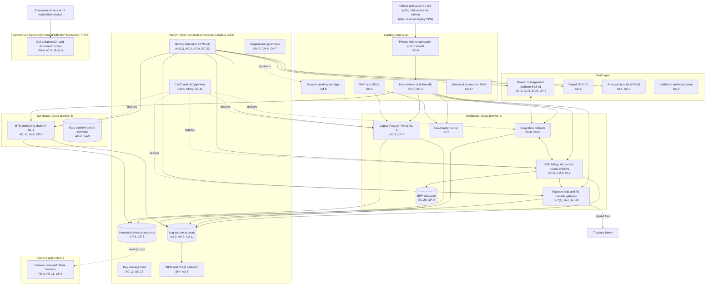

# Cloud Architecture and Control Placement: Cris Santos Company | Construction | Enterprise

**Organization:** Cris Santos Company, Inc. (publicly traded commercial and institutional building general contractor) | **Tier:** Enterprise | **Provider:** Multi-cloud, vendor-agnostic: two public cloud providers (called Cloud provider A and Cloud provider B), a FedRAMP Moderate government community cloud offering for CUI, two colocation data centers, and SaaS (see section 4)
**Owner:** Director of Cloud Platform Engineering, with the CISO | **Date:** 2026-08-31 | **Related:** PDPP SSP (P02), enterprise BIA (P05)

## 1. Architecture in layers
The estate is organized in layers. Each lower layer provides **common controls** that the layers above inherit, so a workload team configures only what is specific to its system.

| Layer | What it is | Examples | Who runs it |
|---|---|---|---|
| **Platform** | Organization-wide services in both public clouds | Organization guardrails, identity federation, key management, log archive, SIEM feeds, vulnerability and posture management, immutable backup accounts, CI/CD pipelines | Cloud Platform Engineering; Security Operations; Identity team |
| **Landing zone** | The standard account (subscription or project) pattern every workload lands in | Account vending with mandatory tags, hub-and-spoke network with cloud firewalls, private connectivity to colocation and SD-WAN, WAF and DDoS protection, private DNS and egress filtering, zero-trust and PAM access | Cloud Platform Engineering; Network Engineering |
| **Workload** | Systems the company builds or runs | Cloud A: ERP and payment hub (PDPP), integration platform, estimating database, BIM virtual desktops, file-transfer portal, Capital Program Portal (SL-2). Cloud B: BTS monitoring platform (SL-1), data platform, AI services | Application teams (for example, the Director of ERP Applications) |
| **SaaS** | Vendor-operated applications | Project management platform, payroll, productivity suite, bank account validation, e-signature, AI bid assistant, and the FPCE government community cloud tenant | Vendors, with the company's configuration and oversight |
| **Colocation** | COLO-1 (Florida) and COLO-2 (Texas) | Network core, offline copy of immutable backups | Colocation providers; Network Engineering |

**The CUI enclave is deliberately separate.** The FPCE (SYS-10) runs in a government community cloud offering authorized at FedRAMP Moderate, with its own identities and no federation or network path to the commercial clouds. 32 CFR 170.16(c)(2) allows a cloud offering for CUI only at FedRAMP Moderate or equivalent, and DFARS 252.204-7012(b)(2)(ii)(D) requires equivalent security for any external cloud holding covered defense information. Neither public cloud landing zone nor the commercial project management platform is approved for CUI.

## 2. Diagram

## 3. Responsibility by service model
Sources: SRC-AWS-SRM, SRC-AZURE-SRM, and SRC-GCP-SRM in `00_universal-framework/sources/source-register.csv`. The three published models agree on the split used here, so the design does not depend on which two providers the company uses.

| Service model | Provider | Company (customer) | Shared |
|---|---|---|---|
| IaaS (ERP servers, payment gateway, virtual desktops) | Facilities, hosts, hypervisor, physical network | Guest OS, applications, identities, data, network policy | Encryption (provider service, customer keys), logging |
| PaaS (ERP database, containers, data platform, AI services) | Also the platform runtime and its patching | Data, access, configuration, keys, application code | Backups, availability configuration |
| SaaS (project management, payroll, productivity, FPCE tenant) | Also the application | Users, roles, sharing settings, data, oversight of the vendor | Audit review; customer responsibility matrix for the FedRAMP offering |
| Colocation | Building, power, cooling, perimeter | Racks, equipment, cage access lists | None |

## 4. Service categories and provider equivalents
| Service category | AWS | Microsoft Azure | Google Cloud |
|---|---|---|---|
| Organization guardrails | AWS Organizations service control policies | Azure Policy with management groups | Organization Policy Service |
| Account vending | AWS Control Tower account factory | Azure landing zone subscription vending | Resource Manager project creation |
| Key management | AWS KMS | Azure Key Vault | Cloud KMS |
| Audit logging | AWS CloudTrail | Azure Monitor activity log | Cloud Audit Logs |
| Threat detection | Amazon GuardDuty | Microsoft Defender for Cloud | Security Command Center |
| Managed relational database | Amazon RDS | Azure SQL Database | Cloud SQL |
| Managed containers | Amazon EKS | Azure Kubernetes Service | Google Kubernetes Engine |
| Web application firewall | AWS WAF | Azure Web Application Firewall | Cloud Armor |
| Backup service | AWS Backup | Azure Backup | Backup and DR Service |
| US government cloud environments | AWS GovCloud (US) | Azure Government | Assured Workloads (US regulated controls) |

This table is for reading provider documentation only. The architecture, control map, and SSP describe service categories. The FPCE's FedRAMP authorization is checked on the FedRAMP Marketplace for the specific offering, not inferred from the provider's name.

## 5. Common controls
`cloud-control-map.csv` has **63 rows** across 32 components: Platform 21, Landing zone 7, Workload 20, SaaS 12, Colocation 3. Responsibility: Customer 47, Shared 13, Provider 3.

**29 rows are published as common controls** (`common_control` = Yes) in the enterprise common control catalog. They map to the common control providers in the PDPP SSP (P02 section 10.3): identity (CCP-02), landing zone (CCP-03), security operations (CCP-04), network (CCP-05), and colocation (CCP-07). A workload inherits them by being deployed through account vending, which applies the guardrails, logging, network, key, and backup policies automatically.

**Rules for inheriting:**
1. A workload may claim a common control only if its account was created by account vending and passes the posture baseline.
2. Customer-side identity, data protection, and logging stay explicit at every layer: even a SaaS application has Customer rows for access (AC-2, AC-3) and monitoring (AU-6, SI-4) because those are always the company's responsibility.
3. SaaS rows cite the vendor's SOC 2 report, reviewed by the third-party risk team (P09 evidence map). The FPCE row cites the FedRAMP package and the provider's customer responsibility matrix, which the FPCE SSP must document (32 CFR 170.16(c)(2)(iii)).
4. Nothing in the commercial platform layer is inherited by the FPCE. The enclave has its own identities, logging, and keys.

## 6. Validation against the PDPP SSP (P02)
Every PDPP component in the SSP boundary appears here with controls from each required family, directly or inherited:
| PDPP component | AC | AU | CM | IA | SC | SI |
|---|---|---|---|---|---|---|
| ERP application servers | AC-5 | AU-2, AU-9 (inherited) | CM-6, CM-2 (inherited) | IA-2(1) (inherited) | SC-7 (inherited) | SI-2, SI-4 (inherited) |
| ERP database | AC-6 (inherited) | AU-2 (inherited) | CM-6 (inherited) | IA-2(1) (inherited) | SC-28 | SI-2 (shared) |
| Integration platform | AC-4 (inherited) | AU-2 (inherited) | CM-3 (inherited) | IA-2(1) (inherited) | SC-8 | SI-10 |
| Payment hub and gateway | AC-17 (inherited) | AU-10 | CM-5 (inherited) | IA-5 | SC-7 (inherited) | SI-7(1) |
| Project management platform | AC-2 | AU-6 | CM-6 (tenant baseline in P02) | IA-2(1) (inherited for workforce) | SC-7 (vendor) | SI-4 (inherited) |

## 7. Findings from the mapping
1. **Payment file integrity is a workload responsibility.** No platform service signs payment files; the payment hub must hash and verify them. Bank 3 is not covered yet (POAM-006).
2. **AQ-1 connectivity.** Three AQ-1 VPN subnets reach the integration platform directly, bypassing SD-WAN segmentation (P07 SC-7; POAM-016). The AQ-1 email tenant and ERP are outside the SIEM (POAM-004).
3. **The commercial project management platform cannot hold CUI.** It is not FedRAMP authorized. CUI was found there on 2 DoD projects (P03 G-003). The fix is procedural and technical: upload scanning for CUI markings, blocked sharing to unverified domains for federal projects, and a direct route for design firms to the FPCE exchange gateway (POAM-019).
4. **SaaS audit logs.** The project management platform keeps download and permission events for 90 days and does not stream them to the SIEM, so a bulk drawing download would not be detected (POAM-018).
5. **Two clouds, one control set.** Guardrails, logging, and key policies are written once as code and applied to both clouds. Differences are limited to service names (section 4).
6. **AI services** run under enterprise terms with no training on customer data; the AI governance committee reviews each new model deployment (P10). The AI bid assistant is SaaS and gets FCI only after its enterprise terms are signed.
