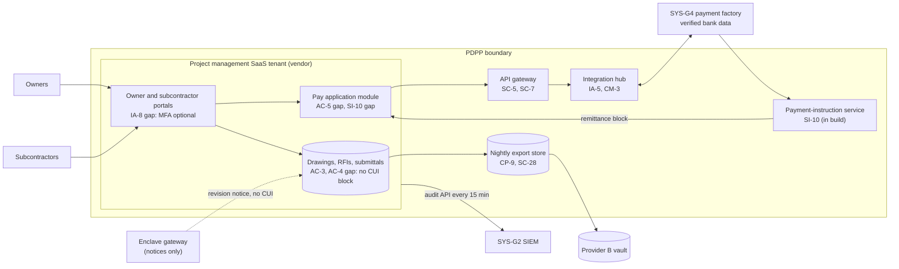

# Cloud Architecture and Control Placement: Cris Santos Company Holdings | Construction | Multi-Sector

**Organization:** Cris Santos Company Holdings, Inc. | **Tier:** Multi-Sector | **Providers:** two commercial public cloud providers, called provider A and provider B, plus a separate FedRAMP Moderate authorized government-community cloud offering for CUI (vendor-agnostic; see section 6)
**Scope:** the shared corporate cloud platform (SYS-G3 landing zone), the Project Delivery and Payment Platform (the P02 SSP system), the CUI enclave (SYS-G6), and the division workloads that run on or beside them.

## 1. Design in one paragraph
Corporate runs one commercial **landing zone** on provider A: identity federation from SYS-G1, a hub network, guardrail policies, a central log archive, key management, and EDR, with the disaster recovery copy and an immutable backup vault on provider B. Each division gets its own **accounts** (subscriptions or projects) inside the landing zone and inherits these guardrails. The **PDPP** combines a commercial project management SaaS tenant with integration and payment-instruction services in a PDPP account on provider A. **CUI never belongs in the landing zone.** It lives in the **CUI enclave**, a separate government-community cloud offering at the FedRAMP Moderate baseline, with its own identities, virtual desktops, email, files, and a CUI file-transfer gateway, as DFARS 252.204-7012(b)(2)(ii)(D) and 32 CFR 170.16(c)(2) require for cloud services that hold CUI. Division workloads include the TSSI remote access platform and credential vault (Construction), the BAS supervisory servers and property SaaS (Property), and the digital twin service and rendering compute (A&E).

## 2. Diagrams
### 2.1 Group landing zone, the enclave, and division workloads

```mermaid
flowchart TB
  subgraph Common["Common controls (corporate; inherited by all divisions)"]
    IDP["Group identity platform SYS-G1<br/>IA-2(1), AC-2, AC-6(5)"]
    IAM["Cloud IAM, providers A and B<br/>AC-3"]
    HUB["Landing-zone hub network<br/>SC-7, SC-7(5), SC-8"]
    GRD["Guardrail policy service<br/>CM-6, CM-7"]
    LOG[("Central log archive<br/>AU-9, AU-11")]
    SOC["Group SIEM and SOC SYS-G2<br/>SI-4, AU-6"]
    EDR["Workload protection (EDR)<br/>SI-3"]
    KMS["Key management<br/>SC-12, SC-28(1)"]
    BK[("Immutable backup vault, provider B<br/>CP-9, CP-6")]
    MAIL["Email security SYS-G5<br/>SI-8"]
    DC["Provider data centers<br/>PE-3 (inherited)"]
  end
  subgraph PDPPB["PDPP (see 2.2)"]
    PM["Project management SaaS tenant"]
    INT["Integration and payment-instruction services"]
  end
  ERP["SYS-G4 ERP and payment factory (SaaS)<br/>AC-5, SI-7, SI-10"]
  BANK["Banks (host-to-host file transfer)"]
  subgraph CON["Construction accounts and SaaS"]
    TSSI["TSSI remote access platform<br/>MA-4, AU-12"]
    VAULT[("TSSI credential vault<br/>SC-28")]
    AIE["AI estimating assistant SYS-D6<br/>SA-9, AC-20"]
    TAB["Field tablets (MDM)<br/>AC-19"]
  end
  CLIENT["Client video, access control, BAS<br/>(client-owned)"]
  subgraph PRP["Property accounts and SaaS"]
    BAS["BAS supervisory servers<br/>SC-7, MA-4, SI-4 (gap)"]
    PMS["Property management SaaS SYS-D3<br/>IA-2, AC-5 (gap)"]
  end
  BLDG["Building networks at 41 properties<br/>flat: BAS, access, video, pay stations"]
  PARK["Parking technology service provider<br/>SA-9 (PCI DSS 12.8)"]
  subgraph AE["A&E accounts and SaaS"]
    DT["Digital twin service<br/>AC-3, CP-9"]
    REN["Rendering compute<br/>SI-2"]
    DCS["Design collaboration SaaS<br/>commercial only"]
  end
  subgraph ENC["CUI enclave SYS-G6 (government-community cloud, FedRAMP Moderate)"]
    EID["Enclave identities<br/>IA-2(1), AC-2"]
    VDI["Virtual desktops with BIM/CAD<br/>AC-4, CM-7(5)"]
    EFS[("Enclave email and files<br/>SC-28")]
    GW["CUI file-transfer gateway<br/>SC-13"]
  end
  IDP --> IAM
  IAM --> PDPPB
  IAM --> CON
  IAM --> PRP
  IAM --> AE
  HUB --> INT
  HUB --> BAS
  HUB --> DT
  INT <-->|hourly; verified remittance data| ERP
  ERP -->|signed payment files| BANK
  TSSI -->|recorded sessions| CLIENT
  BAS -->|site VPN| BLDG
  BLDG --> PARK
  EID --> VDI
  VDI --> EFS
  EFS --> GW
  VDI -.->|"field release export (gap 1)"| PM
  PDPPB --> LOG
  CON --> LOG
  AE --> LOG
  LOG --> SOC
  ENC -.->|separate SIEM workspace, SOC analysts| SOC
  PDPPB --> BK
  AE --> BK
  GRD -.-> CON
  GRD -.-> PRP
  GRD -.-> AE
  KMS -.-> VAULT
  KMS -.-> DT
  EDR -.-> REN
  EDR -.-> BAS
  MAIL -.-> PM
  DC -.-> HUB
```

### 2.2 Project Delivery and Payment Platform (SSP boundary)

**Target state (POAM-006, POAM-009, POAM-011; due 2026-11-30 to 2026-12-31):** the integration hub scans every upload for CUI markings and quarantines matches; the enclave "field release" export is removed and superintendents view CUI drawings in enclave virtual desktops from jobsite trailers; the remittance block is generated only by the payment-instruction service from bank data already verified in SYS-G4, and project accountants can no longer type it; remittance edits and bulk downloads stream to the SIEM.

## 3. Tenancy and identity decision
**Decision.** The three divisions share the group identity platform (SYS-G1). Each division gets its own accounts inside the commercial SYS-G3 landing zone, with cloud roles federated from SYS-G1. The CUI enclave (SYS-G6) is the one separate tenant. It runs on a government-community cloud offering at the FedRAMP Moderate baseline, with its own identities, desktops, email, and files, and it serves Construction and A&E. It inherits only governance, HR, and SOC monitoring from the group.

**Reason.** CUI in an external cloud must meet FedRAMP Moderate equivalency under DFARS 252.204-7012(b)(2)(ii)(D) and 32 CFR 170.16(c)(2), so CUI never belongs in the commercial landing zone. SYS-G1 and the landing zone network sit outside the enclave's authorized boundary, so the enclave cannot inherit them. Everything else shares SYS-G1 so that common controls are assessed once.

**What limits blast radius.** Enclave users have separate identities with phishing-resistant MFA, sponsored per DoD project and reviewed quarterly. The enclave gateway sends only one-way notices to the PDPP. In the landing zone, administrators use just-in-time PAM with session recording, break-glass roles are sealed, and there are no long-lived cloud user keys. Backups sit in provider B with a separate backup identity.

**Known gaps.** The enclave "field release" export lets CUI reach the PDPP (POAM-006, POAM-011). 11 BAS integrators keep remote access outside group PAM (POAM-023). PDPP-local external accounts are outside SYS-G1 (POAM-001).

Cross-division risks: GR-05 (ransomware spreads through shared services), GR-19 (identity platform outage stops all divisions), GR-01 (CUI outside the enclave).

## 4. Common versus division-specific controls
`cloud-control-map.csv` has 55 rows across 31 components. The `control_scope` column shows who owns each placement:

| Scope | Rows | What it means |
|---|---|---|
| Common (group) | 20 | Provided once by corporate (SYS-G1, SYS-G2, SYS-G3, SYS-G5) and inherited by every division account. Listed in the P02 common control catalog |
| Shared system (PDPP) | 11 | Controls of the shared corporate system documented in the P02 SSP |
| CUI enclave (group, for Construction and A&E) | 8 | Controls inside the FedRAMP Moderate authorized enclave; documented in the enclave SSP and assessed for CMMC Level 2 |
| Division-specific (Construction) | 6 | TSSI remote access and credential vault, field devices, AI estimating assistant |
| Division-specific (Property) | 6 | Property SaaS, BAS supervisory servers, parking payment provider |
| Division-specific (A&E) | 4 | Digital twin service, design collaboration SaaS, rendering compute |

| Responsibility | Rows |
|---|---|
| Customer (the group or a division) | 40 |
| Shared (provider and group) | 13 |
| Provider | 2 |

**Rule of thumb.** Identity, network guardrails, logging, keys, backups, EDR, and email security are **common**. A division cannot opt out of them, only request an exception through POL-01. Application behavior, data access within the application, and customer-facing identity are **division-specific**, because they depend on each division's regulators and customers. CUI controls are **enclave-specific**: the enclave does not inherit the commercial landing zone's identity or network controls, because those sit outside its authorized boundary.

## 5. Layers
| Layer | Common components | Division and enclave components | Key controls | Responsibility |
|---|---|---|---|---|
| Identity | SYS-G1, cloud IAM | Enclave identities; PDPP external users; property SaaS SSO; TSSI remote access | AC-2, AC-3, AC-6(5), IA-2, IA-2(1), IA-8, MA-4 | Customer (configuration); vendor (service) |
| Network | Hub network, guardrails | API gateway; BAS site VPNs; enclave gateway | SC-7, SC-7(5), SC-8, SC-5, SC-13 | Customer, with provider DDoS protection shared |
| Compute | EDR on all workloads | Integration hub, BAS servers, rendering compute, enclave desktops | SI-2, SI-3, CM-3, CM-6, CM-7, CM-7(5), AC-4, AC-19 | Customer (guest OS, containers, code, desktop policy) |
| Data | Keys, backup vault | PDPP export, payment-instruction service, credential vault, digital twin tenants, enclave files | SC-12, SC-28, SC-28(1), CP-6, CP-9, SI-10, AC-5 | Shared: providers encrypt; the group owns keys, data placement, and payment data integrity |
| Logging and monitoring | Log archive, SIEM | PDPP audit API; TSSI session logs; enclave SIEM workspace | AU-6, AU-9, AU-11, AU-12, SI-4 | Shared: providers generate platform logs; the group retains and reviews |
| SaaS dependencies | Identity, SIEM, email vendors | PM SaaS, AI estimating, parking provider, design collaboration | SA-9, AC-20 | Provider for the service; customer for use and oversight |
| Physical | Provider data centers | Enclave provider data centers | PE-3 | Provider (inherited) |

Jobsite trailers, offices, and building equipment rooms are physical locations the group controls. They are covered by P03 (FAR 52.204-21(b)(1)(viii)-(ix); NIST SP 800-171 R2 3.10.x) and P07, not by this cloud map.

## 6. Service categories and provider equivalents
The design does not depend on a provider. This table gives each provider's name for each service category, for reading its shared responsibility documentation.

| Service category | AWS | Microsoft Azure | Google Cloud |
|---|---|---|---|
| Account structure and guardrails | AWS Organizations with service control policies | Management groups with Azure Policy | Resource hierarchy with Organization Policy |
| Managed containers and functions (integration hub) | Amazon EKS; AWS Lambda | Azure Kubernetes Service; Azure Functions | Google Kubernetes Engine; Cloud Run functions |
| API gateway | Amazon API Gateway | Azure API Management | Apigee / API Gateway |
| Object storage (export store, digital twin) | Amazon S3 | Azure Blob Storage | Cloud Storage |
| Key management | AWS KMS | Azure Key Vault | Cloud KMS |
| Audit logging | AWS CloudTrail | Azure Monitor activity log | Cloud Audit Logs |
| Backup with immutability | AWS Backup (vault lock) | Azure Backup (immutable vault) | Backup and DR Service |
| Government-community cloud region for CUI | AWS GovCloud (US) | Azure Government | Assured Workloads |

Shared responsibility sources: SRC-AWS-SRM, SRC-AZURE-SRM, SRC-GCP-SRM in `00_universal-framework/sources/source-register.csv`. All three agree on the split used here: for IaaS the provider owns facilities, hosts, and virtualization; for PaaS the provider also owns the runtime; for SaaS the provider owns the application. The customer always keeps identities, access decisions, data classification, and data. Whether a particular government-community service is FedRAMP Moderate authorized is checked on the FedRAMP Marketplace for the exact service offering before CUI is placed in it (32 CFR 170.16(c)(2)(i)); the group does not assume it from the region name.

## 7. Findings from the mapping
1. **The boundary between the enclave and the PDPP is a process, not a control.** The enclave is sound on paper (FedRAMP Moderate, separate identities, encryption). The weak point is the "field release" export that lets users carry CUI drawings out to the commercial PDPP, where nothing detects them (AC-4; P01 GR-01; POAM-006 and POAM-011).
2. **Payment integrity depends on a free-text field.** The payment factory's bank-change controls are strong (AC-5, SI-10, SI-7 in SYS-G4). The PDPP remittance block bypasses them because a project accountant can type any bank details onto a pay application cover sheet (P01 GR-02; POAM-009).
3. **Property building systems are inside the landing zone but outside the SOC.** The BAS supervisory servers sit in a Property account and inherit guardrails, but site VPNs reach flat building networks, integrators connect around group PAM, and nothing is in the SIEM (SC-7, MA-4, SI-4; POAM-003, POAM-022, POAM-023).
4. **Common controls are strong and reused.** One identity platform, one SIEM, one backup design, and one email security stack. This is what lets group internal audit assess them once (P07). The weak links are documentation of inheritance for Property (POAM-021) and PDPP-local external accounts outside SYS-G1 (POAM-001).
5. **SaaS vendors carry much of the load.** The PDPP, the AI estimating assistant, the parking provider, and the design collaboration service are all SaaS. Their assurance (SOC 2 reports, an attestation of compliance for the parking provider) is only as good as the group's mapping of complementary user entity controls, which is incomplete for the PDPP and missing for the AI estimating vendor (SA-9; POAM-019).
