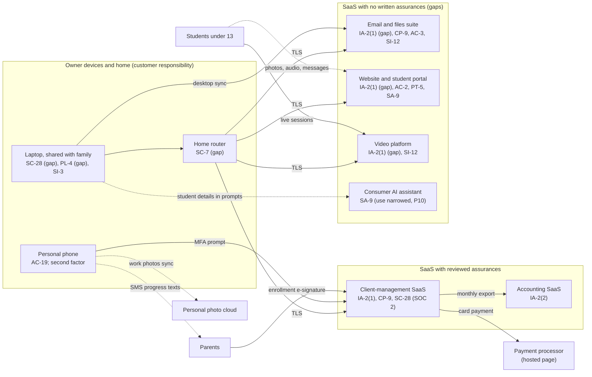

# SaaS Architecture and Control Placement: Cris Santos Company | Educational Services | Sole Proprietorship

**Organization:** Cris Santos Company (tutoring and educational support service) | **Tier:** Sole Proprietorship | **Provider:** SaaS only (no IaaS or PaaS)
**System:** Core Business SaaS Stack (CBSS), as defined in the system profile (P02) | **Mapped:** 2026-07-15 by the owner-tutor with the on-call IT technician

## 1. Diagram
Control IDs on each node are the ones in `cloud-control-map.csv`. Dashed lines are flows with no written security assurances or no informed parent consent.

## 2. Layers
| Layer | Components | Key controls | Responsibility |
|---|---|---|---|
| Identity | Accounts in SYS-01 to SYS-04 and SYS-08; student portal members; laptop user accounts | IA-2(1), IA-2(2), AC-2, PL-4 | Customer configures; vendors provide MFA |
| Data | Student folders, portal content, recordings, client records, prompts | CP-9, AC-3, SI-12, SA-9, PT-5 | Vendors protect data inside their services; the owner decides what is collected, who it is shared with, how long it is kept, and what the vendor may do with it |
| Endpoints | Laptop, phone | SC-28, SI-3, AC-19 | Customer |
| Network | Home router and network; library Wi-Fi and phone hotspot away from home | SC-7 | Customer (the internet service provider supplies the router) |
| Logging | Sign-in histories in each SaaS | AU-6 (planned, P02) | Shared: vendors record, the owner reviews |
| SaaS applications and hosting | All vendor platforms | Inherited (AC-3 role separation, SC-28 and CP-9 at the client-management SaaS) | Provider |

## 3. Shared responsibility for SaaS
All three major cloud providers' shared responsibility models (SRC-AWS-SRM, SRC-AZURE-SRM, SRC-GCP-SRM) agree on the SaaS split: the provider runs the application, the platform, and the facilities; **the customer always keeps its identities and accounts, its data, and its devices.** That is why 15 of the 20 rows in the control map are the owner's alone, 3 are shared, and only 2 rest on the provider. A vendor's SOC 2 report never covers these customer layers. No IaaS provider equivalents table is needed, because the business runs no infrastructure.

COPPA puts one more duty on the customer side that the SaaS model cannot shift: before a vendor collects or keeps children's personal information for the business, the owner must check that the vendor can protect it and **obtain written assurances** that it will (16 CFR 312.8(c)). Today only the client-management SaaS vendor meets that test.

## 4. Findings from the mapping
1. **MFA is off where it is free to turn on** (email and files suite, website-builder administrator, video platform). These three hold almost all of the children's information. Tracked as P01 R-002 and R-003.
2. **Two sharing and tracking settings were found during this mapping:** 12 student folders shared by "anyone with the link" links, and the builder's site-wide visitor analytics running on portal pages. Both are fixed by 2026-08-14 (P03 G-014, P01 R-005).
3. **Retention is a setting, not a project.** The video platform can delete recordings automatically, and the builder can close member accounts. Neither was used (P01 R-007, R-010).
4. **Cloud sync is not a backup.** Desktop sync gives the laptop and cloud storage the same files, so ransomware on the laptop reaches the cloud copy. Version history (30 days) is the only fallback (P01 R-001).
5. **The phone and laptop are inside the boundary.** The laptop is shared with family and unencrypted; the phone holds second factors and syncs work photos to a personal cloud (P01 R-004, R-008, R-011).
