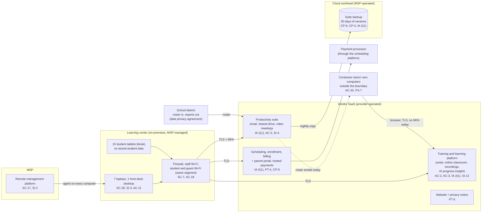

# Cloud Architecture and Control Placement: Cris Santos Company | Educational Services | Micro

**Organization:** Cris Santos Company, LLC (K-12 tutoring and learning center) | **Tier:** Micro | **Provider:** Vendor-agnostic SaaS (see section 3)
**System:** Tutoring Operations Platform (TOP), as defined in the SSP (P02) | **Prepared:** 2026-07-24 by the Center Director with the MSP lead technician | **Approved:** Owner, 2026-08-28

## 1. Diagram
The company runs no servers and no IaaS tenant. Its "cloud" is a set of SaaS services plus one cloud workload that the MSP operates for it: the SaaS-to-SaaS backup of suite email and the shared drive (SYS-06).

## 2. Layers and who is responsible
| Layer | Components | Key controls | Customer (company) | MSP (on the company's behalf) | Provider (SaaS vendor) |
|---|---|---|---|---|---|
| Identity | Platform, scheduling, suite, backup, website, and firewall logins | AC-2, IA-2(1), IA-5 | Decides who gets access; turns on MFA in the platform and scheduling tools; removes contractor tutors | Creates and disables suite and device accounts; holds the backup and firewall admin logins | Runs the sign-in and MFA services |
| Network | Firewall, Wi-Fi, internet line | SC-7, AC-18 | Approves changes; decides on segmentation | Configures, patches, and monitors | Not applicable |
| Endpoints | 7 laptops, front-desk desktop, 10 tablets | SC-28, SI-2, SI-3, AC-11 | Approves exceptions; keeps the inventory | Encryption, patching, antivirus, screen lock, kiosk mode | Not applicable |
| External endpoints | Contractor tutors' computers | AC-20, PS-7 | Sets device rules and collects attestations; stops roster emails | None (not managed) | Not applicable |
| SaaS applications | Platform, scheduling, suite, website | AC-3, AC-6, PT-4, PT-5 | Roles, sharing settings, notices, consent flow, retention settings | Suite administration on request | Application, platform, data centers |
| Data | Platform records and recordings, shared drive, backup copies, consent records | CP-9, CP-4, SC-28, SI-12 | Decides retention; requests exports and restore tests | Operates the backup and runs restore tests | Encrypts and backs up its own platform |
| Logging | Platform audit log, suite logs, firewall logs | AU-2, AU-6, SI-4 | **Reviews logs monthly (gap today)** | Keeps firewall logs; forwards alerts | Generates and stores logs |
| Vendor governance | Contracts, SOC 2 review, MSP review | SA-9 | Gets written security assurances (312.8(c)); reviews the platform SOC 2 report and MSP evidence | Names its own subcontractors (backup vendor) | Provides SOC 2 reports and data processing terms |

**The MSP is not a cloud provider in the shared responsibility sense.** It performs customer-side duties for the company. Anything marked "Customer (performed by MSP)" in `cloud-control-map.csv` remains the company's responsibility under the COPPA Rule's security program (312.8(b)) and the district contract. The company must direct the work, receive evidence, and check it (SA-9).

**The contractor tutors are the gap no provider covers.** Their computers handle live sessions with children and, today, district roster spreadsheets. Neither the MSP nor any vendor is responsible for them, so the company must set and check the rules itself (POL-02 B.9).

## 3. Service categories and provider equivalents
The design is vendor-agnostic. The shared responsibility split for SaaS is the same in all three major cloud providers' models: the provider runs the application, platform, and infrastructure; the customer keeps identities, access, data, and devices (SRC-AWS-SRM, SRC-AZURE-SRM, SRC-GCP-SRM in `00_universal-framework/sources/source-register.csv`). For the company's vendors, the SOC 2 report or vendor security documentation is the evidence of the provider side.

| Service category used | What it is here | Equivalent category in the large cloud providers (for reading their documentation) |
|---|---|---|
| Line-of-business SaaS | Tutoring and learning platform; scheduling and billing platform | Industry SaaS built on any provider |
| Productivity suite | Email, calendar, file storage, video meetings, sync client | Productivity and collaboration SaaS |
| SaaS-to-SaaS backup | Nightly copy of suite email and shared drive | Backup service or third-party SaaS backup |
| Website builder | Public website, inquiry form, privacy notice | Static web hosting or website SaaS |
| Remote monitoring and management | MSP device management | Device management SaaS |

## 4. Findings from the mapping
1. **Children's data sits behind single-factor logins (IA-2(1)).** The tutoring platform supports MFA, but it is not enforced for 21 tutor accounts, including 14 contractor tutors on unmanaged computers and 4 administrators. One stolen password exposes children's records, recordings, and messaging with children. Fix: enforce MFA for every tutor and administrator by 2026-10-31. Tracked as P01 R-003 and P07 POAM-002.
2. **Retention is a customer setting, and the default is forever (SI-12).** The platform keeps every former student's record and every online recording unless the customer sets retention. COPPA 312.10 forbids indefinite retention. Fix: written retention schedule (POL-04 4.9) and a first purge by 2026-11-30 (R-007, POAM-010).
3. **Sync is not backup, and the backup is unproven (CP-9, CP-4).** If ransomware encrypts files in a synced folder, the encrypted files sync to the suite and then into the backup. Only 30 days of versions protect the company, one MSP password can delete them, and nobody has tried a restore. Fix: 90-day immutable versions, MFA on the backup console, a restore test by 2026-09-30, and quarterly tests (R-010, POAM-004, POAM-005).
4. **District data leaves the boundary by email (AC-3, AC-20).** Roster spreadsheets go to contractor tutors' personal inboxes and computers, which the district contract does not allow in practice (no redisclosure, reasonable safeguards). Fix: rosters stay in the platform, where each tutor sees only assigned students (R-005, POAM-008).
5. **The MSP's reach is total (AC-17).** The remote management platform can run commands on every company computer. The company has no evidence of how the MSP protects it. Fix: annual MSP security review and contract terms (R-013).
6. **The AI module is inside the platform but outside the company's control (SA-9).** The vendor switched on the AI progress insights module with terms that allow de-identified data to improve its models. It is mapped here only to show the SA-9 gap; P10 decides its conditions.
