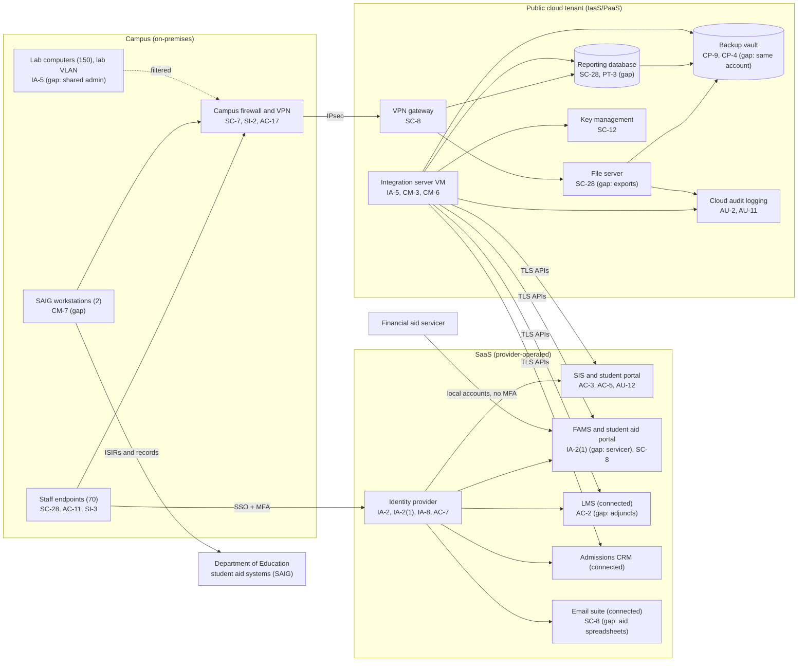

# Cloud Architecture and Control Placement: Cris Santos Company | Educational Services | Small

**Organization:** Cris Santos Company, LLC (private career college) | **Tier:** Small | **Provider:** Vendor-agnostic (see section 3)
**System:** Student Information and Financial Aid Platform (SIFAP), as defined in the SSP (P02)

## 1. Diagram

## 2. Layers
| Layer | Components | Key controls | Responsibility |
|---|---|---|---|
| Identity | Identity provider, cloud IAM roles, FAMS local servicer accounts | AC-2, AC-6, IA-2, IA-2(1), IA-8, AC-7 | Customer (configuration and accounts); provider (service) |
| Network / edge | Campus firewall and VPN, site-to-site VPN gateway, cloud network rules | SC-7, SC-8, SI-2 | Customer (rules); shared for the provider's gateway service |
| Compute / application | Integration server VM, file server VM, SAIG workstations, staff endpoints, lab PCs | CM-3, CM-6, CM-7, IA-5, SI-3 | Customer (guest OS, applications, endpoints) |
| Data | Reporting database, file server storage, backup vault, key management | SC-12, SC-28, CP-9, CP-4, PT-3 | Shared: provider encrypts and runs the services; customer decides what is stored, who can read it, and how backups are isolated |
| Logging / monitoring | Cloud audit logs, identity provider sign-in logs, SIS and FAMS audit trails | AU-2, AU-6, AU-11, AU-12 | Shared: providers generate; customer retains and reviews |
| SaaS applications | SIS, FAMS, LMS, CRM, email | AC-3, AC-5, SC-5, SC-8, SC-28, CP-9 | Provider (application and infrastructure); customer (users, roles, data, integrations) |
| Physical / hypervisor | Provider data centers | PE-3 | Provider (inherited) |

## 3. Service categories and provider equivalents
The college's design is independent of the provider. This table gives each provider's name for each service category, to use when reading its shared responsibility documentation.

| Service category | AWS | Microsoft Azure | Google Cloud |
|---|---|---|---|
| Virtual machines | Amazon EC2 | Azure Virtual Machines | Compute Engine |
| Managed relational database | Amazon RDS | Azure SQL Database | Cloud SQL |
| File and object storage | Amazon EFS / Amazon S3 | Azure Files / Azure Blob Storage | Filestore / Cloud Storage |
| Backup service | AWS Backup | Azure Backup | Backup and DR Service |
| Identity and access management | AWS IAM | Azure role-based access control with Microsoft Entra ID | Cloud IAM |
| Key and secret management | AWS KMS / AWS Secrets Manager | Azure Key Vault | Cloud KMS / Secret Manager |
| Audit logging | AWS CloudTrail | Azure Monitor activity log | Cloud Audit Logs |
| Site-to-site VPN | AWS Site-to-Site VPN | Azure VPN Gateway | Cloud VPN |
| Network filtering | Security groups | Network security groups | VPC firewall rules |

Shared responsibility sources: SRC-AWS-SRM, SRC-AZURE-SRM, SRC-GCP-SRM in `00_universal-framework/sources/source-register.csv`. All three models agree on the split used here:
- **IaaS:** the provider owns physical facilities, hosts, and the virtualization layer. The customer owns the guest operating system, applications, network configuration, identities, and data.
- **PaaS (managed database, key management):** the provider also runs the platform software and patches it. The customer owns access, data, and configuration.
- **SaaS (SIS, FAMS, LMS, CRM, email, identity provider):** the provider also owns the application. The customer keeps identities, roles, data, integrations, and devices. For SaaS rows, the evidence of the provider's side is the vendor's SOC 2 report (P09).

## 4. Findings from the mapping
1. **The weakest identity is outside the college's identity provider (IA-2(1)).** The servicer's FAMS administrator accounts and the adjunct LMS accounts bypass SSO and MFA. The SaaS vendors provide MFA features; enabling them is a customer responsibility. Tracked as P01 R-004 and R-007.
2. **Customer information has leaked out of the systems built to protect it (SC-28, SC-8).** The SIS and FAMS encrypt data at rest, but staff export aid data to spreadsheets on the file server and email. Provider encryption of the file server disk does not limit which staff can open the files. Fix: a restricted FAMS report role for the business office and no standing exports. Tracked as R-002 and R-003.
3. **Backup isolation (CP-9).** The backup vault shares the production account, region, and administrators. Fix: a separate backup account with immutable retention in a second region. Tracked as R-019.
4. **The integration server is a high-value target (IA-5, AC-6).** One service account can read and write every SIS and FAMS object. Fix: scope API rights to the fields synced and move the secret into the key management service. Tracked as R-032.
5. **FAFSA and tax data in the reporting database (PT-3).** The HEA limits FAFSA data and federal tax information to aid administration. Those fields will be dropped from the nightly copy (R-022), which also keeps them out of the early-alert model (P10).
6. **Inherited controls rely on vendor SOC 2 reports.** Rows marked Provider for the SIS and LMS were checked against their SOC 2 Type 2 reports in P09. The FAMS vendor's report has been requested.
