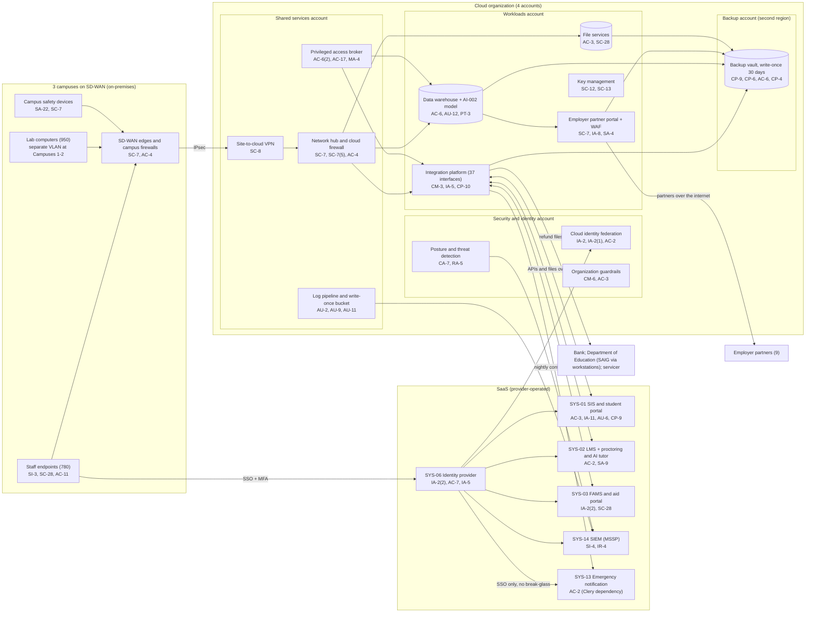

# Cloud Architecture and Control Placement: Cris Santos Company | Educational Services | Mid-Market

**Organization:** Cris Santos Company, Inc. (PE-backed private, for-profit college) | **Tier:** Mid-Market | **Provider:** Vendor-agnostic public cloud (see section 4), plus SaaS
**System:** Student Information and Learning Platform (SILP), as defined in the SSP (P02) | **Prepared:** 2026-07-31 by the Information Security Manager; updated 2026-09-17 with P07 results
**Control map:** `cloud-control-map.csv` (56 rows, 21 components)

## 1. Diagram

## 2. Landing zone design
The landing zone separates duties across 4 accounts (subscriptions or projects, depending on the provider) under one cloud organization, so a compromise in one account cannot easily reach the others.

| Account | Purpose | Who administers | Key design decisions |
|---|---|---|---|
| **Security and identity** | Organization root, cloud identity federation to SYS-06, organization guardrails, posture management and threat detection | Information Security Manager and 1 security analyst | No workloads. Root credentials sealed. Guardrails apply to every other account and cannot be disabled from them |
| **Shared services** | Network hub, cloud firewall, site-to-cloud VPN to the 3 campus SD-WAN edges, DNS, privileged access broker, log pipeline and write-once log bucket | Infrastructure team (4 engineers) | All traffic between campuses, workloads, and the internet passes the hub. Logs from all accounts land in a write-once bucket here |
| **Workloads** | Integration platform, data warehouse with the AI-002 model, employer partner portal, file services, key management | Infrastructure team; Institutional Research for data warehouse content; a contractor for portal code | Separate subnets per workload. The partner portal is the only internet ingress, behind a web application firewall. College-managed keys |
| **Backup** | Backup vault with 30-day write-once retention in a second region | 2 named backup administrators | Separate administrator credentials, not federated to everyday accounts. Backups are pushed by a cross-account role that can write but not delete |

## 3. Layers and shared responsibility per service
| Layer | Components | Key controls | Service model | Responsibility |
|---|---|---|---|---|
| Identity | Cloud federation, break-glass accounts, privileged access broker, SYS-06, partner portal sign-in, backup administrators | IA-2, IA-2(1), IA-2(2), IA-8, AC-2, AC-6(2), AC-6(5), AC-7 | PaaS / SaaS | Customer configures identities, roles, MFA, and reviews; provider runs the identity services |
| Network | Hub, cloud firewall, VPN, DNS, SD-WAN edges | SC-7, SC-7(5), SC-8, AC-4 | PaaS | Customer designs routes, rules, and segmentation; provider runs the gateway services |
| Compute | Integration platform, employer partner portal | CM-3, CM-6, SI-2, SI-3, IA-5, CP-10, SA-4 | IaaS / PaaS | Customer (guest OS, application, code, secrets); provider for hosts, hypervisor, and the container platform |
| Data | Data warehouse, file services, keys, backups | SC-28, SC-12, SC-13, CP-9, CP-6, CP-4, AC-3, AC-6, PT-3 | PaaS | Shared: provider encrypts and operates storage and the database engine; customer controls keys, access, data use, retention, isolation, and restore testing |
| Logging and monitoring | Log pipeline, posture service, SIEM | AU-2, AU-9, AU-11, AU-12, CA-7, RA-5, SI-4, IR-4 | PaaS / SaaS | Shared: provider generates logs and detections; customer enables, retains, forwards, and acts on them; MSSP monitors |
| SaaS applications | SIS, LMS, FAMS, identity provider, SIEM, emergency notification | AC-3, IA-11, AU-6, CP-9, SA-9, SC-28 | SaaS | Provider runs the application and infrastructure; customer keeps users, roles, authentication policy, audit review, integrations, and data |
| Physical | Provider data centers | PE-3 | All | Provider (inherited, evidenced by SOC 2 reports) |

**Responsibility counts in `cloud-control-map.csv`:** 31 Customer, 20 Shared, 5 Provider. By service model: 13 IaaS, 30 PaaS, 13 SaaS rows. The customer side is always identity, data protection, and logging, as the three providers' shared responsibility models agree.

## 4. Service categories and provider equivalents
The design is independent of the provider. This table gives each provider's name for the service category, for reading its shared responsibility documentation (SRC-AWS-SRM, SRC-AZURE-SRM, SRC-GCP-SRM in `00_universal-framework/sources/source-register.csv`).

| Service category | AWS | Microsoft Azure | Google Cloud |
|---|---|---|---|
| Multi-account organization and guardrails | AWS Organizations, service control policies | Management groups, Azure Policy | Resource Manager folders, organization policies |
| Account, subscription, or project | Account | Subscription | Project |
| Cloud identity federation | IAM Identity Center | Microsoft Entra ID with Azure RBAC | Cloud Identity with IAM |
| Network hub and cloud firewall | Transit Gateway, AWS Network Firewall | Virtual WAN hub, Azure Firewall | Network Connectivity Center, Cloud NGFW |
| Site-to-cloud VPN | Site-to-Site VPN | VPN Gateway | Cloud VPN |
| Virtual machines | EC2 | Virtual Machines | Compute Engine |
| Container platform and web application firewall | Amazon ECS or EKS, AWS WAF | Azure Container Apps or AKS, Azure Web Application Firewall | Cloud Run or GKE, Cloud Armor |
| Managed data warehouse | Amazon Redshift | Azure Synapse Analytics | BigQuery |
| Managed file shares | Amazon FSx | Azure Files | Filestore |
| Object storage with write-once retention | S3 with Object Lock | Blob Storage with immutability policies | Cloud Storage with bucket lock |
| Backup service | AWS Backup (vault lock) | Azure Backup (immutable vault) | Backup and DR Service |
| Key management | AWS KMS | Azure Key Vault | Cloud KMS |
| Audit logging | CloudTrail | Azure Monitor activity log | Cloud Audit Logs |
| Posture and threat detection | Security Hub, GuardDuty | Microsoft Defender for Cloud | Security Command Center |

**Service model split used here (all three providers agree):**
- **IaaS** (virtual machines, the organization and its guardrails, the access broker hosts): the provider owns facilities, hosts, and virtualization. The customer owns the guest OS, applications, network configuration, identities, and data.
- **PaaS** (managed data warehouse, container platform, file shares, backup, key service, firewall and VPN services, log services): the provider also owns the platform software and its patching. The customer owns access, keys, data, and configuration.
- **SaaS** (SIS, LMS, FAMS, identity provider, SIEM, emergency notification): the provider also owns the application. The customer keeps identities, roles, authentication policy, audit review, integrations, and data.

## 5. Findings from the mapping
1. **The SaaS customer side carries the biggest risks.** The vendors run the SIS, LMS, and FAMS well (P09), but the college's own settings are weak: optional student MFA, no step-up for refund bank changes, local LMS accounts, servicer accounts without MFA, and no review of application audit logs (P01 R-005, R-007, R-008). These rows are Customer, so no vendor report can cover them.
2. **The integration platform is the crown jewel the college runs itself.** It moves student, aid, and refund data across 37 interfaces, yet its changes are not reviewed, its service account passwords are stale, and its rebuild has never been tested (P01 R-014, R-024). Fix: change tickets with a second reviewer, vaulted secrets, and the first restore test on 2026-10-27.
3. **The data warehouse breaks a use limit, not just a security rule.** ISIR-derived fields flow into a warehouse that 46 analysts can query and that feeds AI-002 and marketing analytics (PT-3, AC-6). Fix: remove the fields by 2026-11-30, role-based views, and query logging (P01 R-011; P10).
4. **Recovery is designed but unproven.** Backups are isolated (separate account, second region, write-once, separate credentials), which is the strongest control in the environment. No workload has ever been restored (gap 5; P07 CP-4).
5. **The emergency notification service is outside the SILP but depends on it.** It signs in only through SYS-06 and gets its contact lists from the integration platform. It is mapped here as a dependency so that the Clery emergency notification path is not forgotten (P05 finding 3).
6. **Boundary check.** Every in-scope component in the SSP (P02 section 9) appears in the diagram. Every cloud component has at least one row in the control map, and each account has controls from at least 2 of the AC, AU, CM, IA, SC, and SI families or inherits them.
7. **Inherited controls rely on SOC 2 reports.** Rows marked Provider or Shared for the SIS, LMS, FAMS, identity provider, cloud provider, and MSSP depend on their SOC 2 Type 2 reports and complementary user entity controls, reviewed each year in P09 `vendor-soc2-review.csv`.
