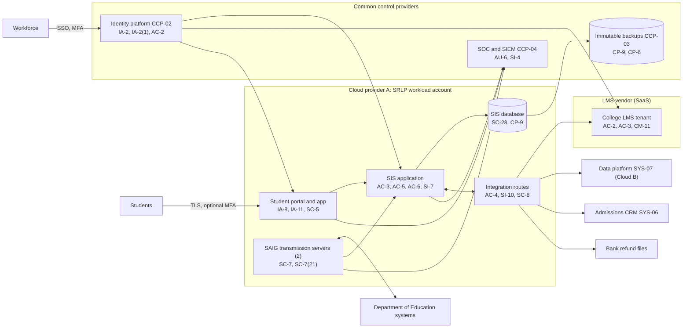

# System Security Plan: Student Records and Learning Platform (SRLP)

**Organization:** Cris Santos Company, Inc. (publicly traded postsecondary education company operating a private, for-profit college) | **Tier:** Enterprise | **Vertical:** Educational Services
**Outline:** NIST SP 800-18 Rev. 2, System Security Plan Outline Example (June 2026) | **Version:** 2.0, 2026-09-14

## 1. System Name and Identifier
Student Records and Learning Platform (**SRLP**), identifier CSC-SYS-SRLP-001. Tier-1 system in the enterprise application inventory.

## 2. System Overview
The SRLP is the College's core student system. It supports admission of matriculated students, registration and enrollment status, grades, degree audit, transcripts, student accounts, Title IV financial aid (ISIR intake, packaging, origination, disbursement), credit balance refunds, and the College's online and campus courses. It serves about 285,000 enrolled students, about 3.4 million former students whose academic records are kept permanently, and about 9,000 course sections per term. It holds nearly all of the company's **customer information** under the FTC Safeguards Rule (16 CFR 314.2(d)) and most of its **education records** under FERPA.

**Why confidentiality and integrity matter most.** The SIS holds SSNs, ISIR data derived from the FAFSA, and refund bank details for about 2.3 million consumers. A breach at that scale is a notification event (16 CFR 314.4(j)) and a likely material event for SEC purposes (P08). A wrong enrollment status, grade, or disbursement can create Title IV liabilities and harm students.

**Major components:**
- **SYS-01 SIS:** commercial higher-education SIS software, customer-managed on Cloud provider A virtual machines, with its database on the provider's managed relational database service. Modules: matriculated admissions records, registration, academic records, degree audit, student financials, and financial aid
- **SYS-02 LMS (College tenant):** vendor SaaS. The College controls its tenant configuration, roles, LTI tool approvals, and the SIS-to-LMS enrollment feed. The 14 SL-2 partner tenants are outside this boundary (P09)
- **SYS-03 student portal and mobile app:** company-built web and mobile application on Cloud provider A managed containers, behind the landing zone web application firewall
- **SYS-04 SAIG transmission servers (2):** Cloud provider A virtual machines running the Department-provided transmission software for ISIR downloads and origination and disbursement files
- **Integration services:** the enterprise integration platform's SRLP routes (SIS to LMS, CRM, data platform, SL-1 portal, partner roster feeds, bank refund files, Title IV third-party servicer)

Users: about 9,400 workforce SRLP accounts (faculty, registrar, financial aid, student finance, enrollment and academic advisors, support center), about 285,000 student accounts, and about 52,000 sponsored students whose employers see progress through the SL-1 portal with the student's consent.

## 3. Laws, Regulations, and Policies Affecting the System
| ID | Requirement | Citation | How it affects the SRLP |
|---|---|---|---|
| N61-R02 | FTC Safeguards Rule, applied to Title IV institutions through the PPA and enforced by FSA | 16 CFR Part 314 (elements in 314.4) | Primary control requirement; every 314.4 element applies because the 314.6 exception is not available |
| N61-R01 | FERPA | 20 U.S.C. 1232g; 34 CFR Part 99 | "Reasonable methods" access control (99.31(a)(1)(ii)); disclosure records (99.32); school-official vendors (99.31(a)(1)(i)(B)) |
| Title IV | Administrative capability; credit balances; fraud referral; record retention; SAIG Enrollment Agreement | 34 CFR 668.16(c), (g); 668.164(h)(2); 668.24(e); SAIG Enrollment Agreement | Internal controls and separation of duties; 14-day refund deadline; referral of applicant fraud; retention; breach report to FSA |
| HEA | Limits on use of FAFSA data and federal tax information | HEA section 483, as summarized in the FSA Handbook | Restricts ISIR-derived data to aid administration (PT-3) |
| SEC | Cybersecurity disclosure | Form 8-K Item 1.05; 17 CFR 229.106 | A material SRLP incident goes through the P08 materiality step |
| SOX | Internal control over financial reporting | IT general controls | Student financials module is in SOX scope (tested by the SOX program) |
| State | State breach notification laws | Each state where affected individuals reside (Florida worked example: Fla. Stat. 501.171) | Notification (P08) |
| Contract | SL-1 employer agreements; SOC 2 | P09 | Availability, confidentiality, and consent commitments for the SL-1 portal feed |
| Internal | POL-01 to POL-05, standards, and procedures | P06 | Enterprise policy hierarchy |

Not applicable:
- COPPA (N61-R03): no users under 13.
- CIPA (N61-R04): the College does not receive E-Rate discounts.
- HIPAA (N61-R05): the company is not a covered entity. Student health information the SRLP holds (for example, immunization records for clinical placements) is in education records covered by FERPA, which PHI excludes (45 CFR 160.103).
- CIRCIA (N61-R06): proposed only. The proposed rule would cover every Title IV institution, so it is tracked in P03 and P08.

## 4. System Status
### 4.1 System Security Plan Approval
Prepared by the SIS Application Manager and the GRC team. Reviewed by the CISO (Qualified Individual), the University Registrar, the Vice President, Financial Aid, and the Provost and Chief Academic Officer. Approved by the Chief Operating Officer on 2026-09-14.
### 4.2 System Authorization Decision
The company is not a federal agency, so there is no formal ATO. The equivalent internal decision:
- **Authorizing official equivalent:** Chief Operating Officer, with the CISO's recommendation and the Provost's concurrence for the LMS tenant.
- **Decision (2026-09-14):** continue operation with conditions, based on the Internal Audit assessment (P07) and the risk register (P01).
- **Conditions:** close the High POA&M items that affect student funds and customer information (POAM-002 by 2026-12-15, POAM-004 by 2026-11-30, POAM-012 by 2026-10-31, POAM-013 by 2026-12-31); prove the 8-hour SIS RTO in a retest (POAM-006 by 2027-01-31); isolate the SAIG transmission servers (POAM-016 by 2026-12-31).
- **Reauthorization:** annually, or after a major change (for example, the SIS version upgrade planned for 2027-06).
### 4.3 System Operational Status
Operational. Planned major modifications: step-up MFA and out-of-band confirmation for refund bank changes (IA-11), removal of ISIR-derived fields from the data platform extract (AC-4, PT-3), and SAIG server isolation (SC-7(21)).

## 5. Role Identification and Responsible Personnel
| Role | Title | Responsibility |
|---|---|---|
| System owner | Vice President, Enterprise Applications | Accountable for the SRLP technology; approves technical changes |
| Authorizing official (equivalent) | Chief Operating Officer | Accepts residual risk to operate |
| Business owners | University Registrar (education records); Vice President, Financial Aid (aid data and SAIG); Vice President, Student Finance (student financials and refunds); Provost and Chief Academic Officer (LMS tenant) | Approve access roles and data uses for their data |
| Qualified Individual | CISO | Oversees and enforces the information security program (16 CFR 314.4(a)); reports to the board in writing at least annually (314.4(i)) |
| System administrator | SIS Application Manager | Day-to-day SIS administration, configuration, and releases |
| LMS tenant administrator | Director of Academic Technology | College LMS tenant configuration, LTI approvals |
| Privacy | Chief Privacy Officer | FERPA program with the University Registrar; data use register; breach determinations |
| Common control providers | See section 10.3 | Operate inherited controls |
| Independent assessor | Chief Audit Executive (Internal Audit) | Annual assessment (P07) |

## 6. System Information Types and System Categorization
Information types come from NIST SP 800-60 Vol. 2 Rev. 1. Impact levels follow FIPS 199.

| Information type | Confidentiality | Integrity | Availability | Rationale |
|---|---|---|---|---|
| Higher education (enrollment, grades, transcripts, course activity) | Moderate | Moderate | Moderate | Disclosure harms students and is a FERPA issue; wrong grades or enrollment status affect aid eligibility; instruction and registration have 24-hour MTDs (P05 BP-01, BP-03) |
| Payments and student accounts (Title IV awards, disbursements, refunds, bank details) | Moderate | Moderate | Moderate | SSNs, ISIR data, and bank details enable identity theft and refund redirection; wrong amounts create Title IV liabilities; refunds have a 14-day deadline (P05 BP-05: MTD 72 h) |
| Personal identity and authentication (workforce and student identities) | Moderate | Moderate | Moderate | Account takeover leads to the data above |
| **SRLP category (high-water mark)** | **Moderate** | **Moderate** | **Moderate** | |

**Categorization decision.** The SRLP is a Moderate system. The company is not a federal agency and uses FIPS 199 as a model. Because the SIS aggregates customer information on about 2.3 million consumers, the board risk committee approved this tailoring on 2026-09-10:
- The SRLP uses the **SP 800-53B Moderate baseline**.
- It adds **8 High-baseline controls** aimed at exfiltration detection, audit protection, and independent testing: AC-2(12), AU-6(5), AU-9(2), CA-8, CA-8(1), PS-4(2), SC-7(21), SI-4(20). CA-8 is also how the company meets the annual penetration test in 16 CFR 314.4(d)(2)(i).
- It adds 3 controls outside the security baselines because the Safeguards Rule and the HEA call for them: PM-2 (Qualified Individual), PM-9 (risk strategy and board reporting), and PT-3 (purpose limits on FAFSA and tax data).

**Documented controls.** `control-implementation.csv` documents **140 controls**: 129 from the Moderate baseline, 8 High-baseline supplements, and 3 tailored additions. The remaining Moderate-baseline controls and enhancements are fully inherited from the common control catalog (section 10.3) or from the cloud and SaaS providers' SOC 2 reports, and are listed there rather than repeated here. The `csf2_subcategories` column is filled from the NIST CSF 2.0 to SP 800-53 crosswalk in `00_universal-framework/crosswalks/`; it is blank for control enhancements, which that crosswalk does not list.

## 7. Authorization Boundary Description
**Inside the boundary:** the SIS application servers and database in the SRLP workload account (Cloud provider A), the student portal and mobile app back end, the two SAIG transmission servers, the SRLP routes on the shared integration platform, the College LMS tenant configuration and roles, and the financial aid processing center workstations and scanners that capture verification documents.

**Outside the boundary (common control providers and interconnected systems):**
- Landing zone services (network hub, key management, log archive, backup accounts, standby region): CCP-03
- Identity platform (SYS-05): CCP-02
- SOC, SIEM, EDR, scanners: CCP-04
- The LMS vendor's platform and the 14 partner tenants; the Department of Education's systems; the admissions CRM (SYS-06); the data platform (SYS-07); the legacy document imaging system in the colocation data center (SYS-08); the Title IV third-party servicer; the bank; SL-1 employers

The enterprise multi-cloud diagram is in P04 `cloud-architecture.md`.

## 8. Information Exchanges Summary
| Connected system / party | Direction | Data | Agreement |
|---|---|---|---|
| Department of Education systems | Bidirectional (SAIG) | ISIRs; origination and disbursement records | PPA; SAIG Enrollment Agreement |
| LMS vendor platform (College tenant) | Bidirectional (API) | Enrollments, rosters, final grades | LMS contract with FERPA school-official and security terms |
| Admissions CRM (SYS-06) | Inbound (applications to matriculation); outbound (enrollment status) | Applicant and student identifiers, status | Internal; CRM vendor contract |
| Data and analytics platform (SYS-07) | Outbound nightly | SIS and LMS extracts. **Includes ISIR-derived fields today (POAM-004)** | Internal data use register |
| Title IV third-party servicer | Bidirectional (secure file transfer and portal) | Verification documents and results; default prevention contact lists | Servicer contract; **notice term 10 days (POAM-020)** |
| Bank | Outbound | Refund payment files | Treasury services agreement |
| SL-1 employer portal | Outbound | Enrollment and progress for consenting sponsored students | SL-1 client agreements; FERPA consent (POAM-021) |
| SL-2 partner institutions | Inbound | Partner roster feeds to partner LMS tenants (routed through the integration platform; partner data does not enter the SIS) | Partner agreements |
| Legacy document imaging system (colocation) | Bidirectional | Scanned verification and tax documents linked to SIS records | Internal; **unsupported system (POAM-008)** |
| SIS software vendor | Remote support (through PAM) | Troubleshooting access | Support agreement with FERPA and security terms |

## 9. System Component Inventory
| Component | Type | Location / provider | Owner |
|---|---|---|---|
| SIS application servers (6) | IaaS virtual machines | Cloud provider A primary region; warm standby in a second region | SIS Application Manager |
| SIS database | Managed relational database (PaaS) | Cloud provider A | SIS Application Manager |
| Student portal and mobile app back end | Managed containers | Cloud provider A | Vice President, Enterprise Applications |
| SAIG transmission servers (2) | IaaS virtual machines | Cloud provider A | Vice President, Financial Aid (with the SIS Application Manager) |
| SRLP integration routes | Configuration on the shared integration platform | Cloud provider A (shared services account) | Integration team (CIO) |
| College LMS tenant | SaaS configuration | LMS vendor | Director of Academic Technology |
| Financial aid processing center workstations (about 120) and networked scanners (31) | Endpoints and devices | Florida headquarters | Director of Endpoint Engineering |

## 10. Control Implementation Details
### 10.1 Control implementation status
See `control-implementation.csv` (140 controls).

| Status | Count |
|---|---|
| Implemented | 111 |
| Partially implemented | 25 |
| Planned | 4 |
| **Total** | **140** |

| Inheritance | Count |
|---|---|
| Common (fully inherited from a common control provider) | 91 |
| Hybrid (shared between a provider and the SRLP team) | 25 |
| System-specific | 24 |

The Planned controls are High-baseline supplements: AC-2(12), PS-4(2), SC-7(21), SI-4(20). Partially implemented controls: AC-2, AC-2(3), AC-4, AC-6, AT-3, AU-6, CM-3, CM-6, CM-8, CP-2, CP-10, IA-5, IA-8, IA-11, IR-4, IR-8, PS-4, PT-3, RA-5, SA-9, SA-22, SC-7, SI-2, SI-4, SI-12.

### 10.2 Control assessment status
Internal Audit assessed 45 of these controls from 2026-07-13 to 2026-08-28 using SP 800-53A Rev. 5 procedures and statistical sampling (P07 `assessment-plan.md`, `assessment-results.csv`). Weaknesses are in P07 `poam.csv`.

### 10.3 Common control providers and inheritance
Common and hybrid controls are inherited from the enterprise platform. Each provider publishes its controls in the enterprise **common control catalog** (maintained by the GRC team in the GRC platform) and is assessed on its own cycle; the SRLP inherits the results.

| Provider | Name | Accountable role | Controls provided | Rows in this plan | Evidence of operation |
|---|---|---|---|---|---|
| CCP-01 | Enterprise GRC program | CISO (with the Chief Risk Officer and Chief Audit Executive for assessment) | Policies and standards (P06), risk methodology, assessment, POA&M, continuous monitoring, penetration testing | 30 | Annual Internal Audit assessment (P07); GRC platform |
| CCP-02 | Identity platform (SYS-05) | Director of Identity and Access Management | SSO, MFA, PAM, identity governance, account lifecycle | 20 | SOX IT general control testing; P07 AC-2, IA-2, IA-5 results |
| CCP-03 | Cloud landing zone (Cloud provider A) | Director of Cloud Platform Engineering | Account guardrails, network policies, key management, encryption, backups, log archive, standby region | 19 | Posture management reports; provider SOC 2 Type 2 (physical and hypervisor) |
| CCP-04 | Security operations | Director of Security Operations | 24x7 SOC, SIEM, EDR, vulnerability management, incident response, threat intelligence | 20 | SOC metrics; P07 SI-4, RA-5, IR results |
| CCP-05 | Enterprise network (SYS-09) | Director of Network Engineering | SD-WAN, campus segmentation, wireless, NAC | 1 | Network configuration reviews |
| CCP-06 | Endpoint engineering (SYS-10) | Director of Endpoint Engineering | Workstation baselines, EDR agents, patching, device control, media sanitization | 6 | Configuration compliance and patch reports |
| CCP-07 | Facilities and physical security | Vice President, Campus Operations | Processing area physical access and monitoring; cloud and colocation physical controls through provider SOC 2 reports | 3 | Badge reviews; provider SOC 2 reports |
| CCP-08 | Human resources and workforce training | Chief Human Resources Officer | Personnel screening, terminations, sanctions, training, acknowledgments | 11 | HR and learning system reports |
| CCP-09 | Third-party risk management | Director of Third-Party Risk Management | Vendor tiering, contract terms, SOC report reviews, supply chain risk management | 6 | Vendor register; SOC report reviews |

**Inheritance rules:**
- A Common control is fully inherited; the SRLP team verifies only that the SRLP is onboarded (for example, SSO integration and log forwarding).
- A Hybrid control names both parts in the implementation statement: the provider's part and the SRLP team's part.
- If a provider's assessment finds a weakness, the finding is linked to every inheriting system's POA&M. Example: POAM-001 (adjunct terminations) is a CCP-08 and CCP-02 weakness that affects the SRLP because adjuncts hold grade entry access.

## 11. Digital Identity Acceptance Statement
- **Workforce users:** SSO with MFA (authenticator app with number matching). Privileged users use phishing-resistant FIDO2 keys through PAM. This is comparable to NIST SP 800-63 AAL2 for users and AAL3-like protection for privileged users. MFA resets at the help desk currently rely on knowledge-based questions; video verification with manager approval is due with POAM-013 by 2026-12-31.
- **Students:** password sign-in to the student identity tenant with bot detection and breached-password checks. **MFA is optional today** except for viewing aid offers. Required MFA for all students and step-up MFA with out-of-band confirmation for refund bank changes are due with POAM-002 by 2026-12-15. 16 CFR 314.4(c)(5) requires MFA for any individual accessing any information system unless the Qualified Individual approves equivalent controls in writing; no such approval exists for students, so this is a gap (P03 G-017).
- **SL-1 employer users:** identity is vouched for by the employer administrator under the client agreement; MFA is required and enforced.

## 12. Referenced Artifacts
Scenario facts (`../00_company-facts.md`), BIA and dependency map (P05), multi-cloud architecture and control map (P04), enterprise risk register (P01), regulatory gap analysis (P03), policy hierarchy and policies (P06), Internal Audit assessment and POA&M (P07), ransomware runbook (P08), SOC 2 readiness for SL-1 and SL-2 (P09), AI portfolio including AI-003 (P10), SRLP contingency plan v3, enterprise common control catalog.

## 13. Acronym List and Glossary
- **AO:** authorizing official
- **CCP:** common control provider
- **FAFSA:** Free Application for Federal Student Aid
- **ISIR:** Institutional Student Information Record (the FAFSA results the Department sends to the institution)
- **LTI:** Learning Tools Interoperability (standard for plugging tools into the LMS)
- **PAM:** privileged access management
- **POA&M:** plan of action and milestones
- **PPA:** Program Participation Agreement
- **SAIG:** Student Aid Internet Gateway
- **SIS / LMS:** student information system / learning management system

## 14. System Security Plan Review and Change Records
| Version | Date | Change | Author |
|---|---|---|---|
| 1.0 | 2025-09-12 | Initial plan (Moderate baseline, SIS only) | SIS Application Manager |
| 1.1 | 2026-03-20 | Added the College LMS tenant, the student portal, and the SAIG servers after the cloud migration | SIS Application Manager |
| 2.0 | 2026-09-14 | High-baseline supplements; common control provider mapping; 2026 assessment results | SIS Application Manager with GRC team |
