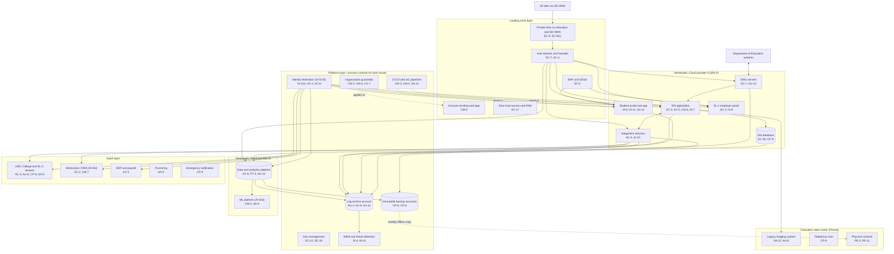

# Cloud Architecture and Control Placement: Cris Santos Company | Educational Services | Enterprise

**Organization:** Cris Santos Company, Inc. (publicly traded postsecondary education company operating a private, for-profit college) | **Tier:** Enterprise | **Provider:** Multi-cloud, vendor-agnostic: two public cloud providers (called Cloud provider A and Cloud provider B), one colocation data center, and SaaS (see section 4)
**Owner:** Director of Cloud Platform Engineering, with the CISO | **Date:** 2026-08-31 | **Related:** SRLP SSP (P02), enterprise BIA (P05)

## 1. Architecture in layers
The estate is organized in four layers, plus one colocation data center. Each lower layer provides **common controls** that the layers above inherit, so a workload team configures only what is specific to its system.

| Layer | What it is | Examples | Who runs it |
|---|---|---|---|
| **Platform** | Organization-wide services in both clouds | Cloud organization guardrails, identity federation, key management, log archive, SIEM feeds, vulnerability and posture management, immutable backup accounts, CI/CD pipelines | Cloud Platform Engineering; Security Operations; Identity team |
| **Landing zone** | The standard account (subscription or project) pattern every workload lands in | Account vending with mandatory tags, hub-and-spoke network with cloud firewalls, private connectivity to the colocation data center and SD-WAN, WAF and DDoS protection, private DNS, zero-trust and PAM access | Cloud Platform Engineering; Network Engineering |
| **Workload** | Systems built or run by the company | Cloud A: SIS application and database, student portal and mobile app, SAIG transmission servers, integration services, SL-1 employer portal. Cloud B: data and analytics platform, machine learning platform (AI-003) | Application teams (for example, the SIS Application Manager) |
| **SaaS** | Vendor-operated applications | LMS (College and 14 SL-2 partner tenants), admissions CRM, ERP and payroll, productivity suite, online proctoring, emergency notification service | Vendors, with the company's configuration and oversight |

The colocation data center in Florida hosts the legacy document imaging system, the contact-center telephony core, and the weekly offline copy of the immutable backups.

## 2. Diagram

## 3. Responsibility by service model
Sources: SRC-AWS-SRM, SRC-AZURE-SRM, and SRC-GCP-SRM in `00_universal-framework/sources/source-register.csv`. The three published models agree on the split used here, so the design does not depend on which two providers the company uses.

| Service model | Provider | Company (customer) | Shared |
|---|---|---|---|
| IaaS (SIS servers, SAIG servers) | Facilities, hosts, hypervisor, physical network | Guest OS, applications, identities, data, network policy | Encryption (provider service, customer keys), logging |
| PaaS (SIS database, containers, data platform, ML service) | Also the platform runtime and its patching | Data, access, configuration, keys, application code, data use limits | Backups, availability configuration |
| SaaS (LMS, CRM, ERP, proctoring, notification) | Also the application | Users, roles, data, tenant configuration, oversight of the vendor | Audit review (complementary user entity controls) |
| Colocation | Building, power, cooling, perimeter | Racks, equipment, cage access lists, the systems in them | None |

## 4. Service categories and provider equivalents
| Service category | AWS | Microsoft Azure | Google Cloud |
|---|---|---|---|
| Organization guardrails | AWS Organizations service control policies | Azure Policy with management groups | Organization Policy Service |
| Account vending | AWS Control Tower account factory | Azure landing zone subscription vending | Resource Manager project creation |
| Key management | AWS KMS | Azure Key Vault | Cloud KMS |
| Audit logging | AWS CloudTrail | Azure Monitor activity log | Cloud Audit Logs |
| Threat detection | Amazon GuardDuty | Microsoft Defender for Cloud | Security Command Center |
| Managed relational database | Amazon RDS | Azure SQL Database | Cloud SQL |
| Managed containers | Amazon EKS | Azure Kubernetes Service | Google Kubernetes Engine |
| Data warehouse | Amazon Redshift | Azure Synapse Analytics | BigQuery |
| Machine learning platform | Amazon SageMaker | Azure Machine Learning | Vertex AI |
| Web application firewall | AWS WAF | Azure Web Application Firewall | Cloud Armor |
| Backup service | AWS Backup | Azure Backup | Backup and DR Service |

This table is for reading provider documentation only. The architecture, control map, and SSP describe service categories.

## 5. Common controls
`cloud-control-map.csv` has **66 rows** across 32 components: Platform 20, Landing zone 8, Workload 22, SaaS 11, Colocation 5. Responsibility: Customer 48, Shared 12, Provider 6.

**30 rows are published as common controls** (`common_control` = Yes) in the enterprise common control catalog. They map to the common control providers in the SRLP SSP (P02 section 10.3): identity (CCP-02), landing zone (CCP-03), security operations (CCP-04), and physical controls (CCP-07). A workload inherits them by being deployed through account vending, which applies the guardrails, logging, network, key, and backup policies automatically.

**Rules for inheriting:**
1. A workload may claim a common control only if its account was created by account vending and passes the posture baseline.
2. Customer-side identity, data protection, and logging stay explicit at every layer: even a SaaS application has Customer rows for access and review (for example, LMS AU-6 and CRM AC-2) because those are always the company's responsibility.
3. SaaS rows cite the vendor's SOC 2 report, reviewed by the third-party risk team (P09 evidence map).

## 6. Validation against the SRLP SSP (P02)
Every SRLP component in the SSP boundary appears here with controls from each required family, directly or inherited:
| SRLP component | AC | AU | CM | IA | SC | SI |
|---|---|---|---|---|---|---|
| SIS application servers | AC-3, AC-5 | AU-2, AU-9 (inherited) | CM-6; CM-2 (inherited) | IA-2(1) (inherited) | SC-7 (inherited) | SI-2, SI-7 |
| SIS database | AC-6 (inherited) | AU-2 (inherited) | CM-6 (inherited) | IA-2(1) (inherited) | SC-28 | SI-2 (provider) |
| Student portal and mobile app | AC-6 (inherited) | AU-2 (inherited) | CM-3 (inherited) | IA-8, IA-11 | SC-5 (inherited) | SA-11 and SI-4 (inherited) |
| SAIG transmission servers | AC-4 (inherited) | AU-12 | CM-2 (inherited) | IA-2(1) (inherited) | SC-7 | SI-4 (inherited) |
| Integration services | AC-4 | AU-2 (inherited) | CM-3 (inherited) | IA-2(1) (inherited) | SC-8(1) (inherited) | SI-10 |
| College LMS tenant (SaaS) | AC-3 | AU-6 | CM-7 (LTI approvals, P02 CM-11) | IA-2(1) (inherited) | SC-8 (vendor) | SI-4 (inherited) |

## 7. Findings from the mapping
1. **SAIG servers share a subnet.** The two SAIG transmission servers sit in the integration subnet rather than an isolated segment, so a compromised integration server could reach them (P07 SC-7). Fix: dedicated segment with only the Department endpoints and the SIS import path allowed (POAM-016).
2. **FAFSA-derived data crosses into analytics.** The integration route to the Cloud B data platform carries ISIR-derived fields. No platform guardrail can enforce a legal purpose limit, so the route's field list and the data use register must (POAM-004).
3. **Two clouds, one control set.** Guardrails, logging, and key policies are written once as code and applied to both clouds. Differences are limited to service names (section 4).
4. **Log coverage gaps sit outside the clouds.** Platform logging covers every cloud account, but the legacy imaging system in the colocation data center and the SAIG transmission software logs are not in the SIEM (POAM-009).
5. **LMS is SaaS with no platform fallback.** The vendor's 24-hour contract RTO cannot be fixed by architecture; it needs contract and procedure changes (POAM-007).
6. **AI features arrive inside SaaS.** The CRM vendor's scoring feature (AI-002) was enabled through tenant configuration without AI governance committee review. The CRM CM-7 row now requires committee approval before AI features are switched on (P10; POAM-019).
