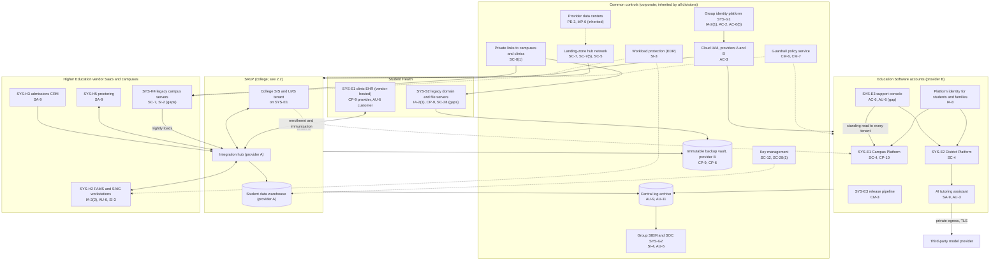
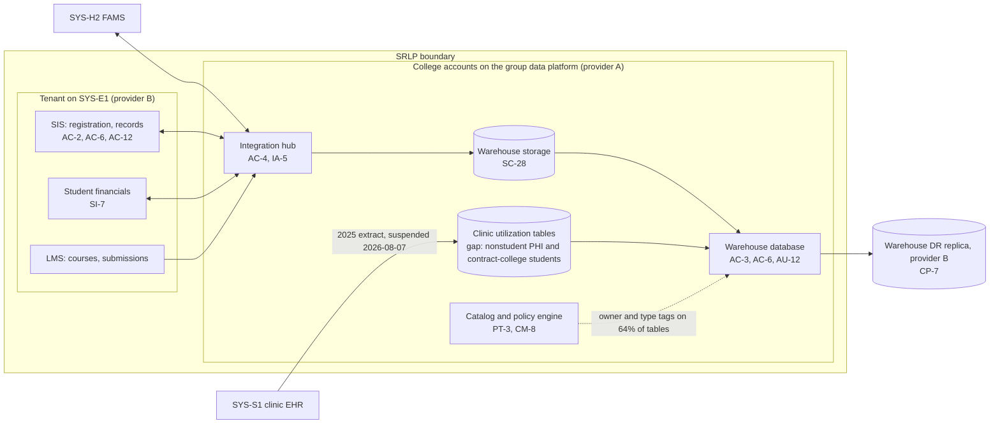

# Cloud Architecture and Control Placement: Cris Santos Company Holdings | Educational Services | Multi-Sector

**Organization:** Cris Santos Company Holdings, Inc. | **Tier:** Multi-Sector | **Providers:** two public cloud providers, called provider A and provider B (vendor-agnostic; see section 6)
**Scope:** the shared corporate cloud platform (SYS-G3 landing zones and the group data platform) plus the division workloads that run on it or connect to it. The SSP system (P02) is the college's Student Records and Learning Platform (SRLP).

## 1. Design in one paragraph
Corporate runs one **landing zone** per provider: identity federation from SYS-G1, a hub network, guardrail policies, a central log archive, key management, EDR, and an immutable backup vault. Divisions get their own **accounts** (subscriptions or projects) inside the landing zone and inherit these guardrails. Provider A hosts the corporate hub, the group data platform (including the college's **student data warehouse** and **integration hub**), and division corporate workloads. Provider B hosts Education Software's two multi-tenant platforms (the Campus Platform, SYS-E1, and the District Platform, SYS-E2), the support console and pipeline (SYS-E3), the backup vault, and the data platform's disaster recovery replica. The college's SIS and LMS are **a tenant on the Campus Platform**, so the college consumes its sister division's SaaS in the same way an outside college does. Outside the cloud platform sit the vendor-hosted clinic EHR (SYS-S1), vendor SaaS used by the college (FAMS, CRM, proctoring), and on-premises systems at 6 legacy campuses (SYS-H4) and Student Health's legacy clinic sites (SYS-S2).

## 2. Diagrams
### 2.1 Group landing zone and division workloads

### 2.2 Student Records and Learning Platform (SSP boundary)

**Target state (POAM-005 to POAM-007, due 2027-03-31):** the clinic utilization tables are purged; any future clinic feed carries only aggregate, de-identified counts for the college's own students; warehouse roles are scoped to legitimate educational interest (advisors to their caseload, institutional research to approved projects); every table carries an owner, data type, and purpose tag enforced by the policy engine; FAFSA-derived fields are restricted to the financial aid role.

## 3. Tenancy and identity decision
**Decision.** All three divisions share the group identity platform (SYS-G1). Each division gets its own accounts inside the SYS-G3 landing zone, with scoped roles federated from SYS-G1. No division has a separate tenant with its own workforce identity. The college's SIS and LMS run as a tenant on its sister division's Campus Platform (SYS-E1), which is an application tenant, not an identity boundary. Students and families sign in through the platform identity service. About 40% of Student Health users still sign in through the legacy domain (SYS-S2) from the 2024 acquisition, which is being migrated to SYS-G1.

**Reason.** One identity platform, one SIEM, and one backup design let group internal audit assess common controls once. The sample names no rule or contract that requires a division to have its own tenant.

**What limits blast radius.** Administrators use phishing-resistant MFA and just-in-time PAM with session recording. Cloud IAM has no long-lived users. Customer tenants on SYS-E1 and SYS-E2 are isolated by tenant keys and row-level policies. Backups use a separate backup identity.

**Known gaps.** 61 support accounts hold standing read access to every customer tenant, including the college's (POAM-001). Student Health legacy users have no MFA at on-site clinical workstations (POAM-016, POAM-017). One shared local administrator password was found on 31 legacy campus servers (POAM-011).

Cross-division risks: GR-01 (support console exposes every tenant), GR-02 (ransomware spreads from legacy sites through shared services), GR-09 (Student Health outside group controls).

## 4. Common versus division-specific controls
`cloud-control-map.csv` has 55 rows across 34 components. The `control_scope` column shows who owns each placement:

| Scope | Rows | What it means |
|---|---|---|
| Common (group) | 22 | Provided once by corporate (SYS-G1, SYS-G2, SYS-G3) and inherited by every division account. Listed in the P02 common control catalog |
| Shared system (SRLP) | 12 | Controls of the SSP system: the college's tenant configuration, integration hub, and warehouse |
| Division-specific (Education Software) | 9 | Multi-tenant platforms, support console, AI tutor, pipeline |
| Division-specific (Higher Education) | 7 | Vendor SaaS (FAMS, CRM, proctoring), SAIG workstations, legacy campuses |
| Division-specific (Student Health) | 5 | Clinic EHR customer duties, legacy domain, clinic file servers |

| Responsibility | Rows |
|---|---|
| Customer (the group or a division) | 41 |
| Shared (provider and group) | 11 |
| Provider | 3 |

**Rule of thumb.** Identity, network guardrails, logging, keys, backups, and EDR are **common**. A division cannot opt out of them, only request an exception through POL-01. Tenant isolation, support access, student-facing identity, and data purpose are **division-specific**, because they depend on each division's regulators and customers.

**A sister division as a cloud provider.** For the college, Education Software is a SaaS provider like any other. The shared responsibility split for the SIS and LMS tenant follows the SaaS pattern: Education Software owns the application, platform identity service, multi-tenant database, and standby; the college owns roles, access approvals, tenant settings, integrations, and its data. That split is only written down in this map and the SSP. The intercompany agreement does not state it (POAM-009).

## 5. Layers
| Layer | Common components | Division components | Key controls | Responsibility |
|---|---|---|---|---|
| Identity | SYS-G1, cloud IAM | Platform identity for students and families, support console, FAMS, legacy clinic domain | AC-2, AC-3, AC-6, AC-6(5), IA-2(1), IA-2(2), IA-5, IA-8 | Customer (configuration); vendor (service) |
| Network | Hub network, private links | Legacy campus networks | SC-7, SC-7(5), SC-8(1), SC-5 | Customer, with provider DDoS protection shared |
| Compute | EDR, guardrails | Platforms, integration hub, SAIG workstations, legacy servers | SI-2, SI-3, SC-4, CM-3, CM-6, CM-7 | Customer (guest OS, containers, code) |
| Data | Keys, backup vault, inventory | Warehouse, platform databases, clinic file servers | SC-12, SC-28, SC-28(1), CP-6, CP-7, CP-9, CP-10, AC-4, PT-3, CM-8, SI-7 | Shared: provider encrypts; group owns keys, zoning, and retention |
| Logging and monitoring | Log archive, SIEM | Warehouse query logs, support console logs, AI tutor logs, FAMS and EHR audit logs | AU-3, AU-6, AU-9, AU-11, AU-12, SI-4 | Shared: providers generate platform logs; group retains and reviews |
| SaaS dependencies | Identity, SIEM, EDR vendors | FAMS, CRM, proctoring, EHR vendors, model provider | SA-9, CP-9, AU-6, IA-2(2) | Provider for the service; customer for use and oversight |
| Physical | Provider data centers | Campus and clinic server rooms (legacy) | PE-3, MP-6 | Provider (inherited) for cloud |

## 6. Service categories and provider equivalents
The design does not depend on a provider. This table gives each provider's name for each service category, for reading its shared responsibility documentation.

| Service category | AWS | Microsoft Azure | Google Cloud |
|---|---|---|---|
| Account structure and guardrails | AWS Organizations with service control policies | Management groups with Azure Policy | Resource hierarchy with Organization Policy |
| Object storage (warehouse raw zone) | Amazon S3 | Azure Blob Storage / Data Lake Storage | Cloud Storage |
| Managed analytical database | Amazon Redshift | Azure Synapse Analytics | BigQuery |
| Managed integration and workflow | AWS Step Functions / Amazon AppFlow | Azure Logic Apps / Data Factory | Workflows / Application Integration |
| Managed containers (platforms) | Amazon EKS | Azure Kubernetes Service | Google Kubernetes Engine |
| Key management | AWS KMS | Azure Key Vault | Cloud KMS |
| Audit logging | AWS CloudTrail | Azure Monitor activity log | Cloud Audit Logs |
| Backup with immutability | AWS Backup (vault lock) | Azure Backup (immutable vault) | Backup and DR Service |

Shared responsibility sources: SRC-AWS-SRM, SRC-AZURE-SRM, SRC-GCP-SRM in `00_universal-framework/sources/source-register.csv`. All three agree on the split used here: for IaaS the provider owns facilities, hosts, and virtualization; for PaaS the provider also owns the runtime; for SaaS the provider owns the application. The customer always keeps identities, access decisions, data classification, and data.

## 7. Findings from the mapping
1. **Purpose, not encryption, is the warehouse's weak point.** Encryption and keys are sound (SC-28, SC-12). The gap is who can see what and why: analysts can query every student and the clinic tables (AC-3, AC-6, PT-3; P01 HE-002; POAM-005 to POAM-007).
2. **The support console is the group's widest door.** One support account can read about 6,300 customer tenants, including the college's (AC-6 on SYS-E3; P01 GR-01; POAM-001). It is a common risk to every customer and to the college, but it is owned by one division.
3. **The college's most important service provider has no contract terms.** The SaaS split is sound in practice but undocumented between the divisions (SA-9; POAM-009).
4. **Common controls are strong and reused.** One identity platform, one SIEM, one backup design. That is what lets group internal audit assess them once (P07). Student Health is the exception: its legacy domain and file servers sit outside SYS-G1 and have untested backups (POAM-016, POAM-017, POAM-019).
5. **On-premises systems at legacy campuses and clinics are the ransomware entry points** the cloud design does not cover (SC-7 and SI-2 on SYS-H4; P01 HE-005; P08).
