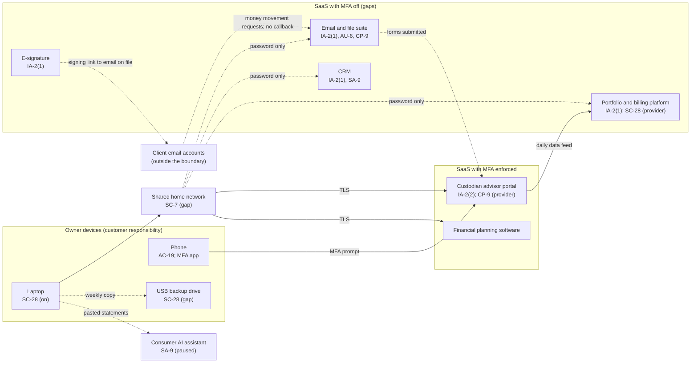

# SaaS Architecture and Control Placement: Cris Santos Company | Finance and Insurance | Sole Proprietorship

**Organization:** Cris Santos Company (state-registered investment adviser) | **Tier:** Sole Proprietorship | **Provider:** SaaS only (no IaaS or PaaS)
**System:** Advisory Practice Systems Profile (APSP), as defined in the system profile (P02)

## 1. Diagram
Control IDs on each node are the ones in `cloud-control-map.csv`. Dashed lines are flows with a gap (no MFA, no verification, or no suitable contract).

## 2. Layers
| Layer | Components | Key controls | Responsibility |
|---|---|---|---|
| Identity | Custodian, email, CRM, portfolio, e-signature, planning, accounting accounts | IA-2(1), IA-2(2), AC-2 | Customer configures; vendor provides MFA |
| Transactions | Money movement requests submitted to the custodian | AT-2(3) (callback rule) | Customer. The custodian's checks are a second line, not the first |
| Data | Custodian records, SaaS data, email and files, laptop copies, USB drive | SC-28, CP-9, SA-9 | Vendor protects data inside its service; customer decides where client data goes and keeps its own backup |
| Endpoints | Laptop, phone, USB drive | SC-28, AC-19 | Customer |
| Network | Home router and Wi-Fi | SC-7 | Customer |
| Logging | Email sign-ins and mailbox rules; custodian and platform activity | AU-2 (vendor), AU-6 (customer) | Shared: vendor records, customer reviews |
| SaaS applications and hosting | Custodian platform; each SaaS platform | Inherited (AC-3, AU-2, SC-5, PE family) | Provider |

## 3. Shared responsibility for SaaS
All three major cloud providers' shared responsibility models (SRC-AWS-SRM, SRC-AZURE-SRM, SRC-GCP-SRM) agree on the SaaS split: the provider runs the application, the platform, and the facilities; **the customer always keeps its identities and accounts, its data, and its devices.** That is why 13 of the 16 rows in the control map are the owner's alone. A custodian's fraud checks or a vendor's SOC 2 report never covers those layers. No IaaS provider equivalents table is needed, because the adviser runs no infrastructure.

## 4. Findings from the mapping
1. **The weakest link is the money movement path, not the custodian.** The custodian portal has strong MFA, but a forged request can reach it through a client's compromised email and a signing link sent to that same address. Only a callback to a known phone number breaks that chain (P01 R-001; the 2026-06-18 near miss).
2. **MFA is off where it is free to turn on** on five services, including the email tenant administrator account and the CRM that holds SSNs. Tracked as P01 R-002 and R-003.
3. **The USB drive is the least protected copy of everything.** It holds every client folder, unencrypted, in an unlocked drawer (R-004).
4. **Provider resilience is not the adviser's backup.** The email suite keeps 30 days of versions; the custodian keeps the records of account but not the adviser's own records (R-008, R-011).
5. **A consumer AI plan is a service provider without safeguards.** Its terms allow model training; use is paused (R-006; P10).
