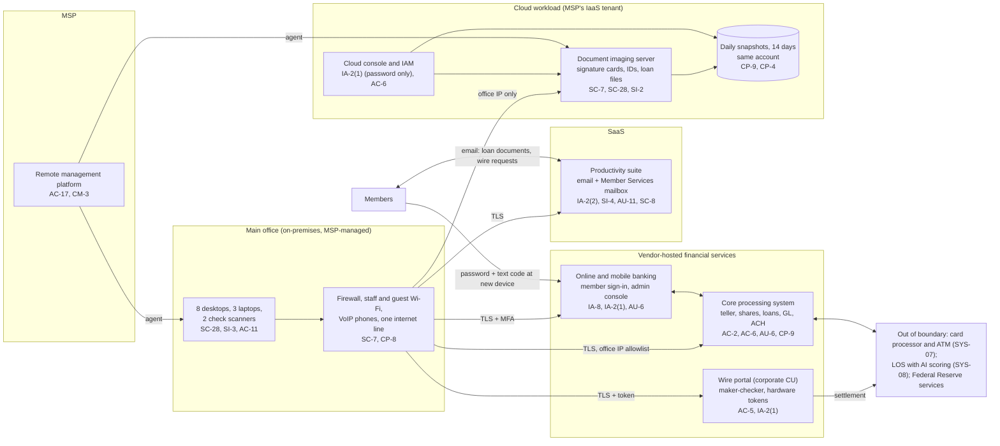

# Cloud Architecture and Control Placement: Cris Santos Company | Finance and Insurance | Micro

**Organization:** Cris Santos Community Federal Credit Union (member-owned federal credit union) | **Tier:** Micro | **Provider:** Vendor-agnostic SaaS plus one IaaS workload (see section 3)
**System:** Core and Digital Banking Platform (CDBP), as defined in the SSP (P02) | **Prepared:** 2026-07-24 by the Operations Manager (ISO) with the MSP lead technician | **Approved:** President and CEO, 2026-08-31

## 1. Diagram
The credit union runs no servers of its own. Its "cloud" is a set of vendor-hosted financial services and SaaS, plus one cloud workload that the MSP operates for it: the document imaging server in a public cloud IaaS tenant (SYS-09).

## 2. Layers and who is responsible
| Layer | Components | Key controls | Customer (credit union) | MSP (on the credit union's behalf) | Provider |
|---|---|---|---|---|---|
| Identity | Core, admin console, wire portal, suite, and cloud console accounts; member sign-in | AC-2, IA-2(1), IA-2(2), IA-8 | Decides who gets access; removes access; sets member authentication options | Creates and disables suite and device accounts; holds the cloud console login | Runs sign-in and MFA services; runs member authentication |
| Network | Firewall, Wi-Fi, phones, internet line; cloud network rules | SC-7, CP-8 | Approves changes; buys failover | Configures, patches, monitors | Not applicable (IaaS provider runs the physical network) |
| Compute | Endpoints; the imaging server's operating system | SC-28, SI-2, SI-3, AC-11 | Approves exceptions; keeps the inventory | Encryption, patching, antivirus, screen lock | IaaS: hypervisor and hardware |
| Vendor-hosted services and SaaS | Core, online banking, wire portal, suite, LOS | AC-3, AC-5, AC-6, SC-8 | Users, roles, limits, callbacks, sharing settings | Suite administration on request | Application, platform, data centers |
| Data | Member records, imaging files, snapshots, the nightly balance file | CP-9, CP-4, SC-28 | Decides retention and restore testing; protects local files | Operates snapshots and runs restore tests | Encrypts and replicates its own platform |
| Logging | Core reports, admin console log, suite logs, cloud activity log | AU-2, AU-6, AU-11, SI-4 | **Reviews logs monthly (gap today)** | Keeps firewall logs; sets suite alerts | Generates and stores logs |
| Vendor governance | Contracts, SOC reports, MSP review | SA-9 | Reviews SOC reports and maps CUECs; negotiates notice terms | Should hold the cloud tenant in the credit union's name | Provides SOC reports |

**The MSP is not a cloud provider in the shared responsibility sense.** It performs customer-side duties for the credit union. Anything marked "Customer (performed by MSP)" in `cloud-control-map.csv` remains the credit union's responsibility under Appendix A III.D: the credit union must require the controls by contract and monitor them.

## 3. Service categories and provider equivalents
The design is vendor-agnostic. The shared responsibility split in the three major cloud providers' models is the same: for SaaS, the provider runs the application, platform, and infrastructure while the customer keeps identities, access, data, and devices; for IaaS, the customer also runs the operating system, network rules, and backups (SRC-AWS-SRM, SRC-AZURE-SRM, SRC-GCP-SRM in `00_universal-framework/sources/source-register.csv`). For the credit union's vendors, SOC reports are the evidence of the provider side.

| Service category used | What it is here | Equivalent category in the large cloud providers (for reading their documentation) |
|---|---|---|
| Hosted core processing | Core system run by a core processor | Industry SaaS built on any provider |
| Hosted digital banking | Online and mobile banking | Industry SaaS built on any provider |
| Hosted wire service | Corporate credit union wire portal | Industry SaaS |
| Productivity suite | Email, calendar, file storage | Productivity and collaboration SaaS |
| Virtual server (IaaS) | Document imaging server | Virtual machines with managed disks |
| Snapshot backup | Daily server snapshots | Block storage snapshots; a backup vault in a separate account is the target design |
| Remote monitoring and management | MSP device management | Device management SaaS |

## 4. Findings from the mapping
1. **Snapshots are not a backup (CP-9, CP-4).** The imaging server's snapshots live in the same cloud account, under the same MSP login, as the server. Anyone who takes that login can delete both. Fix: a copy to a separate account or vault with immutable retention, and a restore test by 2026-09-30. Tracked as P01 R-010 and P07 POAM-008 and POAM-009.
2. **The cloud console login has no MFA and is shared (IA-2(1), AC-6).** Two MSP technicians use one password-only administrator login. Fix: named accounts with MFA and a separate role for deleting snapshots by 2026-09-30 (POAM-003).
3. **The tenant belongs to the MSP.** The credit union's imaging records sit in the MSP's cloud account, and the credit union has no login. If the MSP relationship ends, access to signature cards and ID copies depends on the MSP's cooperation. Fix: move the workload into a tenant held in the credit union's name, with the MSP as a delegated administrator, at the MSP contract renewal (R-014).
4. **Member authentication is the weak layer in vendor services.** The digital banking provider offers stronger options, but the credit union chose a text code at new-device registration only and turned off member alerts (IA-8; R-003).
5. **The wire portal enforces dual control but cannot verify the member.** Maker-checker in the portal proves two employees agreed; it does not prove the member asked. That check (the callback) is entirely customer-side and is missing (R-001).
6. **The LOS and the card processor sit outside the boundary on purpose.** They are mapped only to show the SA-9 duty. The AI scoring add-on is assessed in P10.
