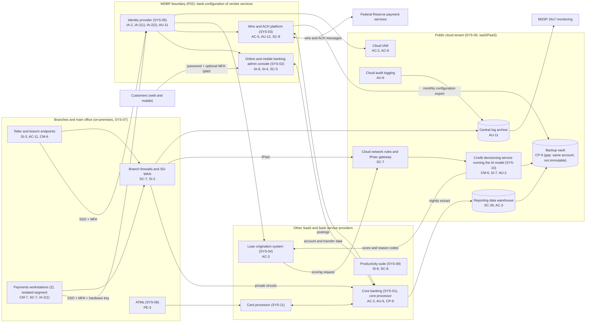

# Cloud Architecture and Control Placement: Cris Santos Company | Finance and Insurance | Small

**Organization:** Cris Santos Bank, N.A. (community commercial bank) | **Tier:** Small | **Provider:** Vendor-agnostic public cloud tenant (IaaS/PaaS) plus SaaS and bank service providers (see section 3)
**Scope:** the cloud tenant (SYS-06) and the SaaS services the bank configures, with the Wire and Digital Banking Platform (WDBP) boundary from the SSP (P02) marked. Mapping prepared 2026-07-24 by the IT Manager (Information Security Officer); approved with the SSP on 2026-08-31.

## 1. Diagram

## 2. Layers
| Layer | Components | Key controls | Responsibility |
|---|---|---|---|
| Identity | Identity provider tenant, cloud IAM, core user administration, admin console and wire platform roles | AC-2, AC-6, IA-2, IA-2(1), IA-2(2), IA-8 | Bank (configuration, users, roles); providers (service) |
| Network / edge | Branch firewalls and SD-WAN, isolated payments segment, private circuits to the core processor, IPsec to the cloud tenant, cloud network rules | SC-7, SI-2, SC-8 | Bank (branch and tenant rules); providers (their edge and DDoS protection, SC-5) |
| Compute / application | Credit decisioning service (PaaS container), endpoints, payments workstations | CM-6, CM-7, SI-3, SI-7 | Bank (container configuration, model version, endpoints); provider (PaaS runtime) |
| Data | Reporting data warehouse, backup vault, core and payments data at providers | SC-28, AC-3, CP-9 | Shared: providers encrypt; bank controls access, network exposure, retention, and backup isolation |
| Logging / monitoring | Cloud audit logging, central log archive, identity provider sign-in logs, admin console and wire platform audit trails, core user activity reports | AU-2, AU-6, AU-11, AU-12, SI-4 | Shared: providers generate records; bank retains and reviews them (review is the main gap) |
| SaaS and bank service providers | Core banking, online banking, wire platform, LOS, productivity suite, card processor | AC-3, AC-5, AU-12, IA-8, SC-8, SI-8 | Provider (application and infrastructure); bank (users, entitlements, security settings, and the CUECs in each SOC report) |
| Physical / hypervisor | Provider data centers | PE-3 | Provider (inherited, per SOC reports) |

**Mapping totals (`cloud-control-map.csv`):** 33 rows covering 18 components. By responsibility: 20 Customer (bank), 8 Shared, 5 Provider.

## 3. Service categories and provider equivalents
The bank's design is independent of the cloud provider. This table gives each provider's name for each service category, to use when reading its shared responsibility documentation.

| Service category | AWS | Microsoft Azure | Google Cloud |
|---|---|---|---|
| Managed containers (credit decisioning service) | Amazon ECS or AWS Fargate | Azure Container Apps | Cloud Run |
| Data warehouse | Amazon Redshift | Azure Synapse Analytics | BigQuery |
| Object storage (log archive) | Amazon S3 | Azure Blob Storage | Cloud Storage |
| Backup service | AWS Backup | Azure Backup | Backup and DR Service |
| Identity and access management | AWS IAM | Azure role-based access control with Microsoft Entra ID | Cloud IAM |
| Audit logging | AWS CloudTrail | Azure Monitor activity log | Cloud Audit Logs |
| Site-to-site VPN | AWS Site-to-Site VPN | Azure VPN Gateway | Cloud VPN |
| Network filtering | Security groups | Network security groups | VPC firewall rules |

Shared responsibility sources: SRC-AWS-SRM, SRC-AZURE-SRM, SRC-GCP-SRM in `00_universal-framework/sources/source-register.csv`. All three models agree on the split used here:
- **IaaS:** the provider owns physical facilities, hosts, and the virtualization layer. The bank owns the guest operating system, applications, network configuration, identities, and data.
- **PaaS:** the provider also owns the runtime. The bank owns the container image settings, the application (the model and its version), access, and data.
- **SaaS and bank service providers:** the provider also owns the application. The bank keeps identities, entitlements, security settings, data, and devices. For the core processor, the digital banking provider, and the payments service provider, the SOC reports list complementary user entity controls (CUECs) that the bank must operate (P09).

The Interagency Guidelines make no distinction by hosting model: the bank must oversee service providers and require them by contract to safeguard customer information (12 CFR 30 App. B III.D). The core processor, the digital banking provider, and the card processor are also bank service providers under 12 CFR 53.4, so they must notify the bank of certain incidents (P03 G-041; P08).

## 4. Findings from the mapping
1. **Backup isolation (CP-9).** The backup vault shares the production account and administrator roles and is not immutable. A ransomware actor with cloud admin rights could delete it. Fix: separate backup account with immutable retention and quarterly restore tests. Tracked as P01 R-004 and P07 POAM-011.
2. **Log retention and review (AU-6, AU-11).** Identity provider sign-in logs keep the default 30 days, and admin console, wire platform, and core user activity logs are generated but not reviewed. Fix: forward identity and admin console logs to the central log archive, a daily beneficiary and limit change report, and a monthly core user activity review. Tracked as R-009 and R-027, P07 POAM-004.
3. **Customer authentication is a bank setting, not a provider gap (IA-8).** The digital banking provider supports MFA, but the bank left it optional. This is the largest configuration gap on the diagram (R-002; P07 POAM-002).
4. **Cloud configuration baseline (CM-6).** The credit decisioning service runs the model vendor's container settings with no documented baseline or posture alerts (R-022). The workload is reachable only from the main office over IPsec and from the LOS vendor's published address range, which limits exposure.
5. **Inherited controls rely on SOC reports.** Controls marked Provider or Shared in the CSV depend on the SOC reports of the core processor (reviewed 2026-08-20, P09), the digital banking provider, the payments service provider, and the cloud provider. The last three are due for documented review by 2026-11-30.
