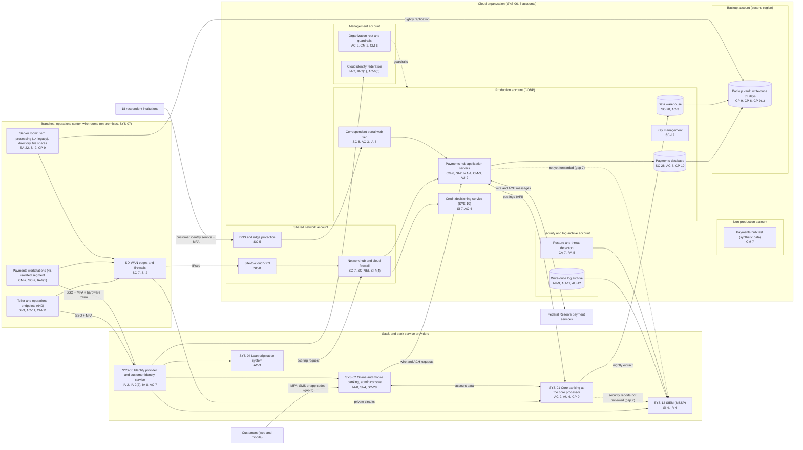

# Cloud Architecture and Control Placement: Cris Santos Company | Finance and Insurance | Mid-Market

**Organization:** Cris Santos Bank, N.A. (regional commercial bank) | **Tier:** Mid-Market | **Provider:** Vendor-agnostic public cloud (see section 4), plus SaaS and bank service providers
**System:** Core and Online Banking Platform (COBP), as defined in the SSP (P02) | **Prepared:** 2026-07-24 by the Cloud Platform Manager and the ISO; updated 2026-09-18 with P07 results
**Control map:** `cloud-control-map.csv` (55 rows, 24 components)

## 1. Diagram

## 2. Landing zone design
The landing zone separates duties across 6 accounts (subscriptions or projects, depending on the provider) under one cloud organization, so that compromise of any one account limits what an attacker can reach.

| Account | Purpose | Who administers | Key design decisions |
|---|---|---|---|
| **Management** | Organization root, guardrails, account vending, cloud identity federation to SYS-05 | Cloud Platform Manager (2 people); root keys held by the ISO and the CIO | No workloads. Guardrails apply to all member accounts and cannot be disabled from them |
| **Security and log archive** | Organization audit trail, flow logs, posture and threat detection, write-once log archive | ISO and 3 security analysts | Logs from every account land here; member-account administrators cannot delete them |
| **Shared network** | Network hub, cloud firewall, site-to-cloud VPN from both operations sites, DNS, edge protection for the correspondent portal | Infrastructure team | All traffic between sites, accounts, and the internet passes the hub. Deny by default |
| **Production** | Payments hub and correspondent portal, payments database, credit decisioning service, data warehouse, key management | Cloud Platform Manager's team; payments hub vendor for application support | Separate subnets per workload. No direct internet ingress except the correspondent portal behind edge protection. Customer-managed keys |
| **Non-production** | Payments hub test and upgrade staging | Application team | Synthetic data only; no network path to production data |
| **Backup (second region)** | Backup vault with 35-day write-once retention; replication target for on-premises backups | 2 named backup administrators | Separate credentials, not federated to everyday accounts. Backups are written by a cross-account role that cannot delete |

## 3. Layers and shared responsibility per service
| Layer | Components | Key controls | Service model | Responsibility |
|---|---|---|---|---|
| Identity | Federation, guardrails, PAM, identity provider, customer identity service | IA-2, IA-2(1), IA-2(2), IA-8, AC-2, AC-6(5), AC-7 | PaaS / SaaS | Bank configures identities, roles, MFA, and reviews; providers run the identity services |
| Network | Hub, cloud firewall, VPN, DNS, edge protection, SD-WAN | SC-7, SC-7(5), SC-8, SC-5, SI-4(4) | IaaS / PaaS | Bank designs routes, rules, and segmentation; provider runs gateway, DNS, and edge services |
| Compute | Payments hub servers, correspondent portal tier, credit decisioning service, test environment | CM-3, CM-6, CM-7, SI-2, SI-3, SI-7, MA-4, AC-3, AC-4 | IaaS / PaaS | Bank (guest OS, application configuration, EDR); payments hub vendor for application code under contract; provider for hosts and runtime |
| Data | Payments database, data warehouse, keys, backups | SC-28, SC-12, CP-9, CP-9(1), CP-6, CP-10, AC-3, AC-6 | PaaS | Shared: provider encrypts and operates storage and database engines; bank controls keys, access, isolation, retention, and restore testing |
| Logging and monitoring | Audit trail, log archive, posture service, SIEM | AU-2, AU-9, AU-11, AU-12, CA-7, RA-5, SI-4, IR-4 | PaaS / SaaS | Shared: providers generate logs and detections; bank enables, retains, forwards, and acts on them; MSSP monitors |
| SaaS and bank service providers | Core, online banking, LOS, productivity suite | AC-2, AC-3, AU-6, CP-9, IA-8, SI-4, SI-8, SC-28 | SaaS | Provider runs the application and infrastructure; bank keeps users, roles, security settings, report review, and the CUECs in each SOC report |
| On-premises | Branches, operations center, wire rooms, server room | SC-7, SA-22 | Bank-operated | Bank |
| Physical | Provider data centers | PE-3 | All | Provider (inherited, evidenced by SOC reports) |

**Responsibility counts in `cloud-control-map.csv`:** 30 Customer, 20 Shared, 5 Provider. By service model: 31 PaaS, 13 SaaS, 8 IaaS, 2 on-premises, and 1 physical row covering all models. The customer side is always identity, data protection, and logging, as the three providers' shared responsibility models agree.

The Interagency Guidelines make no distinction by hosting model: the bank must oversee service providers and require them by contract to safeguard customer information (12 CFR 30 App. B III.D). The core processor, the digital banking provider, and the other bank service providers must also notify the bank of certain incidents under 12 CFR 53.4 (P03; P08). The cloud provider hosts bank-run workloads and is overseen as a critical third party under the same III.D duties.

## 4. Service categories and provider equivalents
The design is independent of the provider. This table gives each provider's name for each service category, for reading its shared responsibility documentation (SRC-AWS-SRM, SRC-AZURE-SRM, SRC-GCP-SRM in `00_universal-framework/sources/source-register.csv`).

| Service category | AWS | Microsoft Azure | Google Cloud |
|---|---|---|---|
| Multi-account organization and guardrails | AWS Organizations, service control policies | Management groups, Azure Policy | Resource Manager folders, organization policies |
| Account, subscription, or project | Account | Subscription | Project |
| Cloud identity federation | IAM Identity Center | Microsoft Entra ID with Azure RBAC | Cloud Identity with IAM |
| Network hub | Transit Gateway | Virtual WAN hub or hub virtual network | Network Connectivity Center or shared VPC |
| Cloud firewall | AWS Network Firewall | Azure Firewall | Cloud NGFW |
| Edge protection | AWS Shield and AWS WAF | Azure DDoS Protection and Web Application Firewall | Cloud Armor |
| Site-to-cloud VPN | Site-to-Site VPN | VPN Gateway | Cloud VPN |
| Virtual machines | EC2 | Virtual Machines | Compute Engine |
| Managed containers (credit decisioning service) | Amazon ECS or AWS Fargate | Azure Container Apps | Cloud Run |
| Managed relational database (payments database) | Amazon RDS | Azure SQL Database | Cloud SQL |
| Data warehouse | Amazon Redshift | Azure Synapse Analytics | BigQuery |
| Backup service with write-once retention | AWS Backup (vault lock) | Azure Backup (immutable vault) | Backup and DR Service |
| Key management | AWS KMS | Azure Key Vault | Cloud KMS |
| Audit logging | CloudTrail | Azure Monitor activity log | Cloud Audit Logs |
| Posture and threat detection | Security Hub, GuardDuty | Microsoft Defender for Cloud | Security Command Center |

**Service model split used here (all three providers agree):**
- **IaaS** (virtual machines, VPN): the provider owns facilities, hosts, and virtualization. The bank owns the guest OS, applications, network configuration, identities, and data.
- **PaaS** (managed database, containers, backup, key service, firewall service): the provider also owns the platform software and its patching. The bank owns access, keys, data, and configuration.
- **SaaS and bank service providers** (core, online banking, identity provider, SIEM): the provider also owns the application. The bank keeps identities, entitlements, security settings, report review, and data.

## 5. Findings from the mapping
1. **Payments resilience is designed but unproven (CP-10).** Cross-region failover of the payments database and hub exists on paper; the 2025 test took 9 hours against a 4-hour RTO, mostly because DNS changes, the Federal Reserve connection, and reconciliation of in-flight wires were manual. Fix: scripted failover, a pre-approved second-region connection, a reconciliation runbook, and a retest by 2027-03-31 (P01 R-004).
2. **Payments events are invisible to the SIEM (AU-2, SI-4).** The payments hub, correspondent portal, and core security reports are not forwarded, so a beneficiary, limit, or contact-information change cannot be correlated with a suspicious sign-in (gap 7; R-013). Fix: onboard these sources and write change-anomaly use cases by 2027-01-31.
3. **Vendor support is a standing path into production (MA-4).** The payments hub vendor keeps an always-on VPN into the production account. Fix: move it behind PAM with per-session approval and recording (R-048).
4. **A default-pattern account was found in the portal (IA-5).** P07 found 2 vendor-created generic administrator accounts in the correspondent portal. They were disabled on 2026-08-14 and added to P01 as R-049.
5. **Isolation of backups is the strongest control.** The backup account is in a second region with write-once retention and separate credentials (CP-9, CP-6). Full restores of the payments database have not been tested (CP-9(1)).
6. **Customer authentication is a bank setting, not a provider gap (IA-8).** The digital banking provider supports app-based push and passkeys; the bank chose SMS codes for consumers (gap 3; R-002, R-016).
7. **Boundary check.** Every in-scope component in the SSP (P02 section 9) appears in the diagram, every cloud account has at least one row in the control map, and each account has controls from at least 2 of the AC, AU, CM, IA, SC, and SI families or inherits them.
8. **Inherited controls rely on SOC reports.** Controls marked Provider or Shared for the core processor, the digital banking provider, the cloud provider, the identity vendor, and the MSSP depend on their SOC reports and the CUECs the bank operates, reviewed each year in P09 `vendor-soc2-review.csv`.
