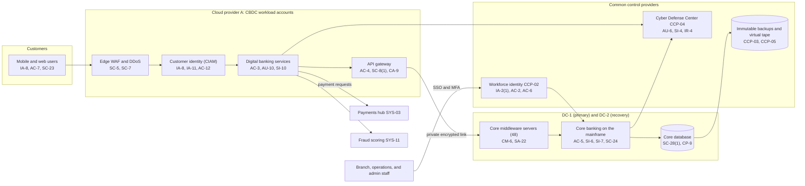

# System Security Plan: Core Banking and Digital Channels Platform (CBDC)

**Organization:** Cris Santos Company, Inc. (publicly traded bank holding company); system operated by Cris Santos Bank, N.A. | **Tier:** Enterprise | **Vertical:** Finance and Insurance
**Outline:** NIST SP 800-18 Rev. 2, System Security Plan Outline Example (June 2026) | **Version:** 3.0, 2026-09-18

## 1. System Name and Identifier
Core Banking and Digital Channels Platform (**CBDC**), identifier CSB-SYS-CBDC-001. Tier-1 system in the enterprise application inventory.

## 2. System Overview
The CBDC platform is the bank's system of record and its main customer channel. It holds about 3.9 million deposit accounts and the loan accounts of the bank, posts every transaction, and serves about 2.4 million consumer and 180,000 business digital banking users. Through digital banking, customers view balances, move money, pay bills, and initiate wires, ACH payments, and person-to-person payments, which the platform hands to the payments hub (SYS-03) after fraud and sanctions checks.

**Why integrity and availability matter most.** An altered balance, payment instruction, or beneficiary causes direct financial loss to customers or the bank and can misstate the bank's books. An outage longer than 8 hours stops service to a material portion of customers, which would make the incident a notification incident under 12 CFR 53.2(b)(7) and likely a matter for the disclosure committee.

**Major components:**
- Core banking software (licensed) on the mainframe in DC-1 (Florida), with recovery in DC-2 (North Carolina), plus about 48 distributed core middleware servers (integration, batch scheduling, statement rendering)
- Core database (on the mainframe), replicated to DC-2 and backed up to virtual tape in DC-2
- Digital banking services (bank-built) on managed containers in Cloud provider A, with managed databases for session, device, and preference data
- API gateway and integration layer (Cloud provider A to the data centers over private encrypted links)
- Customer identity service (CIAM) on Cloud provider A, a component of the SYS-05 identity platform
- Teller, platform, and contact center applications that call core services

Users: about 9,800 workforce users with core roles (branch, operations, contact center, lending, and technology staff), about 310 privileged administrators, and customers through digital banking.

## 3. Laws, Regulations, and Policies Affecting the System
| ID | Requirement | Citation | How it affects the CBDC |
|---|---|---|---|
| N52-R01 | Gramm-Leach-Bliley Act privacy and safeguards | 15 U.S.C. 6801-6809 | The platform holds nonpublic personal information of every bank customer |
| N52-R02 | Interagency Guidelines Establishing Information Security Standards (OCC) | 12 CFR Part 30, Appendix B, with Supplement A | The primary regulation for this plan. Every III.C.1 measure applies (access controls, physical access, encryption, change procedures, dual control, monitoring, response program, and protection against environmental hazards and technological failures) |
| N52-R02 (App. D) | OCC heightened standards | 12 CFR Part 30, Appendix D | The platform's risks roll into the risk governance framework; Internal Audit's assessment (P07) is part of the audit plan under App. D II.C.3 |
| 12 CFR 53 | Computer-security incident notification (bank) | 12 CFR 53.2, 53.3, 53.4 | An extended outage or compromise may be a notification incident; OCC notice within 36 hours of the determination. Bank service providers that support the platform must notify the bank (53.4) |
| 12 CFR 225 Subpart N | Incident notification (parent) | 12 CFR 225.302 | Parallel 36-hour notice to the Federal Reserve when the parent is affected |
| N52-R08 | SEC cybersecurity disclosure | Form 8-K Item 1.05; 17 CFR 229.106 | A material CBDC incident goes through the P08 materiality step; the plan supports the Item 106 description of processes |
| 12 CFR 41.90 | Identity theft red flags (OCC) | 12 CFR 41.90 | Digital banking detects red flags at enrollment, sign-in, and contact data changes |
| 12 CFR 21.11 | Suspicious activity reports | 12 CFR 21.11 | Fraud cases from the platform feed SAR decisions; supporting records kept 5 years |
| State | State breach notification laws | Each state where affected individuals reside (Florida worked example: Fla. Stat. 501.171) | Notification (P08) |
| Contract | Card network and processor rules; commercial client agreements; SOC 2 (P09) | Contracts | Platform commitments to clients and processors |
| Internal | POL-01 to POL-05 and standards | P06 | Enterprise policy hierarchy |

Not applicable to this system: N52-R03 (FTC Safeguards Rule; the bank is OCC-supervised), N52-R04 (NYDFS Part 500; no New York license), N52-R05 and N52-R06 (Regulation S-P and S-ID apply to the broker-dealer's systems, SYS-14, not to the CBDC platform), N52-R07 (NAIC Model #668; no insurance licensee).

## 4. System Status
### 4.1 System Security Plan Approval
Prepared by the Head of Core Banking Technology and the Head of Digital Banking Technology with the GRC team. Reviewed by the CISO and the Director of Technology and Operational Risk (second line). Approved by the Chief Operating Officer on 2026-09-18.
### 4.2 System Authorization Decision
The bank is not a federal agency, so there is no formal ATO. The equivalent internal decision:
- **Authorizing official equivalent:** Chief Operating Officer, on the recommendation of the CISO and with the concurrence of the Chief Risk Officer.
- **Decision (2026-09-18):** continue operation with conditions, based on the Internal Audit assessment (P07) and the enterprise risk register (P01). The executive risk committee recorded the decision on the same day.
- **Conditions:** bring mainframe privileged access into PAM (POAM-002, due 2027-03-31); send core maintenance events to the SIEM with fraud use cases (POAM-003, due 2026-12-31); remove the dormant integration service account and review all non-expiring service credentials (POAM-013, due 2026-10-31); fund and build the cyber vault (POAM-020, due 2027-06-30).
- **Reauthorization:** annually, or after a major change (for example, the planned core software major release in 2027).
### 4.3 System Operational Status
Operational. Planned major modifications: cyber vault for core data (CP-9(3)); mainframe connector for identity governance (AC-2(1)); retirement of SMS passcodes for customers (IA-8).

## 5. Role Identification and Responsible Personnel
| Role | Title | Responsibility |
|---|---|---|
| System owner | Head of Core Banking Technology (with the Head of Digital Banking Technology for SYS-02 components) | Accountable for the platform and this plan; approves technical access roles |
| Business owners | Head of Consumer and Small Business Banking; Head of Payments Operations | Approve business roles, limits, and customer-facing changes |
| Authorizing official (equivalent) | Chief Operating Officer | Accepts residual risk to operate |
| Information security | CISO; Director of Cyber Defense | Program ownership; monitoring and incident response |
| Second-line risk oversight | Director of Technology and Operational Risk (under the Chief Risk Officer) | Independent challenge of this plan and its risk ratings |
| Privacy | Chief Privacy Officer | Customer notice decisions; GLBA privacy |
| Common control providers | See section 10.3 | Operate inherited controls |
| Independent assessor | Chief Audit Executive (Internal Audit) | Annual assessment (P07) |

## 6. System Information Types and System Categorization
Information types come from NIST SP 800-60 Vol. 2 Rev. 1 (the closest federal types are used as models). Impact levels follow FIPS 199.

| Information type | Confidentiality | Integrity | Availability | Rationale |
|---|---|---|---|---|
| Customer accounts and transactions (balances, postings, account numbers, customer information file) | Moderate | **High** | **High** | Disclosure harms customers and triggers notice duties, but account numbers and credentials can be reissued. An altered balance or posting causes direct financial loss and misstated books. The core's MTD is 8 h (P05 BP-04), and a longer outage affects a material portion of customers |
| Payment instructions and beneficiaries (digital initiation) | Moderate | **High** | High | A changed beneficiary or amount sends money to a fraudster within minutes; wire MTD 4 h (P05 BP-01) |
| Customer credentials and authentication data | **High** | High | Moderate | Compromise enables account takeover across many customers |
| Information security (logs, keys, configuration) | Moderate | High | Moderate | Protects the evidence and the integrity controls |
| **CBDC category (high-water mark)** | **High** | **High** | **High** | **High system** |

**Categorization decision.** The platform is **High** under the FIPS 199 high-water mark and uses the **SP 800-53B High baseline**, tailored for a non-federal bank. The executive risk committee approved the categorization on 2026-09-18.

**Documented controls.** `control-implementation.csv` documents **204 controls**: all 188 base controls of the High baseline, plus 16 control enhancements that carry bank-specific implementation detail (for example IA-2(1), CP-9(3), and SI-7(1)). The remaining High-baseline enhancements are fully inherited from the enterprise common control catalog (section 10.3) and are listed there rather than repeated here. The `csf2_subcategories` column uses the official CSF 2.0 to SP 800-53 crosswalk in `00_universal-framework/crosswalks/` and is blank where that crosswalk lists no subcategory for the control.

## 7. Authorization Boundary Description
**Inside the boundary:** the core banking software, database, and middleware servers in DC-1 and DC-2; the digital banking services and their data stores in the CBDC workload accounts on Cloud provider A; the API gateway and integration layer; the CIAM service configuration for digital banking; and the teller, platform, and contact center application components that call core services.

**Outside the boundary (common control providers and interconnected systems):**
- Landing zone services (network hub, key management, log archive, backup accounts, standby region): CCP-03
- Identity platform for the workforce (SSO, MFA, PAM, IGA): CCP-02
- Cyber Defense Center (SIEM, EDR, scanners): CCP-04
- Data center facilities, mainframe platform services, and virtual tape: CCP-05
- Payments hub (SYS-03), treasury management platform (SYS-04), card processor (SYS-10), fraud and sanctions platforms (SYS-11), enterprise data platform (Cloud provider B)

The enterprise multi-cloud diagram is in P04 `cloud-architecture.md`.

## 8. Information Exchanges Summary
| Connected system / party | Direction | Data | Agreement |
|---|---|---|---|
| Payments hub (SYS-03) | Bidirectional (message queue over the data center network) | Wire, ACH, and instant payment requests; status | Internal interface agreement |
| Treasury management platform (SYS-04) | Bidirectional (host-to-host over a private encrypted link) | Balances, postings, payment requests for commercial clients | Vendor contract with security and incident notice terms; interface specification |
| Card processor (SYS-10) | Bidirectional (dedicated circuits) | Authorizations, stand-in files, settlement | Processor contract; 12 CFR 53.4 contact confirmed |
| Fraud and sanctions platforms (SYS-11) | Bidirectional (API) | Login and payment events, risk scores, holds | Internal interface agreement; vendor software licenses |
| Enterprise data platform (Cloud provider B) | Outbound nightly | Account and transaction data for analytics and credit decisioning | Internal data sharing agreement; masking of account numbers |
| Loan origination systems (SYS-09) | Bidirectional | New loan bookings; deposit account data for underwriting | Vendor contracts |
| Statement and notice vendor | Outbound | Statements and customer notices | Contract with confidentiality and disposal terms |
| Core software vendor | Remote support (through PAM) | Troubleshooting access | Support agreement; **9 critical contracts lack incident notice terms enterprise-wide (POAM-019); the core vendor's contract is compliant** |

## 9. System Component Inventory
| Component | Type | Location / provider | Owner |
|---|---|---|---|
| Core banking software and database | Licensed software on mainframe logical partitions | DC-1 (active), DC-2 (recovery) | Head of Core Banking Technology |
| Core middleware servers (48) | Distributed servers (4 on an operating system in extended support) | DC-1 and DC-2 | Head of Core Banking Technology |
| Digital banking services | Managed containers (bank-built services) | Cloud provider A, primary region; warm standby in second region | Head of Digital Banking Technology |
| Digital banking data stores | Managed databases (PaaS) | Cloud provider A | Head of Digital Banking Technology |
| API gateway and integration layer | Managed API service and integration servers | Cloud provider A; DC-1 and DC-2 | Head of Digital Banking Technology |
| CIAM configuration | SaaS component of the identity platform | Cloud provider A region | Director of Identity and Access Management |
| Teller, platform, and contact center application components | Endpoint and server applications | Branches, contact centers, DC-1 | Head of Core Banking Technology |

## 10. Control Implementation Details
### 10.1 Control implementation status
See `control-implementation.csv` (204 controls).

| Status | Count |
|---|---|
| Implemented | 184 |
| Partially implemented | 19 |
| Planned | 1 |
| **Total** | **204** |

| Inheritance | Count |
|---|---|
| Common (fully inherited from a common control provider) | 138 |
| Hybrid (shared between a provider and the CBDC team) | 35 |
| System-specific | 31 |

The Planned control is CP-9(3), the cyber vault. Partially implemented controls: AC-2, AC-6, AT-3, AU-2, AU-6, AU-12, CM-6, CP-2, CP-9, IA-5, IA-8, PS-4, RA-5, SA-9, SA-22, SI-2, SI-4, SR-6, SR-8.

### 10.2 Control assessment status
Internal Audit assessed 44 of these controls from 2026-06-15 to 2026-08-14 using SP 800-53A Rev. 5 procedures and statistical sampling (P07 `assessment-plan.md`, `assessment-results.csv`). Weaknesses are in P07 `poam.csv`.

### 10.3 Common control providers and inheritance
Common and hybrid controls are inherited from the enterprise platform. Each provider publishes its controls in the enterprise **common control catalog** (maintained by the GRC team in the GRC platform) and is assessed on its own cycle; the CBDC inherits the results.

| Provider | Name | Accountable role | Controls provided | Rows in this plan | Evidence of operation |
|---|---|---|---|---|---|
| CCP-01 | Enterprise GRC program | CISO (with the Chief Risk Officer and Chief Audit Executive for risk and assessment) | Policies and standards (P06), risk method, assessment, POA&M, continuous monitoring | 24 | Annual Internal Audit assessment (P07); GRC platform |
| CCP-02 | Identity platform (SYS-05) | Director of Identity and Access Management | SSO, MFA, PAM, identity governance, account lifecycle, CIAM platform | 19 | SOX IT general control testing; P07 AC-2, AC-6, IA-2 results |
| CCP-03 | Cloud landing zones (Cloud providers A and B) | Director of Cloud Platform Engineering | Account guardrails, key management, encryption, backups, log archive, change pipeline, standby region | 14 | Posture reports; provider SOC 2 Type 2 reports (physical and hypervisor) |
| CCP-04 | Cyber Defense Center | Director of Cyber Defense | 24x7 monitoring, SIEM, EDR, vulnerability management, incident response, threat intelligence | 26 | Monitoring metrics; P07 AU, SI, RA, IR results |
| CCP-05 | Data center and mainframe operations (DC-1, DC-2) | Director of Data Center and Mainframe Operations | Physical and environmental protection, mainframe platform services, replication, virtual tape, media handling | 34 | Facility reviews; DR test reports |
| CCP-06 | Enterprise network (SYS-07) | Director of Network Engineering | Segmentation, firewalls, transport encryption, DNS, carrier diversity | 12 | Rule base reviews; TLS scans |
| CCP-07 | Endpoint engineering (SYS-08) | Director of Endpoint Engineering | Workstation baselines, EDR agents, application control, device control | 9 | Configuration compliance reports |
| CCP-08 | Human resources and workforce training | Chief Human Resources Officer | Screening, terminations, training, acceptable use attestations, sanctions | 14 | HR and learning system reports |
| CCP-09 | Third-party risk management | Director of Third-Party Risk Management | Vendor tiering, due diligence, contracts, SOC report reviews, supply chain risk | 15 | Vendor register; SOC review files |
| CCP-10 | Enterprise resilience | Director of Enterprise Resilience | Contingency planning, coordination, training, and testing | 6 | DR test reports |

The 31 system-specific rows have no provider.

**Inheritance rules:**
- A Common control is fully inherited; the CBDC team verifies only that the platform is onboarded (for example, SSO integration, log forwarding, and account vending).
- A Hybrid control names both parts in the implementation statement: the provider's part and the CBDC team's part.
- If a provider's assessment finds a weakness, the finding is linked to every inheriting system's POA&M. Example: POAM-012 (late SOC report reviews) is a CCP-09 weakness that affects the CBDC because the card processor and the core software vendor support it.

## 11. Digital Identity Acceptance Statement
- **Workforce users:** SSO with MFA (authenticator app with number matching, or a FIDO2 security key). Privileged users use phishing-resistant FIDO2 keys through PAM. This is comparable to NIST SP 800-63 AAL2 for users and AAL3-like protection for privileged users. **Exception:** 41 mainframe IDs with standing privileges are outside PAM until POAM-002 closes; they use the mainframe security product with MFA at sign-in.
- **Consumer and business customers:** password plus a second factor (push approval in the mobile app, a one-time passcode, or a security key for business administrators), with step-up for new devices, new payees, limit changes, and contact data changes. This targets AAL2. **Gap:** 23% of consumer users still receive one-time passcodes by SMS, and step-up for new payees is skipped on trusted devices (POAM-005, due 2027-03-31). Enrollment follows the Customer Identification Program at account opening, comparable to IAL2 for remote enrollment.
- **Red flags:** the identity theft prevention program under 12 CFR 41.90 uses CIAM signals (new device, contact data change followed by a payee add) as red flags.

## 12. Referenced Artifacts
Scenario facts (`../00_company-facts.md`), BIA and dependency map (P05), multi-cloud architecture and control map (P04), enterprise risk register (P01), regulatory gap analysis (P03), policy hierarchy and policies (P06), Internal Audit assessment and POA&M (P07), BEC and wire fraud runbook (P08), SOC 2 readiness for SL-1 (P09), AI portfolio including AI-001 (P10), CBDC contingency plan v7, core failover test report 2026-04-25, enterprise common control catalog.

## 13. Acronym List and Glossary
- **AO:** authorizing official
- **BEC:** business email compromise
- **CBDC:** Core Banking and Digital Channels Platform
- **CCP:** common control provider
- **CIAM:** customer identity and access management
- **CUEC:** complementary user entity control
- **IGA:** identity governance and administration
- **NPI:** nonpublic personal information (GLBA)
- **PAM:** privileged access management
- **POA&M:** plan of action and milestones
- **Stand-in:** processing by the card processor with preset limits when the core is unavailable

## 14. System Security Plan Review and Change Records
| Version | Date | Change | Author |
|---|---|---|---|
| 1.0 | 2024-09-20 | Initial plan (High baseline) | Head of Core Banking Technology |
| 2.0 | 2025-09-19 | Added CIAM and the API gateway; common control provider mapping | Head of Core Banking Technology with the GRC team |
| 2.1 | 2026-05-29 | Acquired bank accounts converted to the core (2026-05-16) | Head of Core Banking Technology |
| 3.0 | 2026-09-18 | 2026 assessment results; conditions for continued operation | Head of Core Banking Technology and Head of Digital Banking Technology with the GRC team |
