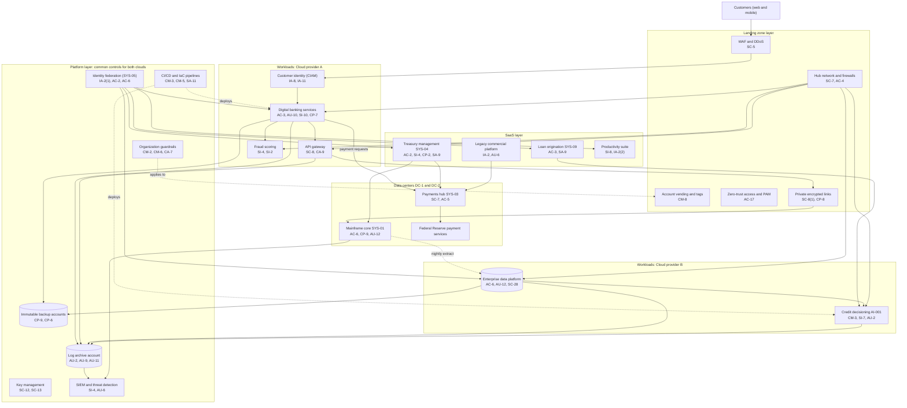

# Cloud Architecture and Control Placement: Cris Santos Company | Finance and Insurance | Enterprise

**Organization:** Cris Santos Company, Inc. (publicly traded bank holding company; Cris Santos Bank, N.A.) | **Tier:** Enterprise | **Provider:** Multi-cloud, vendor-agnostic: two public cloud providers (called Cloud provider A and Cloud provider B), two bank-owned data centers (DC-1 in Florida, DC-2 in North Carolina), and SaaS (see section 4)
**Owner:** Director of Cloud Platform Engineering, with the CISO and the Director of Data Center and Mainframe Operations | **Date:** 2026-08-28 | **Related:** CBDC SSP (P02), enterprise BIA (P05)

## 1. Architecture in layers
The estate is organized in five layers. Each lower layer provides **common controls** that the layers above inherit, so a workload team configures only what is specific to its system.

| Layer | What it is | Examples | Who runs it |
|---|---|---|---|
| **Platform** | Organization-wide services in both clouds | Organization guardrails, identity federation, key management, log archive, SIEM feeds, vulnerability and posture management, immutable backup accounts, CI/CD pipelines | Cloud Platform Engineering; Cyber Defense Center; Identity team |
| **Landing zone** | The standard account pattern every workload lands in | Account vending with mandatory tags, hub-and-spoke network with cloud firewalls, private encrypted links to DC-1 and DC-2, WAF and DDoS protection, private DNS, zero-trust and PAM access | Cloud Platform Engineering; Network Engineering |
| **Workload** | Systems the bank builds or runs in the clouds | Cloud A: digital banking services (SYS-02), API gateway, customer identity service (CIAM), fraud scoring (SYS-11). Cloud B: enterprise data platform, machine learning platform, credit decisioning service (AI-001) | Application teams (for example, the Head of Digital Banking Technology) |
| **SaaS** | Vendor-operated applications | Treasury management platform (SYS-04), legacy commercial platform of the acquired bank, loan origination (SYS-09), productivity suite, trust platform, ERP | Vendors, with the bank's configuration and oversight |
| **Data center** | Bank-owned facilities | Mainframe and core banking (SYS-01), payments hub and Federal Reserve connectivity (SYS-03), sanctions screening, virtual tape | Data Center and Mainframe Operations |

The core banking platform and the payments hub stay in the bank's data centers. Digital channels and analytics run in the clouds and reach the core only through the API layer over private encrypted links.

## 2. Diagram

## 3. Responsibility by service model
Sources: SRC-AWS-SRM, SRC-AZURE-SRM, and SRC-GCP-SRM in `00_universal-framework/sources/source-register.csv`. The three published models agree on the split used here, so the design does not depend on which two providers the bank uses.

| Service model | Provider | Bank (customer) | Shared |
|---|---|---|---|
| IaaS (fraud scoring servers, integration servers) | Facilities, hosts, hypervisor, physical network | Guest OS, applications, identities, data, network policy | Encryption (provider service, bank keys), logging |
| PaaS (containers, managed databases, data platform, machine learning platform) | Also the platform runtime and its patching | Data, access, configuration, keys, application code, models | Backups, availability configuration |
| SaaS (treasury platform, legacy platform, loan origination, productivity suite, trust platform, ERP) | Also the application | Users, roles, data, oversight of the vendor | Monitoring feeds; complementary user entity controls |
| Bank data centers | None | Everything, from facility to application | None |

## 4. Service categories and provider equivalents
| Service category | AWS | Microsoft Azure | Google Cloud |
|---|---|---|---|
| Organization guardrails | AWS Organizations service control policies | Azure Policy with management groups | Organization Policy Service |
| Account vending | AWS Control Tower account factory | Azure landing zone subscription vending | Resource Manager project creation |
| Key management | AWS KMS | Azure Key Vault | Cloud KMS |
| Audit logging | AWS CloudTrail | Azure Monitor activity log | Cloud Audit Logs |
| Threat detection | Amazon GuardDuty | Microsoft Defender for Cloud | Security Command Center |
| Managed containers | Amazon EKS | Azure Kubernetes Service | Google Kubernetes Engine |
| Managed relational database | Amazon RDS | Azure SQL Database | Cloud SQL |
| API gateway | Amazon API Gateway | Azure API Management | Apigee API Management |
| Machine learning platform | Amazon SageMaker | Azure Machine Learning | Vertex AI |
| Web application firewall | AWS WAF | Azure Web Application Firewall | Cloud Armor |
| Backup service | AWS Backup | Azure Backup | Backup and DR Service |

This table is for reading provider documentation only. The architecture, control map, and SSP describe service categories.

## 5. Common controls
`cloud-control-map.csv` has **66 rows** across 30 components: Platform 21, Landing zone 8, Workload 17, SaaS 13, Data center 7. Responsibility: Customer 45, Shared 19, Provider 2.

**29 rows are published as common controls** (`common_control` = Yes) in the enterprise common control catalog. They map to the common control providers in the CBDC SSP (P02 section 10.3): identity (CCP-02), cloud landing zones (CCP-03), Cyber Defense Center (CCP-04), data center operations (CCP-05), and network (CCP-06). A workload inherits them by being deployed through account vending, which applies the guardrails, logging, network, key, and backup policies automatically.

**Rules for inheriting:**
1. A workload may claim a common control only if its account was created by account vending and passes the posture baseline.
2. Customer-side identity, data protection, and logging stay explicit at every layer: even a SaaS application has Customer rows for access (AC-2, AC-3) and monitoring (AU-6, SI-4), because those are always the bank's responsibility.
3. SaaS rows cite the vendor's SOC report, reviewed by the third-party risk management team with complementary user entity controls mapped (P09 evidence map). This is how the bank meets the Interagency Guidelines' duty to monitor service providers where the risk assessment indicates (12 CFR 30 App. B III.D.3).
4. Data center rows are the bank's own. The provider responsibility model does not apply, so `shared_responsibility_ref` says so.

## 6. Validation against the CBDC SSP (P02)
Every CBDC component in the SSP boundary appears here with controls from each required family, directly or inherited:
| CBDC component | AC | AU | CM | IA | SC | SI |
|---|---|---|---|---|---|---|
| Digital banking services | AC-3 | AU-10; AU-2 and AU-9 (inherited) | CM-3 and CM-5 (inherited) | IA-2(1) (inherited) | SC-28; SC-7 (inherited) | SI-10 |
| Customer identity (CIAM) | AC-2 (inherited) | AU-2 (inherited) | CM-2 (inherited) | IA-8, IA-11 | SC-5 (inherited) | SI-4 (inherited) |
| API gateway and integration layer | AC-4 (inherited) | AU-2 (inherited) | CM-3 (inherited) | IA-2(1) (inherited) | SC-8; SC-8(1) (inherited) | SI-4 (inherited) |
| Mainframe core | AC-6 | AU-12 | CM-2 (P02, CCP-05) | IA-2 (P02, CCP-02) | SC-7 (payments segment) | SI-7 (P02) |

## 7. Findings from the mapping
1. **The core is not in the cloud, but its weakest links are.** Customer access to the core arrives through the cloud API layer. The integration identity register found a dormant service identity from a retired integration still enabled with query rights to the customer information file (P07 IA-5 finding; POAM-013).
2. **SaaS concentration in commercial payments.** The treasury platform has no platform-level fallback; its 4-hour contract RTO must be handled by contract and procedure, not architecture (POAM-018). Beneficiary monitoring depends on the vendor's event feed, and the bank's rules do not alert on new beneficiaries paid under $100,000 (POAM-006).
3. **Legacy platform outside the landing zone.** The acquired bank's commercial platform supports only SMS passcodes and sends only login events. It is retired with client migration by 2027-02-26 (POAM-004).
4. **Two clouds, one control set.** Guardrails, logging, and key policies are written once as code and applied to both clouds. Differences are limited to service names (section 4).
5. **Data center logging gap.** Cloud logging covers every account, but core maintenance events on the mainframe do not reach the SIEM (POAM-003), and mainframe privileged IDs sit outside PAM (POAM-002).
6. **No isolated copy of core data.** Cloud backups are immutable in separate accounts, but the core relies on replication and virtual tape inside the bank's own two data centers (POAM-020).
7. **Model releases are controlled like code.** The credit decisioning service accepts only model versions approved by Model Risk Management, and every scoring call is logged for adverse action and fair lending review (P10).
