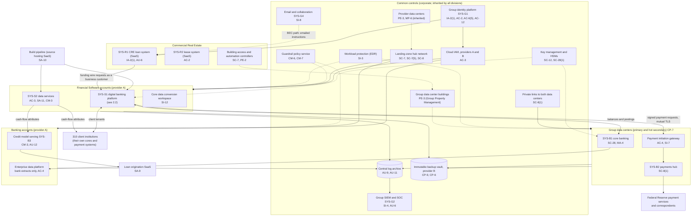
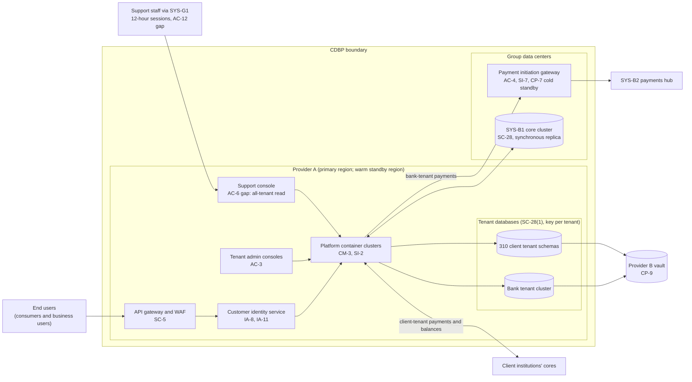

# Cloud Architecture and Control Placement: Cris Santos Company Holdings | Finance and Insurance | Multi-Sector

**Organization:** Cris Santos Company Holdings, Inc. | **Tier:** Multi-Sector | **Providers:** two public cloud providers, called provider A and provider B (vendor-agnostic; see section 5), plus two group data centers
**Scope:** the shared corporate platform (SYS-G3 data centers and landing zones, with SYS-G1, SYS-G2, and SYS-G4) plus the division workloads that run on it. The SSP system (P02) is the Core and Digital Banking Platform (CDBP).

## 1. Design in one paragraph
The group runs a **hybrid** estate. The bank's core (SYS-B1) and payments hub (SYS-B2) run in two group data centers, primary and hot secondary, because of payment system connections and the core's licensing. Everything else runs in one **landing zone** per cloud provider: identity federation from SYS-G1, a hub network with private links to both data centers, guardrail policies, a central log archive, key management, EDR, and an immutable backup vault in provider B. Each division gets its own **accounts** (subscriptions or projects) inside the landing zone and inherits these guardrails. Provider A hosts the digital banking platform (SYS-S1) in two regions, the Financial Software data services platform (SYS-S2), the bank's credit model serving (SYS-B3), and the enterprise data platform. The payment initiation gateway sits in the primary data center and is the only path from the platform to the payments hub. Commercial Real Estate runs mostly on SaaS (loan system, lease system) plus building controllers at each site.

## 2. Diagrams
### 2.1 Group platform and division workloads

### 2.2 Core and Digital Banking Platform (SSP boundary)

**Target state (POAM-003, POAM-008, POAM-009, POAM-011):** support console access is tenant-scoped and tied to a support ticket, with step-up authentication; workforce console sessions are bound to managed devices and last no more than 8 hours; business payment MFA can no longer be switched off by any tenant; the payment initiation gateway runs hot in both data centers and fails over in a tested runbook.

## 3. Common versus division-specific controls
`cloud-control-map.csv` has 57 rows across 32 components. The `control_scope` column shows who owns each placement:

| Scope | Rows | What it means |
|---|---|---|
| Common (group) | 26 | Provided once by corporate (SYS-G1 to SYS-G4, the data centers, and the data center buildings) and inherited by every division. Listed in the P02 common control catalog |
| Shared system (CDBP) | 15 | Controls of the shared banking platform documented in the P02 SSP |
| Division-specific (Banking) | 5 | Credit model serving, loan origination SaaS, bank extracts, the payment system link |
| Division-specific (Financial Software) | 6 | Data services, build pipeline, conversions, client notice tooling |
| Division-specific (Commercial Real Estate) | 5 | Loan and lease SaaS, building controllers |

| Responsibility | Rows |
|---|---|
| Customer (the group or a division) | 43 |
| Shared (provider and group) | 11 |
| Provider | 3 |

| Service model | Rows |
|---|---|
| PaaS | 23 |
| SaaS | 15 |
| On-premises (group data centers and buildings) | 10 |
| IaaS | 9 |

**Rule of thumb.** Identity, network guardrails, logging, keys, backups, EDR, email protection, and data center physical security are **common**. A division cannot opt out of them, only request an exception through POL-01. Application behavior, tenant and customer identity, and data access inside an application are **division-specific** or belong to the CDBP, because they depend on each division's regulators and clients.

## 4. Layers
| Layer | Common components | CDBP and division components | Key controls | Responsibility |
|---|---|---|---|---|
| Identity | SYS-G1, cloud IAM | Customer identity service, tenant and support consoles, loan and lease SaaS accounts | AC-2, AC-3, AC-6, AC-6(5), AC-12, IA-2(1), IA-8, IA-11 | Customer (configuration); vendor (service) |
| Network | Hub network, private links | API gateway and WAF, payment gateway flows, building controller segments | SC-5, SC-7, SC-7(5), SC-8, SC-8(1), AC-4 | Customer, with provider DDoS protection shared |
| Compute | EDR on all hosts; group data centers | Platform clusters, gateway, model serving, data services | SI-2, SI-3, CM-3, SA-11, CP-7 | Customer (guest OS, containers, code) |
| Data | Keys and HSMs, backup vault | Tenant databases, core cluster, data services, conversion workspace | SC-12, SC-28, SC-28(1), CP-9, CP-6, SI-7, SI-12 | Shared: provider encrypts; group owns keys, tenancy, and retention |
| Logging and monitoring | Log archive, SIEM | Console and payment logs, model scoring logs | AU-6, AU-9, AU-11, AU-12, SI-4 | Shared: providers generate platform logs; group retains and reviews |
| SaaS dependencies | Identity, SIEM, EDR, email vendors | Loan origination, loan servicing, lease, source hosting, status page vendors | SA-9, SA-10, SI-8, IR-6 | Provider for the service; customer for use and oversight |
| Physical | Provider data centers; group data center buildings | Branch and operations center buildings | PE-2, PE-3, MP-6 | Provider (cloud, inherited); Group Property Management (group buildings) |

## 5. Service categories and provider equivalents
The design does not depend on a provider. This table gives each provider's name for each service category, for reading its shared responsibility documentation.

| Service category | AWS | Microsoft Azure | Google Cloud |
|---|---|---|---|
| Account structure and guardrails | AWS Organizations with service control policies | Management groups with Azure Policy | Resource hierarchy with Organization Policy |
| Managed containers | Amazon EKS | Azure Kubernetes Service | Google Kubernetes Engine |
| Managed relational database | Amazon RDS / Aurora | Azure SQL Database / Azure Database for PostgreSQL | Cloud SQL / AlloyDB |
| API gateway and WAF | Amazon API Gateway with AWS WAF | Azure API Management with Azure Web Application Firewall | Apigee or API Gateway with Cloud Armor |
| Key management | AWS KMS (and CloudHSM) | Azure Key Vault (and Managed HSM) | Cloud KMS (and Cloud HSM) |
| Audit logging | AWS CloudTrail | Azure Monitor activity log | Cloud Audit Logs |
| Backup with immutability | AWS Backup (vault lock) | Azure Backup (immutable vault) | Backup and DR Service |
| Private connectivity to data centers | AWS Direct Connect / PrivateLink | Azure ExpressRoute / Private Link | Cloud Interconnect / Private Service Connect |

Shared responsibility sources: SRC-AWS-SRM, SRC-AZURE-SRM, SRC-GCP-SRM in `00_universal-framework/sources/source-register.csv`. All three agree on the split used here: for IaaS the provider owns facilities, hosts, and virtualization; for PaaS the provider also owns the runtime; for SaaS the provider owns the application. The customer always keeps identities, access decisions, data classification, and data. For the two group data centers, the group owns every layer, with the buildings run by Group Property Management.

## 6. Findings from the mapping
1. **Identity sessions, not encryption, are the weak point.** Encryption and keys are sound (SC-12, SC-28, SC-28(1)). The gap is that a stolen workforce session token can be replayed for 12 hours from anywhere (AC-12, POAM-003), and one such session reaches the support console, which can read every tenant (AC-6, POAM-008). P08 is built on this path.
2. **Tenant settings can undo platform security.** The platform supports business payment MFA, but 41 client tenants switched it off (IA-8). Because clients are user entities, this is a complementary user entity control in the SOC reports; changing the default (POAM-009) moves it back into the platform's control.
3. **The payment path has one weak link.** Everything from the platform to the Federal Reserve payment services is private, signed, and monitored (AC-4, SI-7, SC-8(1)), but the payment initiation gateway has only a cold standby (CP-7; P01 BR-004; POAM-011).
4. **Common controls are strong and reused.** One identity platform, one SIEM, one backup design, one key policy. This is what lets group internal audit assess them once (P07). The weak links are service accounts (AC-2, IA-5) and documentation of inheritance for Commercial Real Estate (P02, POAM-018), not the controls themselves.
5. **Commercial Real Estate is mostly SaaS plus buildings.** Its most important controls are not in a cloud account at all: the callback procedure for funding instructions and review of funding-instruction changes in the loan system (AU-6, POAM-020). The building controllers it runs also protect the group data centers (PE-3), which makes it a common control provider as well as a division.
