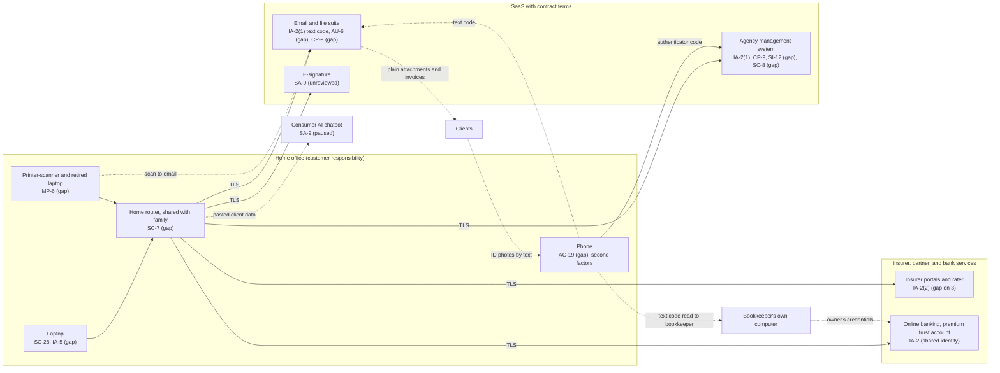

# SaaS Architecture and Control Placement: Cris Santos Company | Financial Services | Sole Proprietorship

**Organization:** Cris Santos Company (independent insurance agency) | **Tier:** Sole Proprietorship | **Provider:** SaaS only (no IaaS or PaaS)
**System:** Agency Systems Profile (ASP), as defined in the system profile (P02) | **Mapped:** 2026-08-04 with the IT consultant

## 1. Diagram
Control IDs on each node are the ones in `cloud-control-map.csv`. Dashed lines are flows with a gap (no MFA, no contract terms, or unprotected content).

## 2. Layers
| Layer | Components | Key controls | Responsibility |
|---|---|---|---|
| Identity | AMS, email, insurer portals, rater, e-signature, banking accounts | IA-2, IA-2(1), IA-2(2), IA-5 | Customer configures; vendors and insurers provide MFA options |
| Data | AMS record, email and files, documents on devices, AI chat history | SI-12, CP-9, SC-8, SA-9 | Vendor protects data inside its service; the customer decides where client information goes, how it travels, and how long it is kept |
| Endpoints | Laptop, phone, printer-scanner, retired laptop | SC-28, AC-19, MP-6, IA-5 | Customer |
| Network | Home router and Wi-Fi | SC-7 | Customer (equipment supplied by the internet provider) |
| Logging | AMS activity log, email sign-in history and mailbox rules | AU-2 (vendor), AU-6 (customer) | Shared: vendor records, customer reviews |
| SaaS applications and hosting | AMS, email suite, e-signature, insurer platforms, bank | Inherited (AC-3, AU-2, SC-28 at rest, PE family) | Provider |

## 3. Shared responsibility for SaaS
All three major cloud providers' shared responsibility models (SRC-AWS-SRM, SRC-AZURE-SRM, SRC-GCP-SRM) agree on the SaaS split: the provider runs the application, the platform, and the facilities; **the customer always keeps its identities and accounts, its data, and its devices.** That is why 13 of the 16 rows in the control map are the agency's alone, 2 are shared, and only 1 (AMS backups) is the provider's. The AMS vendor's SOC 2 report and the insurers' portal security never cover those three layers. No IaaS provider equivalents table is needed, because the agency runs no infrastructure.

The same split applies to the bank and the insurers even though they are not "cloud vendors": the bank secures its platform, but **who signs in as the owner is the owner's responsibility.** Sharing the owner's banking identity with the bookkeeper moves the premium trust account's main protection outside the agency's control.

## 4. Findings from the mapping
1. **Every path to client money runs through email or a shared login.** Invoices with trust account details go out by email (no out-of-band check), and the bookkeeper signs in to banking as the owner with a texted code. Tracked as P01 R-001, R-002, and R-005.
2. **The strongest MFA protects the least exposed system.** The AMS uses an authenticator app; email, where invoices and attachments live, uses text codes. Moving email to an authenticator app or security key is free. Tracked with R-001.
3. **Client documents bypass the protected channel.** The AMS client upload portal is paid for but unused, so applications and ID photos arrive by plain email and text (R-003). This was found during the mapping.
4. **Records depend on one vendor.** Fla. Stat. 626.748 requires policy records for 5 years after expiration, but the only copy is inside the AMS, and email keeps 30 days (R-013, R-014).
5. **Inherited AMS controls depend on the vendor's SOC 2 report** and on the owner operating the complementary user entity controls (MFA device protection, prompt user changes, log review) listed in P09.
