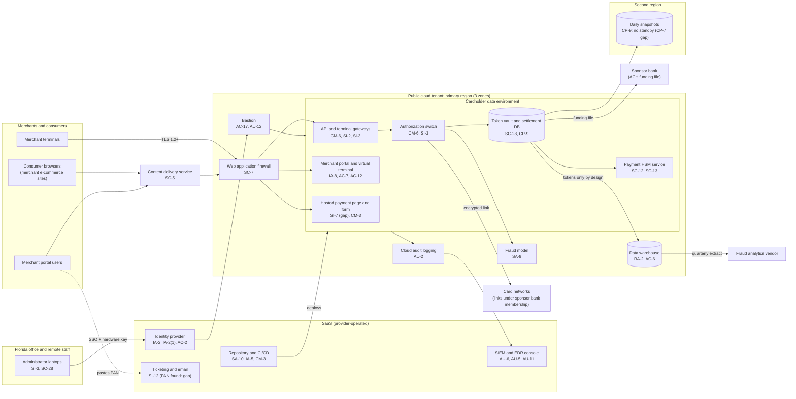

# Cloud Architecture and Control Placement: Cris Santos Company | Financial Services | Small

**Organization:** Cris Santos Company, LLC (payment processor serving merchants) | **Tier:** Small | **Provider:** Vendor-agnostic (see section 3)
**System:** Payment Processing Platform (PPP), as defined in the SSP (P02) | **Prepared:** 2026-07-24 by the Platform Engineering Lead and IT Manager | **Approved:** COO, 2026-08-31

## 1. Diagram

## 2. Layers
| Layer | Components | Key controls | Responsibility |
|---|---|---|---|
| Identity | Identity provider, cloud IAM, bastion | IA-2, IA-2(1), AC-2, AC-3, AC-6(5), AC-17 | Customer (configuration, roles, reviews); provider (service availability) |
| Network and edge | Content delivery service, web application firewall, CDE subnets and rules, card network links | SC-5, SC-7, SC-8, CA-8, SI-4 | Shared: provider runs the services; company sets every rule and tests segmentation |
| Compute and application | Gateways, switch, portal, payment page, fraud model (containers on a managed platform) | CM-6, CM-3, SI-2, SI-3, SI-7, IA-8, SC-39 | Customer (images, code, application security); provider (container control plane, hosts) |
| Data | Token vault and settlement database, payment HSM service, data warehouse, snapshots | SC-12, SC-13, SC-28, CP-9, CP-7, RA-2 | Shared: provider encrypts storage and runs HSM hardware; company owns keys, field-level PAN encryption, retention, and recovery |
| Logging and monitoring | Cloud audit logs, SIEM, EDR | AU-2, AU-5, AU-6, AU-11, AU-12, SI-4 | Shared: provider generates control-plane events; company enables workload logs, reviews, and alerts |
| SaaS applications | Repository and pipeline, ticketing, email | SA-10, IA-5, SI-12 | Provider (application); customer (users, tokens, data) |
| Physical | Provider data centers and HSM hardware | PE-3 | Provider (inherited; evidence in AOCs and SOC 2 reports) |

## 3. Service categories and provider equivalents
The design is independent of the provider. This table gives each provider's name for each service category, to use when reading its shared responsibility documentation and AOC responsibility matrix.

| Service category | AWS | Microsoft Azure | Google Cloud |
|---|---|---|---|
| Managed containers | Amazon EKS | Azure Kubernetes Service | Google Kubernetes Engine |
| Managed relational database | Amazon RDS | Azure Database for PostgreSQL | Cloud SQL |
| Message queue | Amazon SQS | Azure Service Bus | Pub/Sub |
| Payment HSM | AWS Payment Cryptography | Azure Payment HSM | Confirm with the provider |
| General key management | AWS KMS | Azure Key Vault | Cloud KMS |
| Web application firewall | AWS WAF | Azure Web Application Firewall | Google Cloud Armor |
| Network intrusion detection | AWS Network Firewall | Azure Firewall Premium | Cloud IDS |
| Data warehouse | Amazon Redshift | Azure Synapse Analytics | BigQuery |
| Identity and access management | AWS IAM | Azure role-based access control with Microsoft Entra ID | Cloud IAM |
| Audit logging | AWS CloudTrail | Azure Monitor activity log | Cloud Audit Logs |
| Network filtering | Security groups | Network security groups | VPC firewall rules |

Shared responsibility sources: SRC-AWS-SRM, SRC-AZURE-SRM, SRC-GCP-SRM in `00_universal-framework/sources/source-register.csv`. All three models agree on the split used here:
- **IaaS:** the provider owns facilities, hosts, and virtualization. The customer owns operating systems, applications, network configuration, identities, and data.
- **PaaS (managed containers, database, HSM service):** the provider also owns the platform software and its patching. The customer keeps workload images, data, keys it creates, access, and configuration.
- **SaaS:** the provider also owns the application. The customer keeps identities, access, data, and devices.

PCI DSS adds one step: each provider's AOC and responsibility matrix (PCI DSS 12.8.5, 12.9.2 on the provider's side) must show which PCI DSS requirements it covers. The company holds that for the cloud provider only; matrices for the payment HSM service, content delivery service, and fraud model vendor are missing (R-016).

## 4. Findings from the mapping
1. **Payment page scripts are uncontrolled (SI-7, CM-3).** The hosted payment page loads scripts that are not inventoried or integrity-checked, and one pipeline approval can change them. This is the entry point in the P08 scenario. Fix: script inventory, subresource integrity, content security policy, tamper-detection, and two approvals (R-001, R-002; P07 POAM-001, POAM-002).
2. **Nobody watches the exit (SI-4).** The CDE subnets restrict outbound destinations, but DNS queries go to the provider's resolver without logging, so DNS tunneling would pass unseen. Fix: DNS query logging with tunneling detection and network intrusion detection on egress (R-003).
3. **Recovery depends on one region (CP-7).** The second region holds daily snapshots only. The payment HSM service's second-region key replication must be confirmed before a warm standby can work (P05 finding 3).
4. **Card data leaked out of the CDE (RA-2).** The data warehouse, ticketing, and email are outside the CDE by design, but PAN reached all three. The warehouse leak was a faulty extract job; the others come from merchants. Fix: token-only extract checks and monthly PAN discovery (R-005, R-031).
5. **Service accounts hold standing administrator roles (AC-6(5)).** One compromised workload could reach the whole tenant. Fix: one role per workload, reviewed every six months (R-010).
6. **Inherited controls rely on provider AOCs and SOC 2 reports.** Physical security, HSM hardware, and platform patching are inherited. Evidence is reviewed in P09 (`vendor-soc2-review.csv`).
