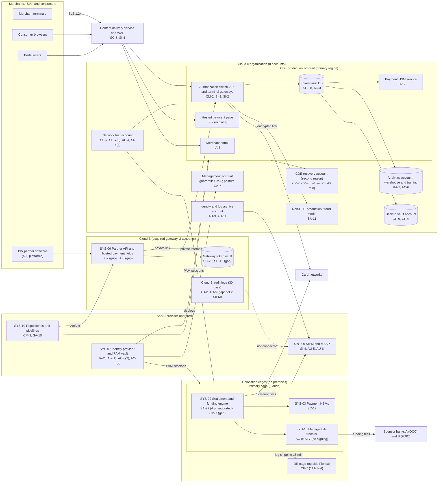

# Cloud Architecture and Control Placement: Cris Santos Company | Financial Services | Mid-Market

**Organization:** Cris Santos Company, Inc. (PE-backed payment processor serving merchants) | **Tier:** Mid-Market | **Provider:** Vendor-agnostic multi-cloud (Cloud A and Cloud B) plus two colocation cages and SaaS (see section 4)
**System:** Payment Processing Platform (PPP), as defined in the SSP (P02) | **Prepared:** 2026-07-31 by the VP Platform Engineering and the Director of Information Security; updated 2026-09-15 with P07 results | **Approved:** Chief Operating Officer, 2026-09-15
**Control map:** `cloud-control-map.csv` (62 rows, 38 components)

## 1. Diagram

## 2. Landing zone and environment design
The PPP spans three hosting models. Each one limits the damage an attacker can do from any other.

**Cloud A landing zone (8 accounts under one organization):**
| Account | Purpose | Who administers | Key design decisions |
|---|---|---|---|
| Management and security tooling | Organization root, guardrails, posture management, threat detection | Security engineers (2) | No workloads; root credentials sealed; guardrails apply to every member account and cannot be disabled from them |
| Identity and log archive | Federation to the identity provider; write-once log archive | Security team | Logs from all accounts land here; member accounts cannot delete them |
| Network hub | Cloud firewall, DNS resolver with query logging, private interconnect to the colocation cages, card network links | Site reliability engineers | All traffic between accounts, the cages, and the internet passes the hub |
| CDE production (primary region) | Authorization switch, gateways, token vault, payment HSM service, portal, hosted payment page | Site reliability engineers through PAM | Separate subnets per tier; no direct internet ingress (only through the content delivery service and WAF) |
| CDE recovery (secondary region) | Warm standby for authorization | Site reliability engineers through PAM | Database replica; promotion is manual today |
| Non-CDE production | Fraud model serving, portal content, APIs without card data | Platform and data science | Receives tokens only |
| Analytics and model training | Data warehouse and training environment | Data science | PAN block on every load; monthly PAN discovery |
| Backup vault | Write-once backups, 35-day retention, second region | 2 named backup administrators | Separate administrator credentials, not federated to everyday accounts |

**Cloud B (acquired gateway, 3 accounts: production, non-production, shared services).** Built by the acquired company before the acquisition. It has its own IAM users, its own pipeline, and logs kept for 30 days inside Cloud B. It connects to the core switch over a private link. Migration into the Cloud A landing zone is planned for 2027-09-30. Until then, the interim controls in section 5 apply.

**Colocation cages.** The colocation providers supply the building, power, cooling, guards, and cage locks under their own AOCs. The company owns everything inside its cages: settlement servers, payment HSMs, firewalls, managed file transfer servers, and the tape library. The cages connect to Cloud A over private circuits through the network hub.

## 3. Layers and shared responsibility per service
| Layer | Components | Key controls | Service model | Responsibility |
|---|---|---|---|---|
| Identity | Cloud A federation, PAM vault, break-glass accounts, Cloud B IAM users | IA-2, IA-2(1), IA-5, AC-2, AC-6, AC-6(2), AC-6(5), AC-6(9) | PaaS / SaaS | Customer configures identities, roles, MFA, PAM, and reviews; providers run the identity services |
| Network and edge | Network hub, cloud firewalls, security groups, private interconnect, content delivery service and WAF | SC-5, SC-7, SC-7(5), AC-4, SI-4, SI-4(4) | PaaS / SaaS | Shared: providers run the services; the company writes every rule and tests segmentation |
| Compute and application | Containers in both clouds; settlement servers in the cages | CM-2, CM-7, SI-2, SI-3, SI-7, IA-8, SA-11, SA-22 | PaaS (managed containers); on premises | Customer: images, code, application security, server hardening; providers: container control planes and hosts |
| Data | Token vaults, payment HSMs (cloud service and company-owned), key management, backups, warehouse, file transfer | SC-8, SC-12, SC-28, AC-3, CP-6, CP-9, RA-2 | PaaS; on premises | Shared in the clouds (providers encrypt storage and run HSM hardware; the company owns keys, field-level PAN encryption, retention, and recovery); customer in the cages |
| Logging and monitoring | Control-plane logs, log archive, posture management, SIEM and MSSP | AU-2, AU-5, AU-6, AU-9, AU-11, AU-12, CA-7, SI-4 | PaaS / SaaS | Shared: providers generate events; the company enables, retains, forwards, and acts on them; the MSSP monitors |
| SaaS applications | Repositories and pipelines, identity provider | CM-3, SA-10, IA-2(8) | SaaS | Provider runs the application; customer keeps users, tokens, branch rules, and data |
| Physical | Cloud data centers; colocation buildings and cages | PE-3, PE-8 | All; on premises | Cloud: provider (inherited). Colocation: shared (provider building and guards; company cage locks and access list) |

**Responsibility counts in `cloud-control-map.csv`:** 38 Customer, 18 Shared, 6 Provider. By service model: 42 PaaS, 9 SaaS, 9 on-premises (colocation), and 2 IaaS rows. By layer: 16 Compute, 12 Data, 10 Identity, 8 Network, 7 Logging, 5 SaaS, 4 Physical. The customer side is always identity, data protection, and logging, as the three major providers' shared responsibility models agree. PCI DSS adds one step: each provider's AOC and responsibility matrix (12.8.5 on the company's side, 12.9.2 on the provider's side) must show which requirements it covers.

## 4. Service categories and provider equivalents
The design is independent of the provider. Cloud A and Cloud B are two different public cloud providers. This table gives each major provider's name for the service category, for reading its shared responsibility documentation (SRC-AWS-SRM, SRC-AZURE-SRM, SRC-GCP-SRM in `00_universal-framework/sources/source-register.csv`) and its AOC responsibility matrix.

| Service category | AWS | Microsoft Azure | Google Cloud |
|---|---|---|---|
| Multi-account organization and guardrails | AWS Organizations, service control policies | Management groups, Azure Policy | Resource Manager folders, organization policies |
| Account, subscription, or project | Account | Subscription | Project |
| Cloud identity federation | IAM Identity Center | Microsoft Entra ID with Azure RBAC | Cloud Identity with IAM |
| Network hub and cloud firewall | Transit Gateway; AWS Network Firewall | Virtual WAN hub; Azure Firewall | Network Connectivity Center; Cloud NGFW |
| Private interconnect to colocation | Direct Connect | ExpressRoute | Cloud Interconnect |
| Managed containers | Amazon EKS | Azure Kubernetes Service | Google Kubernetes Engine |
| Managed relational database | Amazon RDS | Azure Database for PostgreSQL | Cloud SQL |
| Payment HSM | AWS Payment Cryptography | Azure Payment HSM | Confirm with the provider |
| General key management | AWS KMS | Azure Key Vault | Cloud KMS |
| Web application firewall | AWS WAF | Azure Web Application Firewall | Google Cloud Armor |
| Backup with write-once retention | AWS Backup (vault lock) | Azure Backup (immutable vault) | Backup and DR Service |
| Data warehouse | Amazon Redshift | Azure Synapse Analytics | BigQuery |
| Audit logging | CloudTrail | Azure Monitor activity log | Cloud Audit Logs |
| Posture and threat detection | Security Hub, GuardDuty | Microsoft Defender for Cloud | Security Command Center |

**Service model split used here (all three providers agree):**
- **IaaS** (networks, virtual machines): the provider owns facilities, hosts, and virtualization. The customer owns the guest operating system, applications, network configuration, identities, and data.
- **PaaS** (managed containers, database, HSM service, key service, backup): the provider also owns the platform software and its patching. The customer keeps workload images, data, keys it creates, access, and configuration.
- **SaaS** (identity provider, PAM, SIEM, repositories): the provider also owns the application. The customer keeps identities, roles, data, and devices.
- **On-premises colocation** is outside the three models: the colocation provider is responsible only for the building and the services named in its contract and AOC.

## 5. Findings from the mapping
1. **Cloud B is a second, weaker CDE.** The gateway has standing administrator roles, long-lived keys, no PAM, open HTTPS egress, logs that never reach the SIEM, no script controls on the hosted payment fields, and token vault keys without dual control. This combination is the entry path in the P08 gateway scenario (R-001 to R-004, R-011, R-051). **Interim fix before the 2026 ROC:** onboard Cloud B logs and runtime agents to the SIEM and MSSP, put Cloud B consoles behind PAM with security keys, restrict egress to named destinations, and deploy script controls and tamper-detection on the hosted payment fields (POAM-001 to POAM-005, due 2026-10-30 to 2026-11-06).
2. **The colocation interconnect change broke segmentation.** The 2026-04-18 change added a route from the colocation management network to the DR cage settlement database port, and segmentation was not retested afterward (R-009). Combined with vendor default credentials on settlement server management interfaces (R-050, found in P07), an attacker on the management network could reach settlement systems. **Fix:** remove the route, change the credentials (done 2026-08-14), and retest segmentation by 2026-10-15.
3. **Recovery is designed but not fast enough.** The Cloud A warm standby and the DR cage exist, which is the right design, but tests missed their RTOs (R-006, R-007), and the gateway has no cross-region copy (R-008).
4. **Funding file integrity relies on the transport.** Files are encrypted in transit but not signed, so a change on the file transfer server before transmission would not be detected by the bank (R-052). **Fix:** sign files with an HSM-held key and have both banks verify signatures (2027-03-31).
5. **Boundary check.** Every in-scope component in the SSP (P02 section 9) appears in the diagram. Every cloud and colocation component has at least one row in the control map. Each Cloud A account and the Cloud B footprint has controls from at least 2 of the AC, AU, CM, IA, SC, and SI families or inherits them.
6. **Inherited controls rely on AOCs and SOC 2 reports.** Controls marked Provider or Shared depend on the providers' AOCs and SOC 2 Type 2 reports and on complementary user entity controls the company must run. These are reviewed each year in P09 `vendor-soc2-review.csv`.
