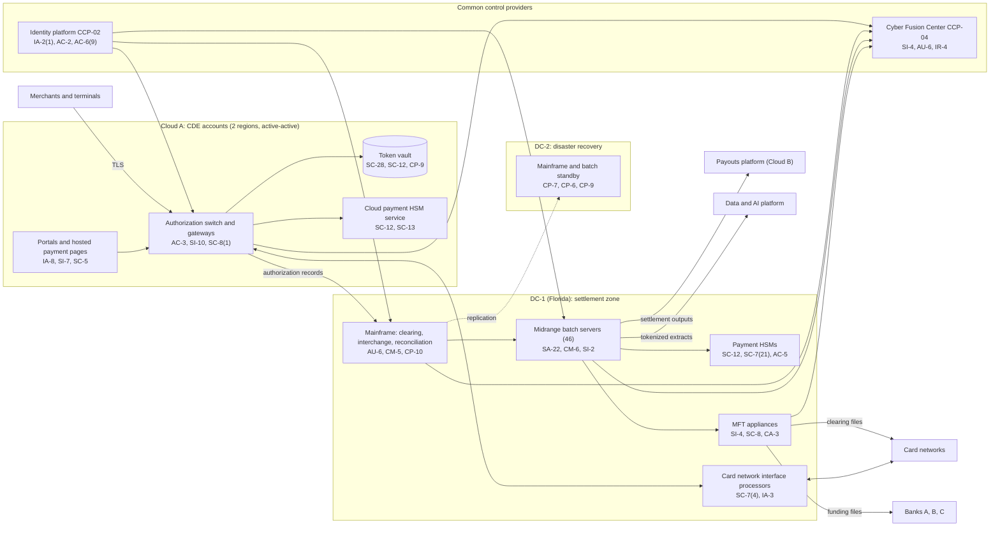

# System Security Plan: Core Payment Processing Platform (CPPP)

**Organization:** Cris Santos Company, Inc. (publicly traded merchant payment processor) | **Tier:** Enterprise | **Vertical:** Financial Services (CISA critical infrastructure sector)
**Outline:** NIST SP 800-18 Rev. 2, System Security Plan Outline Example (June 2026) | **Version:** 3.0, 2026-09-14

## 1. System Name and Identifier
Core Payment Processing Platform (**CPPP**), identifier CSC-SYS-CPPP-001. Tier-1 system in the enterprise application inventory and the main cardholder data environment (CDE) for the Merchant Acquiring business.

## 2. System Overview
The CPPP authorizes, clears, and settles card payments for about 360,000 Merchant Acquiring merchants and settles the Integrated Payments and payouts programs. It processes about 37.8 million authorizations a day, builds the daily clearing files for the card networks, and builds the merchant funding ACH files (about $2.1 billion a business day) that sponsor Banks A, B, and C originate.

**Why every security objective matters here:**
- **Confidentiality:** the CPPP stores, processes, and transmits full PAN for hundreds of millions of cards. A compromise would trigger card brand, FTC, state, and possibly SEC and NYDFS duties (P08).
- **Integrity:** a changed funding file sends merchant money to the wrong account, and a changed clearing file misstates settlement with the networks and banks.
- **Availability:** merchants cannot take cards within minutes of an authorization outage, and a settlement outage of 4 or more hours requires notice to the sponsor banks (P05).

**Major components:**
- **Authorization platform (SYS-01)** on Cloud A managed containers in two regions (active-active): authorization switch, terminal gateway (including PIN debit), e-commerce gateway, enterprise merchant gateway, and token vault on a managed relational database with cross-region replication
- **Settlement platform (SYS-02)** in DC-1 with disaster recovery in DC-2: a mainframe running the clearing file builder, interchange and fee engine, and reconciliation, plus 46 midrange batch servers for funding file generation and the chargeback system
- **Payment HSM estate (SYS-03):** 16 company-owned payment HSMs in DC-1 and DC-2 and Cloud A's dedicated payment HSM service
- **Portals and hosted payment pages (SYS-04)** on Cloud A, served through a content delivery service
- **Bank and network connectivity (SYS-10):** 4 managed file transfer (MFT) appliances (2 per data center), 6 card network interface processors, and 24 treasury workstations

Users: about 2,300 workforce accounts (platform engineers, settlement operators, treasury, key custodians, Cyber Fusion Center analysts), 212 of them privileged, and about 1.1 million merchant user accounts on the portals.

## 3. Laws, Regulations, and Policies Affecting the System
| ID | Requirement | Citation | How it affects the CPPP |
|---|---|---|---|
| PCI DSS | PCI DSS v4.0.1, as a service provider | PCI SSC (contractual through the sponsor agreements and card brand rules) | The CPPP is the core of the CDE assessed in the annual ROC; service provider requirements apply (P03) |
| GLBA | FTC Safeguards Rule | 16 CFR Part 314 | Cardholder information of other institutions' customers (314.1(b)); notice to the FTC (314.4(j)) |
| C-FINANCIAL-R01 | Computer-Security Incident Notification Rule (bank service provider) | 12 CFR 53.4 (Bank A); 12 CFR 304.24 (Bank B); 12 CFR 225.303 (Bank C) | Authorization, clearing, settlement, reconciliation, and funding file services are covered services; 4-hour disruption notice |
| C-FINANCIAL-R02 | Interagency Guidelines Establishing Information Security Standards | 12 CFR 30 App. B; 12 CFR 364 App. B; 12 CFR 208 App. D-2 | Apply to the banks; reach the CPPP through the sponsor agreements' service provider oversight terms |
| C-FINANCIAL-R05 | NYDFS Cybersecurity Regulation | 23 NYCRR Part 500 | The payouts subsidiary (a Class A covered entity) runs on shared systems and adopted this program (500.2(d)); its funding depends on CPPP settlement outputs |
| SEC | Cybersecurity disclosure | Form 8-K Item 1.05; 17 CFR 229.106 | A material CPPP incident goes through the P08 materiality step |
| State | State breach notification laws | Each state where affected individuals reside (Florida worked example: Fla. Stat. 501.171) | Third-party agent notice to merchants (P08) |
| Contract | Sponsor agreements; merchant and enterprise merchant agreements; SOC 1 and SOC 2 commitments | P09 | Availability, notice within 24 hours of suspected account data compromise, processing integrity |
| Internal | POL-01 to POL-05 and standards | P06 | Enterprise policy hierarchy |

Not applicable: C-FINANCIAL-R03 (NCUA 12 CFR 748.1(c); the company is not a credit union), C-FINANCIAL-R04 (Regulation SCI; not an SCI entity), C-FINANCIAL-R06 (CIRCIA; proposed rule only, tracked in P03).

## 4. System Status
### 4.1 System Security Plan Approval
Prepared by the Senior Vice President, Core Payment Platforms with the GRC team and the PCI program office. Reviewed by the CISO, the CTO, and the Senior Vice President, Settlement and Treasury Operations. Approved by the Chief Operating Officer on 2026-09-14.
### 4.2 System Authorization Decision
The company is not a federal agency, so there is no formal ATO. The equivalent internal decision:
- **Authorizing official equivalent:** Chief Operating Officer, with the CISO's recommendation.
- **Decision (2026-09-14):** continue operation with conditions, based on the Internal Audit assessment (P07) and the enterprise risk register (P01).
- **Conditions:**
  - close the segmentation path before ROC fieldwork (POAM-003 by 2026-10-15);
  - vault and rotate all batch scheduler credentials (POAM-002 by 2026-12-15);
  - restore MFA for mainframe operators, with written CISO approval of interim compensating controls (POAM-004 by 2026-12-31);
  - prove the 6-hour settlement RTO in a retest that includes at least one sponsor bank (POAM-006 by 2027-03-31);
  - replace the unsupported midrange servers (POAM-001 by 2027-06-30).
- **Reauthorization:** annually, or after a major change (for example, the settlement platform modernization planned for 2028).
### 4.3 System Operational Status
Operational. Planned major modifications: digital signatures on funding file releases (AU-10), automated audit of mainframe library changes (CM-5(1)), signed batch job code (SI-7(15)), and detection of unauthorized network services in the settlement zones (SI-4(22)).

## 5. Role Identification and Responsible Personnel
| Role | Title | Responsibility |
|---|---|---|
| System owner | Senior Vice President, Core Payment Platforms | Accountable for the CPPP; approves access roles and changes |
| Business owner | Executive Vice President, Merchant Acquiring | Merchant commitments; SL-2 service line owner (P09) |
| Authorizing official (equivalent) | Chief Operating Officer | Accepts residual risk to operate |
| Settlement process owner | Senior Vice President, Settlement and Treasury Operations | Clearing, funding, and sponsor bank cutoffs |
| System administrators | Director of Authorization Platform Engineering; Director of Settlement Systems | Day-to-day administration and change control |
| Key management | Director of Cryptographic Services | HSM operations, key custodians, key ceremonies |
| Information security | CISO; Director of Security Operations (Cyber Fusion Center) | Program oversight; monitoring; incident response |
| PCI DSS program | PCI Program Director | Scope, ROC coordination, quarterly reviews (PCI DSS 12.4.2) |
| Common control providers | See section 10.3 | Operate inherited controls |
| Independent assessor | Chief Audit Executive (Internal Audit) | Annual assessment (P07) |

## 6. System Information Types and System Categorization
Information types are modeled on NIST SP 800-60 Vol. 2 Rev. 1 (financial management types). Impact levels follow FIPS 199, used as a model because the company is not a federal agency.

| Information type | Confidentiality | Integrity | Availability | Rationale |
|---|---|---|---|---|
| Payments (authorization messages, PAN, tokens, clearing files) | **High** | **High** | **High** | Mass PAN theft would have a severe effect (card brand assessments, loss of sponsor banks). Altered clearing data misstates settlement. Authorization has a 2-hour MTD (P05 BP-01) |
| Collections and receivables (merchant funding files, merchant bank accounts, fees) | Moderate | **High** | **High** | A changed funding file misdirects merchant funds; funding must meet bank cutoffs (P05 BP-05, MTD 8 h) |
| Information security (keys, audit logs, credentials) | **High** | **High** | Moderate | Key compromise exposes all PAN; logs are the evidence for incident and notice decisions |
| **CPPP category** | **High** | **High** | **High** | High-water mark |

**Categorization decision.** The CPPP is categorized **High** and uses the **SP 800-53B High baseline** (370 controls and enhancements). The risk and technology committee confirmed the categorization on 2026-09-10.

**Documented controls.** `control-implementation.csv` documents **229 controls**: every control the CPPP team implements in whole or in part (System-specific and Hybrid), and the Common controls that matter most to the assessors. The column `baseline` shows the lowest SP 800-53B baseline that includes each control (Low 121, Moderate 90, High 18); all are required here because the system is High. The other 141 High-baseline controls and enhancements are fully inherited from the common control catalog (section 10.3), or recorded there as not applicable with a reason (for example, wireless enhancements, because no wireless is allowed in CDE zones), and are listed there rather than repeated here. CSF 2.0 subcategories in the CSV come from the official CSF 2.0 to SP 800-53 Rev. 5 mapping (`00_universal-framework/crosswalks/csf2_to_sp800-53r5.csv`); enhancements without their own mapping use their base control's subcategories.

**Tailoring.** No High-baseline control was removed. Physical and environmental controls for Cloud A are inherited from the cloud provider (shared responsibility, P04 section 3), and for the DC-2 building from the colocation provider, under their AOCs.

## 7. Authorization Boundary Description
**Inside the boundary:** the authorization platform and token vault in the Cloud A CDE accounts (both regions), the portals and hosted payment pages, the mainframe and midrange settlement servers in DC-1 and DC-2, the payment HSMs, the MFT appliances, card network interface processors, and treasury workstations.

**Outside the boundary (common control providers and interconnected systems):**
- Cloud A landing zone services (network hub, key management service, log archive, backup accounts): CCP-03
- Identity platform (SYS-07): CCP-02
- Cyber Fusion Center tooling (SYS-08): CCP-04
- Data center facilities and networks: CCP-05
- Engineering platform (SYS-09): CCP-07
- Integrated Payments platform (SYS-05) and payouts platform (SYS-06): separate systems with their own plans; they exchange settlement data with the CPPP
- Data and AI platform (SYS-11): receives tokenized extracts and serves fraud scores
- Card networks, sponsor banks, content delivery service, MFT and mainframe vendors

The enterprise multi-cloud diagram is in P04 `cloud-architecture.md`.

## 8. Information Exchanges Summary
| Connected system / party | Direction | Data | Agreement |
|---|---|---|---|
| Card networks (through links provisioned under the banks' memberships) | Bidirectional | Authorization messages; clearing files with PAN; settlement reports | Network rules; interconnection schedules |
| Banks A, B, and C | Outbound files; inbound reports | Merchant funding ACH files; settlement and reserve reports | Sponsor agreements (BSCA services, 24-hour compromise notice) |
| Merchants and terminals | Inbound | Card-present and card-not-present authorization requests | Merchant agreements |
| Integrated Payments platform (SYS-05) | Inbound | Authorization records for clearing and settlement of Bank B's Integrated Payments program | Internal interface agreement |
| Payouts platform (SYS-06) | Outbound | Settled positions for payouts (no PAN) | Intercompany service agreement with Cris Santos Payouts, LLC |
| Data and AI platform (SYS-11) | Outbound extracts; inbound scores | Tokenized transaction features; fraud scores | Internal data sharing agreement; **a 2026 extract carried full PAN (POAM-014)** |
| MFT software vendor | Remote support (through PAM) | Troubleshooting | Support agreement; no current AOC on file (POAM-008) |
| Mainframe vendor | Remote support | Diagnostics | Support agreement; **always-on VPN account outside PAM (POAM-015)** |
| Content delivery service | Outbound | Hosted payment page content (no PAN at rest) | Service provider agreement and AOC |

## 9. System Component Inventory
| Component | Type | Location / provider | Owner |
|---|---|---|---|
| Authorization switch and gateways (about 1,900 containers) | Managed containers (PaaS) | Cloud A, two regions | Director of Authorization Platform Engineering |
| Token vault | Managed relational database with cross-region replication | Cloud A | Director of Authorization Platform Engineering |
| Portals and hosted payment pages | Web applications on managed containers, content delivery service | Cloud A | Director of Authorization Platform Engineering |
| Mainframe (one per data center) | On-premises mainframe | DC-1 (primary), DC-2 (standby) | Director of Settlement Systems |
| Midrange batch servers (46; 12 on an unsupported operating system) | On-premises servers | DC-1 (DR copies in DC-2) | Director of Settlement Systems |
| Payment HSMs (16) and cloud payment HSM service | FIPS 140-3 Level 3 validated HSMs | DC-1, DC-2, Cloud A | Director of Cryptographic Services |
| MFT appliances (4) | Vendor appliances | DC-1 and DC-2 | Director of Settlement Systems |
| Card network interface processors (6) | On-premises servers | DC-1 and DC-2 | Director of Data Center and Network Engineering |
| Treasury workstations (24) | Hardened endpoints | DC-1 and DC-2 treasury rooms | Senior Vice President, Settlement and Treasury Operations |

## 10. Control Implementation Details
### 10.1 Control implementation status
See `control-implementation.csv` (229 controls).

| Status | Count |
|---|---|
| Implemented | 199 |
| Partially implemented | 26 |
| Planned | 4 |
| **Total** | **229** |

| Inheritance | Count |
|---|---|
| Common (fully inherited from a common control provider) | 150 |
| Hybrid (shared between a provider and the CPPP team) | 41 |
| System-specific | 38 |

The Planned controls are High-baseline items scheduled in section 4.3: AU-10, CM-5(1), SI-4(22), SI-7(15). Partially implemented controls: AC-2, AC-17, AU-6, CM-3, CM-6, CM-8, CP-2, CP-2(1), CP-2(3), CP-4, CP-10, IA-2(1), IA-5, IR-3, IR-6, IR-8, MA-4, PS-7, RA-5, SA-9, SA-22, SC-7, SC-8, SI-2, SI-4, SI-12. Each is linked to a POA&M item in P07 `poam.csv`.

### 10.2 Control assessment status
Internal Audit assessed 44 of these controls from 2026-07-13 to 2026-08-28 using SP 800-53A Rev. 5 procedures and statistical sampling (P07 `assessment-plan.md`, `assessment-results.csv`). Weaknesses are in P07 `poam.csv`. The QSA's 2026 ROC (fieldwork 2026-10-19 to 2026-11-13) assesses the same environment against PCI DSS.

### 10.3 Common control providers and inheritance
Common and hybrid controls are inherited from the enterprise platform. Each provider publishes its controls in the enterprise **common control catalog** (kept by the GRC team in the GRC platform) and is assessed on its own cycle; the CPPP inherits the results.

| Provider | Name | Accountable role | Controls provided | Rows in this plan | Evidence of operation |
|---|---|---|---|---|---|
| CCP-01 | Enterprise GRC program | CISO (with the Chief Risk Officer, and the Chief Audit Executive for assessment) | Policies and standards (P06), risk method, assessment, POA&M, continuous monitoring | 29 | Annual Internal Audit assessment (P07); GRC platform |
| CCP-02 | Identity platform (SYS-07) | Director of Identity and Access Management | SSO, MFA, PAM, identity governance, account lifecycle, remote access | 33 | SOX IT general control testing; P07 AC-2, IA-2, IA-5 results |
| CCP-03 | Cloud A landing zone | Director of Cloud Platform Engineering | Account guardrails, network policies, key management service, backups, log archive, DDoS protection | 9 | Posture management reports; cloud provider AOC and SOC 2 Type 2 |
| CCP-04 | Cyber Fusion Center (SYS-08) | Director of Security Operations | 24x7 monitoring, SIEM, EDR, vulnerability management, incident response, PAN discovery, tamper-detection | 41 | Monitoring metrics; P07 SI-4, RA-5, IR results |
| CCP-05 | Data center and network engineering (DC-1, DC-2) | Director of Data Center and Network Engineering | Segmentation, network links, time synchronization, physical and environmental protection, alternate sites | 31 | Segmentation tests; badge reviews; colocation AOC |
| CCP-06 | Infrastructure and endpoint engineering | Director of Infrastructure Engineering | Server and workstation baselines, patching, allow-listing, asset discovery | 16 | Configuration and patch reports |
| CCP-07 | Engineering platform (SYS-09) | Director of Developer Platform | Source control, pipelines, change workflow, secure development | 10 | Pipeline policy reports; P07 CM-3, CM-5 results |
| CCP-08 | Human resources and workforce training | Chief Human Resources Officer | Screening, terminations, sanctions, awareness and role-based training | 13 | HR and learning system reports |
| CCP-09 | Third-party risk management | Director of Third-Party Risk Management | Vendor tiering, contracts, AOC and SOC report reviews, supply chain risk | 9 | Vendor register; P07 SA-9 results |

Row counts include Hybrid rows that name the provider. The other 38 rows are System-specific.

**Inheritance rules:**
- A Common control is fully inherited; the CPPP team verifies only that the CPPP is onboarded (for example, SSO integration, log forwarding, PAM enrollment).
- A Hybrid control names both parts in the implementation statement: the provider's part and the CPPP team's part.
- If a provider's assessment finds a weakness, the finding is linked to every inheriting system's POA&M. Example: POAM-011 (late contractor terminations) is a CCP-02/CCP-08 weakness that affects the CPPP because contractors hold settlement application access.

## 11. Digital Identity Acceptance Statement
- **Workforce users:** SSO with MFA (number-matching push with device binding, or a FIDO2 security key). Privileged users use phishing-resistant FIDO2 keys through PAM. This is comparable to NIST SP 800-63 AAL2 for users and AAL3-like protection for privileged users. **Exception:** mainframe settlement operators have signed in with a password only since 2026-02-09 (POAM-004); this is not accepted as a permanent state.
- **Merchant users (portals):** identity is established at merchant onboarding (KYC) and by the merchant administrator for additional users. MFA is required for administrator, refund, funding account change, and virtual terminal roles; all other users get dynamic risk analysis of each sign-in, which meets the PCI DSS 8.3.10.1 option for customer users of a service provider.
- **Cardholders** do not authenticate to the CPPP. Card authentication (3-D Secure, PIN) is handled under network rules and the PCI PIN program.

## 12. Referenced Artifacts
Scenario facts (`../00_company-facts.md`), BIA (P05), multi-cloud architecture and control map (P04), enterprise risk register (P01), regulatory gap analysis (P03), policy hierarchy and policies (P06), Internal Audit assessment and POA&M (P07), incident runbook (P08), SOC 2 readiness for SL-1 and SL-2 (P09), AI portfolio including AI-001 fraud model (P10), CPPP contingency plan v6, cryptographic architecture document (PCI DSS 3.6.1.1), data-flow diagrams, 2025 ROC and AOC, enterprise common control catalog.

## 13. Acronym List and Glossary
- **AOC / ROC:** PCI DSS Attestation of Compliance / Report on Compliance
- **CCP:** common control provider
- **CDE:** cardholder data environment
- **Clearing file:** the daily file of transactions sent to each card network, which carries full PAN
- **Funding file:** the ACH file of merchant payments sent to a sponsor bank for origination
- **HSM:** hardware security module
- **MFT:** managed file transfer
- **PAM:** privileged access management
- **PAN:** primary account number
- **POA&M:** plan of action and milestones

## 14. System Security Plan Review and Change Records
| Version | Date | Change | Author |
|---|---|---|---|
| 1.0 | 2024-09-20 | Initial plan (High baseline) | Senior Vice President, Core Payment Platforms |
| 2.0 | 2025-09-15 | Added Bank B Integrated Payments settlement flow; common control provider mapping | Senior Vice President, Core Payment Platforms with GRC team |
| 3.0 | 2026-09-14 | Bank C program; DC-1 to Cloud A interconnect change; 2026 assessment results | Senior Vice President, Core Payment Platforms with GRC team |
