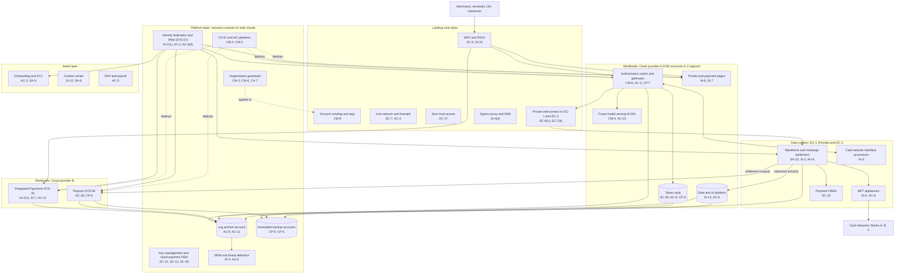

# Cloud Architecture and Control Placement: Cris Santos Company | Financial Services | Enterprise

**Organization:** Cris Santos Company, Inc. (publicly traded merchant payment processor) | **Tier:** Enterprise | **Provider:** Multi-cloud and hybrid, vendor-agnostic: two public cloud providers (called Cloud provider A and Cloud provider B), the company-operated data center DC-1, the colocation data center DC-2, and SaaS (see section 4)
**Owner:** Director of Cloud Platform Engineering, with the CISO and the Director of Data Center and Network Engineering | **Date:** 2026-08-31 | **Related:** Core Payment Processing Platform SSP (P02), enterprise BIA (P05)

## 1. Architecture in layers
The estate is organized in five layers. Each lower layer provides **common controls** that the layers above inherit, so a workload team configures only what is specific to its system.

| Layer | What it is | Examples | Who runs it |
|---|---|---|---|
| **Platform** | Organization-wide services in both clouds | Organization guardrails, identity federation, PAM, key management, cloud payment HSM service, log archive, SIEM feeds, posture and vulnerability management, immutable backup accounts, CI/CD pipelines | Cloud Platform Engineering; Cyber Fusion Center; Identity team; Developer Platform |
| **Landing zone** | The standard account pattern every workload lands in | Account vending with mandatory tags (owner, data classification, PCI scope, RTO), hub-and-spoke network with cloud firewalls, private interconnect to DC-1 and DC-2, web application firewall and DDoS protection, egress proxies and private DNS, zero-trust administrative access | Cloud Platform Engineering; Network Engineering |
| **Workload** | Systems built or run by the company | Cloud A: authorization switch and gateways, token vault, portals and hosted payment pages, data and AI platform, fraud model serving. Cloud B: Integrated Payments platform, payouts platform | Platform teams (for example, the Director of Authorization Platform Engineering) |
| **SaaS** | Vendor-operated applications | Identity platform, SIEM, source code and CI/CD, merchant onboarding and KYC, contact center, productivity suite, ERP and payroll | Vendors, with the company's configuration and oversight |
| **Data center** | Company-operated DC-1 and colocation DC-2 | Mainframe and midrange settlement servers, payment HSMs, MFT appliances, card network interface processors, treasury workstations | Data Center and Network Engineering; Settlement Systems; Cryptographic Services |

The CDE spans three of these environments: Cloud A CDE accounts (authorization, token vault, payment pages), DC-1 and DC-2 settlement zones, and Cloud B (Integrated Payments, its own SSP).

## 2. Diagram

## 3. Responsibility by service model
Sources: SRC-AWS-SRM, SRC-AZURE-SRM, and SRC-GCP-SRM in `00_universal-framework/sources/source-register.csv`. The three published models agree on the split used here, so the design does not depend on which two providers the company uses.

| Service model | Provider | Company (customer) | Shared |
|---|---|---|---|
| IaaS (network hub, interconnect, firewalls) | Facilities, hosts, hypervisor, physical network | Network policy, segmentation, identities, data | Encryption services (provider service, customer keys), logging |
| PaaS (managed containers, databases, key management, cloud payment HSM, backup) | Also the platform runtime and its patching; for the payment HSM service, the validated hardware | Data, access, configuration, keys and key ceremonies, application code | Backups, availability configuration |
| SaaS (identity, SIEM, onboarding, contact center, ERP) | Also the application | Users, roles, data, oversight of the vendor | Audit review (complementary user entity controls) |
| Colocation (DC-2) | Building, power, cooling, perimeter | Cage, equipment, cage access list | None |
| Company-operated (DC-1) | None | Everything | None |

**PCI DSS view.** Every cloud and colocation provider in this table is a PCI DSS third-party service provider for the CDE. Each must give a current AOC and a responsibility matrix that matches the split above (PCI DSS 12.8.4 and 12.8.5). 11 of the 96 service providers in scope do not have both on file yet (POAM-008).

## 4. Service categories and provider equivalents
| Service category | AWS | Microsoft Azure | Google Cloud |
|---|---|---|---|
| Organization guardrails | AWS Organizations service control policies | Azure Policy with management groups | Organization Policy Service |
| Account vending | AWS Control Tower account factory | Azure landing zone subscription vending | Resource Manager project creation |
| Key management | AWS KMS | Azure Key Vault | Cloud KMS |
| Dedicated payment HSM | AWS Payment Cryptography | Azure Payment HSM | No direct equivalent named here |
| Audit logging | AWS CloudTrail | Azure Monitor activity log | Cloud Audit Logs |
| Threat detection | Amazon GuardDuty | Microsoft Defender for Cloud | Security Command Center |
| Managed containers | Amazon EKS | Azure Kubernetes Service | Google Kubernetes Engine |
| Managed relational database | Amazon RDS | Azure SQL Database | Cloud SQL |
| Web application firewall | AWS WAF | Azure Web Application Firewall | Cloud Armor |
| Backup service | AWS Backup | Azure Backup | Backup and DR Service |

This table is for reading provider documentation only. The architecture, control map, and SSP describe service categories.

## 5. Common controls
`cloud-control-map.csv` has **64 rows** across 36 components: Platform 18, Landing zone 9, Workload 17, SaaS 9, Data center 11. Responsibility: Customer 45, Shared 18, Provider 1.

**34 rows are published as common controls** (`common_control` = Yes) in the enterprise common control catalog. They map to the common control providers in the CPPP SSP (P02 section 10.3): GRC program (CCP-01), identity (CCP-02), Cloud A landing zone (CCP-03), Cyber Fusion Center (CCP-04), data center and network engineering (CCP-05), and the engineering platform (CCP-07). A workload inherits them by being deployed through account vending, which applies the guardrails, logging, network, key, and backup policies automatically. The same guardrails are written once as code and applied to both clouds, so Cloud B workloads inherit the same set.

**Rules for inheriting:**
1. A workload may claim a common control only if its account was created by account vending, carries the PCI scope tag, and passes the posture baseline.
2. Customer-side identity, data protection, and logging stay explicit at every layer: even a SaaS application has Customer rows for access (AC-3) and data handling (SI-12), because those are always the company's responsibility.
3. SaaS and colocation rows cite the vendor's AOC or SOC 2 report, reviewed by the third-party risk team (P09 evidence map).
4. Data center rows are not cloud inheritance at all: the company runs DC-1 itself and shares DC-2 with the colocation provider. They are mapped here so the CDE has one control map across all environments.

## 6. Validation against the CPPP SSP (P02)
Every CPPP component in the SSP boundary appears here with controls from each required family, directly or inherited:

| CPPP component | AC | AU | CM | IA | SC | SI |
|---|---|---|---|---|---|---|
| Authorization switch and gateways | AC-3 | AU-9 (inherited) | CM-6 | IA-2(1) (inherited) | SC-7 (inherited) | SI-10 (inherited) |
| Token vault | AC-6 | AU-11 (inherited) | CM-2 (inherited) | IA-2(1) (inherited) | SC-28 | SI-4 (inherited) |
| Portals and hosted payment pages | AC-17 (inherited) | AU-6 (inherited) | CM-3 (inherited) | IA-8 | SC-5 (inherited) | SI-7 |
| Mainframe and midrange settlement servers | AC-6(9) (inherited) | AU-6 | CM-6 (inherited baseline) | IA-2(1) (inherited) | SC-7(4) (inherited) | SI-2 |
| MFT appliances | AC-4 (inherited) | AU-9 (inherited) | CM-8 (inherited) | IA-2(1) (inherited) | SC-8 | SI-4 |
| Payment HSMs | AC-6(9) (inherited) | AU-9 (inherited) | CM-2 (inherited) | IA-7 (custodian smart cards, in the SSP) | SC-12 | SI-4 (inherited) |

## 7. Findings from the mapping
1. **The interconnect is where the clouds and the data centers meet, and where segmentation broke.** The 2026-05-16 re-architecture of the DC-1 to Cloud A interconnect left one unintended path from a DC-1 management subnet to a Cloud A CDE subnet (P07 SC-7; POAM-003). Fix: correct the route policy, add the interconnect to the guardrail code so drift is detected, and retest segmentation before ROC fieldwork.
2. **Settlement controls cannot be inherited from the cloud.** The mainframe, midrange servers, and MFT appliances depend on data center controls that the platform layer cannot supply: unsupported servers (POAM-001), patch timing (POAM-010), batch log forwarding (POAM-012), and MFT monitoring (POAM-009).
3. **Two clouds, one identity standard, uneven enforcement.** The identity platform federates to both clouds, but Cloud B still allows push-based MFA and PAM covers 62% of its administrative roles (POAM-019). The Cloud B pipeline service account holds standing administrator rights (POAM-020).
4. **Payment page integrity ends at the company's edge.** Core hosted payment pages have script inventory and tamper-detection; the hosted payment fields loaded inside ISV checkouts are covered for 64% of integrations (POAM-021).
5. **PAN must stay out of the analytics accounts.** The flow policy allows only tokenized data into the data and AI platform, but a settlement extract outside the cloud flow controls wrote full PANs to a data lake table (POAM-014). PAN discovery is now part of the platform layer.
6. **Concentration.** Cloud A carries all Merchant Acquiring authorization; two regions protect against a regional failure but not a provider-wide one (P01 R-008). This is handled in the BIA and the risk register, not by architecture alone.
