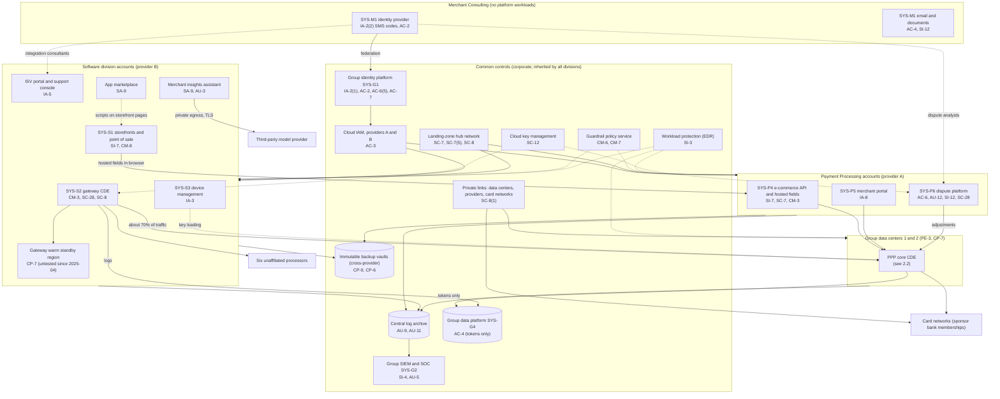
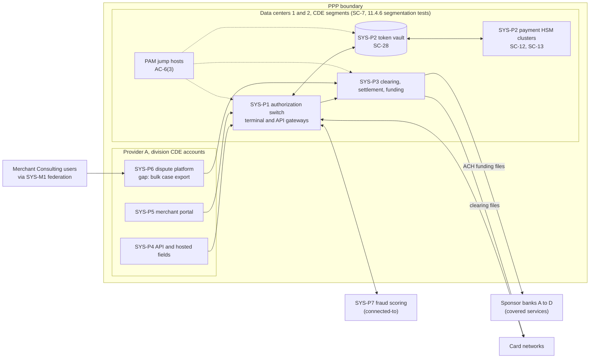

# Cloud Architecture and Control Placement: Cris Santos Company Holdings | Financial Services | Multi-Sector

**Organization:** Cris Santos Company Holdings, Inc. | **Tier:** Multi-Sector | **Providers:** two group data centers plus two public cloud providers, called provider A and provider B (vendor-agnostic; see section 5)
**Scope:** the shared corporate platform (SYS-G3 data centers and landing zones, the SYS-G4 data platform) plus the division workloads that run on it. The SSP system (P02) is the Payment Processing Platform (PPP).

## 1. Design in one paragraph
Corporate runs two **group data centers** and one **landing zone** per cloud provider: identity federation from SYS-G1, a hub network, guardrail policies, a central log archive, key management, EDR, and an immutable backup vault (each provider's workloads back up to the other provider). Divisions get their own **accounts** inside the landing zones and inherit these guardrails. The processor's core CDE (authorization, token vault and HSMs, settlement) runs active-active in both data centers, close to the card network links; its e-commerce API, merchant portal, and dispute platform run in provider A. The Software division's commerce SaaS, gateway, and device management run in provider B, where the gateway is a second, separately assessed CDE. Merchant Consulting runs no workload on the platform: its people reach SYS-P6 and the Software division's ISV support console through the acquired firm's identity provider (SYS-M1), federated to SYS-G1.

## 2. Diagrams
### 2.1 Group platform and division workloads

### 2.2 Payment Processing Platform (SSP boundary)

**Target state (POAM-001 to POAM-004 and POAM-007, due by 2027-03-31):** Merchant Consulting users sign in through SYS-G1 with phishing-resistant MFA and no SMS path; the case export permission is limited to supervisors with a ticket; dispute documents are masked on upload and purged 90 days after closure; SYS-P6 events feed the SIEM with a bulk-export detection; merchants upload dispute evidence through a portal instead of email.

## 3. Common versus division-specific controls
`cloud-control-map.csv` has 55 rows across 34 components. The `control_scope` column shows who owns each placement:

| Scope | Rows | What it means |
|---|---|---|
| Common (group) | 25 | Provided once by corporate (SYS-G1 to SYS-G4, data centers) and inherited by every division account. Listed in the P02 common control catalog |
| System (Payment Processing Platform) | 14 | Controls of the SSP system documented in the P02 SSP |
| Division-specific (Software) | 11 | Gateway CDE, storefronts, marketplace, AI assistant, device management |
| Division-specific (Merchant Consulting) | 5 | The acquired firm's identity provider, email, documents, and endpoints |

| Responsibility | Rows |
|---|---|
| Customer (the group or a division) | 46 |
| Shared (provider and group) | 6 |
| Provider | 3 |

**Rule of thumb.** Identity, network guardrails, logging, keys, backups, and EDR are **common**. A division cannot opt out of them, only request an exception through POL-01. Application behavior, what each role can see inside an application, payment-page integrity, and customer-facing identity are **division-specific**, because they depend on each division's own assessors (QSA, SOC 2 service auditor) and customers.

## 4. Layers
| Layer | Common components | Division components | Key controls | Responsibility |
|---|---|---|---|---|
| Identity | SYS-G1, cloud IAM, PAM | Merchant portal identity, ISV portal, SYS-M1 (consulting) | AC-2, AC-3, AC-6(5), IA-2(1), IA-2(2), IA-8 | Customer (configuration); vendor (service) |
| Network | Hub, private links, DDoS, CDE segments | API gateways, WAF, gateway routing | SC-7, SC-7(5), SC-8, SC-8(1), SC-5 | Customer, with provider DDoS protection shared |
| Compute | EDR on all hosts | Switch, containers, storefront pages, scoring | SI-3, SI-7, CM-3, CA-7 | Customer (guest OS, containers, code, page content) |
| Data | Cloud keys, backup vaults, data platform | Token vault, HSMs, dispute files, gateway store | SC-12, SC-13, SC-28, CP-9, AC-4, SI-12 | Customer for HSMs and the vault; shared for cloud storage encryption |
| Logging and monitoring | Log archive, SIEM | Application and model logs | AU-3, AU-5, AU-9, AU-11, AU-12, SI-4 | Shared: providers generate platform logs; group retains and reviews |
| SaaS dependencies | Identity, SIEM, EDR vendors | Model provider, app developers, consulting SaaS | SA-9, IA-2(2) | Provider for the service; customer for use and oversight |
| Physical | Group data centers; provider data centers | none | PE-3, MP-6, CP-7 | Group for its data centers; provider for cloud facilities (inherited) |

## 5. Service categories and provider equivalents
The design does not depend on a provider. This table gives each provider's name for each service category, for reading its shared responsibility documentation.

| Service category | AWS | Microsoft Azure | Google Cloud |
|---|---|---|---|
| Account structure and guardrails | AWS Organizations with service control policies | Management groups with Azure Policy | Resource hierarchy with Organization Policy |
| Managed containers | Amazon EKS | Azure Kubernetes Service | Google Kubernetes Engine |
| Managed relational database | Amazon RDS / Aurora | Azure SQL Database | Cloud SQL / AlloyDB |
| Key management | AWS KMS | Azure Key Vault | Cloud KMS |
| Audit logging | AWS CloudTrail | Azure Monitor activity log | Cloud Audit Logs |
| Backup with immutability | AWS Backup (vault lock) | Azure Backup (immutable vault) | Backup and DR Service |
| Private connectivity | AWS Direct Connect / PrivateLink | Azure ExpressRoute / Private Link | Cloud Interconnect / Private Service Connect |
| Web application firewall | AWS WAF | Azure Web Application Firewall | Cloud Armor |

Shared responsibility sources: SRC-AWS-SRM, SRC-AZURE-SRM, SRC-GCP-SRM in `00_universal-framework/sources/source-register.csv`. All three agree on the split used here: for IaaS the provider owns facilities, hosts, and virtualization; for PaaS the provider also owns the runtime; for SaaS the provider owns the application. The customer always keeps identities, access decisions, data, and, for PCI DSS, the content of its payment pages. The payment HSMs and the data center CDE are group-operated, so no provider shares those controls. The cloud providers' own AOCs cover the facility and infrastructure requirements the group inherits in provider A and B accounts (PCI DSS 12.8.5).

## 6. Findings from the mapping
1. **The processor's core is sound; its edges are not.** Segmentation, HSM key management, and the token vault (SC-7, SC-12, SC-13, SC-28) are group-operated and fully implemented. The weak points are where other divisions' people and pages touch the CDE: consulting identities (IA-2(2), AC-2), a bulk export permission (AC-6), and unmonitored application events (AU-12, SI-4) in SYS-P6 (P01 GR-02; POAM-001 to POAM-004).
2. **The browser is a shared boundary.** Storefront pages on SYS-S1 host the processor's payment fields. The processor protects the fields (SI-7 on SYS-P4); the Software division is responsible for every script on the page around them, and covers only the standard template today (gap 3; POAM-015). An injected script can still overlay or alter what the consumer sees.
3. **The gateway is a second CDE with a single active region** (CP-7). Its recovery and its separate ROC are the Software division's, but a long outage hits the processor's revenue and its ISVs at once (gap 8; POAM-019).
4. **PAN reached the data platform through a log, not a data feed** (AC-4 on SYS-G4). The feed controls worked; the debug log path was never reviewed. The fix extended the PAN block to every log source (POAM-024).
5. **Common controls are strong and reused.** One identity platform, one SIEM, one backup design. That is what lets group internal audit assess them once (P07). The weak link is documentation of inheritance for Merchant Consulting (P02, POAM-010), not the controls themselves.
