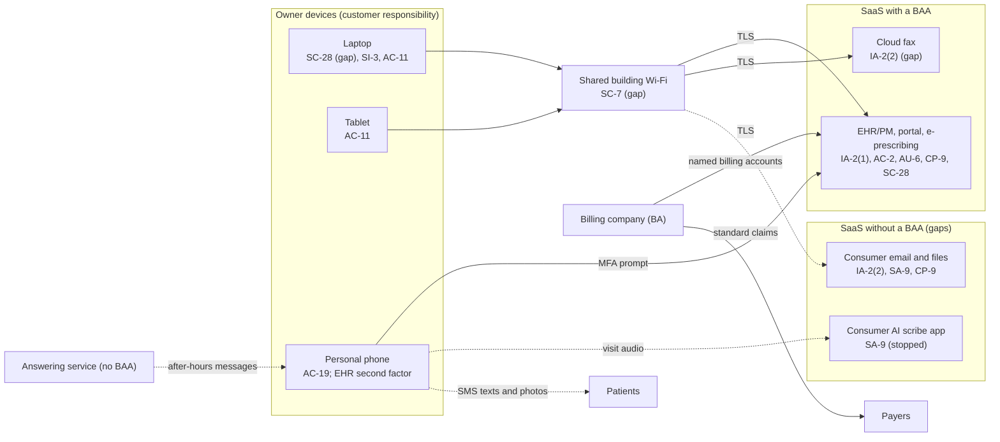

# SaaS Architecture and Control Placement: Cris Santos Company | Health Care | Sole Proprietorship

**Organization:** Cris Santos Company (solo primary care physician practice) | **Tier:** Sole Proprietorship | **Provider:** SaaS only (no IaaS or PaaS)
**System:** Practice Systems Profile (PSP), as defined in the system profile (P02)

## 1. Diagram
Control IDs on each node are the ones in `cloud-control-map.csv`. Dashed lines are flows without a BAA.

## 2. Layers
| Layer | Components | Key controls | Responsibility |
|---|---|---|---|
| Identity | EHR accounts, email account, fax portal account | IA-2(1), IA-2(2), AC-2 | Customer configures; vendor provides MFA |
| Data | EHR record, email and files, fax archive, local downloads, photos | SC-28, CP-9, SA-9 | Vendor protects data inside its service; customer decides where PHI goes and whether a BAA covers it |
| Endpoints | Laptop, tablet, phone | SC-28, SI-3, AC-11, AC-19 | Customer |
| Network | Shared building Wi-Fi | SC-7 | Customer (landlord runs the equipment) |
| Logging | EHR audit log, email sign-in history | AU-2 (vendor), AU-6 (customer) | Shared: vendor records, customer reviews |
| SaaS applications and hosting | EHR platform, fax platform | Inherited (AC-3, AU-2, SC-5, PE family) | Provider |

## 3. Shared responsibility for SaaS
All three major cloud providers' shared responsibility models (SRC-AWS-SRM, SRC-AZURE-SRM, SRC-GCP-SRM) agree on the SaaS split: the provider runs the application, the platform, and the facilities; **the customer always keeps its identities and accounts, its data, and its devices.** That is why 12 of the 15 rows in the control map are the owner's. A SOC 2 report or a BAA from the vendor never covers these three layers. No IaaS provider equivalents table is needed, because the practice runs no infrastructure.

## 4. Findings from the mapping
1. **Two vendors hold PHI with no BAA** (email and files, AI scribe; EV-013, EV-005, EV-027). The SaaS model cannot fix this; only a contract can. Tracked as P01 R-003 and R-009.
2. **MFA is off where it is free to turn on** (email, cloud fax). The cloud fax MFA gap was found during this mapping, from the fax portal settings collected at intake (EV-006). Tracked with R-002.
3. **The owner's phone is part of the security boundary.** It holds the EHR second factor, patient texts, and clinical photos. Losing it is both a disclosure risk (R-005) and a lockout risk (R-010).
4. **Inherited EHR controls depend on the vendor's SOC 2 report** and on the owner operating the complementary user entity controls (account removal, MFA, log review) listed in P09.
